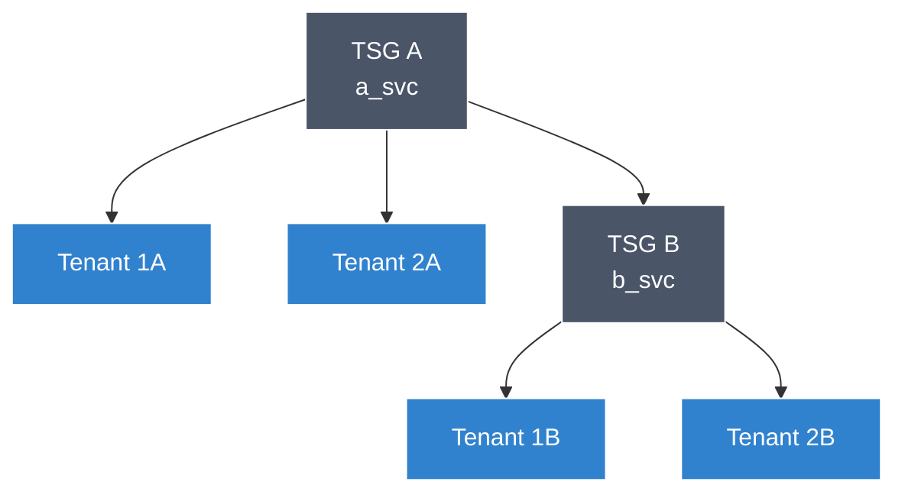

Admin API requests are authorised with a short-lived access token issued by Strata Cloud Manager, not with an AI Gateway API key.

<Warning>
A gateway API key — the key you send as `Authorization: Bearer $API_KEY` on `/chat/completions` and every other inference route — is **not** accepted on any Admin API endpoint. Inference credentials and administrative credentials are separate systems. See [Inference API authentication](/aigw/api-reference/inference-api/authentication) for the inference path.
</Warning>

You obtain an Admin API token by authenticating a **service account** against the Palo Alto Networks authentication service. The token carries the ID of the tenant service group (TSG) it was scoped to, and every request made with it is routed to that tenant.

## What you need

Before you can request a token, three values must exist. All three come from Strata Cloud Manager.

| Value | What it identifies | Where it comes from |
|:--|:--|:--|
| TSG ID | The tenant the token will act on. One TSG corresponds to one AI Gateway organisation. | Shown against the tenant in Strata Cloud Manager |
| Client ID | The service account | Issued when the service account is created |
| Client Secret | The service account's credential | Shown **once**, at creation |

<Note>
A TSG must have a service account before you can make any API call against it. If a tenant has no service account of its own, a service account belonging to one of its ancestor TSGs can be used instead — see [Token scope within a TSG hierarchy](#token-scope-within-a-tsg-hierarchy).

One TSG may have many service accounts, and one service account may have many tokens.
</Note>

<Info>
*Tenant service group* and *tenant* are used interchangeably; there is no functional difference between them.
</Info>

## Create a service account

<Steps>
  <Step title="Open Identity & Access in Strata Cloud Manager">
    Sign in to [Strata Cloud Manager](https://stratacloudmanager.paloaltonetworks.com/) and go to **Settings → Identity & Access → Service Accounts**.

    {/* TODO(screenshot): SCM Settings → Identity & Access → Service Accounts, empty state */}
  </Step>
  <Step title="Add a service account">
    Select **Add Service Account** and give it a name that identifies the tenant it serves — `1a_svc` for Tenant 1A, for example. The name is how you will recognise the principal later in access policies and audit logs.

    {/* TODO(screenshot): Add Service Account dialog with the name field filled in */}
  </Step>
  <Step title="Assign a role">
    Assign the role the service account needs on this TSG. A service account with no role assignment cannot obtain a token. Grant the narrowest role that covers the Admin API operations you intend to automate; `superuser` is required only for administering the tenant itself.

    {/* TODO(screenshot): role selection step */}
  </Step>
  <Step title="Record the credentials">
    On creation you are shown the **Client ID** and **Client Secret**, alongside the **TSG ID** of the tenant.

    <Warning>
    The Client Secret is displayed once and cannot be retrieved afterwards. Store it in your secret manager before leaving the page; if you lose it, you must generate a new credential for the service account.
    </Warning>

    {/* TODO(screenshot): credentials panel showing Client ID, Client Secret and TSG ID */}
  </Step>
</Steps>

## Request an access token

Exchange the service account credentials for an access token with `POST /oauth2/access_token`.

<Warning>
The authentication service runs on a different FQDN from the rest of Strata Cloud Manager:
`https://auth.apps.paloaltonetworks.com`
</Warning>

The endpoint uses basic auth — the Client ID is the username and the Client Secret is the password — and takes the TSG ID in the `scope` field:

```sh Request an access token
curl -d "grant_type=client_credentials&scope=tsg_id:<tsg_id>" \
  -u <client_id>:<client_secret> \
  -H "Content-Type: application/x-www-form-urlencoded" \
  -X POST https://auth.apps.paloaltonetworks.com/oauth2/access_token
```

The service account you authenticate with must belong to the TSG named on `scope`, or to one of its ancestors.

<Note>
**Access tokens have a lifespan of 15 minutes.** Request a new token rather than caching one for the life of a long-running job, and refresh it before each batch of calls in an automation.
</Note>

## Call an Admin API endpoint

Send the token as a bearer token. Every Admin API endpoint takes the same header; the base URL and path for each one are shown on its own reference page.

```sh
curl https://api.apps.paloaltonetworks.com/ai_gw/v2/configs \
  -H "Authorization: Bearer $ACCESS_TOKEN" \
  -H "Content-Type: application/json"
```

You do not pass the TSG ID on the request. The token already contains it, and the request is routed to that tenant on the strength of it.

## Token scope within a TSG hierarchy

A token issued for one TSG cannot be used against another. If you have a tenant, Tenant 1A, with a service account named `1a_svc`, then a token obtained through `1a_svc` reaches Tenant 1A and nothing else.

When you run multiple tenants you organise them as a hierarchy of TSGs. You *may* create a dedicated service account for every TSG and tenant in that hierarchy — that is the simplest arrangement — but it is not necessary. **A service account belonging to a TSG can name any descendant of that TSG when it requests a token.**

Consider a root TSG A with two tenants, and a child TSG B with two more:



Assume `a_svc` and `b_svc` were created with the `superuser` role on TSG A and TSG B respectively. Then:

- **`a_svc` can request a token for any TSG ID in the hierarchy**, because every TSG and tenant shown is a descendant of TSG A.
- **`b_svc` can request tokens for TSG B, Tenant 1B and Tenant 2B**, its own descendants.
- **`b_svc` cannot request a token for TSG A, Tenant 1A or Tenant 2A.** Those are its ancestor and its peers.
- Tenants 1A, 2A, 1B and 2B hold no service accounts of their own, so only the service accounts of their parent TSGs can obtain tokens for them.

<Note>
The TSG IDs used in the examples on this page are deliberately fake. Real TSG IDs are 10-digit integers, such as `1000000001`.
</Note>

### Grant cross-hierarchy access with an access policy

`b_svc` cannot obtain a token for Tenant 1A, because Tenant 1A sits outside its subtree. Where you need exactly that, create an **access policy** on Tenant 1A naming the Client ID of `b_svc` as the principal. The policy overrides the hierarchy restriction for that one pairing.

You can do this from the multitenant UI, or with the Identity and Access Management *create an access policy* API. The following grants `b_svc` superuser permissions on Tenant 1A, represented here by TSG ID `18`:

```sh Grant b_svc access to Tenant 1A
curl -d '{"role":"superuser","resource":"prn:18::::","principal":"b_svc@15.iam.panserviceaccount.com"}' \
  -H "Authorization: Bearer <YOUR_ACCESS_TOKEN_WITH_TSG_15>" \
  -H "Content-Type: application/json" \
  -X POST https://api.sase.paloaltonetworks.com/access_policies
```

The token you authenticate this call with must itself be scoped to the TSG that owns the resource — `15` in the example above.

## Check your token

If the credentials baked into a token are not the ones you expect, the Admin API rejects the request and the error reports an invalid authorisation code.

Paste the token into [jwt.io](https://jwt.io/) to decode it and read the claims back. The decoded payload shows the `tsg_id` the token was issued for, which is the fastest way to confirm you are hitting the tenant you think you are.

{/* TODO(screenshot): jwt.io showing an encoded token beside its decoded payload, tsg_id highlighted */}

### Common failures

| Symptom | Cause |
|:--|:--|
| Token request rejected at `/oauth2/access_token` | The Client ID or Client Secret is wrong, or the service account has no role assignment |
| Token request rejected for the TSG on `scope` | The service account is not in that TSG or an ancestor of it. Create an [access policy](#grant-cross-hierarchy-access-with-an-access-policy) |
| Admin API returns an authorisation error with a valid-looking token | The token has expired — they last 15 minutes — or it is scoped to a different tenant. Decode it and check `tsg_id` |
| Admin API rejects a key that works for inference | A gateway API key was sent instead of an access token. Only tokens from the authentication service are accepted |

## Related

<CardGroup cols={2}>
  <Card title="Admin API introduction" icon="book" href="/aigw/api-reference/admin-api/introduction">
    What the Admin API manages, and the permissions model behind it
  </Card>
  <Card title="Inference API authentication" icon="key" href="/aigw/api-reference/inference-api/authentication">
    Gateway API keys and JWT authentication for inference requests
  </Card>
  <Card title="Errors" icon="triangle-exclamation" href="/aigw/api-reference/admin-api/error">
    Admin API error codes and what they mean
  </Card>
  <Card title="Audit logs" icon="shield-check" href="/aigw/product/enterprise-offering/audit-logs">
    Every administrative action, attributed to the principal that made it
  </Card>
</CardGroup>
