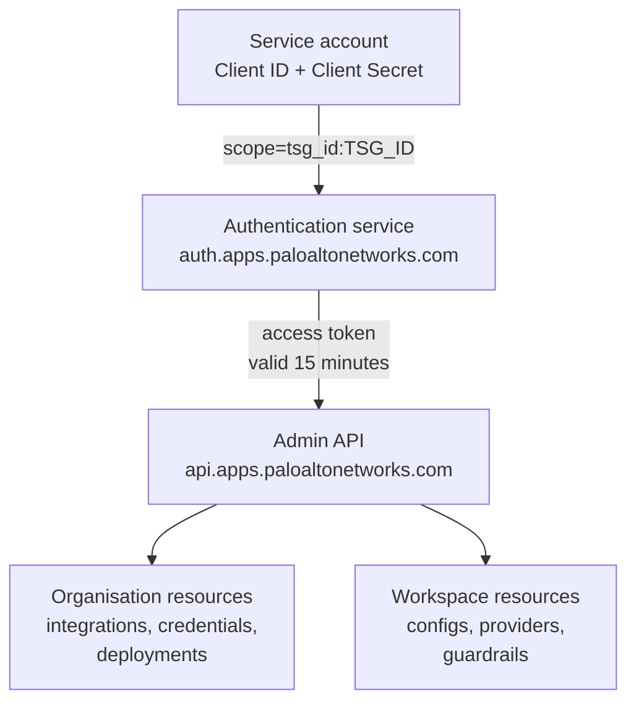
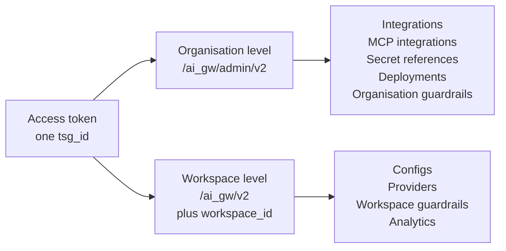

The Admin API manages the resources that make up your AI Gateway organisation: the integrations that connect model providers, the credentials behind them, the configs and guardrails applied to workspaces, the policies that cap usage, the MCP servers you expose, and the analytics you report on.

Anything an administrator sets up in Strata Cloud Manager can be set up here instead.



Created in Strata Cloud Manager, the service account is the identity behind every administrative call. It exchanges its credentials for a short-lived token, the token names one tenant, and every request made with it lands on that tenant.

<Warning>
Admin API requests are authorised with a **Strata Cloud Manager access token**, not a gateway API key. A key that works for inference returns `401` here. See [Authentication](/aigw/api-reference/admin-api/authentication).
</Warning>

## Your first request

<Steps>
  <Step title="Create a service account">
    In Strata Cloud Manager, go to **System Settings > Identity & Access**, select your tenant, and add an identity of type **Service Account**. Save the Client ID and Client Secret it issues, and note the tenant service group ID (TSG ID).

    Full walkthrough with roles and inheritance: [Create a service account](/aigw/api-reference/admin-api/authentication#create-a-service-account).
  </Step>
  <Step title="Request an access token">
    Exchange those three values for a token.

    ```sh
    curl -d "grant_type=client_credentials&scope=tsg_id:<tsg_id>" \
      -u <client_id>:<client_secret> \
      -H "Content-Type: application/x-www-form-urlencoded" \
      -X POST https://auth.apps.paloaltonetworks.com/oauth2/access_token
    ```
  </Step>
  <Step title="Call an endpoint">
    Send the token as a bearer token. Every endpoint takes the same header.

    ```sh
    curl https://api.apps.paloaltonetworks.com/ai_gw/v2/configs \
      -H "Authorization: Bearer $ACCESS_TOKEN"
    ```

    The response lists the configs belonging to the organisation the token is scoped to. You do not send a tenant identifier on the request, because the token carries it.
  </Step>
  <Step title="Refresh before it expires">
    Tokens last **15 minutes**, reported as `expires_in: 900` on the token response. Cache one for that window and refresh it shortly before it lapses.
  </Step>
</Steps>

## Base URLs

Which base URL an endpoint uses follows the resource, not the sidebar group it sits in.

| Base URL | Serves |
|:--|:--|
| `https://api.apps.paloaltonetworks.com/ai_gw/v2` | Configs, workspace guardrails, providers, API keys, usage and rate limit policies, MCP servers, analytics, feedback |
| `https://api.apps.paloaltonetworks.com/ai_gw/admin/v2` | Integrations, MCP integrations, secret references, deployments, organisation guardrails |
| `https://aigw.portkey.ai/v1` | `POST /logs` and `GET /logs/{logId}`. Self-hosted deployments substitute their own host |

The organisation guardrail endpoints carry their prefix in the path instead of the base URL, as `/admin/v2/guardrails` against `https://api.apps.paloaltonetworks.com/ai_gw`. That resolves to the same place as the admin base above.

Each endpoint's reference page states its server. Where the two disagree, trust the reference page, which is generated from the specification.

## How resources are scoped

Every resource sits at one of two levels. Knowing which one you are addressing explains most `403` responses.



| Level | Addressed by | Holds |
|:--|:--|:--|
| **Organisation** | The TSG ID inside your token. One TSG is one organisation. | Integrations, MCP integrations, secret references, deployments, organisation guardrails |
| **Workspace** | A `workspace_id`, passed explicitly | Configs, providers, workspace guardrails, analytics |

The split matches the base URLs: organisation-level resources are served from the `admin/v2` base. API keys and limit policies span both levels, and [`POST /api-keys/{sub-type}`](/aigw/api-reference/api-keys/post-api-keys-by-sub-type) takes the level from the calling token rather than from the path — `sub-type` chooses `user` or `service`, nothing more.

To reach a workspace-level resource, pass `workspace_id` as a **query parameter** on `GET` and list requests, and in the **request body** on `POST` and `PUT`. A workspace UUID or a slug both work.

```sh
curl "https://api.apps.paloaltonetworks.com/ai_gw/v2/configs?workspace_id=WORKSPACE_SLUG" \
  -H "Authorization: Bearer $ACCESS_TOKEN"
```

Omit it and the call resolves against the organisation default.

### Slugs and IDs

Mixing these up is a common cause of `404`.

- **Slugs** identify the resources you name yourself: `/configs/{slug}`, `/integrations/{slug}`, `/providers/{slug}`
- **IDs** identify the resources the gateway names for you: `/guardrails/{guardrailId}`, `/mcp-servers/{mcpServerId}`, `/policies/usage-limits/{policyUsageLimitsId}`, `/api-keys/{id}`

### Guardrails sit at both levels

[`/guardrails`](/aigw/api-reference/guardrails/list-guardrails) manages the guardrails of a single workspace. [`/admin/v2/guardrails`](/aigw/api-reference/org-guardrails/list-org-guardrails) manages the organisation-wide ones, which apply to every workspace unless a workspace is explicitly excluded. See [Enforcing Org Level Guardrails](/aigw/product/administration/enforce-organisation-level-guardrails).

## Common tasks

Each of these is a sequence of calls, not a single endpoint.

<AccordionGroup>
  <Accordion title="Connect a model provider and provision it to a team" icon="plug">
    1. [`POST /integrations`](/aigw/api-reference/integrations/post-integrations) creates the integration and attaches the provider credential
    2. [`PUT /integrations/{slug}/models`](/aigw/api-reference/integrations/models/put-integrations-by-slug-models) chooses which models it exposes
    3. [`PUT /integrations/{slug}/workspaces`](/aigw/api-reference/integrations/workspaces/put-integrations-by-slug-workspaces) grants the workspaces that may use it

    Steps 2 and 3 are [model provisioning](/aigw/product/model-catalog/model-provisioning) and [workspace provisioning](/aigw/product/model-catalog/workspace-provisioning). Skip them and the integration exists but nobody can reach it.
  </Accordion>
  <Accordion title="Put an MCP server behind the gateway" icon="server">
    1. [`POST /mcp-servers`](/aigw/api-reference/mcp-servers/mcp-servers-create) registers the server
    2. [`GET /mcp-servers/{mcpServerId}/capabilities`](/aigw/api-reference/mcp-servers/capabilities/mcp-server-capabilities-list) reads the tools it advertises
    3. [`PUT /mcp-servers/{mcpServerId}/capabilities`](/aigw/api-reference/mcp-servers/capabilities/mcp-server-capabilities-bulk-update) enables only the tools you intend to expose
    4. [`PUT /mcp-servers/{mcpServerId}/user-access`](/aigw/api-reference/mcp-servers/user-access/mcp-server-user-access-bulk-update) decides who may call it
    5. [`POST /mcp-servers/{mcpServerId}/test`](/aigw/api-reference/mcp-servers/mcp-servers-test) confirms the connection before anyone depends on it

    See the [MCP Gateway](/aigw/product/mcp-gateway) documentation for what each capability means.
  </Accordion>
  <Accordion title="Cap what a team can spend" icon="gauge">
    1. [`POST /policies/usage-limits`](/aigw/api-reference/usage-limit-policies/create-usage-limits-policy) defines the budget
    2. [`GET /policies/usage-limits/{policyUsageLimitsId}/entities`](/aigw/api-reference/usage-limit-policies/list-usage-limits-policy-entities) shows what the policy currently binds to
    3. [`PUT /policies/usage-limits/{policyUsageLimitsId}/entities/{entityId}/reset`](/aigw/api-reference/usage-limit-policies/reset-usage-limits-policy-entity) clears consumption for one entity

    Rate limits work the same way under [`/policies/rate-limits`](/aigw/api-reference/rate-limit-policies/list-rate-limits-policies). Background in [Budget Limits](/aigw/product/policies/budget-limits) and [Rate Limits](/aigw/product/policies/rate-limits).
  </Accordion>
  <Accordion title="Issue and rotate an API key" icon="key">
    1. [`POST /api-keys/{sub-type}`](/aigw/api-reference/api-keys/post-api-keys-by-sub-type) creates the key with the scopes it needs, `user` or `service`
    2. [`POST /api-keys/{id}/rotate`](/aigw/api-reference/api-keys/post-api-keys-by-id-rotate) rotates it on a schedule or on suspicion

    Available scopes are listed in [API Keys (AuthN and AuthZ)](/aigw/product/enterprise-offering/org-management/api-keys-authn-and-authz).
  </Accordion>
  <Accordion title="Report on last month" icon="chart-line">
    - [`GET /analytics/graphs/cost`](/aigw/api-reference/analytics/graphs/get-analytics-graphs-cost) returns spend over time
    - [`GET /analytics/groups/ai-models`](/aigw/api-reference/analytics/groups/get-analytics-groups-ai-models) breaks it down by model
    - [`GET /analytics/groups/metadata/{metadataKey}`](/aigw/api-reference/analytics/groups/get-analytics-groups-metadata-by-metadata-key) breaks it down by whatever your requests tag themselves with

    Tagging requests with [metadata](/aigw/product/observability/metadata) is what makes the last one useful.
  </Accordion>
</AccordionGroup>

## When a call fails

| Status | Read it as |
|:--|:--|
| `401` | The token is expired, malformed, or is actually a gateway API key |
| `403` | The token is valid but scoped to a different tenant, or the service account's role does not cover this operation |
| `404` | A slug was passed where an ID was expected, or the resource belongs to a workspace you did not name |
| `409` | The resource already exists. Most creates are not idempotent |

Every code the Admin API returns is listed on the [Errors](/aigw/api-reference/admin-api/error) page.

## Audit

Every administrative call is recorded with the principal that made it, the action, the target resource, a timestamp, an IP address and the request details. Automation is attributable to the service account that ran it, which is a good reason to give each one a name that says what it is for.

## Next

<CardGroup cols={2}>
  <Card title="Authentication" icon="key" href="/aigw/api-reference/admin-api/authentication">
    Service accounts, access tokens, and how scope works across a TSG hierarchy
  </Card>
  <Card title="Errors" icon="triangle-exclamation" href="/aigw/api-reference/admin-api/error">
    Every error code, with the usual cause
  </Card>
  <Card title="Audit Logs" icon="shield-check" href="/aigw/product/enterprise-offering/audit-logs">
    The trail of every administrative change
  </Card>
  <Card title="Organisation Management" icon="browser" href="/aigw/product/enterprise-offering/org-management">
    The same settings, configured from Strata Cloud Manager
  </Card>
</CardGroup>
