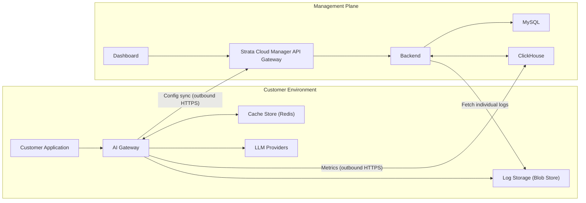

Prisma AIRS AI Gateway is deployed as a **hybrid, two-plane system**. AI traffic is processed
inside your own environment; administration, analytics, and storage run in the Management Plane
behind Palo Alto Networks Strata Cloud Manager.

- **Customer Environment** — the AI Gateway and the LLM providers it routes to. All LLM traffic
  is processed within your network boundary. No prompt or response data is forwarded to the
  Management Plane directly.
- **Management Plane** — the Dashboard, Backend, MySQL, ClickHouse, Redis, and Blob Store.
  Handles identity resolution, configuration management, analytics, log storage, and audit
  logging. It communicates with the Customer Environment over an authenticated HTTPS connection.

The Strata Cloud Manager API Gateway sits at the boundary between the two planes. It is the sole
authentication authority for all requests entering the Management Plane.

## Core components

### Customer Environment

| Component | Role |
| :--- | :--- |
| **AI Gateway** | LLM reverse proxy. Routes requests to LLM providers, enforces rate limits and quotas, applies guardrails, and produces all analytics and raw log data. Writes directly to ClickHouse (metrics) and Blob Store (raw logs). Reads from Redis for fast auth and config lookups on every request. Runs as stateless containers that scale horizontally. |
| **Cache Store** | Local Redis cache holding configuration objects so requests are served without a round-trip to the Management Plane. Eliminates the runtime dependency on the Management Plane. |
| **Log Storage** | Blob Store holding the full request and response payload for every LLM call. Keeps sensitive LLM data in your environment. |
| **LLM Providers** | Upstream AI model providers — private, proprietary, or public — that the AI Gateway routes traffic to. |

### Management Plane

| Component | Role |
| :--- | :--- |
| **SCM API Gateway** | Palo Alto Networks gateway in front of the Management Plane. Terminates mTLS, authenticates end users, and injects identity context headers into every downstream request. Sole authentication authority for all Management Plane operations. |
| **Backend** | Owns all writes to MySQL. Reads ClickHouse to serve the analytics UI and log list. Reads Blob Store to serve individual log detail views. Writes audit log entries to ClickHouse for every configuration change. Manages cache invalidation in Redis on every configuration mutation. |
| **Dashboard** | Web interface for managing configurations, viewing logs, monitoring analytics, and administering the deployment. All Dashboard requests pass through the SCM API Gateway before reaching the Backend. |
| **MySQL** | Relational database exclusively owned by the Backend. Stores organisations, workspaces, API keys, routing configurations, guardrail definitions, virtual keys, licensing entitlements, and tenant-to-organisation mappings. The AI Gateway never connects to MySQL directly. |
| **ClickHouse** | Analytical database with split write ownership. The AI Gateway writes request metrics and guardrail execution results. The Backend writes management plane audit logs. The Backend reads all data to serve the analytics UI. |
| **Redis** | In-memory cache serving the AI Gateway on every request. Caches authentication context, API key details, routing configurations, virtual keys, and guardrail definitions. Also stores rate limit counters, circuit breaker state, and semantic cache entries. |
| **Blob Store** | Object storage holding the complete request and response body for every LLM call. The AI Gateway writes to it directly and asynchronously; the Backend reads from it when a user opens a log detail view. |

## Identity and authentication

The SCM API Gateway is the sole authentication authority. Standard session cookies are not used
on Management Plane routes. Identity is established through three headers that the SCM API
Gateway injects into every request it forwards:

| Header | What it carries | How the Backend uses it |
| :--- | :--- | :--- |
| **Tenant ID** | The Palo Alto Tenant/TSG identifier for the calling organisation | Looked up in MySQL to resolve the internal organisation identity. If the tenant is unrecognised, the request is rejected before any business logic runs. |
| **User Subject** | Opaque user identity from the JWT issued by Palo Alto | Used as the caller identity for audit log entries. Never persisted in the Backend's user store. Strata Cloud Manager manages user lifecycle entirely outside the AI Gateway. |
| **Scope Access** | The set of workspace scopes the caller is permitted to access | Evaluated per-request to enforce workspace-level access control. Workspace membership tables are not consulted — access is entirely scope-based. |

**mTLS boundary:** the load balancer between the SCM API Gateway and the Backend terminates the
mTLS connection and forwards the verified client certificate subject. The Backend re-verifies the
certificate CN so that gateway-injected identity headers are only trusted when the caller is the
genuine SCM API Gateway.

**Tenant-to-organisation resolution:** every request to a Management Plane route resolves the
Tenant ID to an internal organisation identifier by querying a dedicated tenant mapping table in
MySQL. This resolved identifier scopes all downstream database queries and enforces data
isolation between tenants.

## Request lifecycle

### Synchronous path (affects response latency)

1. **Entry** — the customer application sends an LLM request to the AI Gateway in the Customer
   Environment.

2. **Auth and config hydration** — the gateway checks Redis for a cached copy of the API key,
   organisation context, and routing configuration. On a cache hit this is near-instantaneous. On
   a cache miss the gateway calls the Backend; the Backend reads from MySQL
   and returns the hydrated object, which the gateway then stores in Redis.

3. **LLM proxying** — the gateway forwards the request, with any configured transformations, to
   the target LLM provider. The provider response is streamed back through the gateway.

4. **Response return** — the LLM response is returned to the customer application. The request
   lifecycle ends here from the client's perspective.

### Asynchronous path (non-blocking, runs after the response is returned)

5. **Metrics write to ClickHouse** — the gateway writes a lightweight analytics record capturing
   token counts, cost, latency, model, provider, cache status, and trace identifiers, along with
   a pointer to the full log body. This write is batched and does not affect response latency.

6. **Raw log write to Blob Store** — the gateway writes the complete request and response payload
   (headers, body, token breakdown) as a structured document. The file path is the same pointer
   stored in the ClickHouse record in step 5, letting the Backend cross-reference both stores
   when serving log details.

7. **Usage sync** — the gateway notifies the Backend of updated usage counters, API key
   exhaustion events, and quota state. This call is non-blocking.

## Data flow between planes

<AccordionGroup>
<Accordion icon="network-wired" title="AI traffic (fully contained in your environment)">
  All LLM traffic stays within your network boundary:

  1. Your application sends requests to the AI Gateway
  2. The gateway processes the request, applying routing, caching, and guardrails
  3. The gateway forwards the request to the appropriate LLM provider
  4. Responses from LLMs return through the same path

  Prompt data and responses are never exposed outside your environment.
</Accordion>

<Accordion icon="database" title="Config sync (gateway ↔ Management Plane)">
  The AI Gateway periodically synchronises with the Management Plane:

  - **Frequency**: 1-minute heartbeat intervals
  - **Data retrieved**: routing configs, integrations, providers, API keys
  - **Process**: deltas (changed items) are fetched, decrypted locally, and the corresponding
    cache entries are invalidated — they are re-fetched on next use
  - **Resilience**: the gateway operates independently between syncs using cached configs, so it
    continues serving traffic during a Management Plane disconnection
</Accordion>

<Accordion icon="clock" title="Cache behaviour">
  The gateway holds all configuration objects — API keys, virtual keys, configs, guardrails — in
  a local cache so every request is served without a real-time round-trip to the Management
  Plane.

  - **Lazy-loaded**: items enter the cache on first use; their TTL resets to 7 days on every
    re-population, so actively used objects stay fresh automatically.
  - **Delta invalidation**: every minute the gateway fetches a list of changed items from the
    Management Plane and deletes the corresponding cache entries.
  - **Eviction policy**: use `volatile-lru` so idle entries are evicted first under memory
    pressure, preserving the objects your live traffic depends on.

  <Card title="Cache Behavior" icon="database" href="/aigw/self-hosting/cache-behavior">
    TTL details, delta sync mechanics, eviction policy, and configuration reference.
  </Card>
</Accordion>

<Accordion icon="chart-line" title="Analytics (gateway → Management Plane)">
  The gateway writes anonymised operational metrics — model used, token counts, response times —
  to ClickHouse. These power the analytics dashboards without exposing prompt or response
  content.
</Accordion>

<Accordion icon="files" title="Log management options">
  **Option A: logs in your environment** (recommended for high-security deployments)
  - Logs stored in your own Blob Store
  - When viewing logs in the Dashboard, the Management Plane requests them from the gateway

  **Option B: logs in the Management Plane log store**
  - The gateway encrypts and forwards logs
  - No inbound connections to your environment are required to view logs
</Accordion>
</AccordionGroup>

## Storage ownership

Which component writes and reads each store determines your network security design and access
control.

| Storage System | Written by | Read by | What it holds |
| :--- | :--- | :--- | :--- |
| **MySQL** | Backend only | Backend only | Organisation config, workspaces, API keys, routing configs, guardrails, virtual keys, tenant-to-organisation mappings, licensing entitlements |
| **ClickHouse** | AI Gateway (metrics, guardrail results, feedback) and Backend (audit logs) | Backend (analytics UI, log list, audit log views) | Per-request analytics, guardrail execution outcomes, user feedback scores, management plane change history |
| **Blob Store** | AI Gateway (async, post-response) | Backend (log detail view only, via pointer from ClickHouse) | Full request and response payloads for every LLM call |
| **Redis** | AI Gateway (post-cache-miss population, rate limit counters, circuit breaker state) and Backend (cache invalidation on config mutations) | AI Gateway (hot path lookup on every request) | Auth context, routing configs, rate limit counters, circuit breaker state, semantic cache entries |

### ClickHouse split ownership

ClickHouse has intentionally split write ownership across the two planes:

- The **AI Gateway** writes to the analytics tables at high volume directly after every request.
  These writes are asynchronous and bypass the Backend entirely, keeping the write path
  low-latency.
- The **Backend** writes only to the audit log table, recording every configuration change made
  through the Dashboard or API, tagged with the caller's identity and timestamp.

The Backend reads all tables to power the analytics UI, log browsing, and audit log views.

### Redis

Redis is the caching layer between the AI Gateway and the Backend. It is the primary mechanism by
which the gateway avoids a synchronous Backend call on every request.

**What the AI Gateway stores:**

- Hydrated API key and organisation context, populated after a cache-miss Backend call
- Routing configurations, guardrail definitions, and virtual key credentials
- Rate limit counters, tracked as atomic per-key and per-organisation windows
- Circuit breaker state, tracking per-provider failure and recovery status
- Semantic cache entries for prompt similarity matching

**What the Backend does:**

- On every configuration mutation — an API key rotation, config update, or workspace change — the
  Backend invalidates the relevant Redis entry, forcing the next gateway request for that key to
  re-fetch fresh data from MySQL.
- The Backend also uses Redis for internal background job coordination: analytics provisioning,
  alert dispatching, and usage syncing.

### Blob Store

Blob Store is the raw log storage layer. It holds the full-fidelity record of every LLM
interaction and is deliberately kept separate from ClickHouse, which holds only lightweight
analytics metrics.

Every LLM call results in a structured document containing the complete request body, response
body, headers, and token breakdown. The gateway writes it asynchronously after returning the
response to the caller, so the write does not affect latency, and stores the file path as a
pointer in the corresponding ClickHouse record.

The Backend does not read Blob Store in the regular request flow. It reads only on demand, when a
user opens a log detail view: it retrieves the storage pointer from ClickHouse and fetches the
corresponding document. The two stores are always used together for log detail retrieval; neither
is queried in isolation.

Supported backends include AWS S3, Google Cloud Storage, Azure Blob Storage, and any
S3-compatible store such as MinIO.

## Deploying the gateway

The AI Gateway is deployed as containerised workloads using Helm charts for Kubernetes, with
options for the major cloud providers.

### Storage options

<Tabs>
  <Tab title="Object Storage">
    S3-compatible storage options including:
    - AWS S3 (standard credentials or assumed roles)
    - Google Cloud Storage (S3-compatible interoperability mode)
    - Azure Blob Storage (key, managed identity, or Entra ID)
    - Any S3-compatible Blob Storage
  </Tab>
  <Tab title="Document DB">
    MongoDB/DocumentDB for structured log storage, with options for:
    - Direct connection string with username and password
    - Certificate-based authentication (PEM)
    - Connection pooling configurations
  </Tab>
</Tabs>

### Authentication methods

<Tabs>
  <Tab title="Cloud Provider IAM">
    - IAM roles for service accounts (IRSA) in Kubernetes
    - Instance Metadata Service (IMDS) for EC2/ECS
    - Managed identities in Azure environments
  </Tab>
  <Tab title="Direct Authentication">
    - Standard access/secret keys
    - Certificate-based authentication
    - JWT-based authentication
  </Tab>
</Tabs>

### Infrastructure requirements

- **Kubernetes cluster**: K8s 1.20+ with Helm 3.x
- **Outbound network**: HTTPS access to Management Plane endpoints
- **Container registry access**: for pulling gateway container images
- **Recommended resources per gateway instance**:
  - CPU: 1–2 cores
  - Memory: 2–4 GB
  - Storage: dependent on logging configuration

## Data security and encryption

<Tabs>
  <Tab title="Data Residency">
    **Your sensitive data stays in your environment**
    - All prompt content and LLM responses remain within your network
    - Only anonymised metrics cross network boundaries
    - Log storage location is configurable
  </Tab>
  <Tab title="Encryption Methods">
    **Multi-layered encryption**
    - All data in the Management Plane is encrypted at rest
    - Communication between planes uses TLS 1.3 in transit
    - Sensitive data uses envelope encryption
    - Optional BYOK (bring your own key) support with AWS KMS
  </Tab>
  <Tab title="Access Controls">
    **Defence in depth**
    - Network-level controls limit Management Plane access to authorised IPs
    - Scope-based access control for administrative functions
    - Audit logging of all administrative actions
    - Access tokens are short-lived with automatic rotation
  </Tab>
</Tabs>

## Why the architecture is split this way

<AccordionGroup>
<Accordion title="Why the transaction database lives in the Management Plane">
  1. **Real-time model updates**: LLM providers frequently change model parameters, pricing, and
     availability. Centralising this data ensures every gateway operates with current
     information.

  2. **Feature velocity**: new capabilities can ship without requiring a customer-side
     deployment.

  3. **Operational efficiency**: you do not maintain database infrastructure solely for
     non-sensitive object management.
</Accordion>

<Accordion title="Why objects are cached locally">
  1. **Performance**: eliminates network latency during LLM requests by keeping routing and
     config data available locally.

  2. **Resilience**: the gateway keeps operating even when temporarily disconnected from the
     Management Plane.

  3. **Security**: reduces attack surface by minimising runtime external dependencies.
</Accordion>
</AccordionGroup>

## What SCM deployment changes

The storage write paths — how the gateway writes to ClickHouse and Blob Store, and how the
Backend writes to MySQL — are identical to a standard deployment. SCM mode changes the
authentication model and the API surface, not the underlying data architecture.

| Aspect | Standard deployment | SCM deployment |
| :--- | :--- | :--- |
| Auth authority | Gateway-issued API keys and session cookies | SCM API Gateway injects identity headers |
| User identity | Persisted in the Backend user store | Opaque JWT subject, never stored in the Backend |
| Access control | Role-based membership tables per organisation and workspace | Scope-based, evaluated per-request from the injected header |
| Organisation resolution | API key lookup | Tenant ID mapped to organisation in MySQL |
| Licensing | Standard subscription billing | Per-tenant entitlement table with device and quota tracking |
| mTLS boundary | Not enforced | Certificate CN verified at the Management Plane entry point |
| User management | Managed in the gateway | Managed entirely in Strata Cloud Manager — the AI Gateway holds no user records |
| API surface | Full standard route set | SCM-scoped workspace and admin routes only |
| Storage mechanics | Identical to SCM | Identical to standard |

## Next steps

<CardGroup cols={2}>
  <Card title="Gateway Registration" icon="key" href="/aigw/self-hosting/hybrid-deployments/gateway-registration" />
  <Card title="Cache Behavior" icon="database" href="/aigw/self-hosting/cache-behavior" />
  <Card title="AWS (EKS)" icon="aws" href="/aigw/self-hosting/hybrid-deployments/aws/eks" />
  <Card title="Azure (AKS)" icon="microsoft" href="/aigw/self-hosting/hybrid-deployments/azure/aks" />
  <Card title="GCP" icon="google" href="/aigw/self-hosting/hybrid-deployments/gcp" />
  <Card title="Enterprise Changelog" icon="clock-rotate-left" href="/aigw/changelog/enterprise" />
</CardGroup>
