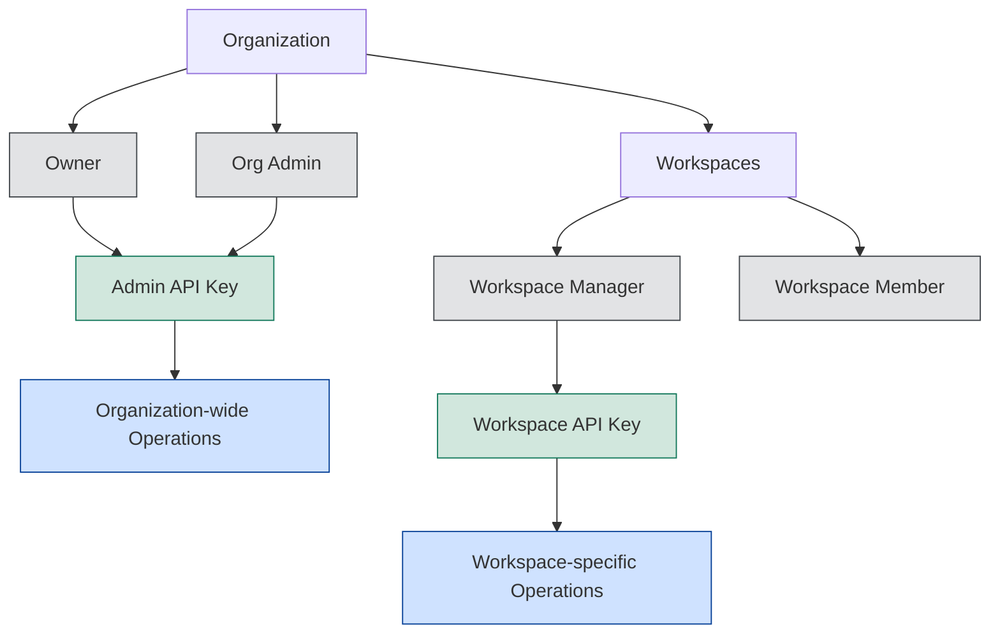

# Portkey Admin API

The Portkey Admin API provides programmatic access to manage your organization, workspaces, and resources. Whether you're automating routine administration tasks, integrating Portkey with your existing systems, or customizing your deployment at scale, this API gives you the tools to control every aspect of your Portkey implementation.

## Understanding the Admin API Ecosystem

The Admin API is organized around key capabilities that let you manage different aspects of your Portkey environment. Let's explore what you can build and automate:

### Resource Management

At the foundation of Portkey are the resources that define how your AI implementation works. These can all be managed programmatically:

<CardGroup cols={3}>
  <Card title="Configs" href="/api-reference/admin-api/control-plane/configs/create-config">
    Create and manage configuration profiles that define routing rules, model settings, and more.
  </Card>
  <Card title="Virtual Keys" href="/api-reference/admin-api/control-plane/virtual-keys/create-virtual-key">
    Manage virtual API keys that provide customized access to specific configurations.
  </Card>
  <Card title="API Keys" href="/api-reference/admin-api/control-plane/api-keys/create-api-key">
    Create and manage API keys for accessing Portkey services.
  </Card>
</CardGroup>

### Analytics and Monitoring

Once your resources are configured, you'll want to measure performance and usage. The Admin API gives you powerful tools to access analytics data:

<CardGroup cols={3}>
  <Card title="Summary Data" href="/api-reference/admin-api/control-plane/analytics/summary/get-all-cache-data">
    Retrieve aggregated usage statistics and performance metrics.
  </Card>
  <Card title="Grouped Data" href="/api-reference/admin-api/control-plane/analytics/groups-paginated-data/get-model-grouped-data">
    Access detailed analytics organized by metadata, model, or user.
  </Card>
  <Card title="Time Series Data" href="/api-reference/admin-api/control-plane/analytics/graphs-time-series-data/get-cost-data">
    Monitor performance trends, costs, errors, feedback, and usage patterns over time.
  </Card>
</CardGroup>

### User and Workspace Administration

Beyond resources and analytics, you'll need to manage who has access to your Portkey environment:

<CardGroup cols={2}>
  <Card title="Users & Invites" href="/api-reference/admin-api/control-plane/users/retrieve-a-user">
    Manage user accounts, permissions, and access. Send and manage user invitations.
  </Card>
  <Card title="Workspaces & Members" href="/api-reference/admin-api/control-plane/workspaces/create-workspace">
    Create workspaces and manage team membership and permissions within workspaces.
  </Card>
</CardGroup>

## Authentication Strategy

Now that you understand what the Admin API can do, let's explore how to authenticate your requests. Portkey uses a sophisticated access control system with two types of API keys, each designed for different use cases:

<CardGroup cols={2}>
  <Card title="Admin API Key" icon="key">
    **Organization-wide access**
    
    These keys grant access to administrative operations across your entire organization.
    
    <Note>Only Organization Owners and Admins can create and manage Admin API keys.</Note>
  </Card>
  <Card title="Workspace API Key" icon="key">
    **Workspace-specific access**
    
    These keys provide targeted access to resources within a single workspace.
    
    <Note>Workspace Managers can create and manage Workspace API keys.</Note>
  </Card>
</CardGroup>

The key you use determines which operations you can perform. For organization-wide administrative tasks, you'll need an Admin API key. For workspace-specific operations, you can use a Workspace API key.

## Access Control and Permissions Model

Portkey's hierarchical access control system governs who can use which APIs. Let's examine how roles, API keys, and permissions interact:



This access model follows a clear hierarchy:

| Role | Can Create Admin API Key | Can Create Workspace API Key | Access Scope |
|:------|:--------------------------|:------------------------------|:--------------|
| Organization Owner | ✅ | ✅ (any workspace) | All organization resources |
| Organization Admin | ✅ | ✅ (any workspace) | All organization resources |
| Workspace Manager | ❌ | ✅ (managed workspace only) | Single workspace resources |
| Workspace Member | ❌ | ❌ | Limited workspace access |

## Creating and Managing API Keys

Now that you understand the permission model, let's look at how to create the API keys you'll need:

### Through the Portkey Dashboard

The simplest way to create an API key is through the Portkey dashboard:

<Frame caption="Creating an Admin API Key in the Portkey Dashboard">
  
</Frame>

### Through the API

You can also create keys programmatically:

<CodeGroup>
```sh Creating Admin API Key {1,2}
curl -X POST https://api.portkey.ai/v1/api-keys/organisation/service
  -H "x-portkey-api-key: YOUR_EXISTING_ADMIN_KEY" \
  -H "Content-Type: application/json" \
  -d '{
    "name":"API_KEY_NAME_0809",
    "scopes":[
      "logs.export",
      "logs.list",
      "logs.view"
    ]
  }'
```

```sh Creating Workspace API Key {1,2}
curl -X POST https://api.portkey.ai/v1/api-keys/workspace/user \
  -H "x-portkey-api-key: YOUR_EXISTING_WORKSPACE_KEY" \
  -H "Content-Type: application/json" \
  -d '{
    "name":"API_KEY_NAME_0909",
    "workspace_id":"WORKSPACE_ID",
    "scopes":[
      "virtual_keys.create",
      "virtual_keys.update",
    ]
  }'
```
</CodeGroup>

## Understanding API Key Capabilities

Both key types have different capabilities. This table clarifies which operations each key type can perform:

| Operation | Admin API Key | Workspace API Key |
|:-----------|:---------------|:-------------------|
| Manage organization settings | ✅ | ❌ |
| Create/manage workspaces | ✅ | ❌ |
| Manage users and permissions | ✅ | ❌ |
| Create/manage configs | ✅ (All workspaces) | ✅ (Single workspace) |
| Create/manage virtual keys | ✅ (All workspaces) | ✅ (Single workspace) |
| Access Analytics | ✅ (All workspaces) | ✅ (Single workspace) |
| Create/update feedback | ❌ | ✅ |

## Security and Compliance: Audit Logs

For security-conscious organizations, Portkey provides comprehensive audit logging of all Admin API operations. These logs give you complete visibility into administrative actions:

<Frame caption="Audit Logs in the Portkey Dashboard">
  
</Frame>

Every administrative action is recorded with:
- User identity
- Action type and target resource
- Timestamp
- IP address
- Request details

This audit trail helps maintain compliance and provides accountability for all administrative changes.

<Card title="Audit Logs Documentation" icon="shield-check" href="https://portkey.ai/docs/product/enterprise-offering/access-control-management#audit-logs">
  Learn more about Portkey's audit logging capabilities
</Card>

## Getting Started with the Admin API

Now that you understand the Admin API ecosystem, authentication, and permissions model, you're ready to start making requests. Here's what you'll need:

1. **Appropriate role**: Ensure you have the right permissions (Org Owner/Admin for Admin API, Workspace Manager for Workspace API)
2. **API key**: Generate the appropriate key from the Portkey dashboard
3. **Make your first request**: Use your key in the request header


For developers looking to integrate with the Admin API, we provide a complete OpenAPI specification that you can use with your API development tools:

<Card title="OpenAPI Specification" icon="file-code" href="/api-reference/admin-api/open-api-specification">
  Download the OpenAPI spec for the Admin API
</Card>

## Need Support?

If you need help setting up or using the Admin API, our team is ready to assist:

<Card title="Book a Support Call" icon="calendar" href="https://portkey.sh/demo-1">
  Schedule time with our team to get personalized help with the Admin API
</Card>