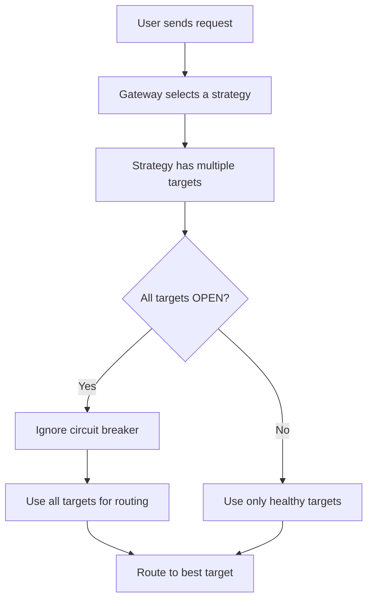

June was a big one.

We launched **Model Catalog**, one of our most requested features from enterprise users, and something we’ve spent the last few weeks building, testing, and refining. It’s now the central control plane for managing every model your teams use through Portkey.

Along with that, we rolled out several core updates across the platform and gateway including OpenAI Agents TS SDK support, circuit breaker, global endpoints for Vertex AI, expanded Azure coverage, and more.

June also saw increased GitHub momentum as we rolled out one of our largest infrastructure upgrades to date!

Here’s everything that went live in June.

## Summary

| Area         | Key Highlights                                                                                                                               |
| :----------- | :------------------------------------------------------------------------------------------------------------------------------------------- |
| **Platform**            | • Model Catalog launch    • OpenAI background mode    • Circuit breaker config|
| **Gateway & Providers** | • Support for Sutra, o3-pro, Magistral, and Gemini 2.5 models    • Vertex AI global endpoints    • Anthropic Computer Use tool support    • Support for additional Azure OpenAI endpoints    • Bedrock Inference Profiles    • Prompt caching for tools (Anthropic) |
| **Integrations**        | • OpenAI Agent SDK (TypeScript)    • Langroid native support    • Strands SDK & ADK integration    • Cursor integration    • Gemini CLI support |
| **Community & Partnerships** | • FutureAGI integration    • Prompt Security integration    • Lasso Security integration    • Arize AI cookbook |

---

## 🎉 Introducing the Model Catalog 🎉
Take control of which models your teams can use across every provider, from one place.
With Model Catalog, you can:
- Manage access to 1,600+ models across OpenAI, Anthropic, Azure, and more
- Decide which models are available to which teams
- Set rate limits and budgets per workspace
- Automatically enable new models as they’re released

<Frame>
  <video width="700" autoPlay loop muted playsInline>
    <source src="https://cfassets.portkey.ai/WEBSITE%2FPRODUCT%20PAGES%2FModel%20Catalog%2FNew%20Hero.mp4" type="video/mp4" />
    Your browser does not support the video tag.
  </video>
</Frame>

No more scattered configuration or manual provisioning. Just clean, centralized governance for all your AI usage.

To enable it in your organizattion,reach out to us at support@portkey.ai

## Circuit breaker

When a model starts failing or slowing down, Portkey can now temporarily route traffic to fallback targets — then automatically restore routing once things stabilize.
It’s a smarter way to handle failovers without manual intervention.
Available as a config option. [Learn more ->](https://portkey.ai/docs/product/ai-gateway/circuit-breaker)

## OpenAI Agent SDK (TypeScript)

With the OpenAI Agents SDK (TS), building agents in TypeScript just got easier - no Python, no context switching, just native tooling and agent workflows.

But turning those prototypes into production-ready systems reveals real gaps:

- No logging or tracing
- No retries or failover
- No cost visibility or access control
- No simple way to switch LLM providers

That’s where Portkey comes in. Route your calls through Portkey and unlock observability, guardrails, prompt versioning, and multi-provider support instantly. [Learn more ->](https://portkey.ai/docs/integrations/agents/openai-agents-ts)

## Strands Agents SDK

Enterprises building on Strands Agents SDK now have a cleaner path to production — thanks to Portkey as the LLM gateway.
With a single abstraction layer, you can:
- Access 2,000+ LLMs with provider-agnostic logic
- Standardize tool calling across providers
- Add conditional routing for cost control
- Enable retries, rate limits, and full observability

Huge thanks to Federico Kamelhar for leading the integration effort and bringing Portkey support to Strands.
If you love Strands & Portkey **[contribute to this PR](https://portkey.sh/L1tDBwa)** and help us stabilize this integration.

## Gateway & Providers

**AWS Bedrock inference profiles**

You can now route Bedrock requests by inference profile, allowing access to multiple regions or compute configurations through a single virtual key. [Learn more -> ](https://portkey.ai/docs/integrations/llms/bedrock#inference-profiles).

**Vertex AI global endpoint support**

Portkey helps you improve model availability and reduce 429 (rate limit) errors with support for Vertex AI’s global endpoints.
You can now set `region = global` in your Vertex AI Virtual Key config to automatically access Google’s distributed infrastructure — no manual region selection needed. 

**OpenAI Background Mode**

Reasoning models can take minutes to solve complex problems.
With background mode, you can now run long-running tasks on models like `o3-pro` and `o1-pro` reliably, without worrying about timeouts or dropped connections.

Portkey now supports background mode for OpenAI requests.
Simply pass `background:True` as a parameter, and Portkey will handle the rest.

**Computer Use tool support**

Experiment confidently with Anthropic’s new Computer Use tool by adding observability, fallback logic, and cost controls from day one. [Learn more ->](https://portkey.ai/docs/integrations/libraries/anthropic-computer-use)

**Support for additional Azure OpenAI endpoints**

Portkey now supports a wider range of Azure OpenAI endpoints including image generation, audio transcription, speech synthesis, file management, and batch operations.

**Anthropic prompt caching (tools)**

Anthropic tool-based interactions now benefit from prompt caching in Portkey, improving performance and reducing token use for repeated tool calls.

**To keeping up the pace!**
<Frame>
  
</Frame>

## New models and providers

  

    <ul>
      <li><b>Sutra</b>: Multilingual LLM with standout MMLU scores in Hindi & Gujarati</li>
      <li><b>Magistral</b>: Mistral’s first reasoning model, built for multilingual and domain-specific logic</li>
      <li><b>o3-pro</b>: OpenAI’s latest flagship model with strong reasoning and fast response times</li>
      <li><b>Gemini 2.5 (Flash, Pro, Flash-Lite)</b>: Now GA and supported with full observability</li>
    </ul>
  

  

    <ul>
      <li><b>Kluster AI</b>: Claude-compatible, MCP-enabled models optimized for low latency and high availability. </li>
      <li><b>Hyperbolic AI</b>: OpenAI-compatible models focused on cost efficiency and speed for production-scale usage. </li>
      <li><b>Featherless AI</b>: Serverless access to Hugging Face models with a lightweight setup.</li>
      <li><b>Groq</b>: Support for <code>service_tier</code> flag added</li>
    </ul>
  

## Integrations
<CardGroup cols={2}>
  <Card
    title="OpenAI Agent SDK (TypeScript)"
    icon="tool"
    href="https://portkey.ai/docs/integrations/agents/openai-agents-sdk"
  >
    Portkey now works with OpenAI’s new TypeScript Agents SDK. Add retries, observability, rate limits, and multi-provider support to your agent flows, without changing core logic.
  </Card>
  <Card
    title="Langroid"
    icon="integration"
    href="https://portkey.ai/docs/integrations/agents/langroid"
  >
    Langroid now supports Portkey natively — plug it in to get multi-provider routing, observability, fallback logic, and guardrails in your agentic Python apps.
  </Card>
  <Card
    title="Cursor"
    icon="integration"
  >
    Bring visibility and governance to Cursor’s coding assistant with Portkey. Choose from 1600+ models, track requests, enforce rate limits, and log usage, making it easy for enterprises to govern Cursor across the org.
  </Card>
  <Card
    title="Agent Development Kit (ADK)"
    icon="integration"
  >
    Portkey now integrates with Google’s Agent Development Kit (ADK), bringing production-grade features like retries, fallback logic, and observability to ADK-based agents.
  </Card>
</CardGroup>

## Partnerships
<Frame>
  
</Frame>
- **Prompt Security** – Secure every prompt and response in real time by embedding Prompt Security directly into Portkey’s AI Gateway. [Read more here](https://portkey.ai/blog/why-llm-security-is-non-negotiable/)

- **Lasso Security** – Combine infra-level controls and real-time behavioral monitoring to secure the entire LLM lifecycle — from access to output. [Read more here](https://portkey.ai/blog/how-to-secure-your-entire-llm-lifecycle)

- **FutureAGI** – Use Portkey as the control layer and FutureAGI as the eval layer to automate output scoring across all model traffic. [See how you can implement this](https://portkey.ai/docs/integrations/tracing-providers/future-agi)

- **Arize AI** – Connect Portkey’s routing and guardrails with Arize’s observability to monitor model drift, latency, cost, and quality in one flow. [Read more here](https://portkey.ai/docs/integrations/tracing-providers/arize)

## Portkey Live!

In partnership with [**Pangea**](https://pangea.cloud/), we hosted a live webinar on how to build scalable, secure GenAI infrastructure. Catch the replay here!.
<Frame>
  <iframe
    width="700"
    height="394"
    src="https://www.youtube.com/embed/gUz5caRvtes"
    title="Portkey Live Webinar"
    frameBorder="0"
    allow="accelerometer; autoplay; clipboard-write; encrypted-media; gyroscope; picture-in-picture"
    allowFullScreen
  ></iframe>
</Frame>

**Improvements**
- Renamed Model Whitelist to Allowed Models for clarity and consistency
- Improved error responses for webhook failures, making them easier to debug and handle programmatically

<Frame>
  
</Frame>

## Resources
- Cookbook: [Optimizing Prompts with LLama Prompt Ops](https://portkey.ai/docs/guides/prompts/llama-prompts)
- Cookbook: [OpenAI Computer Use Tool](https://portkey.ai/docs/guides/llms/openai-computer-use-tool)
- Blog: [Building AI agent workflows with the help of an MCP gateway](https://portkey.ai/blog/building-ai-agent-workflows-with-the-help-of-an-mcp-gateway/)
- Blog: [Balancing AI model accuracy, performance, and costs](https://portkey.ai/blog/balancing-model-accuracy-performance-and-costs-with-an-ai-gateway/)

## Community Contributors

A special thanks to our community contributors this month:
- [Shubhwithai](https://github.com/Shubhwithai)
- [DarinVerheijke](https://github.com/DarinVerheijke)
- [jroberts2600](https://github.com/jroberts2600)

## Coming this month!
Struggling with unauthorized tool usage in MCP? Portkey is about to solve that. Stay tuned.

## Support

<CardGroup cols={2}>
<Card title="Need Help?" icon="bug" href="https://github.com/Portkey-AI/gateway/issues">
Open an issue on GitHub
</Card>
<Card title="Join Us" icon="discord" href="https://portkey.wiki/community">
Get support in our Discord
</Card>
</CardGroup>
