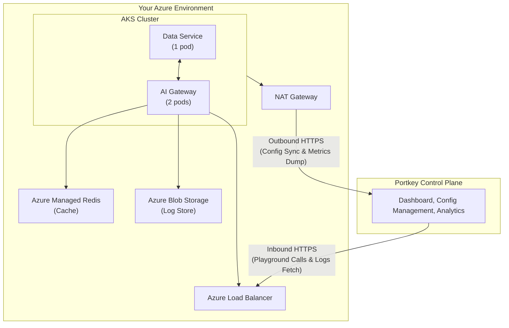
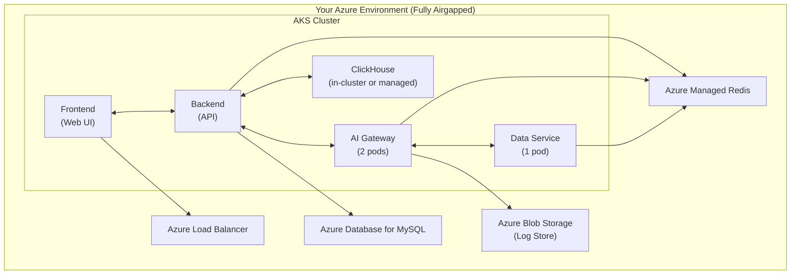

This guide provides complete architecture and service requirements for deploying Portkey on Azure for both **Hybrid** and **Full Private (Airgapped)** deployment models.

## Deployment Models

| Deployment Model | Description |
|:-----------------|:------------|
| **Hybrid** | Data Plane runs in your Azure environment; Control Plane hosted by Portkey |
| **Full Private (Airgapped)** | Both Data Plane and Control Plane run entirely in your Azure environment |

---

## Hybrid Deployment

In a Hybrid deployment, only the **Data Plane** components are deployed in your Azure environment. The **Control Plane** (dashboard, config management, analytics) is hosted and managed by Portkey.

### Architecture Diagram

### Required Azure Services

| Component | Azure Service | Sizing Recommendation |
|:----------|:-------------|:---------------------|
| **Kubernetes Cluster** | Azure Kubernetes Service (AKS) | 4 vCPU, 8 GB RAM (minimum) |
| **Cache Store** | Azure Managed Redis | 6 GB (Basic or Standard tier) |
| **Log Store** | Azure Blob Storage | Serverless (no provisioned storage required) |
| **Load Balancer** | Azure Load Balancer | Standard tier (created via AKS Load Balancer Controller) |
| **Authentication** | Entra ID or Managed Identity | Access to Blob Storage |

### Network Requirements

<Note>
**Portkey Control Plane IP**: `44.221.117.129` — whitelist this for inbound accessing the playground and fetching individual logs.
</Note>

| Direction | Requirement |
|:----------|:-----------|
| **Outbound HTTPS** | Required for config sync with Portkey Control Plane |
| **Inbound HTTPS** | Required for Control Plane to fetch logs (if storing logs locally) |

---

## Full Private (Airgapped) Deployment

In a Full Private deployment, **all components** run within your Azure environment. This includes the complete Control Plane with the web dashboard, backend services, and analytics infrastructure.

### Architecture Diagram

### Required Azure Services

| Component | Azure Service | Sizing Recommendation |
|:----------|:-------------|:---------------------|
| **Kubernetes Cluster** | Azure Kubernetes Service (AKS) | 16 vCPU, 32 GB RAM (minimum) |
| **Transactional Database** | Azure Database for MySQL | 4 vCPU, 16 GB RAM |
| **Cache Store** | Azure Managed Redis | 6 GB (Standard tier recommended) |
| **Log Store** | Azure Blob Storage | Serverless (no provisioned storage required) |
| **Load Balancer** | Azure Load Balancer | Standard tier (created via AKS Load Balancer Controller) |
| **Authentication** | Entra ID or Managed Identity | Access to Blob Storage |

### Network Requirements

<Info>
**No outbound internet required** — This deployment is fully airgapped. Container images must be pre-loaded or pulled from a private registry.
</Info>

Internal load balancer recommended for private network access.

---

## Next Steps

<Steps>
  <Step title="Hybrid Deployment" icon="cloud">
    Follow the [Azure Hybrid Deployment Guide](/product/enterprise-offering/private-cloud-deployments/azure) for step-by-step instructions.
  </Step>
  <Step title="Full Private Deployment" icon="lock">
    Contact the Portkey team for full private deployment Helm charts and license keys.
  </Step>
  <Step title="Access Helm Charts" icon="code">
    All Helm charts are available at the [Portkey Helm repository](https://github.com/Portkey-AI/helm).
  </Step>
</Steps>

---

## Additional Resources

<CardGroup cols={2}>
  <Card title="Helm Charts" icon="github" href="https://github.com/Portkey-AI/helm">
    Access deployment manifests and configuration templates
  </Card>
  <Card title="Security Overview" icon="shield" href="/enterprise/security">
    Compare security postures across deployment models
  </Card>
  <Card title="PoC Options" icon="flask" href="/enterprise/poc">
    Evaluate Portkey with a proof-of-concept deployment
  </Card>
  <Card title="Contact Enterprise Team" icon="envelope" href="mailto:support@portkey.ai">
    Get architecture reviews and sizing guidance
  </Card>
</CardGroup>
