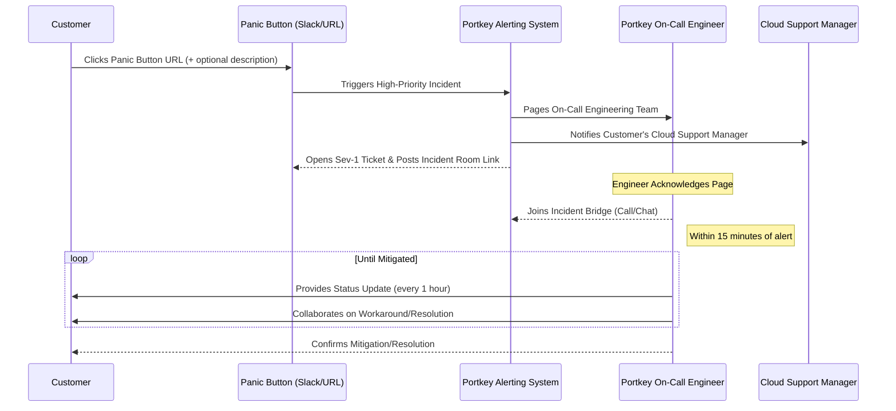

Portkey is committed to empowering your AI initiatives with robust and reliable support. We offer tailored support plans for enterprise and hybrid-cloud deployments, ensuring you have the assistance you need, when you need it. Understand our coverage, service-level commitments, and proactive features to select the perfect tier for your organization.

*Last updated: June 2025*

## TL;DR: Which Support Tier is Right for You?

<CardGroup cols={2}>
  <Card title="Standard Support" icon="headset" href="#standard-support-details">
    **Included with every paid license.** Ideal for teams needing reliable, business-hours assistance for setup, operations, and troubleshooting.
     
    **Price:** Included
  </Card>
  <Card title="Premium Support" icon="rocket" href="#premium-support-details">
    **Paid add-on.** Best for mission-critical deployments requiring 24/7/365 coverage, instant escalation for Sev-1s, proactive guidance, and direct access to engineering.
     
    **Price:** Starting from $2,500/month
  </Card>
</CardGroup>

<Icon icon="cash-register" color="#0e7490" /> [View Full Enterprise Pricing](/enterprise/pricing) | <Icon icon="envelope" color="#8b5cf6" /> [Contact Sales to Upgrade](mailto:sales@portkey.ai?subject=Inquiry%20about%20Portkey%20Support%20Tiers)

## Support Tiers: A Side-by-Side Comparison

Let's break down what each tier offers:

<Tabs>
  <Tab title="Standard Support">
    ### Standard Support: Reliable Foundations
    *Included with every paid Portkey license.*

    **Best for:** Teams needing core support during business hours for operational stability and issue resolution.

    | Feature                    | Details                                       |
    | :------------------------- | :-------------------------------------------- |
    | **Coverage Hours**         | 09:00–17:00 ET, Mon–Fri (Holidays excluded)   |
    | **Contact Channels**       | Customer Portal / Email                       |
    | **Named Customer Contacts**| Up to 2                                       |
    | **Panic Button (Sev 1)**   | Not Available                                 |
    | **Initial Response (Sev 1)**| 4 business hours                             |
    | **Workaround Target (Sev 1)**| 1 business day                               |
    | **Proactive Reviews**      | Not Included                                  |
    | **Pricing**                | Included with license                         |
  </Tab>
  <Tab title="Premium Support">
    ### Premium Support: Mission-Critical Assurance
    *Paid add-on for comprehensive, 24/7 care.*

    **Best for:** Enterprises with high-availability requirements, global operations, or those seeking a proactive support partnership.

    | Feature                    | Details                                                                    |
    | :------------------------- | :------------------------------------------------------------------------- |
    | **Coverage Hours**         | **24×7×365 global coverage**                                               |
    | **Contact Channels**       | Portal / Email / **Phone hotline / Shared Slack channel**                  |
    | **Named Customer Contacts**| Up to 5                                                                    |
    | **Panic Button (Sev 1)**   | **Yes** – instant engineering page across on-call roster (≤15 min engagement) |
    | **Initial Response (Sev 1)**| **30 minutes**                                                            |
    | **Workaround Target (Sev 1)**| **4 hours**                                                               |
    | **Proactive Reviews**      | Best-practice guidance & architecture reviews                             |
    | **Pricing**                | Starting from $2,500/month.  See [Upgrade & Pricing Options](#upgrade--pricing-options) |
  </Tab>
</Tabs>

## Choosing Your Tier: An Interactive Guide

Not sure which tier fits? Consider these scenarios:

<AccordionGroup>
  <Accordion title="Do you operate critical production systems that require immediate attention, 24/7?">
    **Recommendation: Premium Support.**
    If downtime directly impacts your revenue or reputation, Premium Support's 24/7/365 coverage, Panic Button, and rapid Sev-1 response times are essential.
  </Accordion>
  <Accordion title="Are your teams distributed globally, requiring support outside standard US business hours?">
    **Recommendation: Premium Support.**
    Premium offers global coverage, ensuring your teams worldwide receive timely assistance.
  </Accordion>
  <Accordion title="Do you need direct lines of communication, like phone or a shared Slack channel, for urgent issues?">
    **Recommendation: Premium Support.**
    Premium provides multiple direct channels for faster and more interactive communication.
  </Accordion>
  <Accordion title="Are you looking for proactive guidance, architecture reviews, and best practices from Portkey experts?">
    **Recommendation: Premium Support.**
    Premium includes these value-added services to help you optimize your Portkey deployment.
  </Accordion>
  <Accordion title="Is your primary need reliable support during business hours for standard operational questions and non-critical issues?">
    **Recommendation: Standard Support.**
    If your operations are primarily within standard business hours and you don't require immediate 24/7 escalation, Standard Support provides a solid foundation.
  </Accordion>
</AccordionGroup>

## A Sev-1 Journey with Premium Support

When a critical incident strikes, Premium Support provides a rapid and structured response. Here’s what happens:

<Info>
  The Panic Button is reserved strictly for Sev 1 events in production.
</Info>

## Detailed Support Information

Here’s a deeper dive into the specifics of our support offerings.

### Scope of Support

Portkey Support assists with the core functionality of your Portkey deployment.

**Support Covers:**
*   **Gateway & Observability:** Installation, configuration, upgrades, and day-to-day operation.
*   **Troubleshooting:** Error diagnostics, performance issues, and security patch guidance.
*   **Best Practices (Premium Only):** Guidance on optimal usage and architecture reviews.

**Support Excludes:**
*   Debugging of custom code developed by your team.
*   Issues originating from third-party services not directly managed by Portkey.
*   Problems caused by unsupported environments or configurations.

### Severity Definitions

We classify issues based on their impact to ensure appropriate prioritization:

| Severity        | Definition                                                                                             |
| :-------------- | :----------------------------------------------------------------------------------------------------- |
| **Sev 1 – Critical** | Production system down or severely degraded; no viable workaround; immediate business impact         |
| **Sev 2 – High**   | Major functionality impaired; workaround exists but performance or usability is significantly affected |
| **Sev 3 – Medium** | Minor functionality issue; workaround available; or development/test environment affected            |
| **Sev 4 – Low**    | General questions, documentation clarifications, enhancement requests                                |

<Info>
  **Business Hours Clarification:** For Standard Support SLAs, "business hours" refer to 09:00–17:00 Eastern Time (ET), Monday through Friday, excluding public holidays. Premium Support offers 24x7x365 coverage.
</Info>

### Service-Level Agreements (SLAs)

Our SLAs define our commitment to timely responses and updates.

**Initial Response & Update Targets:**
*"Initial Response"* means your ticket is acknowledged by a support engineer. *"Updates"* are progress communications until a workaround or fix is delivered.

| Severity        | Standard – Initial Response / Updates       | Premium – Initial Response / Updates                                            |
| :-------------- | :------------------------------------------ | :------------------------------------------------------------------------------ |
| **Sev 1 Critical** | 4 business hours / every 8 business hours  | **30 min** / every 1hr (Panic Button auto-pages engineering in ≤15 min)        |
| **Sev 2 High**   | 1 business day / daily                       | 4 hours / every 4 hours                                                        |
| **Sev 3 Medium** | 1 business day / every 3 days              | 8 hours (9×5) / daily                                                          |
| **Sev 4 Low**    | 2 business days / as progress made         | 1 business day / weekly                                                        |

**Workaround & Resolution Targets:**
*"Workaround Target"* is the goal for providing a temporary solution. *"Resolution Target"* is the goal for a permanent fix.

| Severity        | Standard – Workaround / Resolution Target | Premium – Workaround / Resolution Target |
| :-------------- | :---------------------------------------- | :--------------------------------------- |
| **Sev 1 Critical**| 1 business day / 3 business days          | **4 hours** / **1 business day**         |
| **Sev 2 High**  | 2 business days / 5 business days         | 1 business day / 3 business days         |
| **Sev 3 Medium**| Best-effort / next minor release          | 3 business days / next minor release     |
| **Sev 4 Low**   | — / future roadmap                        | — / future roadmap                       |

### Panic Button (Premium Only)

The customer-specific **Panic Button URL** (pinned in your shared Slack channel for Premium customers) is your direct line for critical emergencies.
1.  **Customer clicks** the Panic Button URL and optionally adds a short description.
2.  System **opens a Sev 1 ticket**, posts an incident room link, and **pages engineering**.
3.  First engineer **joins the bridge within 15 minutes**.
4.  Incident comms cadence: **every 1 hour** until mitigated.

This feature is reserved strictly for Sev 1 events in production.

### Customer Obligations

To help us provide you with the best possible support, please ensure:
1.  **Provide Access:** Grant secure remote access or diagnostic data as needed for troubleshooting.
2.  **Maintain Versions:** Keep your Portkey software on supported versions (N-1 for Standard; N or N-1 for Premium, where N is the latest).
3.  **Designate Contacts:** Appoint named contacts authorized to raise Sev 1/2 tickets and liaise with support.

### Change Management & Incident Communication

Portkey is committed to transparency.
*   **SLA/Service Changes:** We may refine SLAs, coverage, or pricing with at least 60 days' notice, unless a multi-year contract states otherwise.
*   **Deprecations:** We provide advance notice for any feature deprecations, typically through product announcements and documentation updates, aiming for minimal disruption.
*   **Service Incidents:** For widespread service incidents, status updates are provided via our status page (if applicable) and direct communication for affected Premium customers.

## Onboarding & Engagement (Premium Focus)

Premium Support is a partnership:
*   **Kickoff Call:** A dedicated session to understand your environment, team, and critical workflows.
*   **Shared Slack Channel:** Setup of your private Slack Connect channel for direct communication.
*   **Quarterly Business Reviews (QBRs):** (Optional, by request) Regular check-ins to discuss support performance, upcoming Portkey features, and your evolving needs.
*   **Proactive Guidance:** Access to architectural reviews and best-practice sessions.

## Compliance & Security Commitment

Portkey takes security and compliance seriously. Our platform and support processes are designed with enterprise-grade security in mind.
*   **Certifications:** Portkey maintains industry-standard certifications (e.g., SOC 2, ISO 27001 readiness).
*   **Data Handling:** We adhere to strict data privacy and security protocols for any diagnostic data shared.
*   **Vulnerability Disclosure:** We have a responsible disclosure program.

<Card title="Portkey Trust Portal" icon="shield-check" iconType="solid" href="https://trust.portkey.ai/">
  For detailed information on our security posture, compliance certifications (like SOC 2 reports), and privacy policies, please visit our Trust Portal.
</Card>

## Upgrade & Pricing Options

Elevate your support experience by upgrading to Premium or choosing a flexible plan.

**Moving from Standard to Premium:**
Simply contact our sales team at <a href="mailto:sales@portkey.ai?subject=Upgrade%20to%20Premium%20Support">sales@portkey.ai</a> or reach out to your account manager. We'll discuss your needs and facilitate a smooth transition.

**Premium Support Pricing:**
Premium Support is an add-on designed for flexibility:
*   **Monthly:** $2,500 per month per deployment account. Ideal for initial critical months or specific projects.
*   **6-Month Commitment:** $10,000 (a saving of $5,000 over monthly).
*   **Annual Commitment:** $24,000 (a saving of $6,000 over monthly, equivalent to $2,000/month).

<Info>
  For detailed enterprise package pricing, including multi-deployment discounts for Gateway instances, please see our [Enterprise Pricing Guide](/enterprise/pricing).
</Info>

## Frequently Asked Questions (FAQ)

<AccordionGroup>
  <Accordion title="Does Premium Support include professional services for custom development or integrations?">
    Premium Support focuses on break-fix, operational assistance, best practices, and architectural guidance for the Portkey platform itself. While we provide extensive support for integrating with Portkey, dedicated professional services for custom development projects are typically scoped separately. Please discuss specific needs with your sales representative.
  </Accordion>
  <Accordion title="Is the Panic Button usage billed separately?">
    No, the Panic Button is an included feature of the Premium Support tier and is not billed per use. It's designed for genuine Sev-1 production emergencies.
  </Accordion>
  <Accordion title="How are named customer contacts managed?">
    Upon subscribing to a support tier, you'll designate your named contacts. For Premium, these contacts will be onboarded to any special communication channels like the shared Slack. Changes to named contacts can be requested through the support portal or your account manager.
  </Accordion>
  <Accordion title="What if we need more than 5 named contacts for Premium Support?">
    The standard Premium tier includes up to 5 named contacts. If you require more, please discuss this with our sales team, as custom arrangements may be possible.
  </Accordion>
</AccordionGroup>

---

<Card title="Ready to Discuss Your Support Needs?" icon="calendar-check" iconType="solid" color="#0e7490" href="mailto:sales@portkey.ai?subject=Discuss%20Portkey%20Support%20Options">
  Whether you're looking to understand the best fit, upgrade your current plan, or get a custom quote, our team is here to help.  
  **[Contact Sales](mailto:sales@portkey.ai?subject=Discuss%20Portkey%20Support%20Options) or explore our [Full Enterprise Pricing](/enterprise/pricing).**
</Card>

---

*This Portkey Enterprise Support Plan document provides an overview of support services. The specific terms and conditions applicable to your organization are governed by your executed agreement with Portkey.*
