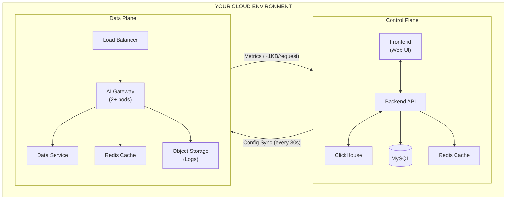

In an Airgapped deployment, both the **Data Plane** and **Control Plane** run entirely within your cloud environment for complete data isolation.

<CardGroup cols={3}>
  <Card title="Data Plane" icon="server">
    **~$300/mo** 
    per data plane
  </Card>
  <Card title="Control Plane" icon="gauge">
    **~$200/mo** 
    shared across all DPs
  </Card>
  <Card title="Total (Single Cloud)" icon="calculator">
    **~$500-550/mo** 
    + Portkey License
  </Card>
</CardGroup>

## Prerequisites

Gather the following before your architecture review:

<Icon icon="check" /> Request volume (expected requests per month) 
<Icon icon="check" /> Peak RPM (maximum requests per minute) 
<Icon icon="check" /> Average log size (5-20 KB typical) 
<Icon icon="check" /> Log retention period (hot storage) 
<Icon icon="check" /> Cloud provider & region 
<Icon icon="check" /> Data plane count (regions/clouds needing DPs) 
<Icon icon="check" /> ClickHouse preference (self-hosted or managed) 
<Icon icon="check" /> HA requirements (redundancy, backups) 
<Icon icon="check" /> VPN/MPLS requirements (if multi-cloud)

## Architecture

---

## Data Plane Costs

<Icon icon="microchip" /> **Compute**

| Component | Cost Drivers | Sizing Guideline | Example Resources |
|-----------|--------------|------------------|-------------------|
| AI Gateway | Request volume, complexity (guardrails, routing) | 100K RPM ≈ 2 VMs (4 vCPU, 8 GB) | t4g.medium, Standard_D2s_v3, e2-standard-2 |
| Data Service | Metadata operations | Included in Gateway sizing | — |

<Icon icon="hard-drive" /> **Storage**

| Component | Cost Drivers | Sizing Guideline | Example |
|-----------|--------------|------------------|---------|
| Object Storage (Logs) | Volume × size × retention | 100M req × 10 KB × 3 mo = 3 TB | S3, Blob, GCS |
| Redis Cache | Cache size, HA replication | 6 GB baseline; 15-20 GB for heavy semantic caching | ElastiCache, Azure Cache, Memorystore |

## Control Plane Costs

<Icon icon="microchip" /> **Compute**

| Component | Cost Drivers | Sizing Guideline |
|-----------|--------------|------------------|
| Frontend + Backend | User activity, analytics queries, # of data planes | 3-4 medium VMs |

<Icon icon="hard-drive" /> **Storage**

| Component | Cost Drivers | Sizing Guideline |
|-----------|--------------|------------------|
| MySQL | DB size, IOPS, Multi-AZ, backup retention | 2-4 vCPU, 8-16 GB RAM, 10-50 GB storage |
| ClickHouse | Log volume, query complexity, retention | Self-hosted: 1 VM (4 vCPU, 16 GB RAM); or managed service |
| Redis Cache | Sessions, config caching | 1-6 GB; can share with DP Redis if co-located |

<Info>
Control Plane costs are **shared** across all Data Planes. Adding more DPs does not multiply CP infrastructure.
</Info>

---

## Network Costs

| Traffic Type | Direction | Cost Drivers | Example |
|--------------|-----------|--------------|---------|
| Metrics | DP → CP | ~1 KB/request × volume | 100M req = 100 GB |
| Config Sync | CP → DP | 86,400 syncs/mo × payload × # DPs | ~26 GB per 3 DPs |
| Cross-cloud egress | Multi-cloud only | Egress rate × transfer volume | $0.12/GB typical |

---

## Additional Costs

| Component | Notes |
|-----------|-------|
| Load Balancers | One per plane; data processed charges |
| Kubernetes | Cluster management fee, image storage |
| RDS Backups | Automated backups, PITR, cross-region replication |
| S3 Versioning | If required for compliance |
| Monitoring | CloudWatch, Datadog, etc. |
| VPN/PrivateLink | If required for private connectivity |

## Sample Cost Calculation

**Assumptions:** 100M requests/month, 10 KB avg log size, 3-month retention, self-hosted ClickHouse

<Tabs>
  <Tab title="Single Cloud (AWS)">
    | Category | Component | Specification | Monthly Cost |
    |----------|-----------|---------------|--------------|
    | Data Plane | Compute | 2× t4g.medium | ~$50 |
    | Data Plane | Log Store (S3) | 3 TB | ~$70 |
    | Data Plane | Cache (ElastiCache) | 6 GB Redis | ~$140 |
    | Data Plane | Load Balancer | ALB | ~$40 |
    | Control Plane | Compute | 3× t4g.medium | ~$75 |
    | Control Plane | MySQL (RDS) | db.t4g.medium | ~$70 |
    | Control Plane | ClickHouse | 1× t4g.medium + 100 GB EBS | ~$35 |
    | Control Plane | Load Balancer | ALB | ~$20 |
    | Network | Cross-plane (same region) | Minimal | ~$10 |
    | **Total** | | | **~$510/mo** |
  </Tab>
  <Tab title="3 Data Planes (Multi-Cloud)">
    | Category | Component | Specification | Monthly Cost |
    |----------|-----------|---------------|--------------|
    | Data Plane (AWS) | Full stack | Compute, storage, cache, LB | ~$300 |
    | Data Plane (GCP) | Full stack | Equivalent | ~$300 |
    | Data Plane (Azure) | Full stack | Equivalent | ~$300 |
    | Control Plane (AWS) | Full stack | Shared | ~$200 |
    | Network | Cross-cloud egress | ~300 GB | ~$50 |
    | **Total** | | | **~$1,150/mo** |
  </Tab>
</Tabs>

<Note>
Portkey Enterprise License required. Contact your Portkey account team for license pricing.
</Note>

## Frequently Underestimated Costs

| Item | Impact |
|------|--------|
| Log API costs (PUT/GET) | +20-30% on storage |
| Inter-AZ traffic | ~$50/month within same region |
| ClickHouse storage growth | Budget 100+ GB/month at scale |
| RDS Multi-AZ | Doubles database cost |

## Scaling Behavior

| Trigger | Component Impact |
|---------|------------------|
| Request volume increases | Add gateway instances horizontally; log storage auto-scales |
| Cache hit rates decline | Increase Redis capacity |
| Analytics performance degrades | Add ClickHouse nodes or increase compute |
| Additional data planes | Each DP adds full infrastructure stack; CP remains shared |

---

## Related Resources

<CardGroup cols={2}>
  <Card title="Airgapped Deployment Guide" icon="lock" href="/product/enterprise-offering/private-cloud-deployments"/>
  <Card title="Architecture Reference" icon="sitemap" href="/product/enterprise-offering/private-cloud-deployments/architecture"/>
  <Card title="Contact Sales" icon="envelope" href="https://portkey.ai/contact"/>
  <Card title="Enterprise Pricing" icon="dollar-sign" href="/enterprise/pricing"/>
</CardGroup>
