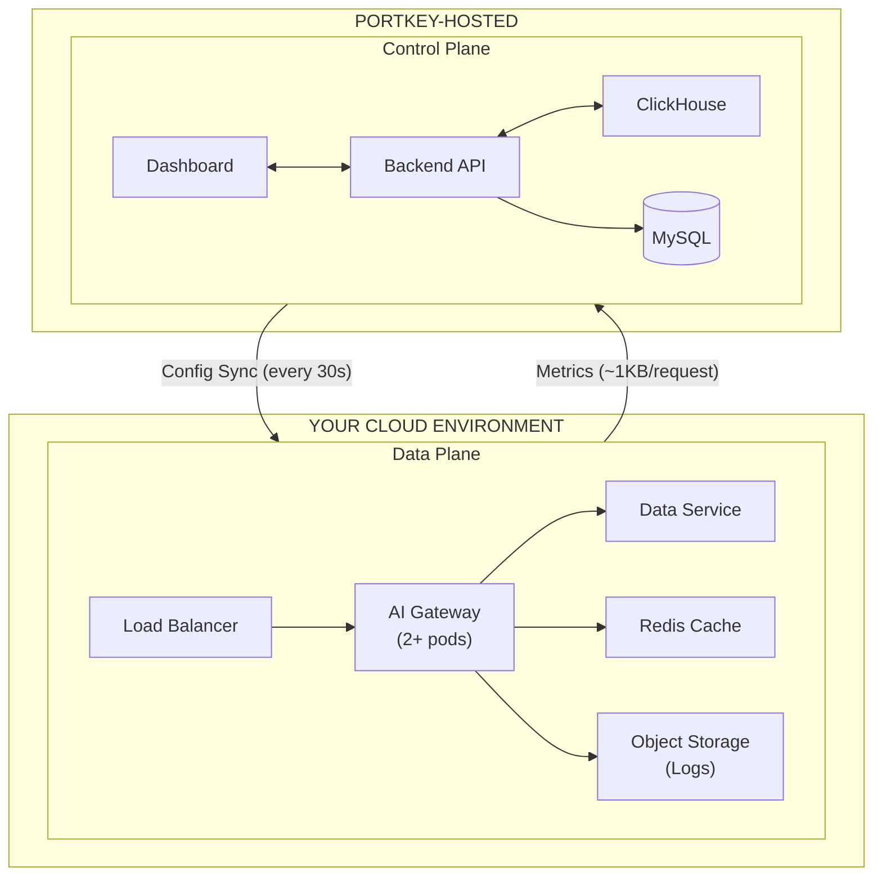

In a Hybrid deployment, the **Data Plane** runs in your cloud environment while the **Control Plane** (dashboard, analytics, config management) is hosted by Portkey.

---

## Prerequisites

Gather the following before your architecture review:

| Parameter | Notes |
|-----------|-------|
| Request Volume | Expected requests per month |
| Peak RPM | Maximum requests per minute |
| Average Log Size | Typical prompt/response length (5-20 KB common) |
| Log Retention | Hot storage retention period |
| Cloud Provider & Region | Pricing varies significantly |
| Data Plane Count | Number of regions/clouds requiring DPs |
| Security Requirements | Public internet vs PrivateLink/Private Endpoint |

---

## Architecture

---

## Infrastructure Costs

### Compute

| Component | Cost Drivers | Sizing Guideline | Example Resources |
|-----------|--------------|------------------|-------------------|
| AI Gateway | Request volume, complexity (guardrails, routing) | 100K RPM ≈ 2 VMs (4 vCPU, 8 GB) | t4g.medium, Standard_D2s_v3, e2-standard-2 |
| Data Service | Metadata operations | Included in Gateway sizing | — |

### Storage

| Component | Cost Drivers | Sizing Guideline | Example |
|-----------|--------------|------------------|---------|
| Object Storage (Logs) | Volume × size × retention | 100M req × 10 KB × 3 mo = 3 TB | S3, Blob, GCS |
| Redis Cache | Cache size, HA replication | 6 GB baseline; 15-20 GB for heavy semantic caching | ElastiCache, Azure Cache, Memorystore |

### Network

| Traffic Type | Direction | Cost Drivers | Example |
|--------------|-----------|--------------|---------|
| Metrics | DP → Portkey | ~1 KB/request × volume | 100M req = 100 GB egress |
| Config Sync | Portkey → DP | 86,400 syncs/mo × payload × # DPs | ~26 GB ingress (typically free) |

### Additional

| Component | Notes |
|-----------|-------|
| Load Balancer | Data processed, routing rules |
| Kubernetes | Cluster management fee, image storage |
| Backups | S3 versioning, cross-region replication |
| Monitoring | CloudWatch, Datadog, etc. |
| PrivateLink | If required by security policy |

---

## Sample Cost Calculation

**Assumptions:** 100M requests/month, 10 KB avg log size, 3-month retention, single data plane

<Tabs>
  <Tab title="AWS">
    | Category | Component | Specification | Monthly Cost |
    |----------|-----------|---------------|--------------|
    | Data Plane | Compute | 2× t4g.medium | ~$50 |
    | Data Plane | Log Store (S3) | 3 TB | ~$70 |
    | Data Plane | Cache (ElastiCache) | 6 GB Redis | ~$140 |
    | Data Plane | Load Balancer | ALB | ~$40 |
    | Network | Egress to Portkey | 100 GB | ~$10 |
    | **Total** | | | **~$310/mo** |
  </Tab>
  <Tab title="Azure">
    | Category | Component | Specification | Monthly Cost |
    |----------|-----------|---------------|--------------|
    | Data Plane | Compute | 2× Standard_D2s_v3 | ~$55 |
    | Data Plane | Log Store (Blob) | 3 TB | ~$65 |
    | Data Plane | Cache | 6 GB Azure Cache | ~$135 |
    | Data Plane | Load Balancer | Standard LB | ~$35 |
    | Network | Egress to Portkey | 100 GB | ~$10 |
    | **Total** | | | **~$300/mo** |
  </Tab>
  <Tab title="GCP">
    | Category | Component | Specification | Monthly Cost |
    |----------|-----------|---------------|--------------|
    | Data Plane | Compute | 2× e2-standard-2 | ~$50 |
    | Data Plane | Log Store (GCS) | 3 TB | ~$60 |
    | Data Plane | Cache (Memorystore) | 6 GB | ~$140 |
    | Data Plane | Load Balancer | Cloud LB | ~$40 |
    | Network | Egress to Portkey | 100 GB | ~$12 |
    | **Total** | | | **~$302/mo** |
  </Tab>
</Tabs>

<Note>
Portkey Enterprise License required. Contact your Portkey account team for license pricing.
</Note>

---

## Frequently Underestimated Costs

| Item | Impact |
|------|--------|
| Log API costs (PUT/GET) | +20-30% on storage |
| Inter-AZ traffic | ~$50/month within same region |
| PrivateLink/Private Endpoint | +$50-100/month per endpoint |

---

## Scaling Behavior

| Trigger | Component Impact |
|---------|------------------|
| Request volume increases | Add gateway instances horizontally |
| Cache hit rates decline | Increase Redis capacity |
| Additional data planes | Each DP adds full infrastructure stack; egress scales linearly |

---

## Related Resources

<CardGroup cols={2}>
  <Card title="Hybrid Deployment Guide" icon="cloud" href="/enterprise/hybrid"/>
  <Card title="Architecture Reference" icon="sitemap" href="/product/enterprise-offering/private-cloud-deployments/architecture"/>
  <Card title="Contact Sales" icon="envelope" href="https://portkey.ai/contact"/>
  <Card title="Enterprise Pricing" icon="dollar-sign" href="/enterprise/pricing"/>
</CardGroup>
