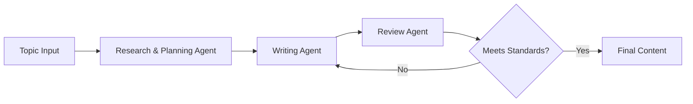

Creating high-quality, SEO-optimized content is a time-consuming challenge. SEO strategist spend hours researching topics, analyzing competitors, and crafting content that both ranks well and engages readers. What if we could automate this process while maintaining (or even exceeding) human-level quality?

In this tutorial, we'll build an intelligent content generation system that transforms hours of work into minutes. We'll combine the power of multiple AI models through Portkey to create a workflow that mirrors expert content creators.
## What We're Building ?

We're creating a sophisticated AI agent that mirrors the workflow of expert SEO content creators:

1. **Research and Planning Agent**(OpenAI o1): Uses Serper Dev's SERP API to gather real-time. Acts as our strategic planner, analyzing search results and crafting intelligent content outlines. We chose o1 for its superior reasoning capabilities and cost-effective input token pricing.
2. **Content Writing Agent** (Google Gemini): Creates the actual content using Google's grounding mode, ensuring outputs are factual and well-supported. This helps avoid common LLM pitfalls like hallucination.
3. **Quality Assurance Agent** (OpenAI o1): Reviews and scores the generated content, providing actionable feedback for improvements.




## Why This Approach Works
Our system solves the problem of creating high-quality SEO content in record time by:
- Using real-time SERP data for current insights
- Employing multiple specialized agents
- Implementing quality verification
- Learning from top-ranking content


## Tools of Choice

1. **Portkey**: Accesssing AI models and Managing Prompts

2. **Search APIs**: [Serper Dev APIs](https://serper.dev/) for real-time SERP data. (Get 2500 free credits wehn you sign up for free)

3. **AI Models**: OpenAI O1 for strategic planning and content evaluation. Google Gemini with Grouding mode for content creation.


Let's dive in and start build! 🚀

<Note>
    You can follow along with the code snippets using this [Google Colab Notebook](https://colab.research.google.com/drive/1oikNYVgqyyDFOfzl61x63p6AvZCFNNlS?usp=sharing)
</Note>

## Setting Up Your Environment 🏗️

First, let's install our dependencies and initialize Portkey:
```bash
!pip install portkey-ai python-dotenv requests --quiet
```

```py
import os
import json
import requests
from portkey_ai import Portkey

# Initialize Portkey Client
portkey = Portkey(
    api_key="YOUR_PORTKEY_API_KEY",
)
```
### Working with Portkey's Prompt Library

Before we dive into creating agents, let's understand how Portkey's prompt library works. Unlike traditional approaches where prompts are written directly in code, Portkey allows you to:

- Create and manage prompts through an intuitive UI
- Access prompts via simple prompt tags in code calls


We use Mustache templating `{{variable}}` in our prompts, which allows for dynamic content insertion. This makes our prompts more flexible and reusable. To follow this guide you will need to create prompts in the Portkey UIs as shown in the examples below and access them using Prompt_id inside your codebase.

<Note>
You will need to choose the right model setting for your prompts in Portkey. We will use OpenAI O1 for Planning and Evaluation and Google's Grounding mode for generating blogs.
</Note>

<Frame>
    
</Frame>


## Creating Our Agents 🤖

Let's break down each agent's role and how to implement them:


### 1. Research & Planning Agent

This agent gathers and analyzes current information about your topic. It uses SERP APIs to get the top performaning content on Web and then uses OpenAI's o1 model to create a strategic content plan based on the search results.

<Frame>
    
</Frame>

<Accordion title="Prompt">
    OpenAI's o1 model does not support system messages
    ```
    User:
    This is the result from a SERP API search: {{api_result}}. Based on this data, please provide a detailed outline for the best blog post I can write.
    ## Output Format

    <Blog>
    Clear blog post outline including:
    - Title
    - Introduction
    - Main points or sections
    - Conclusion
    </Blog>
    # Steps

    1. Analyze the provided API result to identify key themes and topics.
    2. Determine the target audience for the blog post.
    3. Create a structured outline that includes a compelling title, an engaging introduction, main points or sections, and a conclusion.

    # Output Format

    The output should be formatted as a clear blog post outline, enclosed within <Blog> tags.
    # Notes
    Consider including specific keywords or phrases from the API result to enhance SEO and relevance.
    ```
</Accordion>


```python
def search_google(query: str, api_key: str) -> dict:
    """Search Google using Serper.dev API"""
    url = "https://google.serper.dev/search"
    headers = {
        'X-API-KEY': "YOUR_SERPER_DEV_API_KEY",
        'Content-Type': 'application/json'
    }
    response = requests.post(url, headers=headers, json={"q": query, "num": 5})
    return response.json()

def get_search_results_and_send_to_llm() -> str:
    """Get search results and generate initial outline"""
    query = input("Enter your search query: ")
    results = search_google(query, "YOUR_SERPER_API_KEY")
    results_str = json.dumps(results)

    prompt_completion = portkey.prompts.completions.create(
        prompt_id="pp-main-969042",
        variables={"api_result": results_str}
    )
    return prompt_completion.choices[0].message.content

def extract_blog_outline(llm_response: str) -> str:
    """Extract blog outline from LLM response"""
    start = llm_response.find('<Blog>') + len('<Blog>')
    end = llm_response.find('</Blog>')
    return llm_response[start:end].strip()
```

### 2. Content Writing Agent

This Agent generates the actual content following the outline given by the planning agent:
- SEO-optimized writing
- Natural language flow
- Proper formatting

<Note>
    We use Google Gemini with [Grounding mode](https://cloud.google.com/vertex-ai/generative-ai/docs/grounding/overview) for content creation to ensure factual accuracy and coherence. grounding is the ability to connect model output to verifiable sources of information.
</Note>
<Frame>
    
</Frame>

<Accordion title="Prompt">
    ```
    System: You're a helpful assistant that will assist the user in writing blogs based on the outline they provide. Before composing any information, you will first verify your results against relevant search results to ensure accuracy and reliability.
    ```
    ```
    User: here is the user blog outline: {{blog_outline}}
    ```
    ```
    Tool:
    {
   	"type": "function",
   	"function": {
    		"name": "google_search"
   	}
    }
    ```

</Accordion>


```py
def write_blog_post(outline: str) -> str:
    """Generate initial blog post from outline"""
    completion = portkey.prompts.completions.create(
        prompt_id="pp-write-blog-f801d1",
        variables={"blog_outline": outline}
    )
    return completion.choices[0].message.content

initial_blog = write_blog_post(outline)
print("\nGenerated Blog Post:\n", initial_blog)


```

### 3. Review Agent

Ensures quality and optimization:
- Content quality metrics
- Improvement suggestions
- Final refinements

<Frame>
    
</Frame>

<Accordion title="Prompt">

```
System: O1 model does not support system message
```

```
User:
You're a helpful assistant. Your job is to review the blog provided to you, rate it out of 5, and identify the top critiques based on effective SEO strategies.

# Steps
1. Read the blog thoroughly to understand its content and structure.
2. Evaluate the blog based on key SEO content only strategies such as keyword usage, content quality, readability. (keep it related to the blog post content only, not on any other variable)
3. Assign a rating from 1 to 5, where 1 is poor and 5 is excellent.
4. List the top critiques you find, focusing on areas for improvement related to SEO.

# Output Format
Provide your evaluation in a structured format:
- Rating: [1-5]
- Top Critiques: [List of critiques]

# Examples
**Example 1:**
- Input: Blog about "Healthy Eating"
- Output:
  - Rating: 4
  - Top Critiques:
    1. Good keyword usage but lacks internal links.
    2. Content is informative but could be more engaging.

**Example 2:**
- Input: Blog about "Travel Tips"
- Output:
  - Rating: 3
  - Top Critiques:
    1. Needs better formatting for readability.
    2. Lacks images and multimedia elements to enhance engagement.
(Note: Real examples should be longer and provide more detailed critiques.)

# Notes
Consider the latest SEO trends and guidelines while reviewing the blog.
Here is the blog {{blog}}
```
</Accordion>

```py
def review_blog(blog_content: str) -> str:
    """Review and provide feedback on blog content"""
    review_completion = portkey.prompts.completions.create(
        prompt_id="pp-blog-revie-017642",
        variables={"blog": blog_content}
    )
    return review_completion.choices[0].message.content


# Step 4: Review the blog
review_feedback = review_blog(initial_blog)
print("\nReview Feedback:\n", review_feedback)

```


### 4. Write the Final Blog Post after Review
This is the last step of our workflow. We take the initial blog post, review feedback, and generate the final blog post that incorporates the feedback effectively.
<Frame>
    
</Frame>

<Accordion title="Prompt">
```
System:
You're a helpful assistant. Your task is to write a blog post based on a user's draft and the feedback provided.
Please ensure that the final blog post is well-structured, engaging, and incorporates the feedback effectively.

# Steps

1. Review the user’s blog post draft thoroughly.
2. Analyze the feedback given to identify key areas for improvement.
3. Rewrite the blog post, ensuring clarity and coherence.
4. Incorporate the feedback into the revised draft.
5. Ensure the tone and style are appropriate for the intended audience.

```
```
User:
{{blog}} &
{{review_feedback}}

```

```
Tool:
{
	"type": "function",
	"function": {
		"name": "google_search"
	}
}
```
</Accordion>

```py
def write_final_blog(blog_content: str, review_feedback: str) -> str:
    """Generate final blog incorporating review feedback"""
    final_completion = portkey.prompts.completions.create(
        prompt_id="pp-final-blog-4441fc",
        variables={
            "blog": blog_content,
            "review_feedback": review_feedback
        }
    )
    return final_completion.choices[0].message.content

# Step 5: Write final blog with feedback
final_blog = write_final_blog(initial_blog, review_feedback)
print("\nFinal Reviewed Blog Post:\n", final_blog)
```

## Conclusion
We've built a sophisticated SEO content generation system that combines:

- Strategic planning with o1
- Grounded content creation with Gemini
- Automated quality assurance
- Efficient prompt management

This system demonstrates the power of combining specialized AI models through Portkey's orchestration layer. The result is a highly efficient content creation pipeline that maintains quality while dramatically reducing production time.

---

Need help or have questions? Join our [Discord community](https://discord.gg/portkey) or contact support@portkey.ai.
