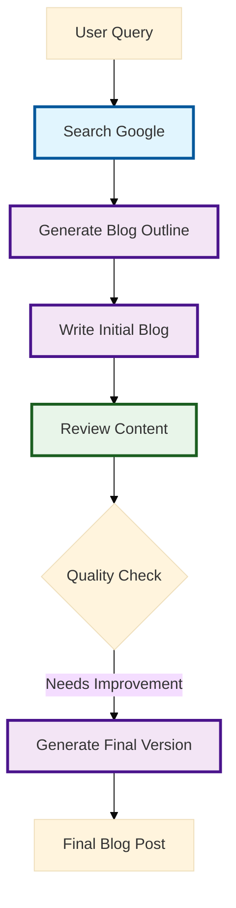

# Building an Automated Blog Writer with Portkey

## Overview

This guide demonstrates how to build an automated blog writing system using Portkey's prompt templates. The system takes a search query, generates a structured blog post, reviews it for quality, and produces a final optimized version through multiple iterations.

## Architecture



## Implementation

### 1. Setup and Dependencies

```python
from portkey_ai import Portkey
import requests
import json

# Initialize Portkey client
portkey = Portkey(
    api_key="YOUR_API_KEY",
    trace_id="YOUR_TRACE_ID"
)
```

### 2. Search Function Setup

```python
def search_google(query: str, api_key: str) -> dict:
    """Search Google using Serper.dev API"""
    url = "https://google.serper.dev/search"
    headers = {
        'X-API-KEY': api_key,
        'Content-Type': 'application/json'
    }
    response = requests.post(url, headers=headers, json={"q": query, "num": 5})
    return response.json()
```

### 3. Blog Generation Pipeline

#### Step 1: Generate Blog Outline
```python
def get_search_results_and_send_to_llm() -> str:
    """Generate initial blog outline from search results"""
    query = input("Enter your search query: ")
    results = search_google(query, "YOUR_SERPER_API_KEY")

    # Use Portkey prompt template for outline generation
    prompt_completion = portkey.prompts.completions.create(
        prompt_id="pp-main-969042",
        variables={"api_result": json.dumps(results)}
    )
    return prompt_completion.choices[0].message.content
```

#### Step 2: Write Initial Blog
```python
def write_blog_post(outline: str) -> str:
    """Generate initial blog post from outline"""
    completion = portkey.prompts.completions.create(
        prompt_id="pp-write-blog-f801d1",
        variables={"blog_outline": outline}
    )
    return completion.choices[0].message.content
```

#### Step 3: Review Content
```python
def review_blog(blog_content: str) -> str:
    """Review and provide feedback on blog content"""
    review_completion = portkey.prompts.completions.create(
        prompt_id="pp-blog-revie-017642",
        variables={"blog": blog_content}
    )
    return review_completion.choices[0].message.content
```

#### Step 4: Generate Final Version
```python
def write_final_blog(blog_content: str, review_feedback: str) -> str:
    """Generate final blog incorporating review feedback"""
    final_completion = portkey.prompts.completions.create(
        prompt_id="pp-final-blog-4441fc",
        variables={
            "blog": blog_content,
            "review_feedback": review_feedback
        }
    )
    return final_completion.choices[0].message.content
```

## Portkey Prompt Templates

### 1. Main Outline Generator (pp-main-969042)
Purpose: Analyzes search results and creates structured blog outline
```yaml
name: "Blog Outline Generator"
description: "Generates structured blog outlines from search results"
input_variables:
  - api_result: JSON string of search results
output_format: Markdown blog outline
```

### 2. Blog Writer (pp-write-blog-f801d1)
Purpose: Converts outline into full blog post
```yaml
name: "Blog Content Writer"
description: "Generates full blog post from outline"
input_variables:
  - blog_outline: Structured outline
output_format: Markdown blog post
```

### 3. Content Reviewer (pp-blog-revie-017642)
Purpose: Reviews blog quality and provides feedback
```yaml
name: "Content Reviewer"
description: "Reviews blog content and provides structured feedback"
input_variables:
  - blog: Blog content to review
output_format: JSON with review metrics and feedback
```

### 4. Final Blog Generator (pp-final-blog-4441fc)
Purpose: Creates final version incorporating feedback
```yaml
name: "Final Blog Generator"
description: "Generates optimized final blog version"
input_variables:
  - blog: Original blog content
  - review_feedback: Review feedback
output_format: Markdown blog post
```

## Usage Example

```python
# Get initial outline
llm_response = get_search_results_and_send_to_llm()
outline = extract_blog_outline(llm_response)

# Generate initial blog
initial_blog = write_blog_post(outline)

# Get review feedback
review_feedback = review_blog(initial_blog)

# Generate final version
final_blog = write_final_blog(initial_blog, review_feedback)
```

## Review Criteria

The system evaluates content on:
- Keyword optimization
- Internal/external linking
- Multimedia integration
- Meta descriptions
- Content structure
- Readability

## Best Practices

1. **Prompt Management**
   - Keep prompt templates versioned
   - Test prompts with various inputs
   - Monitor prompt performance

2. **Content Quality**
   - Set minimum quality thresholds
   - Review automated content periodically
   - Update prompt templates based on results

3. **System Optimization**
   - Cache search results when possible
   - Batch process similar topics
   - Monitor API usage and costs

## Next Steps

1. Clone the repository and install dependencies
2. Configure your Portkey API key
3. Set up your Serper API key
4. Create your prompt templates in Portkey
5. Run the system with test queries

For support, join our [Discord community](https://discord.gg/portkey) or contact support@portkey.ai.
