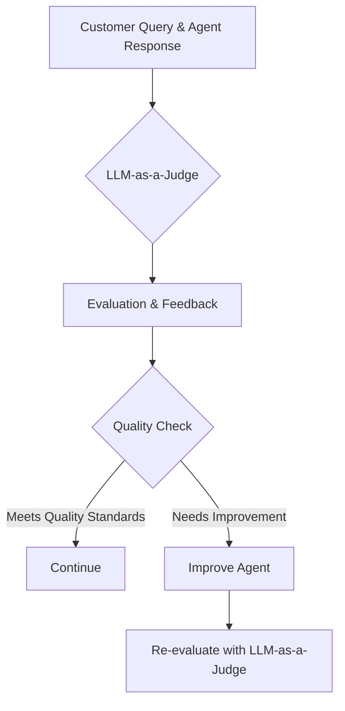

> Before reading this guide: We recommend checking out [Hamel Husain's excellent post on LLM-as-a-Judge](https://hamel.dev/blog/posts/llm-judge/). This cookbook implements the principles discussed in Hamel's post, providing a practical walkthrough of building LLM-as-a-judge evaluation .

## Introduction
AI-powered customer support agents are great, but how do you ensure they provide high-quality responses at scale?

You need a system that can automatically evaluate customer support interactions by analyzing both the customer's query and the AI agent's response. This system should determine whether the response meets quality standards, provide a detailed critique explaining the reasoning behind the judgment, and scale easily to run tests on thousands of interactions.

Quality assurance for customer support interactions is critical but increasingly challenging as AI Agents handle more customer conversations. Manual reviews are great but they don't scale.

The "LLM-as-a-Judge" approach offers a powerful solution to this challenge. This guide will show you how to build an automated evaluation system that scales to thousands of interactions. By the end, you'll have a robust workflow that helps you improve AI agents responses.

## What We're Building

We'll create an LLM as a judge workflow that evaluates customer support interactions by analyzing both the customer's query and the AI agent's response. For each interaction, our system will:

1. Determine whether the response meets quality standards (pass/fail)
2. Provide a detailed critique explaining the reasoning behind the judgment
3. Scale easily to run tests on thousands of interactions

**Use Case Example**:

Imagine you're building a customer support AI agent. Your challenges include:
- Ensuring consistent quality across all AI responses
- Identifying patterns of problematic responses
- Maintaining security and compliance standards
- Quickly detecting when the AI is providing incorrect information

With an LLM-as-a-Judge system, you can:
- Get specific feedback on why responses fail to meet standards
- Identify trends and systematic issues in your support system
- Provide targeted training and improvements based on detailed critiques
- Quickly validate whether changes to your AI agent have improved response quality

## System Architecture: How It Works



**Industry Best Practices for AI Agent Evaluation**

Before diving into implementation, let's briefly look at evaluation approaches for customer support AI:

- **Human Evaluation**: The gold standard, but doesn't scale
- **Offline Benchmarking**: Testing against curated datasets with known answers
- **Online Evaluation**: Monitoring live interactions and collecting user feedback
- **Multi-dimensional Scoring**: Evaluating across different attributes (accuracy, helpfulness, tone)
- **LLM-as-a-Judge**: Using a powerful model to simulate expert human judgment

This cookbook focuses on building a robust LLM-as-a-Judge system that balances accuracy with scalability, allowing you to evaluate thousands of customer interactions automatically.

## Working with [Portkey's Prompt Studio](/product/prompt-engineering-studio)

We will be using [Prompt Studio](/product/prompt-engineering-studio) in this cookbook. Unlike traditional approaches where prompts are written directly in code, Portkey allows you to:

- Create and manage prompts through an intuitive UI
- Version control your prompts
- Access prompts via simple API calls
- Deploy prompts to different environments

We use Mustache templating `{{variable}}` in our prompts, which allows for dynamic content insertion. This makes our prompts more flexible and reusable.

**What are Prompt Partials?**

Prompt partials are reusable components in Portkey that let you modularize parts of your prompts. Think of them like building blocks that can be combined to create complex prompts. In this guide, we'll create several partials (company info, guidelines, examples) and then combine them in a main prompt.

To follow this guide, you will need to create prompt partials first, then create the main template in the Portkey UI, and finally access them using the prompt_id inside your codebase.

## Step-by-Step Guide to Building LLM-as-a-Judge

**The Judge Prompt Structure**
To build an effective LLM judge, we need to create a well-structured prompt that gives the model all the context it needs to make accurate evaluations. Our judge prompt will consist of four main components:

- Company Information - Details about your company, products, and support policies that help the judge understand the context of customer interactions
- Evaluation Guidelines - Specific criteria for what makes a good or bad response in your customer support context
- Golden Examples - Sample evaluations that demonstrate how to apply the guidelines to real iteractions
- Main Judge Template - This brings everything together and creates the Judgement System

#### Step 1: Define Your Company Information in a Partial

First, we'll create a partial that provides context about your company, products, and support policies. This helps the judge evaluate responses in the proper context.

<Frame>
    
</Frame>

Here's an example of what your company info partial might look like:

<Accordion  title="Company Info Prompt Partial">


TechConnect Electronics is a consumer electronics retailer founded in 2016 that sells smartphones, computers, audio equipment, and smart home devices through its website and 42 physical stores. The company offers a 30-day return policy on most items (15 days for opened software and select accessories), free shipping on orders over $50, and a 24/7 customer support team available via chat, email, and phone. TechConnect distinguishes itself with its "TechConnect Plus" membership program offering extended warranties and exclusive discounts, as well as its "Tech Support Plus" service providing personalized setup assistance and troubleshooting.

</Accordion>

This partial gives the judge important context about your products, return policy, shipping policies, support channels, and special programs. Customize this to match your own company's specifics.

After creating this partial in Portkey, you'll get a partial ID (e.g., `pl-llm-as-0badba`) that you'll reference in your main prompt template.

#### Step 2: Define the Evaluation Guidelines Partial

Next, create a partial that defines the criteria for evaluating responses. This ensures consistent quality standards.

<Frame>
    
</Frame>

Here's an example of evaluation guidelines:

<Accordion  title="Judge Guidelines Partial Prompt">


When evaluating AI chatbot responses, first assess whether the response directly answers the customer's specific question with accurate and complete information. Check if the response verifies necessary customer details (like order eligibility or account status) when appropriate. Look for clarity of instructions, proactive offering of relevant next steps, and appropriate tone/empathy for the situation. Good responses address the specific query with complete information and clear next steps, while bad responses provide generic information, miss verification opportunities, lack critical details, or fail to acknowledge customer emotions. Your critique should be concise (2-4 sentences) and include a clear "good" or "bad" outcome assessment.

</Accordion>
These guidelines define your primary evaluation criteria, secondary considerations, what constitutes good vs. bad responses, and format requirements for critiques. You can adjust these based on what matters most for your specific customer support context.

After creating this partial, you'll receive another partial ID (e.g., `pl-llm-as-1e1952`) to reference in your main template.

#### Step 3: Create Golden Examples Partial

Now create a partial with example evaluations. These examples "teach" the LLM what good and bad responses look like in your specific context.

<Frame>
    
</Frame>

Here's what your examples partial might look like:

<Accordion  title="Golden Example Partial Prompt">
```
<example-1>
<nlq>Where is my order #45789?</nlq>
<query>
Your order #45789 is currently in transit. According to our tracking information, it was shipped yesterday and is expected to arrive at your address by Thursday, March 27th. You can track it in real-time using the tracking number KJ853720164US on our website or mobile app.
</query>
<critique>
{
  "critique": "The response directly addresses the customer's question by providing the current status of the specific order number mentioned. It includes helpful details like the shipping date, expected delivery date, and tracking information the customer can use. This is a complete and informative response.",
  "outcome": "good"
}
</critique>
</example-1>

<example-2>
<nlq>How do I return these broken headphones?</nlq>
<query>
I'm sorry to hear about your broken headphones. To return them, you'll need to go to your order history, select the order containing the headphones, and click "Return Item." Follow the on-screen instructions to print a return label. Pack the headphones in their original packaging if possible, attach the label, and drop it off at any postal service location.
</query>
<critique>
{
  "critique": "While the response explains the general return process, it fails to verify if the customer's purchase is still within the return window or ask for the order number to confirm eligibility. Without this verification, the instructions might not apply to this specific situation, potentially causing customer frustration.",
  "outcome": "bad"
}
</critique>
</example-2>

<example-3>
<nlq>Do you have the new iPhone 16 in stock?</nlq>
<query>
Yes, we currently have the iPhone 16 in stock in all colors. The 128GB, 256GB and 512GB storage options are available for immediate shipping. However, the 1TB version is currently on backorder with an expected 2-week waiting period. Would you like me to check availability at stores near your location?
</query>
<critique>
{
  "critique": "The response clearly addresses the stock status of the iPhone 16 with detailed information about different storage options and their availability. The agent proactively offers to check local store inventory, which adds value beyond just answering the immediate question. The information is specific and actionable.",
  "outcome": "good"
}
</critique>
</example-3>

<example-4>
<nlq>Can I cancel my subscription?</nlq>
<query>
You can cancel your subscription at any time. Simply log into your account, go to "Subscription Settings" and click the "Cancel Subscription" button. Your benefits will continue until the end of your current billing cycle.
</query>
<critique>
{
  "critique": "The response provides clear instructions on how to cancel a subscription but doesn't acknowledge potential consequences like loss of data or saved preferences, nor does it offer alternatives like pausing or downgrading. It also doesn't express any interest in retaining the customer or understanding their reason for cancellation.",
  "outcome": "bad"
}
</critique>
</example-4>
```
</Accordion>

When creating your examples:
- Include diverse scenarios covering different types of customer questions
- Show the reasoning process by explaining why an answer is good or bad
- Include both good and bad examples
- Match your actual use cases with examples that reflect your real customer interactions
- Be consistent with the format structure

After creating this partial, you'll receive another partial ID (e.g., `pl-exampl-55b6e3`) to reference in your main template.

#### Step 4: Create the Main Judge Prompt Template

Now that you have all the partials, it's time to create the main judge prompt template that brings everything together.
We will reference the partials we created earlier to provide context, guidelines, and examples to the judge using mustache variables.

<Frame>
    
</Frame>

Here's what your main prompt template should look like:

<Accordion  title="Main LLM as a Judge Prompt">

```
You are a Customer Service query evaluator with advanced capabilities to judge if a query is good or not.
You understand the nuances of customer service including what is likely to be the most useful customer service executive.

Here is information about the customer service in X company:
{{customer_service_info}}

Here are some guidelines for evaluating queries:
{{guidelines}}

Example evaluations:
<examples>
 {{>pl-exampl-55b6e3}}
</examples>

For the following query, first write a detailed critique explaining your reasoning,
then provide a pass/fail judgment in the same format as above.

<nlq>{{user_input}}</nlq>
<query>
{{generated_query}}
</query>
<critique>
```
</Accordion>


<Accordion  title="Tool Calling Supported LLM">

If your LLM does not support Structure Outputs, you will have to add this tool in your prompt template along with the prompt above
```
{
  "type": "function",
  "function": {
    "name": "evaluation",
    "parameters": {
      "type": "object",
      "required": [
        "critique",
        "outcome"
      ],
      "properties": {
        "outcome": {
          "enum": [
            "good",
            "bad"
          ],
          "type": "string",
          "description": "The final judgment: 'good' or 'bad'"
        },
        "critique": {
          "type": "string",
          "description": "A detailed critique of the agent's response"
        }
      }
    },
    "description": "this fuuction evaluates the user query and agent ouptut and give a detailed repsone"
  }
}
```
</Accordion>


This template sets the evaluator role, inserts your company information, guidelines, and examples, and provides placeholders for the customer query and agent response. Make sure to select an appropriate model (like OpenAI o1, DeepSeek R1) when creating this template.

Once you've created the main template, you'll get a prompt ID that you'll use in your code to access this prompt.

#### Step 5: Implementing the Evaluation Code with Structured Output

Now that you have your prompt template set up in Portkey, use this Python code to evaluate customer support interactinos. You can use either of the following ways to go ahead with this cookbook, depending upon what your LLM supports:

<Tabs>
    <Tab title="Structured Output">
        ```python
        from portkey_ai import Portkey

        # Initialize Portkey client
        portkey = Portkey(
            api_key="YOUR_PORTKEY_API_KEY",
            trace_id="customer-support-eval-run-1"  # For tracing in Portkey
        )
        def evaluate_interaction(customer_query, agent_response):
            """
            Evaluate a customer support interaction using LLM-as-a-Judge
            """
            # Use response_schema to ensure structured output
            response_schema = {
                "name": "evaluation",
                "schema": {
                "type": "object",
                "properties": {
                    "critique": {
                        "type": "string",
                        "description": "A detailed critique of the agent's response"
                    },
                    "outcome": {
                        "type": "string",
                        "enum": ["good", "bad"],
                        "description": "The final judgment: 'good' or 'bad'"
                    }
                },
                "required": ["critique", "outcome"]
                }
            }

            # Call Portkey's prompt API with response_schema
            response = portkey.prompts.completions.create(
                prompt_id="pp-llm-judge-62a41d",  # Replace with your actual prompt ID for LLM as a Judge
                variables={
                    "user_input": customer_query,
                    "generated_query": agent_response,
                },
                response_format={"type": "json_schema", "json_schema": response_schema, }
            )

            # Extract structured response and log feedback to Portkey
            result = response.choices[0].message.content


            import json

            # Parse the JSON string into a dictionary
            result_dict = json.loads(result)

            trace = response.get_headers()['trace-id']
            print(result_dict["outcome"])

            # Now you can access the dictionary with keys
            portkey.feedback.create(
                trace_id=trace,
                value=1 if result_dict["outcome"] == "good" else 0,  # Now this will work
            )


            return result

        # Example usage
        customer_query = "I've been waiting for my refund for over two weeks now. When will I receive it?"
        agent_response = "Refunds typically take 7-10 business days to process. Let me check the status of your refund and get back to you."

        evaluation = evaluate_interaction(customer_query, agent_response)
        print(evaluation)
        ```
    </Tab>

    <Tab title="Tool Calling Supported LLM">
        ```py
        from portkey_ai import Portkey

        # Initialize Portkey client
        portkey = Portkey(
            api_key="YOUR_PORTKEY_API_KEY",
            trace_id="customer-support-eval-run-1"  # For tracing in Portkey
        )

        def evaluate_interaction(customer_query, agent_response):
            """
            Evaluate a customer support interaction using LLM-as-a-Judge
            """

            # Call Portkey's prompt API with response_schema
            response = portkey.prompts.completions.create(
                prompt_id="pp-llm-judge-62a41d",  # Replace with your actual prompt ID for LLM as a Judge
                variables={
                    "user_input": customer_query,
                    "generated_query": agent_response,
                },
            )

            # Extract structured response and log feedback to Portkey
            result = response.choices[0].message.tool_calls[0].function.arguments


            import json

            # Parse the JSON string into a dictionary
            result_dict = json.loads(result)

            trace = response.get_headers()['trace-id']
            print(result_dict["outcome"])

            # Now you can access the dictionary with keys
            portkey.feedback.create(
                trace_id=trace,
                value=1 if result_dict["outcome"] == "good" else 0,  # Now this will work
            )


            return result

        # Example usage
        customer_query = "I've been waiting for my refund for over two weeks now. When will I receive it?"
        agent_response = "Refunds typically take 7-10 business days to process. Let me check the status of your refund and get back to you."

        evaluation = evaluate_interaction(customer_query, agent_response)
        print(evaluation)
        ```
    </Tab>
</Tabs>


<Accordion  title="Example Output">

Example output:
```json
{
  "critique": "The agent response provides general information about refund processing times (7-10 business days) but doesn't address why the customer's refund is taking over two weeks, which exceeds the standard timeline. While the agent offers to check the status, they don't acknowledge the customer's obvious frustration with the delay, missing an opportunity for empathy. There's also no clear explanation of when the agent will 'get back' with the information, leaving the timeline ambiguous.",
  "outcome": "bad",
  "improvement_areas": [
    "Acknowledge customer frustration",
    "Explain why the refund exceeds standard timeline",
    "Provide specific timeframe for follow-up"
  ]
}
```
</Accordion>

#### Step 6: Iterate with Domain Experts
The most important part of building an effective LLM-as-a-Judge is iterating on your prompt with feedback from domain experts:

1. Create a small test dataset with 20-30 representative customer support interactions
2. Have human experts evaluate these interactions using the same criteria
3. Compare the LLM judge results with human expert evaluations
4. Calculate agreement rate and identify patterns in disagreements
5. Update your prompt based on what you learn

Focus especially on adding examples that cover edge cases where the judge disagreed with experts, clarifying evaluation criteria, and adjusting the weight given to different factors based on business priorities.

## Portkey Observability for Continuous Improvement

<Frame>
    
</Frame>

One of Portkey's key advantages is its built-in observability. Each evaluation generates detailed traces showing execution time and token usage, input and output logs for debugging, and performance metrics across evaluations.

This visibility helps you identify performance bottlenecks, track costs as you scale, debug problematic evaluations, and compare different judge prompt versions.

## Visualizing Evaluation Results on the Portkey Dashboard

The feedback data we collect using the `portkey.feedback.create()` method automatically appears in the Portkey dashboard, allowing you to:

1. Track evaluation outcomes over time
2. Identify specific areas where your agent consistently struggles
3. Measure improvement after making changes to your AI agent
4. Share results with stakeholders through customizable reports

<Frame>
    
</Frame>

The dashboard gives you a bird's-eye view of your evaluation metrics, making it easy to spot trends and areas for improvement.


## Running Evaluation on Scale

<Accordion title="Running evaluation on scale">
```python
import pandas as pd
from tqdm import tqdm
import time

# Load your dataset of customer interactions
df = pd.read_csv("customer_interactions.csv")

# Run evaluations on the entire dataset
results = []
for idx, row in tqdm(df.iterrows(), total=len(df)):
    customer_query = row['customer_query']
    agent_response = row['agent_response']

    try:
        # Evaluate the interaction
        evaluation = evaluate_interaction(customer_query, agent_response)

        # Store the result with the original data
        results.append({
            "customer_query": customer_query,
            "agent_response": agent_response,
            "critique": evaluation["critique"],
            "outcome": evaluation["outcome"],
            "improvement_areas": evaluation.get("improvement_areas", [])
        })

        # Add a small delay to avoid rate limits
        time.sleep(0.5)
    except Exception as e:
        print(f"Error evaluating interaction {idx}: {e}")

# Save the results
results_df = pd.DataFrame(results)
results_df.to_csv("evaluation_results.csv", index=False)

# Calculate overall performance
pass_rate = (results_df['outcome'] == 'good').mean() * 100
print(f"Overall pass rate: {pass_rate:.2f}%")
```
</Accordion>

This code runs your evaluator on an entire dataset, collects the results, and calculates an overall pass rate.


## Next Steps
After implementing your LLM-as-a-Judge system, here are key ways to leverage it:

1. **Analyze quality trends**: Track pass rates over time to measure improvement
2. **Identify systematic issues**: Look for patterns in failing responses to address root causes
3. **Improve your support AI**: Use the detailed critiques to refine your support system

## Conclusion

An LLM-as-a-Judge system transforms how you approach customer support quality assurance. Rather than sampling a tiny fraction of interactions or relying on vague metrics, you can evaluate every interaction with consistency and depth. The detailed critiques provide actionable insights that drive continuous improvement in your customer support AI.

By implementing this approach with Portkey, you create a scalable quality assurance system that grows with your support operations while maintaining the high standards your customers expect.

Ready to build your own LLM-as-a-Judge system? Get started with Portkey today.
