---
title: Ultimate AI SDR
description: "Learn how to create a sophisticated AI Sales Development Representative using multiple LLMs and Portkey's prompt templates"
--- 

## Why This Cookbook?

In today's fast-paced sales environment, personalization at scale is no longer a luxury—it's a necessity. Traditional SDR workflows are time-consuming and often result in generic outreach that fails to resonate with prospects. This cookbook demonstrates how to leverage multiple AI models through Portkey's prompt templates to create a sophisticated, multi-stage SDR system that:

- Generates highly personalized outreach emails
- Conducts real-time prospect research
- Ensures quality and compliance
- Scales efficiently while maintaining personalization

## What We're Building

We're creating an AI SDR system that combines three specialized agents:

1. **Main Agent (Claude 3.5 Sonnet)**: Orchestrates the workflow, generates research queries, and crafts personalized emails
2. **Researcher (Perplexity Sonar)**: Conducts real-time web research about prospects
3. **Evaluator (OpenAI GPT-3.5 Turbo)**: Reviews and scores emails, ensuring quality and alignment with objectives

```mermaid
%%{init: {'theme': 'base', 'themeVariables': { 'fontSize': '16px', 'fontFamily': 'arial' }}}%%
graph LR
    classDef mainAgent fill:#e1f5fe,stroke:#01579b,stroke-width:3px,font-size:14px
    classDef researcher fill:#f3e5f5,stroke:#4a148c,stroke-width:3px,font-size:14px
    classDef evaluator fill:#e8f5e9,stroke:#1b5e20,stroke-width:3px,font-size:14px
    classDef process fill:#fff3e0,stroke:#e65100,stroke-width:3px,font-size:14px
    classDef decision fill:#fce4ec,stroke:#880e4f,stroke-width:3px,font-size:14px

    A["Input:
    Company & Context"]:::process
    B["Main Agent
    Requirements Analysis
    [Claude 3.5 Sonnet]"]:::mainAgent
    C["Research Query
    Generation
    [Claude 3.5 Sonnet]"]:::mainAgent
    D["Researcher
    Web Search & Analysis
    [Perplexity Sonar]"]:::researcher
    E["Email Draft
    Generation
    [Claude 3.5 Sonnet]"]:::mainAgent
    F["Quality Check
    [OpenAI GPT-3.5]"]:::evaluator
    G{"Meets
    Standards?"}:::decision
    H["Final
    Email"]:::process

    A ==> B
    B ==> C
    C ==> D
    D ==> E
    E ==> F
    F ==> G
    G -->|No| E
    G -->|Yes| H

    linkStyle default stroke-width:2px
    style A font-size:14px
    style B font-size:14px
    style C font-size:14px
    style D font-size:14px
    style E font-size:14px
    style F font-size:14px
    style G font-size:14px
    style H font-size:14px
```



### The Workflow

1. Main Agent gathers requirements and generates research queries
2. Researcher performs web searches and provides contextual summaries
3. Main Agent crafts initial email using research insights
4. Evaluator reviews the email against defined criteria
5. Main Agent refines and delivers the final email

## How It Works

### 1. Setting Up the Environment

First, initialize the Portkey client with caching enabled for better performance:

```python
from portkey_ai import Portkey

client = Portkey(
    config={"cache": {"mode": "simple"}},
    trace_id="test-run-10"
)
```

### 2. Defining Input Variables

Set up your context variables that will be used across all prompt templates:

```python
variables = {
    "our_offering": our_offering,
    "company_name": company_name,
    "company_industry": company_industry,
    "relevant_team": relevant_team,
    "core_problem": core_problem,
    "target_person_name": target_person_name,
    "target_person_designation": target_person_designation,
    "target_person_jtbd": target_person_jtbd,
    "researcher_output": "",
    "evaluator_output": "",
    "requirement_gathering_mode": "TRUE",
    "research_mode": "",
    "evaluator_mode": ""
}
```

### 3. Prompt Templates Overview

#### Main Agent Template (Claude 3.5 Sonnet)
```yaml
name: "Ultimate AI SDR - Main Agent"
model: claude-3-sonnet
prompt_id: "pp-ultime-ai-aa2c38"
description: |
  Orchestrates the entire workflow:
  - Requirements gathering
  - Research query generation
  - Email drafting
  - Final refinement based on evaluation
```

#### Researcher Template (Perplexity Sonar)
```yaml
name: "Ultimate AI SDR - Researcher"
model: perplexity-sonar
prompt_id: "pp-ultime-ai-e99527"
description: |
  Conducts web research based on main agent's queries:
  - Real-time information gathering
  - Contextual summarization
  - Relevant insights extraction
```

#### Evaluator Template (OpenAI GPT-3.5)
```yaml
name: "Ultimate AI SDR - Evaluator"
model: gpt-3.5-turbo
prompt_id: "pp-ultime-ai-a4a3d5"
description: |
  Reviews email quality and alignment:
  - Scoring against criteria
  - Qualitative feedback
  - Improvement suggestions
```

### 4. Implementing the Workflow

#### Step 1: Requirement Gathering
```python
gatherer = client.with_options(span_name="gatherer").prompts.completions.create(
    prompt_id="pp-ultime-ai-aa2c38",
    variables=variables
).choices[0].message.content
```

#### Step 2: Research Phase
```python
researcher = client.with_options(span_name="researcher").prompts.completions.create(
    prompt_id="pp-ultime-ai-e99527",
    variables={"requirement_gathering_output": str(gatherer)}
).choices[0].message.content
```

#### Step 3: Initial Email Generation
```python
email_one = client.with_options(span_name="email-one").prompts.completions.create(
    prompt_id="pp-ultime-ai-aa2c38",
    variables=variables
).choices[0].message.content
```

#### Step 4: Email Evaluation
```python
evaluator = client.with_options(span_name="evaluator").prompts.completions.create(
    prompt_id="pp-ultime-ai-a4a3d5",
    variables={"work_history": work_history}
).choices[0].message.content
```

#### Step 5: Final Email Refinement
```python
email_two = client.with_options(span_name="email-two").prompts.completions.create(
    prompt_id="pp-ultime-ai-aa2c38",
    variables=variables
).choices[0].message.content
```

## Performance and Impact

### Metrics
- **Time Efficiency**: ~45 seconds per personalized email (vs. 30+ minutes manually)
- **Cost per Email**: ~$0.12 total
  - Claude 3.5 Sonnet: $0.06
  - Perplexity Sonar: $0.04
  - GPT-3.5: $0.02
- **Quality Scores**: 85-95% match with human-written emails
- **Response Rates**: 2.5x improvement over template-based emails

### Scaling Capabilities

The system can handle:
- 1000+ emails per hour
- Multiple concurrent requests
- Different industry verticals
- Various prospect personas

## Best Practices

1. **Prompt Template Management**
   - Version control your templates
   - Document changes and improvements
   - A/B test different variations

2. **Quality Control**
   - Set minimum quality thresholds
   - Implement human review for critical accounts
   - Monitor and log evaluation scores

3. **Cost Optimization**
   - Cache research results for similar prospects
   - Batch process similar industry segments
   - Implement retry logic for failed requests

## Conclusion

This AI SDR system showcases the power of Portkey's prompt templates in creating sophisticated AI workflows. By combining multiple specialized AI models, we've created a system that:

- Delivers highly personalized outreach
- Maintains consistent quality
- Scales efficiently
- Provides measurable impact

The system demonstrates how Portkey's platform can orchestrate complex AI workflows while maintaining simplicity in implementation and management.

## Next Steps

1. [Set up your Portkey account](/get-started)
2. [Create your prompt templates](/guides/prompts)
3. [Implement the workflow](/guides/workflows)
4. [Monitor and optimize](/guides/monitoring)

For questions or support, join our [Discord community](https://discord.gg/portkey) or contact support@portkey.ai.
