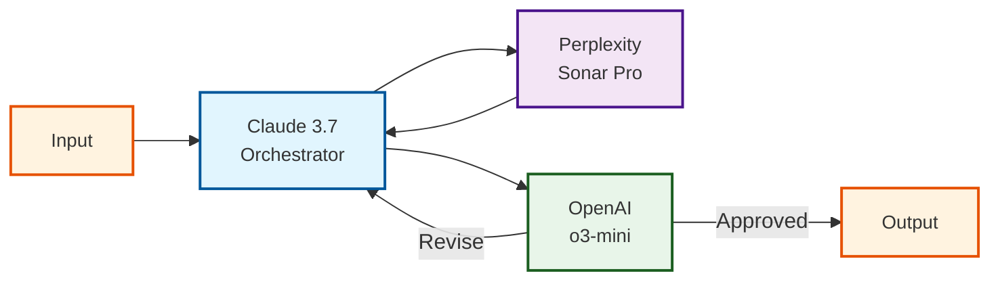

<Frame>

</Frame>

### The Problem: Generic Sales Outreach Doesn't Work

  <div className="grid grid-cols-2 gap-4 mb-8">
    <div className="border rounded-md p-4 bg-red-50">
      <div className="text-lg font-bold mb-2 text-red-700">❌ Before</div>
      <div className="text-sm text-gray-800">
        <p>Dear John,</p>
        <p>I hope this email finds you well. I wanted to reach out about our security services that might be of interest to YMU Talent Agency.</p>
        <p>Our company provides security personnel for events. We have many satisfied customers and would like to schedule a call to discuss how we can help you.</p>
        <p>Let me know when you're available.</p>
        <p>Regards,<br/>Sales Rep</p>
      </div>
      <div className="mt-2 text-red-700 text-xs">Response rate: 1.2%</div>
    </div>
    
    <div className="border rounded-md p-4 bg-green-50">
      <div className="text-lg font-bold mb-2 text-green-700">✅ After</div>
      <div className="text-sm text-gray-800">
        <p>Subject: Quick security solution for YMU's talent events</p>
        <p>Hi John,</p>
        <p>I noticed YMU's been expanding its roster of A-list talent lately – congrats on that growth. Having worked event security for talent agencies before, I know how challenging it can be coordinating reliable security teams, especially on short notice.</p>
        <p>We've built something I think you'll find interesting – an on-demand security platform that's already being used by several major talent agencies.</p>
        <p>Best,<br/>Ilya</p>
      </div>
      <div className="mt-2 text-green-700 text-xs">Response rate: 9.5%</div>
    </div>
  </div>

This cookbook shows you how to build an AI-powered system that:
- **Researches prospects in real-time** using up-to-date web data
- **Crafts personalized emails** based on prospect-specific insights
- **Self-evaluates and improves** its output before sending
- **Scales to thousands of prospects** at a fraction of the usual cost

## Multi-Agent Architecture



Our system combines three specialized AI models:

1. **Orchestrator (Claude 3.7)**: Generates research queries, drafts emails, and refines based on feedback
2. **Researcher (Perplexity)**: Gathers real-time web information about prospects and companies
3. **Evaluator (OpenAI)**: Reviews email quality, providing scores and improvement suggestions

This architecture delivers superior results because:
- Each model handles tasks it excels at
- The system includes built-in quality control
- Cost efficiency through right-sized models and targeted research

## Creating the Prompt Templates

<Tabs>
<Tab title="Orchestrator Template">
  
  ### What You'll Create

  The Orchestrator template handles three different roles depending on which "mode" is activated:
  1. **Research Query Generator**: Creates targeted questions for the researcher
  2. **Email Drafter**: Uses research findings to write personalized outreach
  3. **Email Refiner**: Incorporates evaluator feedback to improve the email

  ### Variables You'll Need

  | Variable | Purpose | Example |
  |----------|---------|---------|
  | `our_offering` | Your product/service description | "Umbrella Corp offers 'Uber for personal protection'..." |
  | `company_name` | Prospect's company | "YMU Talent Agency" |
  | `company_industry` | Industry sector | "Elite Talent Management" |
  | `target_person_name` | Contact name | "John Wick" |
  | `target_person_designation` | Contact's role | "Event Organizer" |
  | `requirement_gathering_mode` | Activates research query mode | "TRUE" or "" (empty) |
  | `research_mode` | Activates email drafting mode | "TRUE" or "" (empty) |
  | `evaluator_mode` | Activates email refinement mode | "TRUE" or "" (empty) |
  | `researcher_output` | Data from the researcher | (JSON response from research) |
  | `evaluator_output` | Feedback from evaluator | (JSON with score and comments) |


  ### Step-by-Step Setup

  1. **Create template** in [prompt.new](https://prompt.new/) with **Claude 3.7 Sonnet**

    <video autoPlay muted loop playsInline className="w-full aspect-video" src="/guides/prompts/ultimate-ai-sdr/new-prompt.mp4" />

  2. **Add core partials**:

Let's create reusable components that define our SDR's core instructions and persona. These are added as **Prompt Partials** - reusable blocks that can be inserted in any template.
  <AccordionGroup>
  <Accordion title="Core Agent Instructions Partial">
  You are the ultimate sales representative from Umbrella Corporation. Your job is to:
  1. Understand the company and target person
  2. Write research queries to learn more about them
  3. Use research findings to write the ultimate opener email
  4. Send to evaluator for improvements
  5. Write final email based on feedback
  </Accordion>
  <Accordion title="SDR Persona Partial">
  Your name is Ilya:
  - You acutely understand the exact requirements your target person and their company has
  - You write short, to the point emails that feel like a friend sending a text to you
  - At the same time, you understand the importance of coming across as a thorough professional
  - You have yourself been on both ends - when you needed private security and when you yourself were a private security professional
  </Accordion>
  </AccordionGroup>

  We'll insert both partials into the template's system role like this:

  <Frame>
    
  </Frame>

  3. **Add product offering**:

  Next, we'll add a section that will receive your company's offering details from a variable:

  <Frame>
    
  </Frame>

  We'll send this variable's content at runtime.

  4. **Add Prospect Information Section**:

  Now let's add a section that will receive the prospect information variables:

  <Frame>
    
  </Frame>

  We'll send these values at runtime as well.

  5. **Create Agent-Specific Sections with Conditional Logic**:

This is where the magic happens! We'll add three "conditional sections" that only appear when a specific mode is activated:

  *A. Research Query Generation Mode:*
  Here, we'll explain how the research query should be generated.

  <Frame>
    
  </Frame>

  At this stage, we can send a request to the researcher get the research output back.

  *B. Email Drafting Mode (add this section next):*
  
  Once we have the research output, we can create the first email, and add the following to a new user role in the prompt template:
  <Frame>
    
  </Frame>

  We'll take this email and send it to the evaluator, which will send back a JSON with two keys: "score" and "comment".

  *C. Email Refinement Mode (add this final section):*

  With the Evaluator's output, we'll now create the final email.

  <Frame>
    
  </Frame>

    <Tip>
  **The Power of Conditional Variables**

  This approach with `{{#variable_name}}` syntax lets you use a single template for three different purposes. When you set `requirement_gathering_mode` to "TRUE", only that section appears. When you set it to empty and instead set `research_mode` to "TRUE", the email drafting section appears instead. This keeps your templates DRY (Don't Repeat Yourself).
  </Tip>

  ### Complete Template Overview

  When finished, your template should have:
  1. Core instruction and persona partials at the top
  2. Company offering section
  3. Prospect information section
  4. Three conditional sections for different modes

  This single template will now handle all three stages of the orchestrator's job, activated by different variables in your code.
</Tab>
  
<Tab title="Researcher Template">

  ### What You'll Create
  
  The Researcher template powers the real-time web research capabilities of your AI SDR system.

  ### Variables

  | Inputt | Description | Source/Destination |
  |--------------|-------------|-------------------|
  | `requirement_gathering_output` | Research queries | Received from Orchestrator |

  ### Setup Steps

  1. Create a new prompt template with **Perplexity Sonar Pro** as the model

  2. Add researcher instructions:

  Add these system instructions that define the researcher's role:

  <Accordion title="Researcher instructions">
  You are a world-class researcher who, when given key info about a company, its industry, and the target person, helps your handler write the ultimate sales email by gathering the critical insights about them from the internet.

  In scenarios where you do not find much info about the company in question, you also try to extrapolate the key information about this company that helps with writing the ultimate opener email.
  </Accordion>

  Your completed template should look like this:

  <Frame>
    
  </Frame>

<Accordion title="Researcher output">
YMU Group is a global talent management agency founded in 1984 and based in London[1]. It offers full-service talent management, including representation for entertainers, athletes, musicians, and literary figures[1]. The company works with high-profile clients like Simon Cowell, Graham Norton, Claudia Winkleman, Nicole Scherzinger, Stacey Solomon, and Ant and Dec[7].

In 2023, YMU reported a pre-tax loss of £32 million on revenue of £42.4 million[7]. The company was sold in March 2024 for £60 million to Permira Credit[7].

YMU appears to focus on talent representation and career management rather than event organization. The search results don't mention John Wick or provide details about specific events, security practices, or budgets.

For writing a sales email, you might focus on YMU's role as a major talent agency representing top celebrities. Their need for security services likely relates to protecting high-profile clients rather than large-scale event management. You could highlight how your security offerings could benefit their roster of celebrity talent in various professional and personal settings.

Without more specific information, it's best to keep the email fairly general, focusing on your company's experience protecting high-profile individuals and how that aligns with YMU's client base. You might also mention your ability to provide flexible, on-demand security staffing to meet the changing needs of busy entertainment professionals.
</Accordion>
</Tab>
  
<Tab title="Evaluator Template">

  ### What You'll Create
  
  The Evaluator template provides quality control for your AI SDR system.

  ### Variables

  | Input | Description | Source/Destination |
  |--------------|-------------|-------------------|
  | `work_history` | Research queries + findings + email draft | Received from previous steps |


  ### Setup Steps

  1. Create a template with **OpenAI o3-mini** as the model

  2. Add evaluator instructions:

  Add these system instructions that define the evaluator's role:

  <Accordion title="Evaluator instructions">
  You are the critical part of an AI SDR agent that helps write opening sales email to a given prospect at a given company. Your key job is look at everything provided to you: The SDR's job to be done, the SDR's persona, the company and the target person in question, the research output, and send back a JSON with two keys: "score" and "comment".

  The actual JSON object will be: `{"score":<integer out of 10>, "comment":"<qualitative feedback about the email given to you>"}`

  Based on your feedback, the agent will rework the email and then send it to the prospect.
  </Accordion>

  Your completed template should look like this:

  <Frame>
    
  </Frame>

    Evaluator is like an AI sales manager reviewing drafts before they go out - ensuring consistent quality at scale.

    <Accordion title="Evaluator output">
    ```json
    {"score": 7, "comment": "The research summary does a good job of contextualizing YMU as a leading talent agency with high-profile clients, emphasizing the need for security services tailored to the protection of celebrities. It provides a solid foundation for a targeted email by suggesting a focus on flexible, on-demand security staffing. However, the information is somewhat generic, lacking specifics that could create a more compelling and personalized pitch. The email would benefit from slightly more emphasis on addressing potential security challenges or pain points unique to managing high-profile talent, even if inferred, to make the value proposition sharper."}
    ```
    </Accordion>
</Tab>
</Tabs>

## Implementing the Workflow

<Steps>
  <Step title="Setup">
    ```python
    from portkey_ai import Portkey

    # Initialize with tracing
    client = Portkey(
      api_key="PORTKEY_API_KEY",
      trace_id="ultimate-ai-sdr-run-1"
    )

    # Company offering
    our_offering = """Umbrella Corp offers 'Uber for personal protection'. Using our app, you can get highly vetted, 
    arms-bearing ex-veterans who can accompany you to any place that's supported for any amount of hours or days..."""

    # Target information
    company_name = "YMU Talent Agency"
    company_industry = "Elite Talent Management"
    target_person_name = "John Wick"
    target_person_designation = "Event Organizer"
    ```
  </Step>

  <Step title="Generate Research Queries">
    ```python
    # Activate research query generation mode
    variables = {
        "our_offering": our_offering,
        "company_name": company_name,
        "company_industry": company_industry,
        "target_person_name": target_person_name,
        "target_person_designation": target_person_designation,
        "requirement_gathering_mode": "TRUE"  # Activate research query mode
    }

    gatherer = client.with_options(span_name="gatherer").prompts.completions.create(
        prompt_id="your-orchestrator-template-id",
        variables=variables
    ).choices[0].message.content
    ```

    <Accordion title="Example Output">
    ```
    Research Queries:

    1. What are the typical event sizes and types that YMU Talent Agency organizes?
    2. Have there been any security incidents at YMU's past events?
    3. What is John Wick's specific role and experience in event organization at YMU?
    4. Does YMU currently work with any security providers?
    5. What are the most significant upcoming events that YMU is organizing?
    ...
    ```
    </Accordion>
  </Step>

  <Step title="Conduct Research">
    ```python
    # Send queries to researcher
    researcher = client.with_options(span_name="researcher").prompts.completions.create(
        prompt_id="your-researcher-template-id",
        variables={"requirement_gathering_output": gatherer}
    ).choices[0].message.content
    ```

    <Accordion title="Example Output">
    ```
    Research Summary for YMU Talent Agency:

    1. Company Profile:
       - YMU is one of the world's leading talent management companies
       - Represents high-profile clients including Simon Cowell, Nicole Scherzinger
       ...

    2. Security Considerations:
       - Growing concern about celebrity stalking incidents in the industry
       - Multiple high-profile clients have experienced security threats
       ...
    ```
    </Accordion>
  </Step>
  
  <Step title="Draft Initial Email">
    ```python
    # Activate email drafting mode
    variables = {
        "our_offering": our_offering,
        "company_name": company_name,
        "target_person_name": target_person_name,
        "researcher_output": researcher,
        "requirement_gathering_mode": "",  # Deactivate research mode
        "research_mode": "TRUE"  # Activate email drafting mode
    }

    email_one = client.with_options(span_name="email-one").prompts.completions.create(
        prompt_id="your-orchestrator-template-id",  # Same template, different mode
        variables=variables
    ).choices[0].message.content
    ```

    <Accordion title="Example Output">
    ```
    Subject: Quick security chat - from one protection expert to another

    Hi John,

    As someone who's been on both sides of event security, I know the stress of finding reliable protection for high-profile talent. Especially given YMU's roster including Simon Cowell and Nicole Scherzinger.

    We've built an 'Uber for security' that top agencies use - you get instant access to vetted, armed ex-veterans through an app.
    ...
    ```
    </Accordion>
  </Step>
  
  <Step title="Evaluate Email">  
    ```python
    # Send to evaluator
    evaluator = client.with_options(span_name="evaluator").prompts.completions.create(
        prompt_id="your-evaluator-template-id",
        variables={"work_history": gatherer + " " + researcher, "email_output": email_one}
    ).choices[0].message.content
    ```
  
    <Accordion title="Example Output">
    ```json
    {
        "score": 7,
        "comment": "The email does a good job establishing rapport by acknowledging John's background in event security and mentioning specific clients. However, it could be improved by directly addressing the specific pain point mentioned in the research - 'finding reliable security staff on short notice.'"
    }
    ```
    </Accordion>
  </Step>
  
  <Step title="Refine Email">
    ```python
    # Activate email refinement mode
    variables = {
        "our_offering": our_offering,
        "company_name": company_name,
        "target_person_name": target_person_name,
        "researcher_output": researcher,
        "evaluator_output": evaluator,
        "requirement_gathering_mode": "",
        "research_mode": "",
        "evaluator_mode": "TRUE"  # Activate refinement mode
    }

    email_two = client.with_options(span_name="email-two").prompts.completions.create(
        prompt_id="your-orchestrator-template-id",  # Same template, third mode
        variables=variables
    ).choices[0].message.content
    ```

    <Accordion title="Final Email">
    ```
    Subject: Quick security solution for YMU's talent events

    Hi John,

    I noticed YMU's been expanding its roster of A-list talent lately – congrats on that growth. Having worked event security for talent agencies before, I know how challenging it can be coordinating reliable security teams, especially on short notice.

    We've built something I think you'll find interesting – an on-demand security platform that's already being used by several major talent agencies. Think of it like having an elite security team in your pocket, available within hours.
    ...
    ```
    </Accordion>
  </Step>
</Steps>

## Monitoring and Optimization

<video autoPlay muted loop playsInline className="w-full aspect-video" src="/guides/prompts/ultimate-ai-sdr/trace.mp4" />

Portkey's trace view provides complete visibility to track performance, cost, latency, and opportunities for improvement.

## Implementation Checklist

✅ Set up Portkey account and API credentials  
✅ Create prompt templates for all three agents  
✅ Define your company offering and SDR persona  
✅ Configure basic prospect information  
✅ Implement the five-step workflow  
✅ Set up tracing and monitoring  
✅ Create a system for batching multiple prospects  

## Troubleshooting & Best Practices

| Issue | Solution |
|-------|----------|
| Low research quality | Make research queries more specific |
| Generic emails | Ensure research findings are prominently featured |
| High token usage | Remove redundant information from prompts |

## Ready to Transform Your Outreach?

This AI SDR system isn't just an incremental improvement—it's a fundamental reimagining of how sales development works. By combining specialized AI agents in an orchestrated workflow, you can achieve personalization at scale that was previously impossible.

The result? More meetings, stronger relationships, and ultimately more closed deals—all while freeing your team to focus on high-value activities.