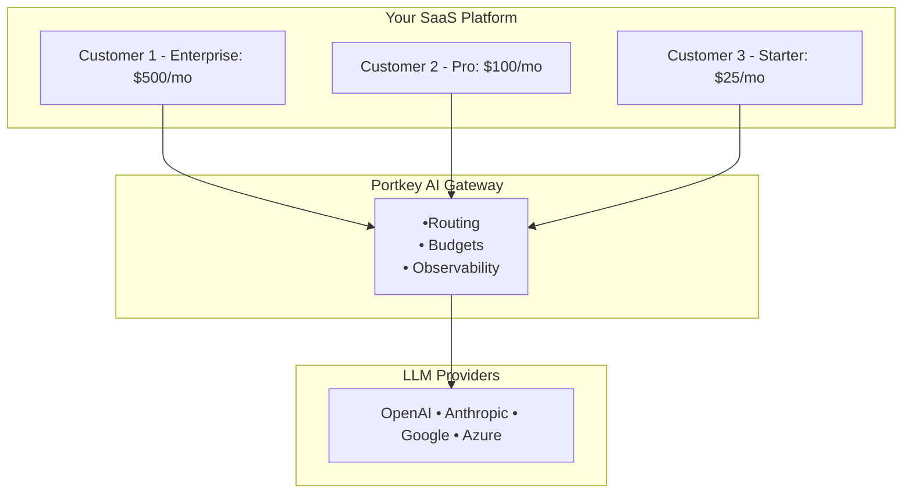

Modern SaaS platforms face a critical challenge when adding AI capabilities: how to provide thousands of customers with access to powerful language models while maintaining predictable costs, ensuring fair resource allocation, and preventing abuse.

Consider a typical scenario: Your B2B SaaS platform serves 5,000 users across 200 customer accounts. Each customer wants to leverage AI for different use cases - some need GPT-4 for complex analysis, others require Claude for writing tasks, and many are satisfied with GPT-3.5 for basic queries. Without proper infrastructure, you risk:

- **Uncapped Costs**: A single customer consuming $10,000 in API credits overnight
- **Resource Contention**: Power users monopolizing API capacity
- **Security Vulnerabilities**: Shared API keys creating audit and compliance issues
- **Poor User Experience**: No visibility into usage limits or remaining budgets
- **Operational Complexity**: Managing multiple provider APIs without unified controls

This guide demonstrates how to build production-ready AI features that give your customers flexibility while maintaining enterprise-grade control and predictability.

## What You'll Build

This architecture enables:

- **Individual Usage Controls**: Per-customer API keys with configurable limits
- **Dynamic Model Access**: Customers see only authorized models based on their subscription tier
- **Real-time Budget Management**: Automatic enforcement of spending caps
- **Comprehensive Observability**: Usage analytics at customer, account, and platform levels
- **Provider Abstraction**: Single API interface across OpenAI, Anthropic, Google, and more

## Architecture Overview

The solution uses Portkey as an intelligent gateway between your application and LLM providers:


The architecture provides three key abstraction layers:

1. **Customer Layer**: Your application issues individual API keys to customers
2. **Gateway Layer**: Portkey handles routing, validation, and enforcement
3. **Provider Layer**: Your LLM credentials remain secure and centralized

## Prerequisites

Before implementing this solution, ensure you have:

- Portkey account with admin/owner role on organization access
- API credentials from your chosen LLM providers

## Step 1: Establishing Organizational Structure

### Understanding the Hierarchy

Before diving into configuration, let's understand how Portkey organizes access control. The platform uses a three-tier hierarchy that maps naturally to business structures:

```
Organization (Your Entire SaaS Platform)
├── Workspaces (Logical Groups - Teams, Tiers, or Regions)
│   ├── Enterprise Customers Workspace
│   ├── Professional Customers Workspace
│   └── Starter Customers Workspace
└── API Keys (Individual Access Points)
    ├── Each customer gets their own API key
    ├── Keys inherit workspace settings
    └── Keys can have individual budget and reate limits
```

**Why this structure?**
- **Organization**: Sets platform-wide policies and defaults
- **Workspaces**: Groups customers with similar needs (e.g., all Enterprise customers)
- **API Keys**: Individual access points with customer-specific limits

### Configuring Organization Settings

We will first start with first setting up some organisation properites for Portkey.  Navigate to your organization settings to establish platform-wide rules.


<Frame>
  
</Frame>


#### A. Metadata Schema Enforcement

**What is Metadata?**

Metadata in Portkey is custom key-value pair attached to every AI request. Think of it as tags that help you track who's using AI, how they're using it, and what it's costing you. This becomes crucial when you have thousands of customers making millions of requests.

For example, metadata helps you answer questions like:
- Which customer made this request?
- What feature in your app triggered it?
- Which subscription tier should be billed?
- What was the user trying to accomplish?

<Card title="Learn About Metadata" icon="tags" href="/product/observability/metadata">
  Deep dive into metadata configuration and best practices
</Card>

Define required metadata fields for subscription_tier:

```json
{
  "api_key_metadata_schema": {
    "type": "object",
    "required": ["subscription_tier"],
    "properties": {
      "subscription_tier": {
        "type": "string",
        "enum": ["starter", "professional", "enterprise"]
      }
    }
  }
}
```

This schema ensures every API key created has proper tagging for cost allocation and compliance.

## Step 2: Workspace Design for Customer Segmentation

### Creating Customer Workspaces

Workspaces are containers that group customers with similar characteristics. Let's create workspaces for different customer tiers:

**To create a new workspace:**

1. Click on your current workspace name in the sidebar
2. Click **"+ Add Workspace"**
3. Configure the workspace with appropriate settings

<Frame>
  
</Frame>

For each workspace, configure:

```yaml
Workspace Name: workspace-enterprise
Description: Enterprise tier customers with premium access
Metadata:
  tier: enterprise
  default_monthly_budget: 500
  support_level: premium
```

Create three workspaces (for example):
- `workspace-enterprise` - For your highest-tier customers
- `workspace-professional` - For mid-tier customers
- `workspace-starter` - For entry-level customers

## Step 3: Connecting AI Providers

### Creating Provider Integrations

Integrations securely store your provider credentials while enabling controlled access. Think of them as secure vaults that your workspaces can access without ever exposing the actual API keys.

<Card title="Learn About Integrations" icon="plug" href="/product/model-catalog/integrations">
  Complete guide to managing AI provider integrations
</Card>

<Frame>
  
</Frame>

Set up your primary provider:

1. Navigate to **Integrations** → **Create New Integration**
2. Select your AI provider (e.g., OpenAI)
3. Configure the integration:

### Workspace Provisioning

When creating the integration, configure which workspaces can access it and set appropriate budget and rate limits for your integration:

<Frame>
  
</Frame>

For each workspace, click the edit icon to configure:

```yaml
Enterprise Tier:
  Access: ✓ Enabled
  Budget Limit: $500/month
  Rate Limit: 1000 requests/minute
  Alert Threshold: 80% ($400)

Professional Tier:
  Access: ✓ Enabled
  Budget Limit: $100/month
  Rate Limit: 100 requests/minute
  Alert Threshold: 80% ($80)

Starter Tier:
  Access: ✓ Enabled
  Budget Limit: $25/month
  Rate Limit: 10 requests/minute
  Alert Threshold: 80% ($20)
```

### Model Provisioning

Define which models your integration can access:

<Frame>
  
</Frame>

Configure model access strategically by tier:

```yaml
  - gpt-4o (Advanced reasoning)
  - gpt-5 (Complex tasks)
  - gpt-5-nano (Basic queries)
```

###  Model Rules with Guardrails (Advanced)

For fine-grained control over model access based on metadata, use Portkey's Guardrails feature:

1. Navigate to **Guardrails** → **Model Rule Guardrail**
2. Create a new guardrail with your routing rules:


```json
{
  "model_rules": {
    "defaults": ["gpt-3.5-turbo"],
    "metadata_routing": {
      "subscription_tier": {
        "enterprise": ["gpt-4-turbo", "claude-3-opus"],
        "professional": ["gpt-4", "claude-3-sonnet"],
        "starter": ["gpt-3.5-turbo"]
      }
    }
  }
}
```

3. Attach the guardrail at the workspace level by going to [Workspace Control](https://app.portkey.ai/workspace-control/)
4. Alternatively, attach it to individual API keys using configs

<Card title="Learn About Guardrails" icon="shield" href="/product/guardrails">
  Explore content filtering, PII detection, and model routing rules
</Card>

## Step 4: Customer API Key Management with Budget Limits and Metadata

### Programmatic Key Generation

Now let's create individual API keys for your customers. Each customer gets their own key with specific budget and rate limits:

<Note>
    You need to use Admin API key here and not Workspace API key. You can find it on Admin settings -> API Keys
</Note>

```python
from portkey_ai import Portkey
from typing import List, Dict

class WorkspaceKeyManager:
    def __init__(self, admin_api_key: str):
        """Initialize with your Portkey admin API key"""
        self.portkey = Portkey(api_key=admin_api_key)

    def get_all_workspaces(self) -> List[Dict]:
        """
        Step 1: Retrieve all workspace slugs
        """
        workspaces = self.portkey.admin.workspaces.list()

        # Extract workspace info
        workspace_list = []
        for workspace in workspaces.data:
            workspace_list.append({
                "id": workspace.id,
                "slug": workspace.slug,
                "name": workspace.name
            })

        print(f"\n{'='*60}")
        print(f"Found {len(workspace_list)} workspaces:")
        print(f"{'='*60}")
        for i, ws in enumerate(workspace_list, 1):
            print(f"{i:2}. {ws['name']}")
            print(f"    Slug: {ws['slug']}")
        print(f"{'='*60}\n")

        return workspace_list

    def create_workspace_api_key(
        self,
        workspace_slug: str,
        workspace_name: str,
        customer_email: str,
        monthly_budget: float = 100.0,
        requests_per_minute: int = 100
    ) -> Dict:
        """
        Step 2: Create API key for a specific workspace with budget and rate limits
        """
        # Create the API key with budget and rate limits
        api_key_response = self.portkey.api_keys.create(
            name=f"Service Key for {workspace_name}",
            workspace_id=workspace_slug,

            # Required type and sub_type
            type="workspace",
            sub_type="service",

            # Required scopes
            scopes=["completions.write"], # you can learn more about scopes on Portkey Docs.

            # Budget limits
            usage_limits={
                "credit_limit": monthly_budget,
                "type": "cost",
                "periodic_reset": "monthly",
                "alert_threshold": int(monthly_budget * 0.8)  # Alert at 80%
            },

            defaults={
                "metadata": {
                    "user_email": customer_email
                }
            }

            # Rate limits
            rate_limits=[{
                "type": "requests",
                "unit": "rpm",
                "value": requests_per_minute
            }]
        )

        return {
            "api_key": api_key_response.key,
            "workspace": workspace_slug,
            "workspace_name": workspace_name,
            "monthly_budget": monthly_budget,
            "rate_limit": f"{requests_per_minute} rpm"
        }

# Example usage
def main():
    # Initialize with your admin API key
    manager = WorkspaceKeyManager(admin_api_key="YOUR_PORTKEY_ADMIN_API_KEY")

    # Step 1: Get all workspaces
    workspaces = manager.get_all_workspaces()

    # Step 2: Create API key for the first workspace
    if workspaces:
        first_workspace = workspaces[0]

        print(f"Creating API key for workspace: {first_workspace['name']}")
        print(f"{'='*60}")

        try:
            # Create API key with $100 monthly budget and 100 requests/minute
            result = manager.create_workspace_api_key(
                workspace_slug=first_workspace['slug'],
                workspace_name=first_workspace['name'],
                customer_email="your-customer-email-address",  # ✅ pass your customer email here as metadata for tracking
                monthly_budget=100.0,
                requests_per_minute=100
            )

            print(f"\n✅ API Key Created Successfully!")
            print(f"{'='*60}")
            print(f"Workspace:       {result['workspace_name']}")
            print(f"Workspace Slug:  {result['workspace']}")
            print(f"API Key:         {result['api_key']}")
            print(f"Monthly Budget:  ${result['monthly_budget']}")
            print(f"Rate Limit:      {result['rate_limit']}")
            print(f"Scopes:          completions.write")
            print(f"{'='*60}\n")

        except Exception as e:
            print(f"\n❌ Error creating API key:")
            print(f"   {str(e)}")
            print(f"{'='*60}\n")

if __name__ == "__main__":
    main()
```

## Step 5: Customer-Facing Integration

### Dynamic Model Discovery

Provide customers with real-time access to their available models:

```python
import json
from portkey_ai import Portkey

client = Portkey(
    api_key = "your-customer-api-key"
)
models = client.models.list()

# Extract the data array from the response
model_data = models.data if hasattr(models, 'data') else models

# Create organized structure with just IDs
organized = {"ids": []}

for model in model_data:
    organized["ids"].append(model.id)

print(organized)

```

### Real-Time Usage Display

Show customers their usage and remaining budget:

<Frame>
  
</Frame>

```python


from portkey_ai import Portkey

def get_user_limits(workspace_slug, portkey_api_key, user_email):
    """Get rate and usage limits for a user by email"""

    portkey = Portkey(api_key=portkey_api_key)
    api_keys = portkey.api_keys.list(workspace_id=workspace_slug)

    # Filter by user email in metadata
    for key in api_keys.get('data', []):
        metadata = key.get('defaults', {}).get('metadata') or key.get('metadata')

        # Check if metadata contains user_email
        if metadata and isinstance(metadata, dict) and metadata.get('user_email') == user_email:
            print(f"User: {user_email}")
            print(f"API Key: {key.get('name')}")

            # Rate limits
            for limit in key.get('rate_limits', []):
                print(f"Rate Limit: {limit['value']} {limit['unit']}")

            # Usage limits
            usage = key.get('usage_limits') or {}
            print(f"Usage Limit: ${usage.get('credit_limit')} {usage.get('periodic_reset')}")
            print(f"Alert Threshold: {usage.get('alert_threshold')}")
            return

    # If no metadata match, show first available key's limits
    print(f"No metadata match for {user_email}. Showing available limits:")
    if api_keys.get('data'):
        key = api_keys['data'][0]
        for limit in key.get('rate_limits', []):
            print(f"Rate Limit: {limit['value']} {limit['unit']}")
        usage = key.get('usage_limits') or {}
        print(f"Usage Limit: ${usage.get('credit_limit')} {usage.get('periodic_reset')}")
        print(f"Alert Threshold: {usage.get('alert_threshold')}%")


# Usage
if __name__ == "__main__":
    get_user_limits(
        workspace_slug="your-workspace-slug",
        portkey_api_key="your-portkey-admin-api-key",
        user_email="your-customer-email-metadata-value" # in this example assuming your user api keys have user_email metadata value
    )

# Expected output for your data:
# Rate Limit: 100 rpm
# Usage Limit: $100 monthly
# Alert Threshold: 80%
```

## Step 6: Observability and Analytics

### Accessing Analytics

Portkey provides comprehensive analytics at multiple levels. Access your analytics dashboard to monitor:


<Frame>
    
</Frame>


**Key Metrics to Track:**
- Total requests by customer tier
- Cost distribution across models
- Error rates and types
- Peak usage times
- Customer usage patterns


## Conclusion

You've successfully built a multi-tenant AI infrastructure that provides:

- **Individual customer control** with per-user API keys and budgets
- **Tiered access** to models based on subscription levels
- **Automatic enforcement** of spending and rate limits
- **Complete visibility** into usage patterns and costs
- **Enterprise security** with encrypted keys and audit trails

Your customers get powerful AI capabilities with transparent limits. Your business gets predictable costs and complete control. Your engineering team gets a simple, maintainable solution.


## Next Steps

Explore these related resources to get the most out of your private LLM integration:

<CardGroup cols={2}>
  <Card title="Universal API" icon="globe" href="/product/ai-gateway/universal-api">  </Card>
  <Card title="Adding Metadata" icon="tags" href="/product/observability/metadata">
  </Card>
  <Card title="Gateway Configs" icon="sliders" href="/product/ai-gateway/configs">
  </Card>
  <Card title="Request Tracing" icon="route" href="/product/observability/traces">  </Card>
</CardGroup>


## Additional Resources

- [Portkey API Reference](https://docs.portkey.ai/api-reference)
- [Integration Guides](https://docs.portkey.ai/integrations)
- [Guardrails Documentation](https://docs.portkey.ai/guardrails)
- [Webhook Configuration](https://docs.portkey.ai/webhooks)

---

*For support and questions, contact support@portkey.ai or visit our [documentation](https://docs.portkey.ai)*
