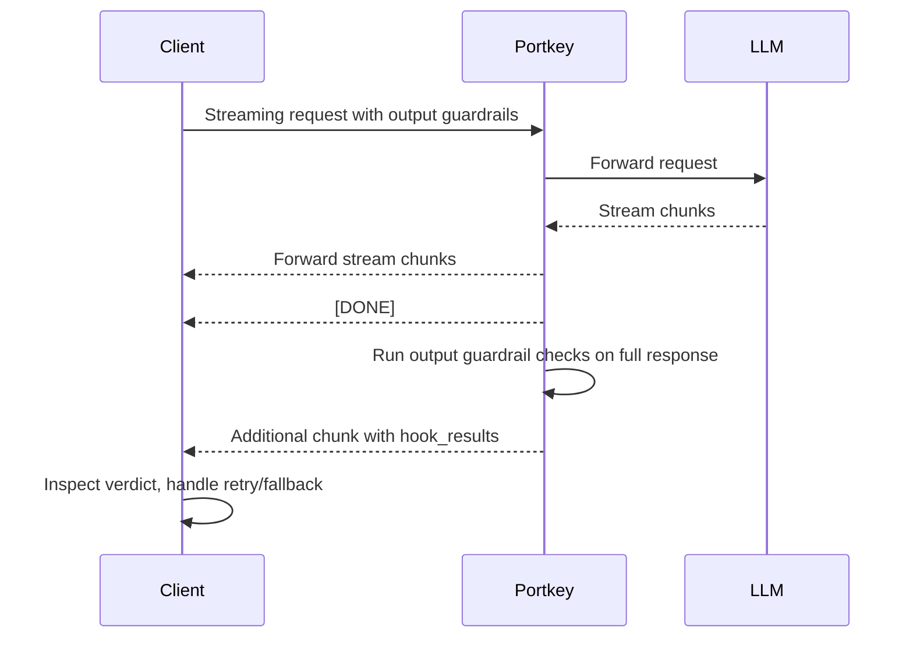

When you enable **output guardrails** on streaming requests, Portkey accumulates the full response after the stream completes, runs your guardrail checks, and sends the results as an additional SSE chunk. Unlike non-streaming requests, **no server-side action is taken** — retry, fallback, and deny are not triggered automatically. The results are informational, giving you full control to handle them on the client side.

This guide walks through capturing those results and building client-side handling patterns like retry, fallback, and content filtering.

## Prerequisites

- A Portkey account with an API key
- An output guardrail created in the Portkey dashboard (e.g., sentence count, word count, regex match, or any custom check)
- The guardrail's ID (visible after saving it in the dashboard)

<Note>
To receive `hook_results` in streaming chunks, you **must** set the `x-portkey-strict-open-ai-compliance` header to `false`. Without this, guardrail is executed but the result chunks are not sent to be compliant with the spec.
</Note>

## How streaming output guardrails work

1. You send a streaming request with output guardrails configured
2. Portkey streams the LLM response chunks to you normally
3. After the final `[DONE]` chunk, Portkey sends **one additional chunk** containing `hook_results` with the `after_request_hooks` array
4. Your client can inspect the verdict and decide what to do — retry, fall back to another model, filter the response, or surface a warning



## Step 1: Configure the request

Add your output guardrail to the config using `afterRequestHooks` (or `output_guardrails` in a saved config). Set `stream: true` and disable strict OpenAI compliance.

<CodeGroup>
```python Python
from portkey_ai import AsyncPortkey
import asyncio

portkey = AsyncPortkey(
    api_key="PORTKEY_API_KEY",
    provider="openai",
    config={
        "afterRequestHooks": [
            {
                "type": "guardrail",
                "id": "your-output-guardrail-id",
            }
        ],
    },
)
```

```javascript Node
import Portkey from 'portkey-ai';

const portkey = new Portkey({
    apiKey: "PORTKEY_API_KEY",
    provider: "openai",
    config: {
        afterRequestHooks: [
            {
                type: "guardrail",
                id: "your-output-guardrail-id",
            }
        ],
    },
});
```

```python OpenAI Python
from openai import AsyncOpenAI

client = AsyncOpenAI(
    api_key="OPENAI_API_KEY",
    base_url="https://api.portkey.ai/v1",
    default_headers={
        "x-portkey-api-key": "PORTKEY_API_KEY",
        "x-portkey-config": '{"afterRequestHooks":[{"type":"guardrail","id":"your-output-guardrail-id"}]}',
        "x-portkey-strict-open-ai-compliance": "false"
    }
)
```

```javascript OpenAI Node
import OpenAI from 'openai';

const client = new OpenAI({
    apiKey: process.env.OPENAI_API_KEY,
    baseURL: "https://api.portkey.ai/v1",
    defaultHeaders: {
        "x-portkey-api-key": process.env.PORTKEY_API_KEY,
        "x-portkey-config": JSON.stringify({
            afterRequestHooks: [
                {
                    type: "guardrail",
                    id: "your-output-guardrail-id",
                }
            ]
        }),
        "x-portkey-strict-open-ai-compliance": "false"
    }
});
```
</CodeGroup>

## Step 2: Capture guardrail results from the stream

Iterate over the stream, collect content chunks, and extract `hook_results` from the final chunk.

<CodeGroup>
```python Python
async def stream_with_guardrails():
    collected_content = ""
    guardrail_results = None

    response = await portkey.chat.completions.create(
        model="gpt-4o-mini",
        messages=[
            {"role": "system", "content": "You are a helpful assistant."},
            {"role": "user", "content": "Explain quantum computing in 2 sentences."},
        ],
        stream=True,
    )

    async for chunk in response:
        # Check for hook_results in every chunk
        if chunk.model_extra and chunk.model_extra.get("hook_results"):
            hook_results = chunk.model_extra["hook_results"]
            if hook_results.get("after_request_hooks"):
                guardrail_results = hook_results["after_request_hooks"]
        
        # Collect streamed content
        if chunk.choices and chunk.choices[0].delta.content:
            collected_content += chunk.choices[0].delta.content

    return collected_content, guardrail_results
```

```javascript Node
async function streamWithGuardrails() {
    let collectedContent = "";
    let guardrailResults = null;

    const response = await portkey.chat.completions.create({
        model: "gpt-4o-mini",
        messages: [
            { role: "system", content: "You are a helpful assistant." },
            { role: "user", content: "Explain quantum computing in 2 sentences." },
        ],
        stream: true,
    });

    for await (const chunk of response) {
        // Check for hook_results in every chunk
        if (chunk.model_extra?.hook_results?.after_request_hooks) {
            guardrailResults = chunk.model_extra.hook_results.after_request_hooks;
        }

        // Collect streamed content
        if (chunk.choices?.[0]?.delta?.content) {
            collectedContent += chunk.choices[0].delta.content;
        }
    }

    return { collectedContent, guardrailResults };
}
```
</CodeGroup>

## Step 3: Inspect the verdict

Each guardrail in `after_request_hooks` returns a `verdict` (boolean) and an array of `checks`. A guardrail's overall verdict is `true` only when **all** its checks pass.

```python
def evaluate_guardrail_results(guardrail_results):
    """Returns True if all guardrails passed, False otherwise."""
    if not guardrail_results:
        return True  # No results means guardrails didn't run

    for guardrail in guardrail_results:
        if not guardrail.get("verdict"):
            # At least one guardrail failed
            failed_checks = [
                check["id"]
                for check in guardrail.get("checks", [])
                if not check.get("verdict")
            ]
            print(f"Guardrail '{guardrail['id']}' failed. "
                  f"Failed checks: {failed_checks}")
            return False

    return True
```

The `hook_results` chunk for output guardrails looks like this:

```json
{
  "hook_results": {
    "after_request_hooks": [
      {
        "verdict": false,
        "id": "your-output-guardrail-id",
        "transformed": false,
        "checks": [
          {
            "data": {
              "sentenceCount": 5,
              "minCount": 1,
              "maxCount": 2,
              "verdict": false,
              "explanation": "The sentence count (5) exceeds the maximum of 2."
            },
            "verdict": false,
            "id": "default.sentenceCount",
            "execution_time": 1
          }
        ],
        "feedback": null,
        "execution_time": 1,
        "async": false,
        "type": "guardrail",
        "deny": false
      }
    ]
  }
}
```

## Client-side handling patterns

Since streaming output guardrails are informational only, you implement the handling logic yourself. Here are common patterns:

### Pattern 1: Client-side retry

Re-send the request when the guardrail fails, optionally with a modified prompt to steer the model toward compliant output.

<CodeGroup>
```python Python
async def stream_with_retry(messages, max_retries=3):
    for attempt in range(max_retries):
        content, guardrail_results = await stream_with_guardrails_custom(messages)

        if evaluate_guardrail_results(guardrail_results):
            return content  # Passed — return the response

        print(f"Attempt {attempt + 1} failed guardrails. Retrying...")

        # Optionally refine the prompt to improve compliance
        messages = messages + [
            {"role": "assistant", "content": content},
            {
                "role": "user",
                "content": (
                    "Your previous response did not meet the requirements. "
                    "Please try again, keeping it to exactly 2 sentences."
                ),
            },
        ]

    raise Exception("All retry attempts failed guardrail checks")


async def stream_with_guardrails_custom(messages):
    collected_content = ""
    guardrail_results = None

    response = await portkey.chat.completions.create(
        model="gpt-4o-mini",
        messages=messages,
        stream=True,
    )

    async for chunk in response:
        if chunk.model_extra and chunk.model_extra.get("hook_results"):
            hook_results = chunk.model_extra["hook_results"]
            if hook_results.get("after_request_hooks"):
                guardrail_results = hook_results["after_request_hooks"]

        if chunk.choices and chunk.choices[0].delta.content:
            collected_content += chunk.choices[0].delta.content

    return collected_content, guardrail_results
```

```javascript Node
async function streamWithRetry(messages, maxRetries = 3) {
    for (let attempt = 0; attempt < maxRetries; attempt++) {
        const { collectedContent, guardrailResults } =
            await streamWithGuardrailsCustom(messages);

        if (evaluateGuardrailResults(guardrailResults)) {
            return collectedContent; // Passed
        }

        console.log(`Attempt ${attempt + 1} failed guardrails. Retrying...`);

        messages = [
            ...messages,
            { role: "assistant", content: collectedContent },
            {
                role: "user",
                content:
                    "Your previous response did not meet the requirements. " +
                    "Please try again, keeping it to exactly 2 sentences.",
            },
        ];
    }

    throw new Error("All retry attempts failed guardrail checks");
}

async function streamWithGuardrailsCustom(messages) {
    let collectedContent = "";
    let guardrailResults = null;

    const response = await portkey.chat.completions.create({
        model: "gpt-4o-mini",
        messages,
        stream: true,
    });

    for await (const chunk of response) {
        if (chunk.model_extra?.hook_results?.after_request_hooks) {
            guardrailResults = chunk.model_extra.hook_results.after_request_hooks;
        }
        if (chunk.choices?.[0]?.delta?.content) {
            collectedContent += chunk.choices[0].delta.content;
        }
    }

    return { collectedContent, guardrailResults };
}

function evaluateGuardrailResults(guardrailResults) {
    if (!guardrailResults) return true;
    return guardrailResults.every((g) => g.verdict === true);
}
```
</CodeGroup>

### Pattern 2: Client-side fallback to another model

If the primary model's output fails guardrails, fall back to a different model.

<CodeGroup>
```python Python
FALLBACK_MODELS = ["gpt-4o-mini", "gpt-4o", "claude-sonnet-4-20250514"]

async def stream_with_fallback(messages):
    for model in FALLBACK_MODELS:
        print(f"Trying model: {model}")
        content, guardrail_results = await stream_with_model(messages, model)

        if evaluate_guardrail_results(guardrail_results):
            return {"content": content, "model": model}

        print(f"Model {model} failed guardrails, trying next...")

    raise Exception("All fallback models failed guardrail checks")


async def stream_with_model(messages, model):
    collected_content = ""
    guardrail_results = None

    response = await portkey.chat.completions.create(
        model=model,
        messages=messages,
        stream=True,
    )

    async for chunk in response:
        if chunk.model_extra and chunk.model_extra.get("hook_results"):
            hook_results = chunk.model_extra["hook_results"]
            if hook_results.get("after_request_hooks"):
                guardrail_results = hook_results["after_request_hooks"]

        if chunk.choices and chunk.choices[0].delta.content:
            collected_content += chunk.choices[0].delta.content

    return collected_content, guardrail_results
```

```javascript Node
const FALLBACK_MODELS = ["gpt-4o-mini", "gpt-4o", "claude-sonnet-4-20250514"];

async function streamWithFallback(messages) {
    for (const model of FALLBACK_MODELS) {
        console.log(`Trying model: ${model}`);
        const { collectedContent, guardrailResults } =
            await streamWithModel(messages, model);

        if (evaluateGuardrailResults(guardrailResults)) {
            return { content: collectedContent, model };
        }

        console.log(`Model ${model} failed guardrails, trying next...`);
    }

    throw new Error("All fallback models failed guardrail checks");
}

async function streamWithModel(messages, model) {
    let collectedContent = "";
    let guardrailResults = null;

    const response = await portkey.chat.completions.create({
        model,
        messages,
        stream: true,
    });

    for await (const chunk of response) {
        if (chunk.model_extra?.hook_results?.after_request_hooks) {
            guardrailResults = chunk.model_extra.hook_results.after_request_hooks;
        }
        if (chunk.choices?.[0]?.delta?.content) {
            collectedContent += chunk.choices[0].delta.content;
        }
    }

    return { collectedContent, guardrailResults };
}
```
</CodeGroup>

### Pattern 3: Conditional content filtering

Show or hide the streamed response based on specific check results.

<CodeGroup>
```python Python
async def stream_with_filtering(messages):
    content, guardrail_results = await stream_with_guardrails_custom(messages)

    if not guardrail_results:
        return {"content": content, "status": "no_guardrails"}

    # Build a report of which checks passed/failed
    report = []
    all_passed = True

    for guardrail in guardrail_results:
        for check in guardrail.get("checks", []):
            check_id = check.get("id", "unknown")
            passed = check.get("verdict", True)
            report.append({
                "check": check_id,
                "passed": passed,
                "details": check.get("data", {}),
            })
            if not passed:
                all_passed = False

    if all_passed:
        return {"content": content, "status": "approved", "report": report}

    # Option A: Return the content with a warning
    # return {"content": content, "status": "warning", "report": report}

    # Option B: Replace the content entirely
    return {
        "content": "The response did not meet quality standards. Please try again.",
        "status": "blocked",
        "report": report,
    }
```

```javascript Node
async function streamWithFiltering(messages) {
    const { collectedContent, guardrailResults } =
        await streamWithGuardrailsCustom(messages);

    if (!guardrailResults) {
        return { content: collectedContent, status: "no_guardrails" };
    }

    const report = [];
    let allPassed = true;

    for (const guardrail of guardrailResults) {
        for (const check of guardrail.checks || []) {
            const passed = check.verdict ?? true;
            report.push({
                check: check.id || "unknown",
                passed,
                details: check.data || {},
            });
            if (!passed) allPassed = false;
        }
    }

    if (allPassed) {
        return { content: collectedContent, status: "approved", report };
    }

    // Option A: Return content with warning
    // return { content: collectedContent, status: "warning", report };

    // Option B: Replace the content
    return {
        content: "The response did not meet quality standards. Please try again.",
        status: "blocked",
        report,
    };
}
```
</CodeGroup>

### Pattern 4: Logging and observability

Log guardrail outcomes for monitoring without blocking the response.

```python
import json

async def stream_with_logging(messages):
    content, guardrail_results = await stream_with_guardrails_custom(messages)

    if guardrail_results:
        for guardrail in guardrail_results:
            log_entry = {
                "guardrail_id": guardrail.get("id"),
                "verdict": guardrail.get("verdict"),
                "execution_time_ms": guardrail.get("execution_time"),
                "checks": [
                    {
                        "id": c.get("id"),
                        "verdict": c.get("verdict"),
                        "execution_time_ms": c.get("execution_time"),
                    }
                    for c in guardrail.get("checks", [])
                ],
            }
            # Send to your logging/observability platform
            print(json.dumps(log_entry))

    return content  # Always return the content
```

## Combining patterns

You can chain these patterns together for robust handling:

```python
async def robust_stream_handler(messages):
    models = ["gpt-4o-mini", "gpt-4o"]
    max_retries_per_model = 2

    for model in models:
        for attempt in range(max_retries_per_model):
            content, guardrail_results = await stream_with_model(messages, model)

            # Log every attempt
            if guardrail_results:
                for g in guardrail_results:
                    print(f"[{model}] Attempt {attempt+1}: "
                          f"guardrail={g['id']} verdict={g['verdict']}")

            if evaluate_guardrail_results(guardrail_results):
                return {"content": content, "model": model, "attempts": attempt + 1}

            # Refine prompt for retry
            messages = messages + [
                {"role": "assistant", "content": content},
                {"role": "user", "content": "Please revise to meet the output requirements."},
            ]

        print(f"Model {model} exhausted retries, falling back...")

    # Final fallback: return last content with a warning
    return {
        "content": content,
        "model": models[-1],
        "status": "warning",
        "message": "Response may not meet all quality checks",
    }
```

## Important considerations

- **Output guardrails on streaming are informational only.** Portkey does not trigger server-side retry, fallback, or deny for output guardrails in streaming mode. You must handle these on the client side.
- **Set `x-portkey-strict-open-ai-compliance` to `false`** to receive the `hook_results` chunk. This header defaults to `true`.
- **Async guardrails do not return results in the response.** If your guardrail is configured with `async=true`, results appear only in Portkey logs, not in the stream.
- **The full response is evaluated.** Portkey assembles all stream chunks and runs checks on the complete text, so partial-stream checks are not supported.
- **Anthropic `/messages` endpoint:** Hook results cannot be accessed through the Anthropic SDK. Use cURL or raw HTTP requests for that endpoint.

## Next steps

- [Guardrails overview](/product/guardrails) — Full reference for configuring guardrail checks and actions
- [List of guardrail checks](/product/guardrails/list-of-guardrail-checks) — All available built-in and partner checks
- [Bring your own guardrails](/integrations/guardrails/bring-your-own-guardrails) — Integrate custom guardrail logic via webhooks
