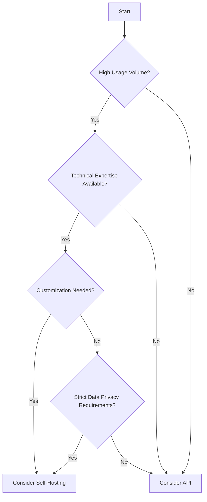

When implementing GenAI solutions, architectural decisions play a crucial role in balancing performance, cost, and scalability. This section explores key architectural considerations that can significantly impact the efficiency and effectiveness of your LLM deployments.

## 5.1 Model Selection and Trade-offs
Selecting the right model for your use case involves careful consideration of various factors. This process is crucial for balancing performance, cost, and complexity in your LLM applications.

## Key Considerations

1. **Accuracy vs. Cost**: Larger models often provide higher accuracy but at a greater cost. Determine the minimum accuracy required for your application and choose a model that meets this threshold without unnecessary overhead.

2. **Latency vs. Complexity**: More complex models may offer better results but can introduce higher latency. For real-time applications, faster, simpler models might be preferable.

3. **Generalization vs. Specialization**: While general-purpose models like GPT-3 offer versatility, specialized models fine-tuned for specific tasks can provide better performance in their domain.

## Decision-Making Process

To make informed decisions:

- Conduct thorough benchmarking of different models for your specific use cases.
- Consider a multi-model approach, using smaller models for simple tasks and reserving larger models for complex queries.
- Regularly reassess model performance as new models and versions become available.

## Model Comparison Table

| Model | Size | Cost | Typical Use Cases |
|-------|------|------|-------------------|
| GPT-3 | 175B | High | General-purpose text generation, complex reasoning |
| BERT  | 340M | Low  | Text classification, named entity recognition |
| T5    | 11B  | Medium | Text-to-text generation, summarization |

By carefully considering these factors and regularly evaluating your model choices, you can optimize the balance between performance and cost in your LLM applications.

## 5.2 Creating a Model Garden

A model garden is a curated collection of AI models that developers can access and use within an organization. This approach offers several benefits for managing and optimizing LLM usage.

## Benefits of a Model Garden

1. **Flexibility**: Developers can choose the most appropriate model for each task.
2. **Cost Optimization**: By providing access to a range of models, organizations can ensure that expensive, high-performance models are only used when necessary.
3. **Experimentation**: A model garden facilitates easy testing and comparison of different models.

## Implementing a Model Garden

1. **Model Selection**: Choose a diverse range of models that cover various use cases and performance levels.
2. **API Standardization**: Create a unified API interface for accessing different models.
3. **Documentation**: Provide clear documentation on each model's capabilities, use cases, and cost implications.
4. **Monitoring**: Implement usage tracking to understand which models are being used and for what purposes.

## Example: Simple Model Garden API

Here's a basic example of how you might structure a model garden API:

```python
class ModelGarden:
    def __init__(self):
        self.models = {
            "gpt-3": OpenAIModel("gpt-3"),
            "distilbert": HuggingFaceModel("distilbert-base-uncased"),
            "custom-fintuned": CustomModel("path/to/model")
        }

    def generate(self, model_name, prompt):
        if model_name not in self.models:
            raise ValueError(f"Model {model_name} not found in the garden")
        return self.models[model_name].generate(prompt)

# Usage
garden = ModelGarden()
response = garden.generate("distilbert", "Summarize this text:")
```

By implementing a model garden, organizations can provide their developers with a flexible, efficient, and cost-effective way to leverage various AI models in their applications.

## 5.3 Self-hosting vs. API Consumption

The decision between self-hosting LLMs and consuming them via APIs is crucial and depends on various factors. Each approach has its own set of advantages and challenges.
## Comparison

| Aspect | Self-Hosting | API Consumption |
|--------|--------------|-----------------|
| Control | Greater control over the model and infrastructure | Less control, dependent on provider |
| Cost | Potential for lower long-term costs for high-volume usage | Lower upfront costs, but potentially higher long-term costs |
| Privacy | Enhanced data privacy and security | Data leaves your environment |
| Expertise Required | Requires specialized expertise for deployment and maintenance | Minimal technical expertise required |
| Scalability | Less flexible in scaling | Easier scalability |
| Updates | Manual updates required | Regular updates handled by the provider |

## Decision Framework

Consider the following factors when deciding between self-hosting and API consumption:

1. **Usage Volume**: High-volume applications might benefit from self-hosting in the long run.
2. **Technical Expertise**: Consider your team's capability to manage self-hosted models.
3. **Customization Needs**: If extensive model customization is required, self-hosting might be preferable.
4. **Regulatory Requirements**: Some industries may require on-premises solutions for data privacy.
5. **Budget Structure**: Consider whether your organization prefers CapEx (self-hosting) or OpEx (API) models.

## Decision Tree



By carefully considering these factors and using this decision framework, organizations can make an informed choice between self-hosting LLMs and consuming them via APIs, optimizing for their specific needs and constraints.