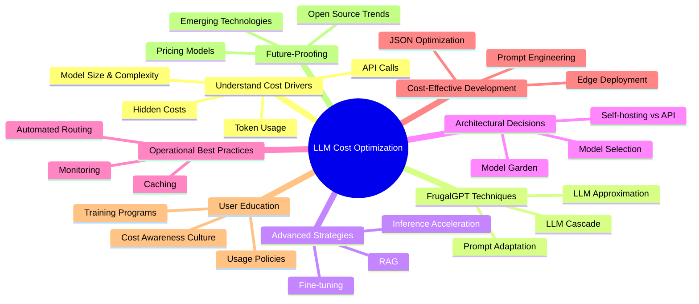

As we've explored throughout this comprehensive guide, optimizing LLM costs and improving GenAI performance is a multifaceted challenge that requires a strategic approach encompassing technical, operational, and organizational aspects.

## Key Takeaways

1. **Understand Your Cost Drivers**: Gain a deep understanding of what drives costs in your GenAI implementations, from model size and complexity to hidden costs like data preparation and integration.

2. **Leverage FrugalGPT Techniques**: Implement prompt adaptation, LLM approximation, and LLM cascade to achieve substantial cost savings without compromising performance.

3. **Embrace Advanced Strategies**: Explore fine-tuning, RAG, and inference acceleration to further enhance performance while managing costs.

4. **Make Informed Architectural Decisions**: Carefully consider model selection, the creation of a model garden, and the trade-offs between self-hosting and API consumption.

5. **Adopt Operational Best Practices**: Implement robust monitoring, effective caching strategies, and automated model selection to optimize ongoing operations.

6. **Foster Cost-Effective Development**: Train developers in efficient prompt engineering, JSON optimization, and edge deployment considerations.

7. **Prioritize User Education and Change Management**: Invest in training programs, implement clear usage policies, and foster a culture of cost awareness among GenAI users.

8. **Stay Informed About Future Trends**: Keep an eye on emerging technologies, evolving pricing models, and the changing landscape of open source and proprietary models.

## Final Thoughts

As the field of GenAI continues to evolve at a rapid pace, the strategies for cost optimization and performance improvement will undoubtedly evolve as well. Organizations that remain agile, continually reassess their approaches, and stay informed about the latest developments will be best positioned to harness the full potential of GenAI technologies while keeping costs under control.

Remember, the goal is not just to cut costs, but to optimize the balance between cost, performance, and accuracy. By taking a holistic approach to GenAI optimization, organizations can unlock tremendous value, drive innovation, and maintain a competitive edge in an AI-powered future.

By implementing the strategies and best practices outlined in this report, organizations can significantly reduce their GenAI-related expenses while maintaining or even improving the quality of their AI-powered solutions.