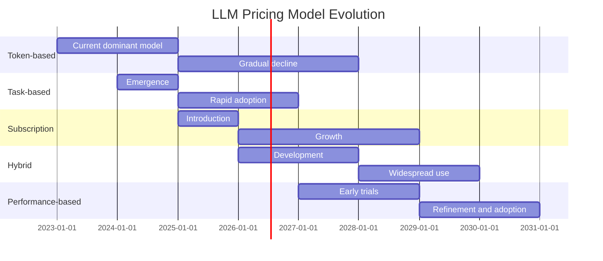

## 9.1 Emerging Technologies
Several cutting-edge technologies are poised to revolutionize LLM cost optimization:

## 1. Neural Architecture Search (NAS)

Automated discovery of optimal model architectures, potentially leading to more efficient models.

## 2. Sparse Transformer Models

These models activate only a small subset of the network for each input, potentially reducing computational costs.

## 3. In-context Learning

Enhancing models' ability to learn from a few examples within the prompt, reducing the need for fine-tuning.

## 4. Federated Learning

Enabling model training across decentralized devices, potentially reducing centralized computing costs.

## Example: Sparse Attention Mechanism

Here's a basic example of implementing a sparse attention mechanism:

```python
import torch
import torch.nn as nn

class SparseAttention(nn.Module):
    def __init__(self, dim, num_heads=8, sparsity=0.9):
        super().__init__()
        self.num_heads = num_heads
        self.sparsity = sparsity
        self.attention = nn.MultiheadAttention(dim, num_heads)

    def forward(self, query, key, value):
        attn_mask = torch.rand(query.size(0), key.size(0)) > self.sparsity
        attn_output, _ = self.attention(query, key, value, attn_mask=attn_mask)
        return attn_output

# Usage
sparse_attn = SparseAttention(dim=512)
output = sparse_attn(query, key, value)
```

By staying informed about these emerging technologies, organizations can position themselves to take advantage of new opportunities for cost optimization and performance improvement in their GenAI initiatives.
## 9.2 Pricing Model Evolution
The pricing models for LLM usage are likely to evolve, offering new opportunities for cost optimization.

## Emerging Pricing Models

1. **Task-based Pricing**: Charging based on the complexity of the task rather than just token count.

2. **Subscription Models**: Offering unlimited access to certain models for a fixed monthly fee.

3. **Hybrid Pricing**: Combining usage-based and subscription models for flexibility.

4. **Performance-based Pricing**: Tying costs to the quality or accuracy of model outputs.

## Projected Evolution of LLM Pricing Models



As pricing models evolve, organizations will need to stay informed and adapt their strategies to leverage the most cost-effective options for their specific use cases.
# 9.3 Open Source vs. Proprietary Models

The landscape of open source and proprietary models is continually shifting, offering new opportunities and challenges for cost optimization.

## Key Trends

1. **Emergence of High-quality Open Source Models**: Models like BLOOM and GPT-NeoX are narrowing the gap with proprietary models.

2. **Specialized Open Source Models**: Increasing availability of domain-specific open source models.

3. **Hybrid Approaches**: Combining open source base models with proprietary fine-tuning.

4. **Democratization of Model Training**: Tools making it easier for organizations to train their own models.

## Comparison of Open Source and Proprietary Models

| Aspect | Open Source | Proprietary |
|--------|-------------|-------------|
| Cost | Lower upfront, potentially higher operational | Higher upfront, predictable operational |
| Customization | High flexibility | Limited to vendor offerings |
| Support | Community-driven | Professional support available |
| Performance | Catching up rapidly | Currently leading in many benchmarks |
| Compliance | Full control and auditability | Dependent on vendor policies |

## Considerations for Choosing Between Open Source and Proprietary Models

1. **Budget constraints**: Open source models may be more suitable for organizations with limited budgets.
2. **Customization needs**: If extensive customization is required, open source models offer more flexibility.
3. **Support requirements**: Organizations needing professional support may prefer proprietary models.
4. **Performance demands**: For cutting-edge performance, proprietary models may still have an edge.
5. **Compliance and auditability**: Open source models offer more control for organizations with strict compliance requirements.

By understanding the evolving landscape of open source and proprietary models, organizations can make informed decisions that balance cost, performance, and specific requirements in their LLM implementations.