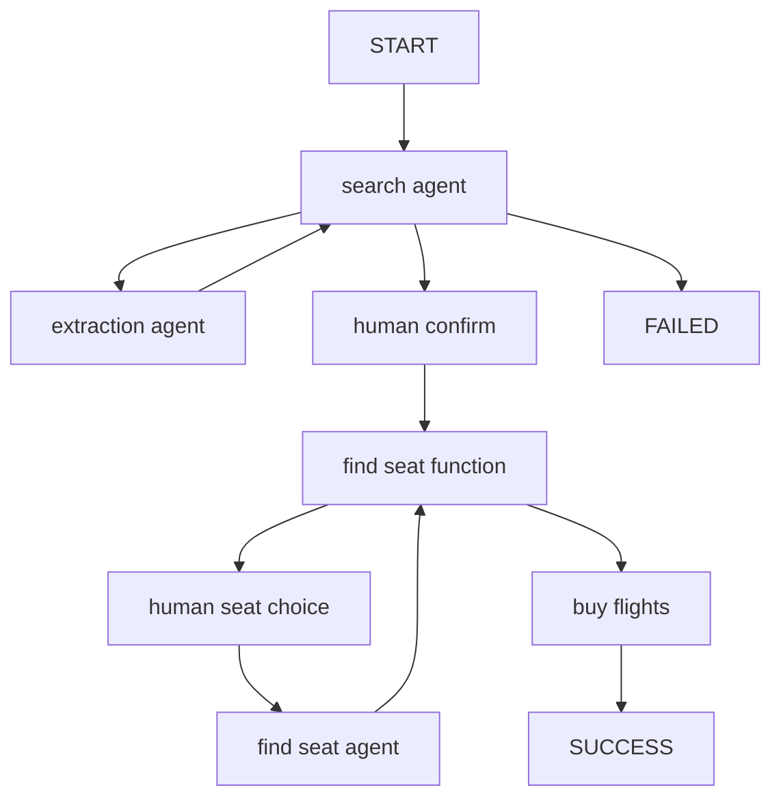

## Introduction

PydanticAI is a Python agent framework designed to make it less painful to build production-grade applications with Generative AI. It brings the same ergonomic design and developer experience to GenAI that FastAPI brought to web development.

Portkey enhances PydanticAI with production-readiness features, turning your experimental agents into robust systems by providing:

- **Complete observability** of every agent step, tool use, and interaction
- **Built-in reliability** with fallbacks, retries, and load balancing
- **Cost tracking and optimization** to manage your AI spend
- **Access to 200+ LLMs** through a single integration
- **Guardrails** to keep agent behavior safe and compliant
- **Version-controlled prompts** for consistent agent performance

<Card title="PydanticAI Official Documentation" icon="arrow-up-right-from-square" href="https://ai.pydantic.dev/">
  Learn more about PydanticAI's core concepts and features
</Card>

### Installation & Setup

<Steps>
<Step title="Install the required packages">
```bash
pip install -U pydantic-ai portkey-ai
```
</Step>

<Step title="Generate API Key" icon="lock">
Create a Portkey API key with optional budget/rate limits from the [Portkey dashboard](https://app.portkey.ai/). You can attach configurations for reliability, caching, and more to this key.
</Step>

<Step title="Configure Portkey Client">
For a simple setup, first configure the Portkey client that will be used with PydanticAI:

```python
from portkey_ai import AsyncPortkey

# Set up Portkey client with appropriate metadata for tracking
portkey_client = AsyncPortkey(
    api_key="YOUR_PORTKEY_API_KEY",
    provider="@YOUR_PROVIDER",
    trace_id="unique-trace-id",               # Optional, for request tracing
    metadata={                                # Optional, for request segmentation
        "app_env": "production",
        "_user": "user_123"                   # Special _user field for user analytics
    }
)
```
</Step>

<Step title="Connect to PydanticAI">
After setting up your Portkey client, you can integrate it with PydanticAI by connecting it to a model provider:

```python
from pydantic_ai import Agent
from pydantic_ai.models.openai import OpenAIModel
from pydantic_ai.providers.openai import OpenAIProvider

# Connect Portkey client to a PydanticAI model via provider
agent = Agent(
    model=OpenAIModel(
        model_name="gpt-4o",
        provider=OpenAIProvider(openai_client=portkey_client),
    ),
    system_prompt="You are a helpful assistant."
)
```
</Step>
</Steps>

## Basic Agent Implementation

Let's create a simple structured output agent with PydanticAI and Portkey. This agent will respond to a query about Formula 1 and return structured data:

```python
from portkey_ai import AsyncPortkey
from pydantic import BaseModel, Field
from pydantic_ai import Agent
from pydantic_ai.models.openai import OpenAIModel
from pydantic_ai.providers.openai import OpenAIProvider

# Set up Portkey client with tracing and metadata
portkey_client = AsyncPortkey(
    api_key="YOUR_PORTKEY_API_KEY",
    provider="@YOUR_OPENAI_PROVIDER",
    trace_id="f1-data-request",
    metadata={"app_env": "production", "_user": "user_123"}
)

# Define structured output using Pydantic
class F1GrandPrix(BaseModel):
    gp_name: str = Field(description="Grand Prix name, e.g. `Emilia Romagna Grand Prix`")
    year: int = Field(description="The year of the Grand Prix")
    constructor_winner: str = Field(description="The winning constructor of the Grand Prix")
    podium: list[str] = Field(description="Names of the podium drivers (1st, 2nd, 3rd)")

# Create the agent with structured output type
f1_gp_agent = Agent[None, F1GrandPrix](
    model=OpenAIModel(
        model_name="gpt-4o",
        provider=OpenAIProvider(openai_client=portkey_client),
    ),
    output_type=F1GrandPrix,
    system_prompt="Assist the user by providing data about the specified Formula 1 Grand Prix"
)

# Run the agent
async def main():
    result = await f1_gp_agent.run("Las Vegas 2023")
    print(result.output)

if __name__ == "__main__":
    import asyncio
    asyncio.run(main())
```

The output will be a structured `F1GrandPrix` object with all fields properly typed and validated:

```json
gp_name='Las Vegas Grand Prix'
year=2023
constructor_winner='Red Bull Racing'
podium=['Max Verstappen', 'Charles Leclerc', 'Sergio Pérez']
```

You can also use the synchronous API if preferred:

```python
result = f1_gp_agent.run_sync("Las Vegas 2023")
print(result.output)
```

## Advanced Features

### Working with Images

PydanticAI supports multimodal inputs including images. Here's how to use Portkey with a vision model:

```python
from portkey_ai import AsyncPortkey
from pydantic_ai import Agent, ImageUrl
from pydantic_ai.models.openai import OpenAIModel
from pydantic_ai.providers.openai import OpenAIProvider

# Set up Portkey client
portkey_client = AsyncPortkey(
    api_key="YOUR_PORTKEY_API_KEY",
    provider="@YOUR_OPENAI_PROVIDER",
    trace_id="vision-request",
    metadata={"request_type": "image_analysis"}
)

# Create a vision-capable agent
vision_agent = Agent(
    model=OpenAIModel(
        model_name="gpt-4o",  # Vision-capable model
        provider=OpenAIProvider(openai_client=portkey_client),
    ),
    system_prompt="Analyze images and provide detailed descriptions."
)

# Process an image
result = vision_agent.run_sync([
    'What company is this logo from?',
    ImageUrl(url='https://iili.io/3Hs4FMg.png'),
])
print(result.output)
```

Visit your Portkey dashboard to see detailed logs of this image analysis request, including token usage and costs.

### Tools and Tool Calls

PydanticAI provides a powerful tools system that integrates seamlessly with Portkey. Here's how to create an agent with tools:

```python
import random
from portkey_ai import AsyncPortkey
from pydantic_ai import Agent, RunContext
from pydantic_ai.models.openai import OpenAIModel
from pydantic_ai.providers.openai import OpenAIProvider

# Set up Portkey client
portkey_client = AsyncPortkey(
    api_key="YOUR_PORTKEY_API_KEY",
    provider="@YOUR_OPENAI_PROVIDER",
    trace_id="dice-game-session",
    metadata={"game_type": "dice"}
)

# Create an agent with dependency injection (player name)
dice_agent = Agent(
    model=OpenAIModel(
        model_name="gpt-4o",
        provider=OpenAIProvider(openai_client=portkey_client),
    ),
    deps_type=str,  # Dependency type (player name as string)
    system_prompt=(
        "You're a dice game host. Roll the die and see if it matches "
        "the user's guess. If so, tell them they're a winner. "
        "Use the player's name in your response."
    ),
)

# Define a plain tool (no context needed)
@dice_agent.tool_plain
def roll_die() -> str:
    """Roll a six-sided die and return the result."""
    return str(random.randint(1, 6))

# Define a tool that uses the dependency
@dice_agent.tool
def get_player_name(ctx: RunContext[str]) -> str:
    """Get the player's name."""
    return ctx.deps

# Run the agent
dice_result = dice_agent.run_sync('My guess is 4', deps='Anne')
print(dice_result.output)
```

<Info>
Portkey logs each tool call separately, allowing you to analyze the full execution path of your agent, including both LLM calls and tool invocations.
</Info>

### Multi-agent Applications

PydanticAI excels at creating multi-agent systems where agents can call each other. Here's how to integrate Portkey with a multi-agent setup:

This multi-agent system uses three specialized agents:
`search_agent` - Orchestrates the flow and validates flight selections
`extraction_agent` - Extracts structured flight data from raw text
`seat_preference_agent` - Interprets user's seat preferences

With Portkey integration, you get:

- Unified tracing across all three agents
- Token and cost tracking for the entire workflow
- Ability to set usage limits across the entire system
- Observability of both AI and human interaction points

Here's a diagram of how these agents interact:




```python [expandable]
import datetime
from dataclasses import dataclass
from typing import Literal

from pydantic import BaseModel, Field
from rich.prompt import Prompt

from pydantic_ai import Agent, ModelRetry, RunContext
from pydantic_ai.messages import ModelMessage
from pydantic_ai.usage import Usage, UsageLimits
from portkey_ai import AsyncPortkey

# Set up Portkey clients with shared trace ID for connected tracing
portkey_client = AsyncPortkey(
    api_key="YOUR_PORTKEY_API_KEY",
    provider="@YOUR_OPENAI_PROVIDER",
    trace_id="flight-booking-session",
    metadata={"app_type": "flight_booking"}
)

# Define structured output types
class FlightDetails(BaseModel):
    """Details of the most suitable flight."""
    flight_number: str
    price: int
    origin: str = Field(description='Three-letter airport code')
    destination: str = Field(description='Three-letter airport code')
    date: datetime.date

class NoFlightFound(BaseModel):
    """When no valid flight is found."""

class SeatPreference(BaseModel):
    row: int = Field(ge=1, le=30)
    seat: Literal['A', 'B', 'C', 'D', 'E', 'F']

class Failed(BaseModel):
    """Unable to extract a seat selection."""

# Dependencies for flight search
@dataclass
class Deps:
    web_page_text: str
    req_origin: str
    req_destination: str
    req_date: datetime.date

# This agent is responsible for controlling the flow of the conversation
from pydantic_ai.models.openai import OpenAIModel
from pydantic_ai.providers.openai import OpenAIProvider

search_agent = Agent[Deps, FlightDetails | NoFlightFound](
    model=OpenAIModel(
        model_name="gpt-4o",
        provider=OpenAIProvider(openai_client=portkey_client),
    ),
    output_type=FlightDetails | NoFlightFound,  # type: ignore
    retries=4,
    system_prompt=(
        'Your job is to find the cheapest flight for the user on the given date. '
    ),
    instrument=True,  # Enable instrumentation for better tracing
)

# This agent is responsible for extracting flight details from web page text
extraction_agent = Agent(
    model=OpenAIModel(
        model_name="gpt-4o",
        provider=OpenAIProvider(openai_client=portkey_client),
    ),
    output_type=list[FlightDetails],
    system_prompt='Extract all the flight details from the given text.',
)

# This agent is responsible for extracting the user's seat selection
seat_preference_agent = Agent[None, SeatPreference | Failed](
    model=OpenAIModel(
        model_name="gpt-4o",
        provider=OpenAIProvider(openai_client=portkey_client),
    ),
    output_type=SeatPreference | Failed,  # type: ignore
    system_prompt=(
        "Extract the user's seat preference. "
        'Seats A and F are window seats. '
        'Row 1 is the front row and has extra leg room. '
        'Rows 14, and 20 also have extra leg room. '
    ),
)

@search_agent.tool
async def extract_flights(ctx: RunContext[Deps]) -> list[FlightDetails]:
    """Get details of all flights."""
    # Pass the usage to track nested agent calls
    result = await extraction_agent.run(ctx.deps.web_page_text, usage=ctx.usage)
    return result.output

@search_agent.output_validator
async def validate_output(
    ctx: RunContext[Deps], output: FlightDetails | NoFlightFound
) -> FlightDetails | NoFlightFound:
    """Procedural validation that the flight meets the constraints."""
    if isinstance(output, NoFlightFound):
        return output

    errors: list[str] = []
    if output.origin != ctx.deps.req_origin:
        errors.append(
            f'Flight should have origin {ctx.deps.req_origin}, not {output.origin}'
        )
    if output.destination != ctx.deps.req_destination:
        errors.append(
            f'Flight should have destination {ctx.deps.req_destination}, not {output.destination}'
        )
    if output.date != ctx.deps.req_date:
        errors.append(f'Flight should be on {ctx.deps.req_date}, not {output.date}')

    if errors:
        raise ModelRetry('\n'.join(errors))
    else:
        return output

# Sample flight data (in a real application, this would be from a web scraper)
flights_web_page = """
1. Flight SFO-AK123
- Price: $350
- Origin: San Francisco International Airport (SFO)
- Destination: Ted Stevens Anchorage International Airport (ANC)
- Date: January 10, 2025

2. Flight SFO-AK456
- Price: $370
- Origin: San Francisco International Airport (SFO)
- Destination: Fairbanks International Airport (FAI)
- Date: January 10, 2025

... more flights ...
"""

# Main application flow
async def main():
    # Restrict how many requests this app can make to the LLM
    usage_limits = UsageLimits(request_limit=15)

    deps = Deps(
        web_page_text=flights_web_page,
        req_origin='SFO',
        req_destination='ANC',
        req_date=datetime.date(2025, 1, 10),
    )
    message_history: list[ModelMessage] | None = None
    usage: Usage = Usage()

    # Run the agent until a satisfactory flight is found
    while True:
        result = await search_agent.run(
            f'Find me a flight from {deps.req_origin} to {deps.req_destination} on {deps.req_date}',
            deps=deps,
            usage=usage,
            message_history=message_history,
            usage_limits=usage_limits,
        )
        if isinstance(result.output, NoFlightFound):
            print('No flight found')
            break
        else:
            flight = result.output
            print(f'Flight found: {flight}')
            answer = Prompt.ask(
                'Do you want to buy this flight, or keep searching? (buy/*search)',
                choices=['buy', 'search', ''],
                show_choices=False,
            )
            if answer == 'buy':
                seat = await find_seat(usage, usage_limits)
                await buy_tickets(flight, seat)
                break
            else:
                message_history = result.all_messages(
                    output_tool_return_content='Please suggest another flight'
                )

async def find_seat(usage: Usage, usage_limits: UsageLimits) -> SeatPreference:
    message_history: list[ModelMessage] | None = None
    while True:
        answer = Prompt.ask('What seat would you like?')
        result = await seat_preference_agent.run(
            answer,
            message_history=message_history,
            usage=usage,
            usage_limits=usage_limits,
        )
        if isinstance(result.output, SeatPreference):
            return result.output
        else:
            print('Could not understand seat preference. Please try again.')
            message_history = result.all_messages()

async def buy_tickets(flight_details: FlightDetails, seat: SeatPreference):
    print(f'Purchasing flight {flight_details=!r} {seat=!r}...')
```

Portkey preserves all the type safety of PydanticAI while adding production monitoring and reliability.

## Production Features

### 1. Enhanced Observability

Portkey provides comprehensive observability for your PydanticAI agents, helping you understand exactly what's happening during each execution.

<Tabs>
  <Tab title="Traces">
<Frame>
    
</Frame>

Traces provide a hierarchical view of your agent's execution, showing the sequence of LLM calls, tool invocations, and state transitions.

```python
# Add trace_id to enable hierarchical tracing in Portkey
portkey_client = AsyncPortkey(
    api_key="YOUR_PORTKEY_API_KEY",
    provider="@YOUR_LLM_PROVIDER",
    trace_id="unique-session-id",  # Add unique trace ID
    metadata={"request_type": "user_query"}
)
```
  </Tab>

  <Tab title="Logs">
<Frame>
    
</Frame>

Portkey logs every interaction with LLMs, including:

- Complete request and response payloads
- Latency and token usage metrics
- Cost calculations
- Tool calls and function executions

All logs can be filtered by metadata, trace IDs, models, and more, making it easy to debug specific agent runs.
  </Tab>

  <Tab title="Metrics & Dashboards">
<Frame>
    
</Frame>

Portkey provides built-in dashboards that help you:

- Track cost and token usage across all agent runs
- Analyze performance metrics like latency and success rates
- Identify bottlenecks in your agent workflows
- Compare different agent configurations and LLMs

You can filter and segment all metrics by custom metadata to analyze specific agent types, user groups, or use cases.
  </Tab>

  <Tab title="Metadata Filtering">
<Frame>
  
</Frame>

Add custom metadata to your PydanticAI agent calls to enable powerful filtering and segmentation:

```python
portkey_client = AsyncPortkey(
    api_key="YOUR_PORTKEY_API_KEY",
    provider="@YOUR_LLM_PROVIDER",
    metadata={
        "agent_type": "weather_agent",
        "environment": "production",
        "_user": "user_123",   # Special _user field for user analytics
        "request_source": "mobile_app"
    }
)
```

This metadata can be used to filter logs, traces, and metrics on the Portkey dashboard, allowing you to analyze specific agent runs, users, or environments.
  </Tab>
</Tabs>

### 2. Reliability - Keep Your Agents Running Smoothly

When running agents in production, things can go wrong - API rate limits, network issues, or provider outages. Portkey's reliability features ensure your agents keep running smoothly even when problems occur.

It's simple to enable fallback in your PydanticAI agents by using a Portkey Config:

```python
from portkey_ai import AsyncPortkey

# Create Portkey client with fallback config
portkey_client = AsyncPortkey(
    api_key="YOUR_PORTKEY_API_KEY",
    config={
        "strategy": {
            "mode": "fallback"
        },
        "targets": [
            {
                "provider": "openai",
                "api_key": "YOUR_OPENAI_API_KEY",
                "override_params": {"model": "gpt-4o"}
            },
            {
                "provider": "anthropic",
                "api_key": "YOUR_ANTHROPIC_API_KEY",
                "override_params": {"model": "claude-3-opus-20240229"}
            }
        ]
    }
)
```

This configuration will automatically try Claude if the GPT-4o request fails, ensuring your agent can continue operating.

<CardGroup cols="2">
  <Card title="Automatic Retries" icon="rotate" href="../../product/ai-gateway/automatic-retries">
    Handles temporary failures automatically. If an LLM call fails, Portkey will retry the same request for the specified number of times - perfect for rate limits or network blips.
  </Card>
  <Card title="Request Timeouts" icon="clock" href="../../product/ai-gateway/request-timeouts">
    Prevent your agents from hanging. Set timeouts to ensure you get responses (or can fail gracefully) within your required timeframes.
  </Card>
  <Card title="Conditional Routing" icon="route" href="../../product/ai-gateway/conditional-routing">
    Send different requests to different providers. Route complex reasoning to GPT-4, creative tasks to Claude, and quick responses to Gemini based on your needs.
  </Card>
  <Card title="Fallbacks" icon="shield" href="../../product/ai-gateway/fallbacks">
    Keep running even if your primary provider fails. Automatically switch to backup providers to maintain availability.
  </Card>
  <Card title="Load Balancing" icon="scale-balanced" href="../../product/ai-gateway/load-balancing">
    Spread requests across multiple API keys or providers. Great for high-volume agent operations and staying within rate limits.
  </Card>
</CardGroup>

### 3. Prompting in PydanticAI

Portkey's Prompt Engineering Studio helps you create, manage, and optimize the prompts used in your PydanticAI agents. Instead of hardcoding prompts or instructions, use Portkey's prompt rendering API to dynamically fetch and apply your versioned prompts.

<Frame caption="Manage prompts in Portkey's Prompt Library">

</Frame>

<Tabs>
  <Tab title="Prompt Playground">
Prompt Playground is a place to compare, test and deploy perfect prompts for your AI application. It's where you experiment with different models, test variables, compare outputs, and refine your prompt engineering strategy before deploying to production. It allows you to:

1. Iteratively develop prompts before using them in your agents
2. Test prompts with different variables and models
3. Compare outputs between different prompt versions
4. Collaborate with team members on prompt development

This visual environment makes it easier to craft effective prompts for each step in your PydanticAI agent's workflow.
  </Tab>

  <Tab title="Using Prompt Templates">
The Prompt Render API retrieves your prompt templates with all parameters configured:

```python
from portkey_ai import Portkey, AsyncPortkey
from pydantic_ai import Agent
from pydantic_ai.models.openai import OpenAIModel
from pydantic_ai.providers.openai import OpenAIProvider

# Initialize Portkey clients
portkey_admin = Portkey(api_key="YOUR_PORTKEY_API_KEY")
portkey_client = AsyncPortkey(api_key="YOUR_PORTKEY_API_KEY", provider="@YOUR_OPENAI_PROVIDER")

# Retrieve prompt using the render API
prompt_data = portkey_admin.prompts.render(
    prompt_id="YOUR_PROMPT_ID",
    variables={
        "user_input": "Tell me about artificial intelligence"
    }
)

# Use the rendered prompt in your PydanticAI agent
agent = Agent(
    model=OpenAIModel(
        model_name="gpt-4o",
        provider=OpenAIProvider(openai_client=portkey_client),
    ),
    system_prompt=prompt_data.data.messages[0]["content"]  # Use the rendered prompt
)

result = agent.run_sync("Tell me about artificial intelligence")
print(result.output)
```
  </Tab>

  <Tab title="Prompt Versioning">
You can:
- Create multiple versions of the same prompt
- Compare performance between versions
- Roll back to previous versions if needed
- Specify which version to use in your code:

```python
# Use a specific prompt version
prompt_data = portkey_admin.prompts.render(
    prompt_id="YOUR_PROMPT_ID@version_number",
    variables={
        "user_input": "Tell me about quantum computing"
    }
)
```
  </Tab>

  <Tab title="Mustache Templating for variables">
Portkey prompts use Mustache-style templating for easy variable substitution:

```
You are an AI assistant helping with {{task_type}}.

User question: {{user_input}}

Please respond in a {{tone}} tone and include {{required_elements}}.
```

When rendering, simply pass the variables:

```python
prompt_data = portkey_admin.prompts.render(
    prompt_id="YOUR_PROMPT_ID",
    variables={
        "task_type": "research",
        "user_input": "Tell me about quantum computing",
        "tone": "professional",
        "required_elements": "recent academic references"
    }
)
```
  </Tab>
</Tabs>

<Card title="Prompt Engineering Studio" icon="wand-magic-sparkles" href="/product/prompt-library">
  Learn more about Portkey's prompt management features
</Card>

### 4. Guardrails for Safe Agents

Guardrails ensure your PydanticAI agents operate safely and respond appropriately in all situations.

**Why Use Guardrails?**

PydanticAI agents can experience various failure modes:
- Generating harmful or inappropriate content
- Leaking sensitive information like PII
- Hallucinating incorrect information
- Generating outputs in incorrect formats

While PydanticAI provides type safety for outputs, Portkey's guardrails add additional protections for both inputs and outputs.

**Implementing Guardrails**

```python
from portkey_ai import AsyncPortkey
from pydantic_ai import Agent
from pydantic_ai.models.openai import OpenAIModel
from pydantic_ai.providers.openai import OpenAIProvider

# Create Portkey client with guardrails
portkey_client = AsyncPortkey(
    api_key="YOUR_PORTKEY_API_KEY",
    provider="@YOUR_OPENAI_PROVIDER",
    config={
        "input_guardrails": ["guardrails-id-xxx", "guardrails-id-yyy"],
        "output_guardrails": ["guardrails-id-zzz"]
    }
)

# Create agent with Portkey-enabled client
agent = Agent(
    model=OpenAIModel(
        model_name="gpt-4o",
        provider=OpenAIProvider(openai_client=portkey_client),
    ),
    system_prompt="You are a helpful assistant."
)
```

Portkey's guardrails can:
- Detect and redact PII in both inputs and outputs
- Filter harmful or inappropriate content
- Validate response formats against schemas
- Check for hallucinations against ground truth
- Apply custom business logic and rules

<Card title="Learn More About Guardrails" icon="shield-check" href="/product/guardrails">
  Explore Portkey's guardrail features to enhance agent safety
</Card>

### 5. User Tracking with Metadata

Track individual users through your PydanticAI agents using Portkey's metadata system.

**What is Metadata in Portkey?**

Metadata allows you to associate custom data with each request, enabling filtering, segmentation, and analytics. The special `_user` field is specifically designed for user tracking.

```python
from portkey_ai import AsyncPortkey
from pydantic_ai import Agent
from pydantic_ai.models.openai import OpenAIModel
from pydantic_ai.providers.openai import OpenAIProvider

# Configure client with user tracking
portkey_client = AsyncPortkey(
    api_key="YOUR_PORTKEY_API_KEY",
    provider="@YOUR_OPENAI_PROVIDER",
    metadata={
        "_user": "user_123",  # Special _user field for user analytics
        "user_tier": "premium",
        "user_company": "Acme Corp",
        "session_id": "abc-123"
    }
)

# Create agent with Portkey client
agent = Agent(
    model=OpenAIModel(
        model_name="gpt-4o",
        provider=OpenAIProvider(openai_client=portkey_client),
    ),
    system_prompt="You are a helpful assistant."
)
```

**Filter Analytics by User**

With metadata in place, you can filter analytics by user and analyze performance metrics on a per-user basis:

<Frame caption="Filter analytics by user">
  
</Frame>

This enables:
- Per-user cost tracking and budgeting
- Personalized user analytics
- Team or organization-level metrics
- Environment-specific monitoring (staging vs. production)

<Card title="Learn More About Metadata" icon="tags" href="/product/observability/metadata">
  Explore how to use custom metadata to enhance your analytics
</Card>

### 6. Caching for Efficient Agents

Implement caching to make your PydanticAI agents more efficient and cost-effective:

<Tabs>
  <Tab title="Simple Caching">
```python
from portkey_ai import AsyncPortkey
from pydantic_ai import Agent
from pydantic_ai.models.openai import OpenAIModel
from pydantic_ai.providers.openai import OpenAIProvider

# Configure Portkey client with simple caching
portkey_client = AsyncPortkey(
    api_key="YOUR_PORTKEY_API_KEY",
    provider="@YOUR_OPENAI_PROVIDER",
    config={
        "cache": {
            "mode": "simple"
        }
    }
)

# Create agent with cached LLM calls
agent = Agent(
    model=OpenAIModel(
        model_name="gpt-4o",
        provider=OpenAIProvider(openai_client=portkey_client),
    ),
    system_prompt="You are a helpful assistant."
)
```

Simple caching performs exact matches on input prompts, caching identical requests to avoid redundant model executions.
  </Tab>

  <Tab title="Semantic Caching">
```python
from portkey_ai import AsyncPortkey
from pydantic_ai import Agent
from pydantic_ai.models.openai import OpenAIModel
from pydantic_ai.providers.openai import OpenAIProvider

# Configure Portkey client with semantic caching
portkey_client = AsyncPortkey(
    api_key="YOUR_PORTKEY_API_KEY",
    provider="@YOUR_OPENAI_PROVIDER",
    config={
        "cache": {
            "mode": "semantic"
        }
    }
)

# Create agent with semantically cached LLM calls
agent = Agent(
    model=OpenAIModel(
        model_name="gpt-4o",
        provider=OpenAIProvider(openai_client=portkey_client),
    ),
    system_prompt="You are a helpful assistant."
)
```

Semantic caching considers the contextual similarity between input requests, caching responses for semantically similar inputs.
  </Tab>
</Tabs>

### 7. Model Interoperability

PydanticAI supports multiple LLM providers, and Portkey extends this capability by providing access to over 200 LLMs through a unified interface. You can easily switch between different models without changing your core agent logic:

```python
from portkey_ai import AsyncPortkey
from pydantic_ai import Agent
from pydantic_ai.models.openai import OpenAIModel
from pydantic_ai.providers.openai import OpenAIProvider

# OpenAI with Portkey
portkey_openai = AsyncPortkey(
    api_key="YOUR_PORTKEY_API_KEY",
    provider="@YOUR_OPENAI_PROVIDER"
)

# Anthropic with Portkey
portkey_anthropic = AsyncPortkey(
    api_key="YOUR_PORTKEY_API_KEY",
    provider="@YOUR_ANTHROPIC_PROVIDER"
)

# Create agents with different models
openai_agent = Agent(
    model=OpenAIModel(
        model_name="gpt-4o",
        provider=OpenAIProvider(openai_client=portkey_openai),
    ),
    system_prompt="You are a helpful assistant."
)

anthropic_agent = Agent(
    model=OpenAIModel(
        model_name="claude-3-opus-20240229",
        provider=OpenAIProvider(anthropic_client=portkey_anthropic),
    ),
    system_prompt="You are a helpful assistant."
)

# Choose which agent to use based on your needs
active_agent = openai_agent  # or anthropic_agent

result = active_agent.run_sync("Tell me about quantum computing.")
print(result.output)
```

Portkey provides access to LLMs from providers including:

- OpenAI (GPT-4o, GPT-4 Turbo, etc.)
- Anthropic (Claude 3.5 Sonnet, Claude 3 Opus, etc.)
- Mistral AI (Mistral Large, Mistral Medium, etc.)
- Google Vertex AI (Gemini 1.5 Pro, etc.)
- Cohere (Command, Command-R, etc.)
- AWS Bedrock (Claude, Titan, etc.)
- Local/Private Models

<Card title="Supported Providers" icon="server" href="/integrations/llms">
  See the full list of LLM providers supported by Portkey
</Card>

## Set Up Enterprise Governance for PydanticAI

**Why Enterprise Governance?**
If you are using PydanticAI inside your organization, you need to consider several governance aspects:
- **Cost Management**: Controlling and tracking AI spending across teams
- **Access Control**: Managing which teams can use specific models
- **Usage Analytics**: Understanding how AI is being used across the organization
- **Security & Compliance**: Maintaining enterprise security standards
- **Reliability**: Ensuring consistent service across all users

Portkey adds a comprehensive governance layer to address these enterprise needs. Let's implement these controls step by step.

<Steps>
<Step title="Create Virtual Key">
Virtual Keys are Portkey's secure way to manage your LLM provider API keys. They provide essential controls like:
- Budget limits for API usage
- Rate limiting capabilities
- Secure API key storage

To create a virtual key:
Go to [Virtual Keys](https://app.portkey.ai/virtual-keys) in the Portkey App. Save and copy the virtual key ID

<Frame>

</Frame>

<Note>
Save your virtual key ID - you'll need it for the next step.
</Note>
</Step>

<Step title="Create Default Config">
Configs in Portkey define how your requests are routed, with features like advanced routing, fallbacks, and retries.

To create your config:
1. Go to [Configs](https://app.portkey.ai/configs) in Portkey dashboard
2. Create new config with:
    ```json
    {
        "provider":"@YOUR_PROVIDER_FROM_STEP1",
       	"override_params": {
          "model": "gpt-4o" // Your preferred model name
        }
    }
    ```
3. Save and note the Config name for the next step

<Frame>

</Frame>
</Step>

<Step title="Configure Portkey API Key">
Now create a Portkey API key and attach the config you created in Step 2:

1. Go to [API Keys](https://app.portkey.ai/api-keys) in Portkey and Create new API key
2. Select your config from `Step 2`
3. Generate and save your API key

<Frame>

</Frame>
</Step>

<Step title="Connect to PydanticAI">
After setting up your Portkey API key with the attached config, connect it to your PydanticAI agents:

```python
from portkey_ai import AsyncPortkey
from pydantic_ai import Agent
from pydantic_ai.models.openai import OpenAIModel
from pydantic_ai.providers.openai import OpenAIProvider

# Configure Portkey client with your API key
portkey_client = AsyncPortkey(
    api_key="YOUR_PORTKEY_API_KEY"  # The API key with attached config from step 3
)

# Create agent with Portkey client
agent = Agent(
    model=OpenAIModel(
        model_name="gpt-4o",
        provider=OpenAIProvider(openai_client=portkey_client),
    ),
    system_prompt="You are a helpful assistant."
)
```
</Step>
</Steps>

<AccordionGroup>
  <Accordion title="Step 1: Implement Budget Controls & Rate Limits">
### Step 1: Implement Budget Controls & Rate Limits

Virtual Keys enable granular control over LLM access at the team/department level. This helps you:
- Set up [budget limits](/product/ai-gateway/virtual-keys/budget-limits)
- Prevent unexpected usage spikes using Rate limits
- Track departmental spending

#### Setting Up Department-Specific Controls:
1. Navigate to [Virtual Keys](https://app.portkey.ai/virtual-keys) in Portkey dashboard
2. Create new Virtual Key for each department with budget limits and rate limits
3. Configure department-specific limits

<Frame>

</Frame>
  </Accordion>

  <Accordion title="Step 2: Define Model Access Rules">
### Step 2: Define Model Access Rules

As your AI usage scales, controlling which teams can access specific models becomes crucial. Portkey Configs provide this control layer with features like:

#### Access Control Features:
- **Model Restrictions**: Limit access to specific models
- **Data Protection**: Implement guardrails for sensitive data
- **Reliability Controls**: Add fallbacks and retry logic

#### Example Configuration:
Here's a basic configuration to route requests to OpenAI, specifically using GPT-4o:

```json
{
	"strategy": {
		"mode": "single"
	},
	"targets": [
		{
			"provider":"@YOUR_OPENAI_PROVIDER",
			"override_params": {
				"model": "gpt-4o"
			}
		}
	]
}
```

  Create your config on the [Configs page](https://app.portkey.ai/configs) in your Portkey dashboard.

    <Note>
    Configs can be updated anytime to adjust controls without affecting running applications.
    </Note>
  </Accordion>

  <Accordion title="Step 3: Implement Access Controls">
    ### Step 3: Implement Access Controls

    Create User-specific API keys that automatically:
    - Track usage per user/team with the help of metadata
    - Apply appropriate configs to route requests
    - Collect relevant metadata to filter logs
    - Enforce access permissions

    Create API keys through:
    - [Portkey App](https://app.portkey.ai/)
    - [API Key Management API](/api-reference/admin-api/control-plane/api-keys/create-api-key)

    Example using Python SDK:
    ```python
    from portkey_ai import Portkey

    portkey = Portkey(api_key="YOUR_ADMIN_API_KEY")

    api_key = portkey.api_keys.create(
        name="engineering-team",
        type="organisation",
        workspace_id="YOUR_WORKSPACE_ID",
        defaults={
            "config_id": "your-config-id",
            "metadata": {
                "environment": "production",
                "department": "engineering"
            }
        },
        scopes=["logs.view", "configs.read"]
    )
    ```

    For detailed key management instructions, see our [API Keys documentation](/api-reference/admin-api/control-plane/api-keys/create-api-key).
  </Accordion>

  <Accordion title="Step 4: Deploy & Monitor">
    ### Step 4: Deploy & Monitor
    After distributing API keys to your team members, your enterprise-ready PydanticAI setup is ready to go. Each team member can now use their designated API keys with appropriate access levels and budget controls.

    Monitor usage in Portkey dashboard:
    - Cost tracking by department
    - Model usage patterns
    - Request volumes
    - Error rates
  </Accordion>

</AccordionGroup>

<Note>
### Enterprise Features Now Available
**Your PydanticAI integration now has:**
- Departmental budget controls
- Model access governance
- Usage tracking & attribution
- Security guardrails
- Reliability features
</Note>

## Frequently Asked Questions

<AccordionGroup>
  <Accordion title="How does Portkey enhance PydanticAI?">
    Portkey adds production-readiness to PydanticAI through comprehensive observability (traces, logs, metrics), reliability features (fallbacks, retries, caching), and access to 200+ LLMs through a unified interface. This makes it easier to debug, optimize, and scale your agent applications, all while preserving PydanticAI's strong type safety.
  </Accordion>

  <Accordion title="Can I use Portkey with existing PydanticAI applications?">
    Yes! Portkey integrates seamlessly with existing PydanticAI applications. You just need to replace your client initialization code with the Portkey-enabled version. The rest of your agent code remains unchanged and continues to benefit from PydanticAI's strong typing.
  </Accordion>

  <Accordion title="Does Portkey work with all PydanticAI features?">
    Portkey supports all PydanticAI features, including structured outputs, tool use, multi-agent systems, and more. It adds observability and reliability without limiting any of the framework's functionality.
  </Accordion>

  <Accordion title="Can I track usage across multiple agents in a workflow?">
    Yes, Portkey allows you to use a consistent `trace_id` across multiple agents and requests to track the entire workflow. This is especially useful for multi-agent systems where you want to understand the full execution path.
  </Accordion>

  <Accordion title="How do I filter logs and traces for specific agent runs?">
    Portkey allows you to add custom metadata to your agent runs, which you can then use for filtering. Add fields like `agent_name`, `agent_type`, or `session_id` to easily find and analyze specific agent executions.
  </Accordion>

  <Accordion title="Can I use my own API keys with Portkey?">
    Yes! Portkey uses your own API keys for the various LLM providers. It securely stores them, allowing you to easily manage and rotate keys without changing your code.
  </Accordion>

</AccordionGroup>

## Resources

<CardGroup cols="3">
  <Card title="PydanticAI Docs" icon="book" href="https://ai.pydantic.dev/">
    <p>Official PydanticAI documentation</p>
  </Card>

  <Card title="Portkey Docs" icon="book" href="https://portkey.ai/docs">
    <p>Official Portkey documentation</p>
  </Card>

  <Card title="Book a Demo" icon="calendar" href="https://calendly.com/portkey-ai">
    <p>Get personalized guidance on implementing this integration</p>
  </Card>
</CardGroup>
