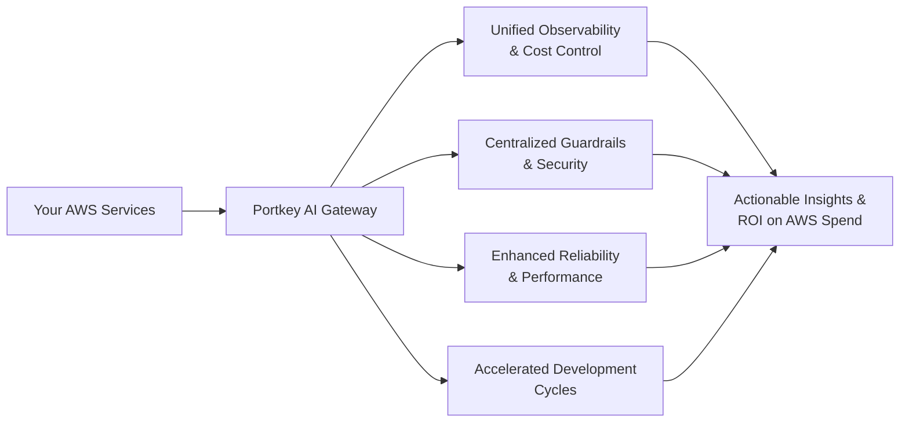

> Unlock enterprise-grade AI orchestration for your AWS Bedrock models with Portkey

## What is Portkey for AWS Bedrock?

Portkey is an **AI Gateway and Observability Platform** that sits between your applications and AWS Bedrock models, providing enterprise-grade controls, monitoring, and optimization. As a unified management layer, Portkey handles authentication, routing, caching, failover, governance, and comprehensive analytics for all your AWS Bedrock AI operations.

Our platform empowers organizations to transform their AWS Bedrock infrastructure into a complete enterprise AI platform with full visibility and control. Companies building on AWS Bedrock achieve **85% faster development cycles**, **significant cost reduction**, and **enhanced governance** while maintaining the security and compliance controls your enterprise demands.

**Enterprise advantages with Portkey + AWS Bedrock:**

* Secure, air-gapped deployment options within your AWS environment
* Comprehensive cost attribution and optimization for your Bedrock spend
* Enterprise-grade controls: SSO, SCIM, and role-based access
* Unified API gateway with observability across all Bedrock models
* Seamless IAM role assumption for secure access management

<Card title="Ready to maximize your AWS Bedrock investment?" href="https://portkey.sh/aws">Schedule a 1:1 architecture review</Card>

## Enterprise-Ready AWS Bedrock Integration

<CardGroup cols={3}>
  <Card title="AWS Marketplace Deployment" icon="aws" href="https://aws.amazon.com/marketplace/pp/prodview-o2leb4xcrkdqa?sr=0-1&applicationId=AWSMPContessa">
    Deploy Portkey directly in your AWS account through AWS Marketplace for maximum security, compliance, and control.
  </Card>
  <Card title="Complete Bedrock Model Support" icon="brain" href="/integrations/llms/bedrock/aws-bedrock">
    Unified gateway for all AWS Bedrock models: Claude, Llama, Titan, Mistral, and more—with seamless version upgrades when new models arrive.
  </Card>

  <Card title="FinOps Controls for Bedrock" icon="chart-line" href="/product/administration/enforce-workspace-budget-limts-and-rate-limits">
    Implement granular budget controls, rate limits, and cost optimization strategies with project/department-level attribution.
  </Card>

  <Card title="Enterprise Security & Compliance" icon="lock" href="/product/enterprise-offering/security-portkey">
    Maintain data sovereignty with air-gapped deployment options, audit logs, and advanced PII protection for regulated environments.
  </Card>

  <Card title="AI-Native Observability & Analytics" icon="chart-mixed" href="/product/observability">
    Gain comprehensive visibility into your Bedrock usage patterns, request performance, and spend across teams and applications.
  </Card>

  <Card title="SSO & SCIM" icon="user-lock" href="/product/enterprise-offering/org-management/sso">
    Integrate seamlessly with your existing identity provider for enterprise-grade access control and automated user provisioning.
  </Card>

  <Card title="Governance: Workspaces, Organizations and RBAC" icon="sitemap" href="/product/enterprise-offering/org-management/organizations">
    Implement comprehensive organizational structures with role-based access control across multiple teams, projects, and environments.
  </Card>

  <Card title="Compliances & Certificates" icon="certificate" href="/product/enterprise-offering/security-portkey">
    Portkey complies with SOC 2, GDPR, ISO27001, HIPAA to meet the most demanding industry standards.
  </Card>
</CardGroup>

## How Portkey Works with AWS Bedrock

Portkey acts as an intelligent middleware layer between your applications and AWS Bedrock:

1. **Unified Gateway**: Route all AWS Bedrock traffic through a single consistent interface
2. **Request Enrichment**: Automatically add metadata, tracking, and governance controls
3. **Intelligent Routing**: Direct requests to the optimal AWS Bedrock models based on cost, performance, and feature requirements
4. **Response Processing**: Apply caching, monitoring, and analytics to maximize performance and insights
5. **Comprehensive Observability**: Track usage, costs, and performance metrics across your entire organization
6. **Governance**: Implement role-based access control, workspace-level policies, and audit trails for all AI operations

## Bedrock-Specific Features

<CardGroup cols={3}>
  <Card title="Bedrock Unified Fine-Tuning Management" icon="gears" href="/integrations/llms/bedrock/fine-tuning">
    Centralize and streamline your fine-tuning workflows for Bedrock models with version control and deployment management.
  </Card>

  <Card title="Bedrock Unified Batches" icon="layer-group" href="/integrations/llms/bedrock/batches">
    Process large volumes of prompts efficiently with batch processing capabilities, optimizing throughput and resource utilization for Bedrock models.
  </Card>

  <Card title="Bedrock Prompt Caching" icon="database" href="/integrations/llms/bedrock/prompt-caching">
    Optimize performance and reduce costs with intelligent caching strategies specifically tuned for AWS Bedrock models.
  </Card>

  <Card title="Bedrock File Processing" icon="file-code" href="/integrations/llms/bedrock/files">
      With Portkey, you can upload files in a unified OpenAI format and Portkey will handle transforming them into the format required by Bedrock on the fly.
  </Card>
</CardGroup>

## Enterprise Deployment Architecture

## Enterprise Deployment Options

1. **AWS Marketplace SaaS Deployment**
   * Deploy through AWS Marketplace with full AWS integration
   * Maintain compliance with enterprise security standards
   * Single-click deployment with immediate availability

2. **Hybrid Deployment**
   * Control plane in Portkey Cloud, data plane in your AWS environment
   * Balance convenience with security requirements
   * Flexible deployment to match your security posture

3. **Fully Air-gapped Deployment**
   * Air-gapped option for maximum security requirements
   * All data and traffic contained within your AWS infrastructure

## Implement in Minutes

<Card title="AWS Bedrock Quick-Start" href="/integrations/llms/bedrock/aws-bedrock">
</Card>

## Why Enterprise CTOs Choose Portkey + AWS Bedrock

### 1. Zero Compromise on Security & Compliance

Portkey's AWS Bedrock integration preserves your security posture:

* **AWS IAM Role Assumption**: No API keys exchanged - Portkey temporarily assumes authorized IAM roles
* **Data Sovereignty**: All data remains within your AWS environment with Private Cloud deployment
* **Air-Gapped Option**: Complete isolation with no outbound internet connectivity
* **End-to-End Encryption**: Data encrypted at rest and in transit with your KMS keys
* **Comprehensive Audit Logs**: Detailed audit trails for all administrative actions and requests

### 2. Enterprise-Grade AI Governance

Implement consistent governance across all AI applications:

* **Workspace-Level Controls**: Enforce guardrails and security policies by workspace
* **Automatic PII Detection**: Identify and redact sensitive information from AI interactions
* **Role-Based Access Control**: Granular permissions for admin, developer, and analyst roles
* **Request Traceability**: Track the origin, purpose, and cost of every AI request
* **Approval Workflows**: Implement change management for model deployments and configurations

### 3. AWS-Optimized Cost Management

Achieve predictable budgeting and cost optimization:

* **Department-Level Attribution**: Allocate Bedrock costs to specific cost centers
* **Budget Enforcement**: Set hard or soft limits on model usage by team or project
* **Cost Optimization Engine**: Automatic routing to cost-effective models based on task complexity
* **Semantic Caching**: Reduce redundant API calls for common requests
* **Usage Analytics**: Comprehensive dashboards showing cost drivers and optimization opportunities

### 4. Accelerated Development Velocity

Enable your teams to build AI applications faster:

* **Unified API**: One consistent interface for all AWS Bedrock models
* **Feature Parity**: Access to advanced capabilities across all supported models
* **Managed Upgrades**: Seamless transitions when new model versions are released
* **Streamlined Testing**: A/B testing and canary deployments built into the platform
* **Developer Tooling**: SDKs, docs, and integrations that developers love

## Enterprise Success Case Study

> "With 30 million policies a month, managing over 25 GenAI use cases became a pain. Portkey helped with prompt management, tracking costs per use case, and ensuring our keys were used correctly. It gave us the visibility we needed into our AI operations."
>
> **— Prateek Jogani, CTO, Qoala**

## Book an Enterprise Demo

<Frame>
<iframe
  src="https://portkey.sh/azure?hide_event_type_details=1&hide_gdpr_banner=1"
  width="100%"
  height="750"
  frameBorder="0"
  allow="fullscreen; clipboard-write; encrypted-media; picture-in-picture"
  allowFullScreen
></iframe>
</Frame>

---

### Enterprise Resources

* [AWS Bedrock Model Integration Guide](/integrations/llms/bedrock/aws-bedrock)
* [AWS Private Cloud Deployment Whitepaper](/product/enterprise-offering/private-cloud-deployments/aws)
* [Enterprise Security & Compliance Documentation](/product/enterprise-offering/security-portkey)
* [Cost Optimization Strategies for AWS Bedrock](/guides/whitepapers/optimizing-llm-costs/architectural-considerations)

<Info>
  Need an enterprise SLA or custom deployment architecture? Contact our enterprise team for a tailored solution designed for your specific requirements.
</Info>
