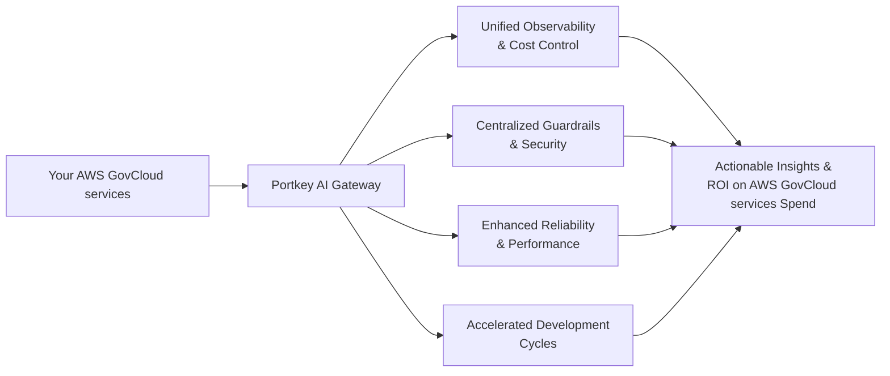

> Unlock enterprise-grade AI orchestration for your AWS GovCloud environment

## What is Portkey for AWS GovCloud (US)?

Portkey is an **Enterprise AI Gateway and Observability Platform** designed to work seamlessly with AWS GovCloud (US), providing government agencies and regulated industries with the security, compliance, and control they need for AI operations. As a unified management layer, Portkey enables compliant AI deployment within AWS GovCloud's U.S. sovereign environment while maintaining the stringent security requirements necessary for handling sensitive and Controlled Unclassified Information (CUI).

Our platform empowers organizations to transform their AWS GovCloud infrastructure into a complete enterprise AI platform with full visibility and control. Government agencies and organizations with elevated compliance needs can achieve **accelerated mission outcomes**, **enhanced governance**, and **optimized AI operations** while maintaining FedRAMP, ITAR, and DoD compliance.

**Enterprise advantages with Portkey in AWS GovCloud (US):**

* Deploy Portkey within your existing AWS GovCloud environment
* Comprehensive cost attribution and optimization for your AI spend
* Enterprise-grade controls: SSO, RBAC, and access management
* Unified API gateway with observability across all AI models
* Seamless IAM role assumption for secure access management

<Card title="Ready to enhance your AWS GovCloud AI capabilities?" href="https://portkey.sh/aws">Schedule a 1:1 architecture review</Card>

## Enterprise-Ready AWS GovCloud (US) Integration

<CardGroup cols={3}>
  <Card title="AWS GovCloud Deployment" icon="aws" href="/product/enterprise-offering/private-cloud-deployments/aws">
    Deploy Portkey within your AWS GovCloud VPC for maximum security and control.
  </Card>

  <Card title="Complete AWS Model Support" icon="brain" href="/integrations/llms/bedrock/aws-bedrock">
    Unified gateway for AI models available in AWS GovCloud with seamless integration.
  </Card>

  <Card title="FinOps Controls" icon="chart-line" href="/product/administration/enforce-workspace-budget-limts-and-rate-limits">
    Implement granular budget controls, rate limits, and cost optimization with project/department-level attribution.
  </Card>

  <Card title="AI-Native Observability" icon="chart-mixed" href="/product/observability">
    Gain comprehensive visibility into your AI usage patterns, request performance, and spend across all applications.
  </Card>

  <Card title="Enterprise Security" icon="lock" href="/product/enterprise-offering/security-portkey">
    Maintain data sovereignty with private deployment options, audit logs, and advanced security features.
  </Card>

  <Card title="SSO & Identity Management" icon="user-lock" href="/product/enterprise-offering/org-management/sso">
    Integrate with your existing identity providers for secure access control and automated user provisioning.
  </Card>

  <Card title="Organizational Governance" icon="sitemap" href="/product/enterprise-offering/org-management/organizations">
    Implement comprehensive organizational structures with role-based access control across teams and projects.
  </Card>

  <Card title="PII Detection & Redaction" icon="file-shield" href="/product/guardrails/pii-redaction">
    Apply configurable PII detection and redaction to every AI request with no code changes required.
  </Card>
  <Card title="AWS KMS Integration" icon="key" href="/product/enterprise-offering/kms">
      Bring your own encryption keys to Portkey AI to encrypt data at storage with AWS KMS support.
    </Card>
    <Card title="AWS Assumed Role" icon="user-shield" href="/product/ai-gateway/virtual-keys/bedrock-amazon-assumed-role">
      Secure access without API keys - Portkey temporarily assumes authorized IAM roles for Bedrock model access.
    </Card>
    <Card title="Comprehensive Integrations" icon="network-wired" href="/integrations/ecosystem">
      Connect AWS with guardrails, agentic frameworks, popular LLMs, and developer libraries for an extensible AI infrastructure.
    </Card>

</CardGroup>

## How Portkey Works in AWS GovCloud (US)

Portkey acts as an intelligent middleware layer that can be deployed within your AWS GovCloud environment:

1. **Unified Gateway**: Route all AI traffic through a single consistent interface
2. **Request Enrichment**: Automatically add metadata, tracking, and governance controls
3. **Intelligent Routing**: Direct requests to the optimal AI models based on cost, performance, and requirements
4. **Response Processing**: Apply caching, monitoring, and analytics to maximize performance and insights
5. **Comprehensive Observability**: Track usage, costs, and performance metrics across your entire organization
6. **Advanced Governance**: Implement role-based access control, workspace-level policies, and audit trails

**Enterprise AI Features Compatible with AWS GovCloud**

<CardGroup cols={3}>
  <Card title="Bedrock Unified Fine-Tuning Management" icon="gears" href="/integrations/llms/bedrock/fine-tuning">
    Centralize and streamline your fine-tuning workflows for AWS models with version control and deployment management.
  </Card>

  <Card title="Bedrock Unified Batches" icon="layer-group" href="/integrations/llms/bedrock/batches">
    Process large volumes of prompts efficiently with batch processing capabilities, optimizing throughput and resource utilization for Bedrock models.
  </Card>

  <Card title="Bedrock Prompt Caching" icon="database" href="/integrations/llms/bedrock/prompt-caching">
    Optimize performance and reduce costs with intelligent caching strategies specifically tuned for AWS models.
  </Card>

  <Card title="Bedrock File Processing" icon="file-code" href="/integrations/llms/bedrock/files">
      With Portkey, you can upload files in a unified OpenAI format and Portkey will handle transforming them into the format required by Bedrock on the fly.
  </Card>
  <Card title="SageMaker Integration" icon="server" href="/integrations/llms/sagemaker">
    Route to your AWS SageMaker models through Portkey for comprehensive management, logging, and access control.
  </Card>
</CardGroup>

**Deployment Architecture for AWS GovCloud**

**Deployment Options in AWS GovCloud**

1. **Full Air-Gapped Cloud Deployment**
   * Run Portkey entirely within your AWS GovCloud VPC
   * All data and traffic contained within your AWS GovCloud infrastructure
   * Maximum security for sensitive environments

2. **Hybrid Deployment**
   * Control plane in Portkey Cloud, data plane in your AWS GovCloud environment
   * Balance convenience with security requirements
   * Flexible deployment to match your security posture

## Why Organizations Choose Portkey for AWS GovCloud

### 1. Enhanced Security & Compliance

Portkey's integration with AWS GovCloud preserves your security posture:

* **AWS IAM Role Assumption**: No API keys exchanged - Portkey temporarily assumes authorized IAM roles
* **Data Sovereignty**: All data remains within your AWS GovCloud environment with Private Cloud deployment
* **End-to-End Encryption**: Data encrypted at rest and in transit with your KMS keys
* **Comprehensive Audit Logs**: Detailed audit trails for all administrative actions and requests

### 2. Enterprise-Grade AI Governance

Implement consistent governance across all AI applications:

* **Workspace-Level Controls**: Enforce security policies by workspace
* **PII Detection**: Identify and redact sensitive information from AI interactions
* **Role-Based Access Control**: Granular permissions for admin, developer, and analyst roles
* **Request Traceability**: Track the origin, purpose, and cost of every AI request
* **Approval Workflows**: Implement change management for model deployments and configurations

### 3. AWS GovCloud-Optimized Cost Management

Achieve predictable budgeting and cost optimization:

* **Department-Level Attribution**: Allocate AI costs to specific cost centers
* **Budget Enforcement**: Set hard or soft limits on model usage by team or project
* **Cost Optimization Engine**: Automatic routing to cost-effective models based on task complexity
* **Semantic Caching**: Reduce redundant API calls for common requests
* **Usage Analytics**: Comprehensive dashboards showing cost drivers and optimization opportunities

### 4. Accelerated Development in Controlled Environments

Enable your teams to build AI applications faster while maintaining security:

* **Unified API**: One consistent interface for all AI models
* **Feature Parity**: Access to advanced capabilities across supported models
* **Managed Upgrades**: Seamless transitions when new model versions are released
* **Streamlined Testing**: A/B testing and canary deployments built into the platform
* **Developer Tooling**: SDKs, docs, and integrations that developers love

## Enterprise Success Case Study

> "With 30 million policies a month, managing over 25 GenAI use cases became a pain. Portkey helped with prompt management, tracking costs per use case, and ensuring our keys were used correctly. It gave us the visibility we needed into our AI operations."
>
> **— Prateek Jogani, CTO, Qoala**

## Book a Consultation

Our solutions architects will analyze your specific AWS GovCloud environment and AI requirements to design an optimal implementation path.

<Frame>
<iframe
  src="https://portkey.sh/awsgov"
  width="100%"
  height="750"
  frameBorder="0"
  allow="fullscreen; clipboard-write; encrypted-media; picture-in-picture"
  allowFullScreen
></iframe>
</Frame>
---

### Additional Resources

* [AWS Cloud Deployment Guide](/product/enterprise-offering/private-cloud-deployments/aws)
* [Enterprise Security Docs](/product/enterprise-offering/security-portkey)
