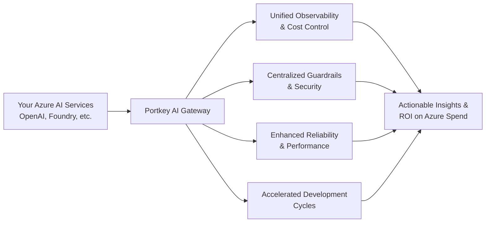

Portkey supercharges your Azure AI infrastructure with an enterprise-ready production stack. Teams building on Azure achieve **75% faster time-to-market**, **significant cost optimization**, and **4× faster deployments** while maintaining seamless integration with existing Azure investments. 

Our solution empowers you to build robust, scalable AI applications that leverage the full security and compliance capabilities of Azure.

**Key benefits for Azure AI teams:**
- Accelerated development cycles with unified API access
- Granular cost tracking and optimization for Azure AI services
- Enhanced governance with centralized security controls
- Simplified deployment and scaling of production AI applications
- Full compatibility with Azure's native security model

<Card title="Ready to optimize your Azure AI investment?" href="https://portkey.sh/azure">Schedule a 30-min strategy call</Card>

## What You Can Do Today with Portkey on Azure

<CardGroup cols={2}>
<Card title="1-Click Azure Marketplace Deploy" icon="rocket" href="https://azuremarketplace.microsoft.com/en-in/marketplace/apps/portkey.enterprise-saas?tab=Overview">
Spin up a managed Portkey instance directly inside your Azure subscription for maximum security and control.
</Card>
<Card title="SSO & SCIM with Microsoft Entra ID" icon="user-lock" href="/product/enterprise-offering/org-management/sso">
Integrate seamlessly with your existing identity provider for enterprise-grade access control and automated user provisioning.
</Card>
<Card title="Unified Access to Azure OpenAI" icon="brain" href="/integrations/llms/azure-openai">
Route all your Azure OpenAI requests (chat, vision, function-calling, DALL-E images) through Portkey while retaining full Azure compliance and gaining enhanced observability.
</Card>
<Card title="Azure AI Foundry Models Integration" icon="flask" href="/integrations/llms/azure-foundry">
Bring any model deployed via Azure AI Studio (formerly AI Foundry) under the Portkey gateway for consistent caching, retries, fallbacks, and observability.
</Card>
<Card title="Azure Content Safety Guardrails" icon="shield-check" href="/product/guardrails/azure-guardrails">
Apply robust, configurable content moderation and PII detection to every AI request—no code changes required in your applications.
</Card>
<Card title="Full Support for OpenAI C# SDK & Semantic Kernel" icon="code" href="/api-reference/sdk/c-sharp">
Developers can continue using familiar Microsoft tooling. Portkey transparently adds value by handling routing, cost attribution, observability, and guardrails.
</Card>
<Card title="Native Azure API Management (APIM) Integration" icon="plug">
Expose Portkey configurations as APIM endpoints, ensuring consistent governance and policies across all your APIs, not just AI.
</Card>
</CardGroup>

## Get Started in Minutes

1.  **Deploy from the Azure Marketplace**: Launch Portkey directly within your Azure subscription.
2.  **Connect Microsoft Entra ID for SSO & SCIM**: Follow our [SSO guide](/product/enterprise-offering/org-management/sso) and [Azure SCIM setup](/product/enterprise-offering/org-management/scim/azure-ad).
3.  **Create Virtual Keys in Portkey**: Link your Azure OpenAI resources or Azure AI Foundry model deployments.
4.  **Enable Azure Content Safety Guardrails**: Configure content filters within your Portkey Configs.
5.  **Instrument Your Applications**: Use your preferred SDK (like the C# example below) to route requests through Portkey.

```csharp C# [expandable]
using OpenAI;
using OpenAI.Chat;
using System;
using System.ClientModel;
using System.ClientModel.Primitives;
using System.Collections.Generic;
using System.Threading.Tasks;

public static class PortkeyAzureClient
{
    private class PortkeyHeadersPolicy : PipelinePolicy
    {
        private readonly Dictionary<string, string> _headers;
        public PortkeyHeadersPolicy(Dictionary<string, string> headers) => _headers = headers;

        public override void Process(PipelineMessage message, IReadOnlyList<PipelinePolicy> pipeline, int index)
        {
            foreach (var header in _headers) message.Request.Headers.Set(header.Key, header.Value);
            if (index < pipeline.Count) pipeline[index].Process(message, pipeline, index + 1);
        }

        public override ValueTask ProcessAsync(PipelineMessage message, IReadOnlyList<PipelinePolicy> pipeline, int index)
        {
            Process(message, pipeline, index);
            return ValueTask.CompletedTask;
        }
    }

    public static OpenAIClient CreateOpenAIClientWithPortkey(
        Uri azureEndpoint,
        string azureApiKey,
        Dictionary<string, string> portkeyHeaders
    )
    {
        var options = new OpenAIClientOptions
        {
            Endpoint = azureEndpoint, // Your Azure OpenAI endpoint
        };
        options.AddPolicy(new PortkeyHeadersPolicy(portkeyHeaders), PipelinePosition.PerCall);

        return new OpenAIClient(new ApiKeyCredential(azureApiKey), options);
    }
}

public class ExampleAzureIntegration
{
    public static async Task Main(string[] args)
    {
        // 1. Define Azure OpenAI credentials
        var azureEndpoint = new Uri("YOUR_AZURE_OPENAI_ENDPOINT"); // Eg: https://<your-resource-name>.openai.azure.com/
        var azureApiKey = "YOUR_AZURE_OPENAI_KEY"; 

        // 2. Define Portkey headers
        // Get your Portkey API Key from https://app.portkey.ai/settings
        // Create a virtual key for your Azure OpenAI setup in Portkey: https://app.portkey.ai/virtual-keys
        var portkeyHeaders = new Dictionary<string, string> 
        {
            { "x-portkey-api-key", "YOUR_PORTKEY_API_KEY" }, 
            { "x-portkey-virtual-key", "YOUR_AZURE_OPENAI_VIRTUAL_KEY" } // Connects to your Azure setup
            // Optional: { "x-portkey-trace-id", "my-azure-app-trace" },
            // Optional: { "x-portkey-metadata", "{\"userId\": \"user-123\"}" }
        };

        // 3. Create Azure OpenAI client with Portkey integration
        var openAIClient = PortkeyAzureClient.CreateOpenAIClientWithPortkey(
            azureEndpoint,
            azureApiKey,
            portkeyHeaders
        );

        // 4. Get the ChatClient
        // The model/deployment name for Azure OpenAI is specified here.
        var chatClient = openAIClient.GetChatClient("YOUR_AZURE_DEPLOYMENT_NAME"); // Eg: gpt-4, gpt-35-turbo

        // 5. Make a request
        try
        {
            Console.WriteLine("Sending request to Azure OpenAI via Portkey...");
            ChatCompletion completion = await chatClient.CompleteChatAsync(
                new List<ChatMessage>
                {
                    new SystemChatMessage("You are an AI assistant that helps people find information."),
                    new UserChatMessage("Give me 3 Azure best practices for cloud security.")
                });

            Console.WriteLine($"[ASSISTANT]: {completion.Content[0].Text}");
        }
        catch (ClientResultException ex)
        {
            Console.WriteLine($"API Call Error: {ex.Status}: {ex.Message}");
            // For more details from Portkey, you can inspect ex.Content and ex.Headers
            // if (ex.Headers.TryGetValue("x-portkey-error-details", out var errorDetails))
            // {
            //    Console.WriteLine($"Portkey Error Details: {string.Join(", ", errorDetails)}");
            // }
        }
    }
}
```

## Why Portkey + Azure? The Strategic Advantages

Enterprises choose to combine Portkey with Microsoft Azure to gain a competitive edge in their AI development. This powerful synergy offers:





1.  **Complete Cost Visibility & Control on Azure Spend**: Go beyond standard Azure billing. Portkey allows you to tag every AI request (by application, environment, user, or custom dimension) and export granular metrics to Azure Monitor or your data warehouse for precise cost attribution and budget management.
2.  **Unified Governance & Security Across Your Azure AI Landscape**: Enforce organization-wide policies consistently. From robust content moderation with Azure Content Safety to PII detection, rate limits, and SSO via Microsoft Entra ID, Portkey centralizes governance across all your Azure AI services and Portkey workspaces.
3.  **Fortified Security with Azure-Native Integration**: Leverage Azure's robust security model. With Portkey's Azure Marketplace deployment or Private Cloud options, secrets remain securely in Azure Key Vault, and AI traffic can be configured to never leave Azure’s backbone, ensuring compliance and data integrity.
4.  **Boosted Developer Velocity & Efficiency**: Eliminate redundant setups and streamline AI development. Portkey provides a single, consistent gateway layer, removing the need for per-team Azure OpenAI subscriptions or duplicated infrastructure, allowing your teams to build faster.
5.  **Seamless Integration with the Azure Ecosystem**: Portkey is built for Azure. Enjoy native support for Azure OpenAI (chat, vision, function-calling, images), Azure AI Foundry Models, and even familiar Microsoft tooling like the OpenAI C# SDK and Semantic Kernel, all while Portkey handles the complexities of routing, cost attribution, and guardrails.

## Book an Enterprise Demo
<Frame>
<iframe
  src="https://portkey.sh/azure?hide_event_type_details=1&hide_gdpr_banner=1"
  width="100%"
  height="750" 
  frameBorder="0"
  allow="fullscreen; clipboard-write; encrypted-media; picture-in-picture"
  allowFullScreen
></iframe>
</Frame>
---

### Additional Resources

- [Azure OpenAI integration](/integrations/llms/azure-openai)
- [Azure AI Foundry integration](/integrations/llms/azure-foundry)
- [Azure Content Safety guardrails](/product/guardrails/azure-guardrails)
- [Azure Private Cloud deployment guide](/product/enterprise-offering/private-cloud-deployments/azure)

<Info>
Need something bespoke? Reach out to our team for a tailored architecture review.
</Info>
