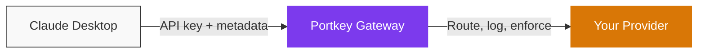

This guide takes you from a fresh Claude Desktop install to a fully-routed connection through Portkey in about five minutes. After setup, every conversation flows through your organization's gateway with approved model routing, policy enforcement, and cost tracking.



<Note>
  **Requirements:** Claude Desktop with third-party inference support (any recent build from late 2025 onward). If you don't see **Configure third-party inference** under the Developer menu after enabling Developer mode, update the app from [claude.ai/download](https://claude.ai/download).
</Note>

## What you need before starting

Get these three values from your platform admin. If you're a solo builder, follow the [Platform Admin Guide](/integrations/libraries/claude-desktop-platform-admins) first to create them yourself.

<CardGroup cols={3}>
  <Card title="Gateway URL" icon="globe">
    `https://api.portkey.ai` for Portkey SaaS, or your custom URL if your org self-hosts. Confirm with your admin.
  </Card>
  <Card title="Portkey API Key" icon="key">
    A scoped key from [API Keys](https://app.portkey.ai/api-keys)
  </Card>
  <Card title="Metadata Template" icon="tag">
    JSON for the `x-portkey-metadata` header
  </Card>
</CardGroup>

## Connect Claude Desktop to Portkey

<Steps>
  <Step title="Enable Developer mode">
    Open **Help → Troubleshooting → Enable Developer mode**. The menu lives in the menu bar on macOS and the hamburger menu (top-left) on Windows.

    <Frame>
      
    </Frame>
  </Step>

  <Step title="Open third-party inference settings">
    Navigate to **Developer → Configure third-party inference**.

    <Frame>
      
    </Frame>
  </Step>

  <Step title="Set the Gateway connection">
    Select **Gateway (Anthropic-compatible)** and fill in the fields:

    | Field | Value |
    |---|---|
    | Gateway base URL | `https://api.portkey.ai` |
    | Gateway API key | Your Portkey API key |
    | Gateway auth scheme | `bearer` |

    <Frame>
      
    </Frame>
  </Step>

  <Step title="Add the metadata header">
    Under **Gateway extra headers**, add a new header:

    | Field | Value |
    |---|---|
    | Header name | `x-portkey-metadata` |
    | Header value | *(your metadata JSON)* |

    ```json
    {"tenant":"acme","user":"dev@acme.com","team":"engineering","env":"prod"}
    ```

    <Frame>
      
    </Frame>

    <Info>
      Replace the values with what your platform team specifies. These fields drive analytics attribution and per-team filtering in Portkey.
    </Info>
  </Step>

  <Step title="Apply and restart">
    Click **Apply locally**. Fully quit Claude Desktop (not just close the window), then reopen it.

    <Warning>
      A simple window close keeps the old process alive. The new gateway settings only load on a full quit and relaunch.
    </Warning>
  </Step>
</Steps>

## Verify it works

Send any prompt in Claude Desktop, then run through these two checks.

<Steps>
  <Step title="Confirm the request reached Portkey">
    Open [Portkey Logs](https://app.portkey.ai/logs). Your request should appear within a few seconds, tagged with the metadata you set in step 4.

    <Frame>
      
    </Frame>
  </Step>

  <Step title="Confirm the right model responded">
    Click the log entry. Verify the **model** and **provider** fields match what your admin configured for your team, not Anthropic's default.

    <Frame>
      
    </Frame>
  </Step>
</Steps>

<Check>
  Request shows in Logs with correct metadata and the expected model? You're done.
</Check>

## Troubleshooting

<AccordionGroup>
  <Accordion title="Why am I getting a 401 or 403 error?" icon="lock">
    Your Portkey API key is expired, revoked, or scoped to a different workspace. Get a fresh key from your admin or generate one yourself at [API Keys](https://app.portkey.ai/api-keys).
  </Accordion>

  <Accordion title="Why aren't my requests appearing in Logs?" icon="eye-slash">
    Three things to check:

    1. Base URL is correct: `https://api.portkey.ai` for Portkey SaaS, or your org's self-hosted gateway URL. No trailing slash, no `/v1`.
    2. Auth scheme is set to `bearer`.
    3. You fully quit and relaunched Claude Desktop after applying settings (not just closed the window).
  </Accordion>

  <Accordion title="Why isn't my policy applying?" icon="shield-halved">
    Metadata JSON must be valid (no trailing commas, no single quotes). Key names are case-sensitive and must exactly match what your admin configured in the policy rules.
  </Accordion>

  <Accordion title="Why is the wrong model responding?" icon="robot">
    Model routing is controlled by your admin's config in Portkey. If you're getting unexpected model behavior, your team's config likely points to a different model than you expect. Check with your platform team.
  </Accordion>

  <Accordion title="Why doesn't Configure third-party inference appear in my menu?" icon="circle-question">
    Either Developer mode isn't enabled (check **Help → Troubleshooting**), or your Claude Desktop build predates third-party inference support. Update the app from [claude.ai/download](https://claude.ai/download).
  </Accordion>
</AccordionGroup>

## FAQ

<AccordionGroup>
  <Accordion title="Does this work on both macOS and Windows?">
    Yes. The menu paths differ slightly (covered in Step 1) but the gateway settings and headers are identical.
  </Accordion>

  <Accordion title="Can I still use Claude Cowork while routed through Portkey?">
    Yes, but Cowork has its own configuration surface inside Claude Desktop. See the [Claude Cowork guide](/integrations/libraries/claude-cowork) for the Cowork-specific setup.
  </Accordion>

  <Accordion title="Will routing through Portkey slow down responses?">
    Portkey adds single-digit milliseconds of overhead per request. You won't notice it during normal use.
  </Accordion>

  <Accordion title="What happens if Portkey is unreachable?">
    Claude Desktop will surface the connection error like any other API failure. If your admin configured fallbacks in the Portkey config, traffic automatically routes to a backup provider before that happens.
  </Accordion>

  <Accordion title="Can I use this with a personal Claude account?">
    Yes. Third-party inference is a Claude Desktop setting independent of your account type. Your platform admin can issue you a personal-scoped API key for pilot or solo use.
  </Accordion>

  <Accordion title="Does Claude Desktop store my Portkey API key securely?">
    Claude Desktop stores third-party inference credentials in the OS keychain (macOS Keychain or Windows Credential Manager).
  </Accordion>

  <Accordion title="My org runs Portkey on-prem. What URL do I use?">
    Your admin will give you the gateway URL for your self-hosted deployment. It will not be `api.portkey.ai`. Everything else in this guide stays the same: same auth scheme, same metadata header, same setup flow.
  </Accordion>
</AccordionGroup>

## Next steps

<CardGroup cols={2}>
  <Card title="Add metadata to your traces" icon="tag" href="/product/observability/metadata">
    Tag requests with custom keys for richer filtering and cost attribution.
  </Card>
  <Card title="Group requests by session" icon="link" href="/product/observability/traces">
    Use trace IDs to group related prompts into a single session view.
  </Card>
  <Card title="Understand your spend" icon="chart-line" href="/product/observability/analytics">
    Filter analytics by team, model, or environment.
  </Card>
  <Card title="Set up alerts" icon="bell" href="/product/model-catalog/budget-limits">
    Get notified before you hit budget caps.
  </Card>
</CardGroup>
