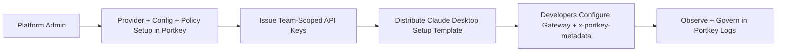

This guide is for **platform admins** managing Claude Desktop usage across teams.

## Admin outcome

You will:

- Configure provider + model routing in Portkey
- Issue scoped keys for teams/workspaces
- Enforce metadata-based policies with `x-portkey-metadata`
- Roll out a repeatable setup template for end users

## 1) Configure Portkey control plane

<Steps>
  <Step title="Add provider integrations">
    In [Model Catalog](https://app.portkey.ai/model-catalog), add Anthropic/Bedrock/Vertex as required.
  </Step>

  <Step title="Create baseline configs">
    In [Configs](https://app.portkey.ai/configs), create one or more configs by cohort/environment.

    ```json
    {
      "override_params": {
        "model": "@anthropic-prod/claude-sonnet-4-20250514"
      }
    }
    ```
  </Step>

  <Step title="Define governance">
    Apply budgets, rate limits, and guardrails per workspace/config.
  </Step>

  <Step title="Create scoped API keys">
    Create keys per team/environment (example: `claude-desktop-eng-prod`, `claude-desktop-support-prod`).
  </Step>
</Steps>

## 2) Metadata-based usage policy (lighthouse pattern)

Use Claude Desktop Gateway extra headers with metadata guardrails.

<Tabs>
  <Tab title="Metadata schema to standardize">

Recommended required keys:

- `tenant`
- `user`
- `team`
- `env`

Example header value:

```json
{"tenant":"acme","user":"alice@acme.com","team":"support","env":"prod"}
```

  </Tab>

  <Tab title="Policy mapping examples">

- `team = support` → allow `claude-sonnet` only + lower RPM limit
- `env = dev` → lower budget cap + cheaper model default
- `tenant = enterprise-a` → dedicated config + stricter guardrails

  </Tab>

  <Tab title="Rollout instruction for users">

Tell users to set one Gateway extra header:

- Header: `x-portkey-metadata`
- Value: team-provided JSON template

This keeps user setup simple while preserving centralized admin control.

  </Tab>
</Tabs>

See [Enforcing Request Metadata](/product/administration/enforcing-request-metadata).

## 3) Rollout model



## 4) Validation checklist

- Requests from each team appear in logs with expected metadata.
- Metadata conditions trigger intended policies.
- Budgets/rate limits behave as expected per team.
- Fallback and routing behavior are correct for each config.
