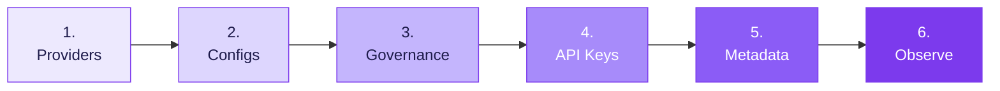

You're setting up Claude Desktop so your team can use it without you worrying about runaway spend, ungoverned model access, or missing audit trails. This guide takes you through six sequential steps. Work through them once, in order, and the result is a self-serve setup for every developer in your org.

When you're done:

- Every Claude Desktop conversation routes through one governed gateway
- Spend caps and rate limits enforce automatically per team and environment
- Content guardrails apply on every request
- Developers paste a key plus a header and they're online
- You see every request, every cost, every policy decision in Portkey



## 1. Add provider integrations

Providers are the upstream LLM accounts Portkey calls on your behalf. Connect every model source your org uses so you can route between them later.

Go to [Model Catalog](https://app.portkey.ai/model-catalog) → **Add Provider**.

<Frame>
  
</Frame>

<CardGroup cols={3}>
  <Card title="Anthropic" icon="bolt" href="/integrations/llms/anthropic">
    Direct API access
  </Card>
  <Card title="AWS Bedrock" icon="cloud" href="/integrations/llms/bedrock/aws-bedrock">
    Cross-region inference
  </Card>
  <Card title="Vertex AI" icon="cloud" href="/integrations/llms/vertex-ai">
    Google Cloud platform
  </Card>
</CardGroup>

## 2. Create configs

Configs are how you control which model and provider developers hit, without them changing anything in Claude Desktop. Create one config per team or environment so you can tune routing independently for each.

<Info>
  Naming convention: `desktop-{team}-{env}`. Examples: `desktop-eng-prod`, `desktop-support-prod`, `desktop-eng-dev`.
</Info>

Go to [Configs](https://app.portkey.ai/configs) → **Create Config**:

```json
{
  "override_params": {
    "model": "@anthropic-prod/claude-sonnet-4-20250514"
  }
}
```

Configs also support reliability features. Open the relevant section if you need them:

<AccordionGroup>
  <Accordion title="Add fallbacks for reliability" icon="life-ring">
    Route to a backup provider if the primary is unavailable:

    ```json
    {
      "strategy": { "mode": "fallback" },
      "targets": [
        { "provider": "@anthropic-prod" },
        { "provider": "@bedrock-prod" }
      ]
    }
    ```

    See [Fallbacks](/product/ai-gateway/fallbacks) for details.
  </Accordion>

  <Accordion title="Add load balancing" icon="scale-balanced">
    Distribute traffic across multiple providers or API keys:

    ```json
    {
      "strategy": { "mode": "loadbalance" },
      "targets": [
        { "provider": "@anthropic-key-1", "weight": 0.5 },
        { "provider": "@anthropic-key-2", "weight": 0.5 }
      ]
    }
    ```

    See [Load Balancing](/product/ai-gateway/load-balancing) for details.
  </Accordion>

  <Accordion title="Enable caching" icon="database">
    Reduce cost and latency for repeated prompts:

    ```json
    {
      "provider": "@anthropic-prod",
      "cache": { "mode": "simple" }
    }
    ```

    See [Caching](/product/ai-gateway/cache-simple-and-semantic) for details.
  </Accordion>
</AccordionGroup>

## 3. Set up governance

Governance is the layer that prevents Claude Desktop from becoming a runaway cost or compliance problem. You apply controls at the config or workspace level, and they enforce automatically on every request.

<CardGroup cols={3}>
  <Card title="Budget Limits" icon="coins" href="/product/model-catalog/budget-limits">
    Cap spend by team, environment, or individual user.
  </Card>
  <Card title="Rate Limits" icon="gauge-high" href="/product/model-catalog/rate-limits">
    Protect infrastructure and ensure fair usage across teams.
  </Card>
  <Card title="Guardrails" icon="shield-check" href="/product/guardrails">
    Content filtering, PII detection, and custom security rules.
  </Card>
</CardGroup>

<Tip>
  Start with moderate limits in a staging config. Validate that real developer workflows aren't blocked by false positives. Then tighten for production.
</Tip>

## 4. Create scoped API keys

API keys are what you hand to your developers. Each key inherits a config and a set of governance controls, so you can give different teams different routing and limits without explaining any of it to them.

Go to [API Keys](https://app.portkey.ai/api-keys) and create one key per team or environment.

<Info>
  Naming convention: `claude-desktop-{team}-{env}`. Example: `claude-desktop-eng-prod`.
</Info>

Each key carries two things you've already set up:

| Attachment | Purpose |
|---|---|
| Config (from step 2) | Controls model routing and reliability features for requests using this key |
| Budget and rate-limit controls (from step 3) | Enforces spend and usage limits per key |

<Note>
  Workspace scope is automatic. Every API key belongs to the workspace it was created in.
</Note>

## 5. Define your metadata standard

Metadata is how Portkey knows *who* is making each request. Claude Desktop sends it as a JSON header (`x-portkey-metadata`) on every call. Portkey reads those fields and uses them for attribution, filtering, and routing decisions.

This step has two parts: pick the schema, then hand the template to your developers.

### Pick a schema

Decide which fields to track. We recommend these four:

| Field | Purpose | Example |
|---|---|---|
| `tenant` | Organization or sub-org | `acme` |
| `team` | Functional team | `engineering`, `support` |
| `user` | Individual user identity | `alice@acme.com` |
| `env` | Deployment environment | `prod`, `staging`, `dev` |

Combined into a single header value:

```json
{"tenant":"acme","user":"alice@acme.com","team":"engineering","env":"prod"}
```

### What Portkey does with these fields

Once your schema is set, every request appears in Portkey tagged with these values. Here's what they unlock:

| Use case | How it works |
|---|---|
| **Filter Logs** | Search by any field combination (for example, all requests where `team=support` and `env=prod`) |
| **Attribute spend in Analytics** | Group cost, tokens, and latency by `team`, `tenant`, `user`, or `env` |
| **Conditional routing in configs** | Route differently based on metadata values (for example, send `env=dev` traffic to a cheaper model) |
| **Audit trail** | Every request includes `user` for compliance and security reviews |

<Warning>
  **Trust boundary.** Metadata is a label developers send from their machine. For *authoritative* enforcement of budgets, rate limits, and model access, rely on the scoped API keys from step 4, not on metadata. Use metadata for visibility and routing. Use keys for control.
</Warning>

### Hand a template to developers

Send each developer this template alongside their team's API key. They paste it into Claude Desktop once and never think about it again.

| Setting | Value |
|---|---|
| Gateway base URL | `https://api.portkey.ai` (or your self-hosted gateway URL) |
| Gateway API key | *(team-scoped key)* |
| Gateway auth scheme | `bearer` |
| Extra header name | `x-portkey-metadata` |
| Extra header value | `{"tenant":"acme","user":"<their-email>","team":"<their-team>","env":"prod"}` |

Then point them to the [Developer Guide](/integrations/libraries/claude-desktop-developers).

## 6. Monitor and iterate

The work isn't done at rollout. Use Portkey to track outcomes and tune the setup based on real usage.

<CardGroup cols={3}>
  <Card title="Logs" icon="list" href="https://app.portkey.ai/logs">
    Verify routing decisions and policy triggers per request.
  </Card>
  <Card title="Analytics" icon="chart-line" href="https://app.portkey.ai/analytics">
    Compare spend, tokens, and latency by team, tenant, or environment.
  </Card>
  <Card title="Operations" icon="gears">
    Tune model routing and limits based on actual usage patterns.
  </Card>
</CardGroup>

## Pre-launch checklist

Before distributing keys to developers, run through each of these checks. Skip any one and you risk learning about the gap from a developer instead of a dashboard.

<Steps>
  <Step title="Requests appear in Logs with correct metadata">
    Send a test request from Claude Desktop. Confirm it shows up in [Portkey Logs](https://app.portkey.ai/logs) with all the metadata fields you defined in step 5.
  </Step>
  <Step title="Policies trigger correctly">
    Test each policy you configured: budget block, rate limit, guardrail. Confirm Portkey enforces them as expected.
  </Step>
  <Step title="Correct model responds">
    Check the `model` field in the log entry. It should match what your config specifies, not whatever Anthropic's default is.
  </Step>
  <Step title="Cost attribution is accurate">
    Verify spend rolls up under the correct team and user in Analytics.
  </Step>
  <Step title="Fallbacks work (if configured)">
    Simulate a provider failure. Confirm traffic routes to your backup target without dropping requests.
  </Step>
</Steps>

## FAQ

<AccordionGroup>
  <Accordion title="Can I roll this out gradually?">
    Yes. Issue keys to one team first, validate the setup, then expand. The metadata `team` field makes it easy to spot which teams are live and which are still on the default Anthropic endpoint.
  </Accordion>

  <Accordion title="What happens if a developer changes their metadata header?">
    They can. Metadata is a hint that Portkey trusts. If you need authoritative attribution, scope each developer's API key narrowly so the key itself enforces team and environment.
  </Accordion>

  <Accordion title="Do I need separate configs per provider, or one config with fallbacks?">
    For most rollouts: one config per team with fallbacks built in. Create separate configs only when teams have genuinely different routing needs (for example, regulated tenants on Bedrock-only).
  </Accordion>

  <Accordion title="How do I revoke access for a specific user?">
    Revoke their workspace membership in Portkey. Their API key stops working immediately. If multiple users share a key, rotate the key and re-issue to the remaining users.
  </Accordion>

  <Accordion title="Can I see what an individual user is asking Claude?">
    Logs show the prompt content unless you've configured request redaction. For privacy-sensitive deployments, enable [PII redaction guardrails](/product/guardrails/pii-redaction) before rollout.
  </Accordion>
</AccordionGroup>
