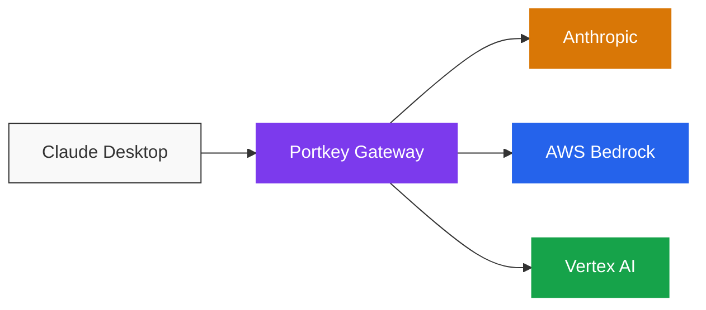

[Claude Desktop](https://claude.ai/download) ships with a setting called *third-party inference*. When enabled, every conversation goes to a gateway you choose instead of Anthropic's hosted API. Pointing it at Portkey turns a personal AI tool into a governed organizational one without changing how anyone uses the app.

## What changes when you connect Portkey

<CardGroup cols={3}>
  <Card title="One endpoint, every model" icon="shuffle">
    Use Anthropic, Bedrock, or Vertex AI without changing anything in Claude Desktop. Switch providers from a config in Portkey.
  </Card>
  <Card title="Spend stays within limits" icon="shield-check">
    Per-team budgets, rate limits, and content guardrails apply automatically. No more surprise invoices.
  </Card>
  <Card title="Every request is auditable" icon="chart-line">
    Cost, latency, tokens, and metadata logged for every prompt. Filter by team, user, or environment.
  </Card>
</CardGroup>

## Pick your path

<CardGroup cols={2}>
  <Card title="I'm rolling this out for my team" icon="building" href="/integrations/libraries/claude-desktop-platform-admins">
    **Platform Admin Guide.** Set up providers, configs, governance policies, and scoped API keys. Hand each developer a five-minute setup.
  </Card>
  <Card title="I just need to connect Claude Desktop" icon="code" href="/integrations/libraries/claude-desktop-developers">
    **Developer Guide.** Paste the credentials your admin gave you and start sending requests through the governed gateway.
  </Card>
</CardGroup>

<Tip>
  **Solo builder or pilot?** Run through the [Platform Admin Guide](/integrations/libraries/claude-desktop-platform-admins) once to create your provider and config. Then follow the [Developer Guide](/integrations/libraries/claude-desktop-developers) to wire up Claude Desktop. Total time: under fifteen minutes.
</Tip>

## When to use this guide vs. the others

<CardGroup cols={3}>
  <Card title="Claude Desktop" icon="message" href="/integrations/libraries/claude-desktop">
    The standard chat experience in Claude Desktop. **You're here.**
  </Card>
  <Card title="Claude Cowork" icon="users" href="/integrations/libraries/claude-cowork">
    The collaborative coding experience inside Claude Desktop. Same gateway setup, slightly different surface.
  </Card>
  <Card title="Claude Code" icon="terminal" href="/integrations/libraries/claude-code">
    The CLI-based agentic coding tool. Different config format (settings.json).
  </Card>
</CardGroup>
