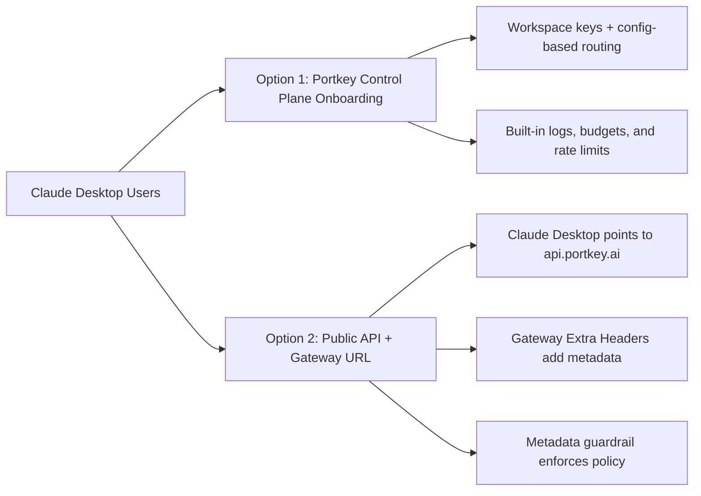

Use Claude Desktop with Portkey Gateway to get:

- **Enterprise-grade control** for desktop AI usage
- **Observability** for tokens, cost, and latency in [Logs](https://app.portkey.ai/logs)
- **Policy enforcement** with budgets, rate limits, and guardrails
- **Metadata-driven governance** via Gateway extra headers

<Note>
  This guide is for Claude Desktop Gateway (Anthropic-compatible) mode. For Cowork-specific setup, see [Claude Cowork](/integrations/libraries/claude-cowork).
</Note>

## Deployment options



## 1) Configure Portkey

<Steps>
  <Step title="Add your provider">
    In [Model Catalog](https://app.portkey.ai/model-catalog), add Anthropic/Bedrock/Vertex (or your preferred provider).
  </Step>

  <Step title="Create a config">
    In [Configs](https://app.portkey.ai/configs), create a default route:

    ```json
    {
      "override_params": {
        "model": "@anthropic-prod/claude-sonnet-4-20250514"
      }
    }
    ```
  </Step>

  <Step title="Create API key">
    In [API Keys](https://app.portkey.ai/api-keys), create a key and attach the config.
  </Step>
</Steps>

## 2) Configure Claude Desktop

1. Open **Claude Desktop**.
2. Enable developer mode: **Help → Troubleshooting → Enable Developer mode**.
3. Open **Developer → Configure third-party inference**.
4. Select **Gateway (Anthropic-compatible)**.
5. Set:
   - **Gateway base URL**: `https://api.portkey.ai`
   - **Gateway API key**: your Portkey API key
   - **Gateway auth scheme**: `bearer`
6. Click **Apply locally** and restart Claude Desktop.

## 3) Gateway extra headers + metadata guardrail (recommended)

Use Claude Desktop's **Gateway extra headers** with Portkey metadata policies.

<Tabs>
  <Tab title="Header to set in Claude Desktop">

Add one header in Claude Desktop:

- **Header name**: `x-portkey-metadata`
- **Value**:

```json
{"tenant":"acme","user":"alice@acme.com","team":"support","env":"prod"}
```

<Warning>
  Keep metadata compact and stable. Do not include secrets or PII beyond what your policy model requires.
</Warning>

  </Tab>

  <Tab title="Recommended metadata schema">

Use these fields for highest policy value:

- `tenant`: tenant/account boundary
- `user`: user identifier for attribution
- `team`: policy cohort (`support`, `engineering`, `finance`, etc.)
- `env`: environment (`prod`, `staging`, `dev`)

These fields let you segment usage, enforce different limits, and audit behavior cleanly.

  </Tab>

  <Tab title="How to enforce with metadata policy">

1. Configure a metadata-based usage policy/guardrail in Portkey.
2. Match on `team`, `env`, or `tenant` values.
3. Apply policy actions such as:
   - stricter model allowlists,
   - lower spend caps for non-prod,
   - tighter rate limits for high-risk cohorts.
4. Validate in [Logs](https://app.portkey.ai/logs) by filtering on metadata values.

See [Enforcing Request Metadata](/product/administration/enforcing-request-metadata).

  </Tab>
</Tabs>

## 4) Validate setup

1. Send a prompt from Claude Desktop.
2. Confirm request appears in [Logs](https://app.portkey.ai/logs).
3. Verify metadata is present in the request.
4. Verify policy/routing outcome for that metadata context.

## 5) Troubleshooting

- **No logs**: verify base URL is exactly `https://api.portkey.ai` and auth scheme is `bearer`.
- **401/403**: rotate API key and confirm key scope/permissions.
- **Metadata policy not triggering**: confirm valid JSON in `x-portkey-metadata` and exact key names used in policy conditions.
