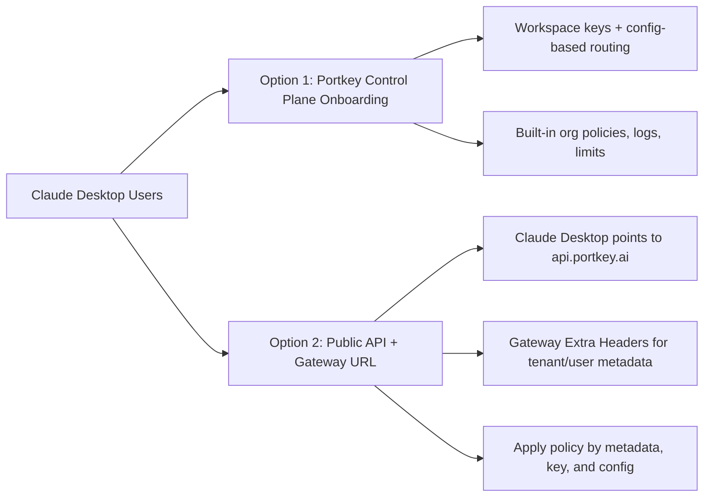

Use Claude Desktop with Portkey Gateway to get:

- **Enterprise-grade control** for desktop AI usage
- **Observability** for tokens, cost, and latency in [Logs](https://app.portkey.ai/logs)
- **Policy enforcement** with budgets, rate limits, and guardrails
- **Flexible routing** using configs and Gateway extra headers

<Note>
  This guide is for Claude Desktop Gateway (Anthropic-compatible) mode. For Cowork-specific setup, see [Claude Cowork](/integrations/libraries/claude-cowork).
</Note>

## Deployment options



## 1) Configure Portkey

<Steps>
  <Step title="Add your provider">
    In [Model Catalog](https://app.portkey.ai/model-catalog), add Anthropic/Bedrock/Vertex (or your preferred provider).
  </Step>

  <Step title="Create a config">
    In [Configs](https://app.portkey.ai/configs), create a default route:

    ```json
    {
      "override_params": {
        "model": "@anthropic-prod/claude-sonnet-4-20250514"
      }
    }
    ```
  </Step>

  <Step title="Create API key">
    In [API Keys](https://app.portkey.ai/api-keys), create a key and attach the config.
  </Step>
</Steps>

## 2) Configure Claude Desktop

1. Open **Claude Desktop**.
2. Enable developer mode: **Help → Troubleshooting → Enable Developer mode**.
3. Open **Developer → Configure third-party inference**.
4. Select **Gateway (Anthropic-compatible)**.
5. Set:
   - **Gateway base URL**: `https://api.portkey.ai`
   - **Gateway API key**: your Portkey API key
   - **Gateway auth scheme**: `bearer`
6. Click **Apply locally** and restart Claude Desktop.

## 3) Use Gateway Extra Headers (recommended)

Claude Desktop supports **Gateway extra headers**. Use them for tenant routing and metadata-aware policies.

Suggested headers:

- `x-portkey-config: pp-your-config-id` (route to a specific config)
- `x-portkey-provider: @anthropic-prod` (pin provider slug)
- `x-portkey-metadata: {"tenant":"acme","user":"alice@acme.com","env":"prod"}` (policy context)

<Note>
  Keep one stable header set per desktop profile/environment to avoid accidental policy drift.
</Note>

See [Inference Headers](/api-reference/inference-api/headers) and [Enforcing Request Metadata](/product/administration/enforcing-request-metadata).

## 4) Validate setup

1. Send a prompt from Claude Desktop.
2. Confirm request appears in [Logs](https://app.portkey.ai/logs).
3. Verify model/config/provider routing is correct.
4. Verify limits/guardrails are enforced for that key/header context.

## 5) Troubleshooting

- **No logs**: verify base URL is exactly `https://api.portkey.ai` and auth scheme is `bearer`.
- **401/403**: rotate API key and confirm key scope/permissions.
- **Wrong route/model**: check attached config and Gateway extra headers.

---

import AdvancedFeatures from '/snippets/portkey-advanced-features.mdx';

<AdvancedFeatures />
