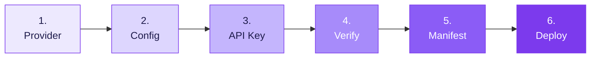

The Claude add-in for Microsoft 365 puts Claude in a task pane inside Excel, Word, PowerPoint, and Outlook. Point it at Portkey instead of Anthropic's API and every request from every user routes through one governed gateway.

Configuration travels in the add-in's manifest XML, so nothing is left to individual users. Generate the manifest once, deploy it from M365 Admin Center, and the whole org is online.

When you're done:

- Every task-pane conversation routes through Portkey
- Model choice is pinned by config, not by the user
- Budget caps, rate limits, and guardrails enforce on every request
- Requests are attributed per user and team in Logs and Analytics



## How it works

The add-in is hosted by Anthropic at `pivot.claude.ai`. You host nothing. The only artifact you produce is a manifest XML, and your gateway settings ride in it as URL query parameters on the task-pane URL.

```
Excel / Word / PowerPoint  ──Authorization: Bearer──>  Portkey  ──>  Anthropic / Bedrock / Vertex
        │
        └── loads pivot.claude.ai/?gateway_url=…&gateway_token=…&gateway_api_format=anthropic
                                        ▲
                                   manifest.xml
```

Model traffic goes from the user's Office WebView straight to Portkey. Allow `pivot.claude.ai` and your gateway host through the corporate firewall.

## Prerequisites

| Requirement | Notes |
|---|---|
| Portkey API key with a config attached | Steps 1–3 |
| Node.js 18+ | The manifest builder runs on Node |
| Claude Code | Hosts the manifest generator plugin |
| M365 Global Admin or Exchange Admin | Required to upload to Integrated apps |
| Excel/Word/PowerPoint 2019+ or Microsoft 365 | Windows, Mac, or web |

## 1. Add a provider integration

Connect the upstream model source Portkey calls on your behalf.

Go to [Model Catalog](https://app.portkey.ai/model-catalog) → **Add Provider**.

<CardGroup cols={3}>
  <Card title="Anthropic" icon="bolt" href="/integrations/llms/anthropic">
    Direct API access
  </Card>
  <Card title="AWS Bedrock" icon="cloud" href="/integrations/llms/bedrock/aws-bedrock">
    Cross-region inference
  </Card>
  <Card title="Vertex AI" icon="cloud" href="/integrations/llms/vertex-ai">
    Google Cloud platform
  </Card>
</CardGroup>

## 2. Create a config with `override_params`

The add-in sends Anthropic-API model names from its built-in model picker — `claude-sonnet-4-5`, `claude-opus-4-5`, and so on. Those names won't resolve against your workspace's provider slugs, so pin the target model with `override_params`.

Go to [Configs](https://app.portkey.ai/configs) → **Create Config**:

```json
{
  "override_params": {
    "model": "@anthropic-prod/claude-sonnet-4-20250514"
  }
}
```

The value uses `@{provider-slug}/{model}` addressing, where the slug is the integration from step 1.

<Info>
  Naming convention: `m365-{team}-{env}`. Examples: `m365-finance-prod`, `m365-legal-prod`.
</Info>

`override_params` **replaces** the matching field in the incoming request. Whatever model the add-in's picker sends is discarded, and every request is served by the model named here.

<Warning>
  **The model picker becomes cosmetic.** Users switch models in the task pane and get identical behaviour. Collapse the picker to a single honest entry with [`available_models`](#optional-configuration), or route on the incoming model name instead of hard-pinning it.
</Warning>

Configs also carry reliability features. Open the relevant section if you need them:

<AccordionGroup>
  <Accordion title="Add fallbacks for reliability" icon="life-ring">
    Route to a backup provider if the primary is unavailable:

    ```json
    {
      "strategy": { "mode": "fallback" },
      "targets": [
        { "provider": "@anthropic-prod" },
        { "provider": "@bedrock-prod" }
      ]
    }
    ```

    See [Fallbacks](/product/ai-gateway/fallbacks).
  </Accordion>

  <Accordion title="Enable caching" icon="database">
    Reduce cost and latency for repeated prompts:

    ```json
    {
      "provider": "@anthropic-prod",
      "cache": { "mode": "simple" }
    }
    ```

    See [Caching](/product/ai-gateway/cache-simple-and-semantic).
  </Accordion>

  <Accordion title="Route by team with conditional routing" icon="route">
    Send different teams to different models using metadata from step 4:

    ```json
    {
      "strategy": {
        "mode": "conditional",
        "conditions": [
          { "query": { "metadata.team": { "$eq": "research" } }, "then": "opus-target" }
        ],
        "default": "sonnet-target"
      },
      "targets": [
        {
          "name": "opus-target",
          "provider": "@anthropic-prod",
          "override_params": { "model": "claude-opus-4-5" }
        },
        {
          "name": "sonnet-target",
          "provider": "@anthropic-prod",
          "override_params": { "model": "claude-sonnet-4-5" }
        }
      ]
    }
    ```

    See [Conditional Routing](/product/ai-gateway/conditional-routing).
  </Accordion>
</AccordionGroup>

## 3. Create the API key

Go to [API Keys](https://app.portkey.ai/api-keys) → create one key per team or environment.

<Steps>
  <Step title="Attach the config from step 2">
    Every request authenticated with this key inherits the config.
  </Step>
  <Step title="Attach budget and rate limits">
    See [Budget Limits](/product/model-catalog/budget-limits) and [Rate Limits](/product/model-catalog/rate-limits).
  </Step>
  <Step title="Turn on Allow config override">
    Required. Without it the attached config does not apply to the request.
  </Step>
</Steps>

<Warning>
  **Allow config override is not optional.** Left off, Portkey keeps the client's own parameters and passes the add-in's `claude-sonnet-4-5` straight through to the provider instead of replacing it with your `override_params.model`. The failure is quiet — a 200 from an unintended model, or a provider error about an unknown model, with nothing naming the config as the cause.
</Warning>

## 4. Verify the gateway before building anything

A manifest pointing at an unreachable model deploys perfectly and then fails at the user's first message. Probe first.

```sh
curl "https://api.portkey.ai/v1/messages" \
  -H 'content-type: application/json' \
  -H 'authorization: Bearer $PORTKEY_API_KEY' \
  -d '{"model": "claude-sonnet-4-5", "max_tokens": 1, "messages": [{"role": "user", "content": "hi"}]}'
```

Check two things in the response:

| Check | Expected |
|---|---|
| HTTP status | `200` |
| `model` field | The model pinned in step 2 — **not** the model sent in the request |

If the response echoes `claude-sonnet-4-5`, the override isn't applying. Re-check *Allow config override* on the API key.

<Note>
  **Use `authorization`, not `x-api-key`.** The add-in supports only those two header schemes, and Portkey rejects its API key on `x-api-key` with `Invalid API Key. Error Code: 03`. Portkey's native `x-portkey-api-key` works with curl but the add-in cannot send it.
</Note>

## 5. Install the manifest generator

The manifest is built by `claude-for-msft-365-install`, a Claude Code plugin published by Anthropic. It fetches the canonical manifest template and appends your gateway settings as URL query parameters.

<Steps>
  <Step title="Confirm Node.js is installed">
    The build and validation scripts run on Node 18+.

    ```sh
    node --version
    ```
  </Step>
  <Step title="Add the marketplace and install the plugin">
    ```sh
    claude plugin marketplace add anthropics/financial-services
    claude plugin install claude-for-msft-365-install@claude-for-financial-services
    ```
  </Step>
  <Step title="Restart the Claude Code session">
    Slash commands register at startup. Without a restart they won't appear.
  </Step>
  <Step title="Set the plugin path">
    The plugin installs to a version-pinned directory:

    ```sh
    PLUGIN=~/.claude/plugins/cache/claude-for-financial-services/claude-for-msft-365-install/0.1.11
    ```

    Check your version with `ls ~/.claude/plugins/cache/claude-for-financial-services/claude-for-msft-365-install/`. Inside a session, `${CLAUDE_PLUGIN_ROOT}` resolves automatically.
  </Step>
</Steps>

The plugin adds these commands:

| Command | Purpose |
|---|---|
| `/claude-for-msft-365-install:setup` | Guided wizard — walks the full deployment end to end |
| `/claude-for-msft-365-install:manifest` | Generate the manifest XML only |
| `/claude-for-msft-365-install:consent` | Azure admin consent URLs for Entra SSO and Outlook Graph |
| `/claude-for-msft-365-install:bootstrap` | Build a per-user config endpoint |
| `/claude-for-msft-365-install:update-user-attrs` | Per-user config via Entra extension attributes |
| `/claude-for-msft-365-install:access-policies` | Scope features by Purview sensitivity label |
| `/claude-for-msft-365-install:debug` | Diagnose a broken deployment |
| `/claude-for-msft-365-install:export-data` | Export a user's chat history, skills, and MCP registrations |

Update later with `claude plugin update claude-for-msft-365-install@claude-for-financial-services`, then restart.

### Option A — guided wizard

Run the wizard and answer its prompts. It handles everything from provider choice through Admin Center upload:

```sh
/claude-for-msft-365-install:setup
```

| Wizard step | What it asks |
|---|---|
| 1. Connection path | Gateway vs. Vertex/Bedrock/Foundry. **Answer gateway** — Portkey is the gateway, even though it routes to Bedrock or Vertex underneath |
| 1b. Office apps | Excel/Word/PowerPoint, Outlook, or both |
| 2. Admin consent | Skipped unless `entra_sso=1` is needed |
| 3. Org-wide vs per-user | Whether the gateway token is the same for everyone |
| 4. Generate manifest | Runs the build script with your captured keys |
| 5. Per-user config | Extension attrs or a bootstrap endpoint, if step 3 needs them |
| 6. Verify a model | The probe from step 4 above |
| 7. Deploy | Walks the Admin Center upload |

<Tip>
  The wizard appends every command and captured value to a setup log at `~/Desktop/claude-for-msft-365-install-setup.md`. Re-running it resumes from that log instead of starting over.
</Tip>

### Option B — generate directly

To skip the wizard, call the build script yourself. Excel, Word, and PowerPoint share one manifest. Outlook uses a different Microsoft schema and needs its own:

<CodeGroup>
```sh Excel / Word / PowerPoint
node "$PLUGIN/scripts/build-manifest.mjs" office manifest.xml \
  gateway_url=https://api.portkey.ai \
  gateway_token='$PORTKEY_API_KEY' \
  gateway_auth_header=authorization \
  gateway_api_format=anthropic
```

```sh Outlook
node "$PLUGIN/scripts/build-manifest.mjs" outlook manifest-outlook.xml \
  gateway_url=https://api.portkey.ai \
  gateway_token='$PORTKEY_API_KEY' \
  gateway_auth_header=authorization \
  gateway_api_format=anthropic \
  graph_client_id=<your-entra-app-guid>
```
</CodeGroup>

### The four gateway keys

| Key | Value for Portkey |
|---|---|
| `gateway_url` | `https://api.portkey.ai`, or your self-hosted gateway URL |
| `gateway_token` | The API key from step 3 |
| `gateway_auth_header` | `authorization` — the `x-api-key` default does not work |
| `gateway_api_format` | `anthropic` — Portkey exposes the `/v1/messages` route |

<Tip>
  Single-quote the token in shell. Portkey keys contain `/` and `+`; the builder percent-encodes them correctly, but an unquoted shell mangles them first.
</Tip>

Validate before uploading:

```sh
npx --yes office-addin-manifest validate manifest.xml
```

<Warning>
  **Outlook needs Microsoft Graph admin consent** before deployment, or every user hits "Need admin approval" on first open. Run `/claude-for-msft-365-install:consent` first. Note that Outlook does not support the Bedrock direct path.
</Warning>

### Version and Id

```xml
<Id>4e2fd29d-dad0-40b3-af3c-a16e347a5ddc</Id>
<Version>1.0.0.12</Version>
```

First deploy: leave both alone. Updating an existing deployment: bump the fourth segment of `<Version>`. M365 Admin Center caches by `<Id>` + `<Version>` and **silently ignores** a re-upload at the same version — the most common cause of "I updated it but nothing changed".

## 6. Test locally, then deploy

Sideload on one machine first. This bypasses the 24–72 hour Admin Center cache entirely, and a sideloaded manifest wins over a centrally deployed one with the same `<Id>`.

<CodeGroup>
```sh macOS
bash "$PLUGIN/scripts/sideload-addin.sh" manifest.xml
```

```powershell Windows
& "$PLUGIN\scripts\sideload-addin.ps1" C:\path\to\manifest.xml
```
</CodeGroup>

Fully quit and reopen Excel — a backgrounded app won't rescan. The add-in appears under **Insert → My Add-ins**. Send a message and confirm the request lands in [Logs](https://app.portkey.ai/logs).

Remove a sideload with `clear-addin-cache.sh --id <GUID> --apply`. It's dry-run by default and only ever touches that one ID.

### Deploy the add-in for your organization

<Steps>
  <Step title="Open Integrated apps">
    Go to [M365 Admin Center → Settings → Integrated apps](https://admin.cloud.microsoft/?#/Settings/IntegratedApps) and choose **Upload custom apps**.
  </Step>
  <Step title="Select the app type">
    App type: **Office Add-in**. Choose how to upload: **Upload manifest file (.xml) from device**, then select `manifest.xml`.

    Admin Center validates on upload — the same check as `office-addin-manifest validate`.
  </Step>
  <Step title="Assign users">
    Start with **Just me** or a pilot group. Widen to **Entire organization** once verified — assignment changes don't require redeployment.

    Assign to **Specific users/groups** if per-user config was issued, matching exactly who was provisioned. Nested groups aren't supported.
  </Step>
  <Step title="Accept permissions and finish">
    Review the requested permissions, then **Finish deployment**.
  </Step>
  <Step title="Repeat for Outlook">
    Upload `manifest-outlook.xml` as a separate app if Outlook was generated.
  </Step>
</Steps>

The add-in appears under **Home → Add-ins** in Excel, Word, and PowerPoint once it lands.

<Note>
  Propagation takes up to 24 hours for a fresh deploy and up to 72 hours for an update. To skip the update wait, redeploy with a fresh `<Id>` UUID — every client then treats it as a brand-new add-in.
</Note>

## Update the manifest

Rotating the Portkey key, changing the model list, or adding any config key means regenerating and re-uploading. Run the four commands in this order:


### 1. Regenerate with the new values

```sh
node "$PLUGIN/scripts/build-manifest.mjs" office manifest.xml \
  gateway_url=https://api.portkey.ai \
  gateway_token='$NEW_PORTKEY_API_KEY' \
  gateway_auth_header=authorization \
  gateway_api_format=anthropic \
  available_models='claude-sonnet-4-5'
```

### 2. Bump the fourth version segment
```sh
perl -i -pe 's{(<Version>\d+\.\d+\.\d+\.)(\d+)(</Version>)}{$1.($2+1).$3}e' manifest.xml
```

### 3. Confirm the bump and validate
```sh
grep -o "<Version>[^<]*</Version>" manifest.xml
npx --yes office-addin-manifest validate manifest.xml
```
### 4. Re-upload in Admin Center → Integrated apps → your add-in → Update

<Warning>
  **The build script overwrites the file.** It fetches the canonical template and writes it out fresh — it never reads your existing `manifest.xml`. Any hand-edit is discarded, including a `<Version>` bump, so always bump *after* regenerating, never before.
</Warning>

Hand-editing the manifest is otherwise fine, and those edits do reach users — trimming `<Host>` entries to drop PowerPoint, for example. Re-apply them after each regeneration, and bump `<Version>` regardless of how the change was made, or Admin Center serves the cached copy.

<Note>
  Keep `<Id>` unchanged so Admin Center treats this as an update to the existing add-in rather than a second, parallel installation.
</Note>

To verify a change immediately instead of waiting out the cache, clear and re-sideload on one machine:

```sh
bash "$PLUGIN/scripts/clear-addin-cache.sh" --id <GUID> --apply
bash "$PLUGIN/scripts/sideload-addin.sh" manifest.xml
```

Fully quit and reopen the Office app — clearing does nothing until the app re-reads on launch, and a backgrounded app counts as still running.

## Attribute requests per user and team

Add `inference_headers` to the manifest to tag every request with metadata Portkey uses for filtering, cost attribution, and conditional routing:

```sh
inference_headers='{"x-portkey-metadata": "{\"team\":\"finance\",\"env\":\"prod\",\"app\":\"m365-addin\"}"}'
```

| Use case | How it works |
|---|---|
| **Filter Logs** | Search by any field combination, e.g. `team=finance` and `env=prod` |
| **Attribute spend** | Group cost, tokens, and latency by team or environment in Analytics |
| **Conditional routing** | Route on metadata values in the step 2 config |

<Warning>
  `Authorization`, `x-api-key`, `Content-Type`, `Host`, `Content-Length`, `User-Agent`, `Cookie`, and any `anthropic-*` / `x-amz-*` / `x-goog-*` header are reserved and silently dropped — they carry the add-in's own auth and protocol negotiation.
</Warning>

For per-user metadata rather than one org-wide value, issue narrower keys per team, or serve per-user config from a bootstrap endpoint (`/claude-for-msft-365-install:bootstrap`).

## Optional configuration

Each of these is another `key=value` argument to the build command.

<AccordionGroup>
  <Accordion title="available_models — control the model picker" icon="list-check">
    **Overrides** the picker. Users see exactly what's listed, in order, and nothing else. List every model that should remain, not just additions.

    ```sh
    available_models='claude-sonnet-4-5'
    available_models='[{"id": "claude-opus-4-5", "label": "Opus"}, "claude-sonnet-4-5"]'
    ```

    Set this to a single entry when the step 2 config pins one model, so the picker tells the truth.
  </Accordion>

  <Accordion title="mcp_servers — attach in-network tools" icon="plug">
    JSON array of MCP servers the add-in connects to directly. `headers` present means static auth; absent triggers OAuth discovery. Values interpolate other config keys.

    ```sh
    mcp_servers='[{"url": "{{gateway_url}}/deepwiki/mcp", "label": "DeepWiki", "headers": {"Authorization": "Bearer {{gateway_token}}"}}]'
    ```

    See [MCP Gateway](/product/mcp-gateway).
  </Accordion>

  <Accordion title="disabled_features — lock features org-wide" icon="lock">
    Comma-separated slugs in `{domain}.{action}` form:

    | Slug | Effect |
    |---|---|
    | `skills.authoring` | Blocks creating, editing, and uploading skills |
    | `file.upload` | Blocks attaching files to the conversation |
    | `web_search` | Removes native web search and fetch, which otherwise egress to a third-party provider |
    | `thumbs` | Blocks response feedback |
    | `addin.access` | Kill switch — the add-in refuses to run |

    Pair `web_search` with `mcp_servers` to substitute an in-network search tool. Unknown slugs are ignored.
  </Accordion>

  <Accordion title="auto_connect and allow_1p — the connection screen" icon="toggle-on">
    By default users skip the connection form and land straight in chat. Set `auto_connect=0` to show the form prefilled instead.

    The **Back** button to Claude.ai sign-in is hidden whenever enterprise config is present. Set `allow_1p=1` to keep it.
  </Accordion>

  <Accordion title="otlp_endpoint — send traces to your collector" icon="chart-line">
    Routes the add-in's OpenTelemetry traces to a collector you operate. Set the base HTTPS URL; the add-in appends `/v1/traces` and posts OTLP/HTTP. gRPC isn't supported — the add-in runs in a browser WebView.

    Portkey also exports traces natively. See [OpenTelemetry](/product/observability/opentelemetry).
  </Accordion>
</AccordionGroup>

## Security

<Warning>
  **The `gateway_token` in a manifest is a shared secret distributed to every user.** It sits in plaintext in the task-pane URL, readable from any installed machine's add-in cache. Don't commit a manifest containing a live key to git.
</Warning>

Mitigate at the Portkey layer rather than trying to hide the key:

- Scope each key narrowly with its own config, budget cap, and rate limit
- Issue one key per team so revocation and rotation are surgical
- Rotate on a schedule — regenerating the manifest is one command

For per-user tokens instead of one shared key, serve them from a bootstrap endpoint (`/claude-for-msft-365-install:bootstrap`), which returns per-user JSON config at startup and overrides manifest values.

## Pre-launch checklist

<Steps>
  <Step title="Requests appear in Logs">
    Send a test message from the task pane. Confirm it shows in [Logs](https://app.portkey.ai/logs) with the expected metadata.
  </Step>
  <Step title="The correct model responds">
    Check the `model` field in the log entry. It should match the step 2 config, not the add-in's picker.
  </Step>
  <Step title="Policies trigger">
    Test each budget cap, rate limit, and guardrail you configured.
  </Step>
  <Step title="Cost attribution is accurate">
    Verify spend rolls up under the right team in Analytics.
  </Step>
  <Step title="Firewall allows both hosts">
    `pivot.claude.ai` for the add-in payload, and your gateway host for model traffic.
  </Step>
</Steps>

## Troubleshooting

<AccordionGroup>
  <Accordion title="Wrong model answers, or a provider error about an unknown model">
    The config isn't applying. Confirm *Allow config override* is on for the API key (step 3) and that a config is attached to it.
  </Accordion>

  <Accordion title="401 or 403 from the gateway">
    Wrong header scheme. The add-in must use `gateway_auth_header=authorization`; Portkey rejects its key on `x-api-key`. Re-run the step 4 probe.
  </Accordion>

  <Accordion title="Updated the manifest but users see old config">
    Two caches. Admin Center ignores re-uploads at the same `<Version>` — bump the fourth segment. Then the client Wef cache holds until the app restarts; clear it with `clear-addin-cache.sh --id <GUID> --apply` and fully quit Office. Service-side propagation takes up to 72 hours for updates.
  </Accordion>

  <Accordion title="Add-in doesn't appear in the ribbon">
    Check Admin Center → Integrated apps → Users tab. Nested groups aren't supported. If it shows under My Add-ins but has no ribbon button, the manifest's `<Hosts>` is missing that app — check both the top-level `<Hosts>` list and the one under `<VersionOverrides>`.
  </Accordion>

  <Accordion title="Connection failed">
    The error screen has a **Copy error details** button. The paste shows a `Request:` block and a `Manifest params:` block with identical key names — diff them. Matching values mean the manifest went through unchanged and the problem is upstream. `Raw error:` is ground truth.
  </Accordion>

  <Accordion title="Reading the WebView console">
    **macOS:** quit the app, run `defaults write com.microsoft.Excel OfficeWebAddinDeveloperExtras -bool true`, enable Safari's developer features, then enable your terminal under System Settings → Privacy & Security → Developer Tools. That third gate is the one everyone misses. Right-click in the task pane → **Inspect Element**.

    **Windows:** right-click in the task pane → **Inspect**. No setup needed with WebView2.
  </Accordion>
</AccordionGroup>

<Note>
  Chat history, skills, and MCP registrations live in browser storage on the user's own machine — there is no server-side copy. On Windows the widely circulated "delete the `Wef` folder" fix destroys them along with the manifest cache. Export first with `/claude-for-msft-365-install:export-data`.
</Note>

## Related

<CardGroup cols={3}>
  <Card title="Claude Desktop" icon="desktop" href="/integrations/libraries/claude-desktop-platform-admins">
    Roll out Claude Desktop across your org
  </Card>
  <Card title="Claude Code" icon="terminal" href="/integrations/libraries/claude-code">
    Route Claude Code through Portkey
  </Card>
  <Card title="Configs" icon="sliders" href="/product/ai-gateway/configs">
    Routing, fallbacks, and caching
  </Card>
</CardGroup>


import PrismaAirsCta from "/snippets/prisma-airs-cta.mdx";

<PrismaAirsCta />
