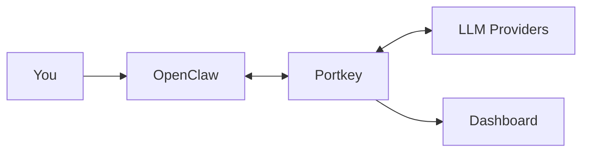

[OpenClaw](https://openclaw.ai) is an open-source AI assistant with persistent memory and multi-platform access. Routing it through Portkey gives you request logs, cost tracking, automatic failovers, and team controls.



## Get Connected

<Info>
**Already have Portkey configured?** Skip to step 3 — use your existing provider slug and API key.
</Info>

**1. Add your provider to Portkey**

Open [Model Catalog](https://app.portkey.ai/model-catalog), click **Add Provider**, enter your API key, and create a slug (e.g., `anthropic-prod`).

**2. Create a Portkey API key**

Go to [API Keys](https://app.portkey.ai/api-keys), click **Create**, and copy the key.

**3. Configure OpenClaw**

```bash
openclaw config edit
```

Add the portkey provider:

```json5
{
  agents: {
    defaults: { model: { primary: "portkey/@anthropic/claude-sonnet-4-5" } }
  },
  models: {
    mode: "merge",
    providers: {
      portkey: {
        baseUrl: "https://api.portkey.ai/v1",
        apiKey: "${PORTKEY_API_KEY}",
        api: "openai-completions",
        models: [
          { id: "@anthropic/claude-sonnet-4-5", name: "Claude Sonnet 4.5" }
        ]
      }
    }
  }
}
```

**4. Set your API key**

```bash
openclaw config set env.PORTKEY_API_KEY "pk-xxx"
```

---

## See Your Requests

Run `openclaw` and make a request. Open the [Portkey dashboard](https://app.portkey.ai) — you should see your request logged with cost, latency, and the full payload.

<Frame>

</Frame>

You can also verify your setup by listing available models:

```bash
curl -s https://api.portkey.ai/v1/models \
  -H "x-portkey-api-key: $PORTKEY_API_KEY" | jq '.data[].id'
```

---

## Add More Models

### Configure Models

Add models from any provider you've configured in Portkey:

```json5
models: [
  { id: "@anthropic/claude-opus-4-5", name: "Claude Opus 4.5" },
  { id: "@anthropic/claude-sonnet-4-5", name: "Claude Sonnet 4.5" },
  { id: "@openai/gpt-5.2", name: "GPT-5.2" }
]
```

Switch your default model by updating:

```json5
agents: {
  defaults: { model: { primary: "portkey/@openai/gpt-5.2" } }
}
```

### Track with Metadata

Add headers to group requests by session or tag by team/project:

```json5
// Add to your portkey provider config
headers: {
  "x-portkey-trace-id": "session-auth-refactor",
  "x-portkey-metadata": "{\"team\":\"backend\",\"project\":\"api-v2\"}"
}
```

These appear in the dashboard for filtering and analytics.

<Frame>

</Frame>

---

## Make It Reliable

Create configs in [Portkey Configs](https://app.portkey.ai/configs) and attach them to your API key. When the config is attached, these features apply automatically to all requests.

<Tabs>
  <Tab title="Failovers">
    Automatically switch providers when one is down:
    ```json
    {
      "strategy": { "mode": "fallback" },
      "targets": [
        { "provider": "@anthropic-prod" },
        { "provider": "@openai-backup" }
      ]
    }
    ```
  </Tab>
  <Tab title="Retries">
    Handle rate limits and transient errors:
    ```json
    {
      "retry": {
        "attempts": 3,
        "on_status_codes": [429, 500, 502, 503]
      }
    }
    ```
  </Tab>
  <Tab title="Load balancing">
    Distribute requests across regions:
    ```json
    {
      "strategy": { "mode": "loadbalance" },
      "targets": [
        { "provider": "@anthropic-us", "weight": 0.5 },
        { "provider": "@anthropic-eu", "weight": 0.5 }
      ]
    }
    ```
  </Tab>
  <Tab title="Caching">
    Cache repeated queries to reduce costs:
    ```json
    {
      "cache": { "mode": "simple", "max_age": 60 }
    }
    ```
  </Tab>
</Tabs>

---

## Control Costs

### Budget Limits

Set spending limits in [Model Catalog](https://app.portkey.ai/model-catalog) → select your provider → **Budget & Limits**:

- **Cost limit**: Maximum spend per period (e.g., $500/month)
- **Token limit**: Maximum tokens (e.g., 10M/week)
- **Rate limit**: Maximum requests (e.g., 100/minute)

Requests that exceed limits return an error rather than proceeding.

### Guardrails

Add input/output checks to filter requests:

```json
{
  "input_guardrails": ["pii-check"],
  "output_guardrails": ["content-moderation"]
}
```

See [Guardrails](/product/guardrails) for available checks.

---

## Roll Out to Teams

### Attach Configs to Keys

When deploying to a team, attach configs to API keys so developers get reliability and cost controls automatically.

1. Create a config with fallbacks, caching, retries, and guardrails
2. Create an API key and attach the config
3. Distribute the key to developers

Developers use a simple config — all routing and reliability logic is handled by the attached config. When you update the config, changes apply immediately.

### Enterprise Options

<AccordionGroup>
  <Accordion title="Self-hosting">
    - **SaaS**: Everything on Portkey cloud
    - **Hybrid**: Gateway on your infra, control plane on Portkey
    - **Air-gapped**: Everything on your infra

    In hybrid mode, the gateway has no runtime dependency on the control plane — routing continues even if the connection drops.
  </Accordion>

  <Accordion title="Authentication">
    - **JWT**: Bring your own JWKS URL for validation
    - **Service keys**: For production applications
    - **User keys**: For individual developers with personal budget limits

    Create keys via UI, [API](/api-reference), or [Terraform](https://registry.terraform.io/providers/portkey-ai/portkey).
  </Accordion>

  <Accordion title="Custom pricing">
    Override default pricing for negotiated rates or custom models in Model Catalog → Edit model.
  </Accordion>
</AccordionGroup>

---

## Troubleshooting

| Problem | Solution |
|---------|----------|
| Requests not in dashboard | Verify base URL is `https://api.portkey.ai/v1` and API key is correct |
| 401 errors | Regenerate Portkey key; check provider credentials in Model Catalog |
| Model not found | Use `@provider/model` format (e.g., `@anthropic/claude-sonnet-4-5`) |
| Rate limited | Adjust limits in Model Catalog → Budget & Limits |

<CardGroup cols={2}>
  <Card title="Configs" icon="gear" href="/product/ai-gateway/configs">
    Routing strategies
  </Card>
  <Card title="Observability" icon="chart-line" href="/product/observability">
    Logs and analytics
  </Card>
  <Card title="Guardrails" icon="shield" href="/product/guardrails">
    Content filtering
  </Card>
  <Card title="Budgets" icon="dollar-sign" href="/product/ai-gateway/virtual-keys/budget-limits">
    Spending controls
  </Card>
</CardGroup>

[Status](https://status.portkey.ai) · [Discord](https://portkey.ai/community) · [Docs](/docs)
