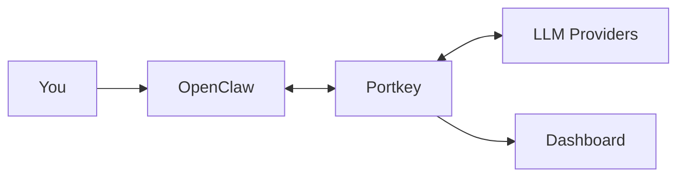

[OpenClaw](https://openclaw.ai) is an open-source AI assistant with persistent memory and multi-platform access. Routing it through Portkey gives you request logs, cost tracking, automatic failovers, and team controls.



## Get Connected

<Info>
**Already have OpenClaw set up?** Start from step 3.  
**Already have Portkey configured?** Re‑use your existing provider slug and API key.
</Info>

**1. Set up OpenClaw (if not already installed)**

**1.1 Install OpenClaw**

Run one of the following:

```bash
# macOS or Linux
npm install -g openclaw@latest

# macOS or Linux (curl installer)
curl -fsSL https://openclaw.ai/install.sh | bash

# Windows (PowerShell)
iwr -useb https://openclaw.ai/install.ps1 | iex
```

**1.2 Run the onboarding wizard**

```bash
openclaw onboard --install-daemon
```

Follow the onboarding wizard according to your needs.  
If you’re unsure, you can refer this minimal QuickStart path:

```text
🦞 OpenClaw 2026.2.15 — onboarding (QuickStart)

- Acknowledge the security notice:
  - Choose: “Yes, I understand this is powerful and inherently risky.”

- Onboarding mode:
  - Choose: QuickStart

- Model/auth provider:
  - Choose: OpenAI
  - Auth method: OpenAI API key
  - Paste your OpenAI API key when prompted
  - Keep default model: openai/gpt-5.1-codex (or similar default suggested)

- Channels (QuickStart):
  - Choose: Skip for now (you can add channels later via `openclaw channels add`)

- Skills:
  - Choose: No / Skip for now

- Hooks:
  - Select: Skip for now

- Gateway service:
  - Let it install the Gateway service (LaunchAgent on macOS)

- Hatch your bot:
  - Choose: Do this later

- When you’re ready:
  - Dashboard: run `openclaw dashboard --no-open`
  - Control UI: follow the printed `http://127.0.0.1:18789/...` link
```

This completes the basic OpenClaw setup.

**2. Make sure OpenClaw is running**

Once onboarding is complete, ensure the Gateway service is up (or start it via your OS tools or `openclaw` commands). When OpenClaw is set up and running, continue with Portkey integration below.

**3. Add your provider to Portkey**

Open [Model Catalog](https://app.portkey.ai/model-catalog), click **Add Provider**, enter your provider API key, and create a slug (for example, `gemini`).

**4. Create a Portkey API key**

Go to [API Keys](https://app.portkey.ai/api-keys), click **Create**, and copy the key.

**5. Open your OpenClaw config**

Edit the OpenClaw config file directly:

```bash
open ~/.openclaw/openclaw.json
```

**6. Add the Portkey provider and agent model**

In `openclaw.json`, add or merge the following snippet:

```json5
{
  "models": {
    "mode": "merge",
    "providers": {
      "portkey": {
        "baseUrl": "https://api.portkey.ai/v1",
        "apiKey": "YOUR_PORTKEY_API_KEY",
        "api": "openai-completions",
        "models": [
          {
            "id": "@gemini/gemini-2.5-flash",
            "name": "Gemini 2.5 Flash"
          }
        ]
      }
    }
  },
  "agents": {
    "defaults": {
      "model": {
        "primary": "portkey/@gemini/gemini-2.5-flash"
      }
    }
  }
}
```

Replace `YOUR_PORTKEY_API_KEY` with your actual Portkey API key.  
Remember to keep `"api"` set to `"openai-completions"` or `"openai-responses"` — Portkey transforms requests based on the OpenAI API format, and other values from the OpenClaw docs will be incompatible here.

**7. Test the integration**

After saving the config, run:

```bash
openclaw agent --agent main --message "hi"
```

If everything is configured correctly, this message will be routed through Portkey to your configured `@gemini/gemini-2.5-flash` model.

For more advanced configuration options, see the OpenClaw docs:

- `https://docs.openclaw.ai/gateway/configuration`
- `https://docs.openclaw.ai/gateway/configuration-examples`
- `https://docs.openclaw.ai/gateway/configuration-reference`

---

## See Your Requests

Run `openclaw` and make a request. Open the [Portkey dashboard](https://app.portkey.ai) — you should see your request logged with cost, latency, and the full payload.

<Frame>

</Frame>

You can also verify your setup by listing available models:

```bash
curl -s https://api.portkey.ai/v1/models \
  -H "x-portkey-api-key: $PORTKEY_API_KEY" | jq '.data[].id'
```

---

## Add More Models

### Configure Models

Add multiple models from any provider you've configured in Portkey.  
You can then refer to them from your agent config using `primary` and `fallbacks`.  
If you only want to use a single model, set it in `primary` without having anything in `fallbacks`.

```json5
"models": [
  {
    "id": "@gemini/gemini-2.5-flash",
    "name": "Gemini 2.5 Flash"
  },
  {
    "id": "@mistral/open-mixtral-8x7b",
    "name": "Mixtral 8x7b"
  }
]
```

Use `primary` and `fallbacks` to control routing:

```json5
"agents": {
  "defaults": {
    "model": {
      "fallbacks": [
        "portkey/@gemini/gemini-2.5-flash"
      ],
      "primary": "portkey/@mistral/open-mixtral-8x7b"
    }
  }
}
```

In this example:

- **Primary** traffic goes to `portkey/@mistral/open-mixtral-8x7b`.
- **Fallback** traffic uses `portkey/@gemini/gemini-2.5-flash` when the primary fails.  
If you want to use just one model at a time, set only the `primary` field.

### Track with Metadata

Add headers to group requests by session or tag by team/project:

```json5
// Add to your portkey provider config
headers: {
  "x-portkey-trace-id": "session-auth-refactor",
  "x-portkey-metadata": "{\"team\":\"backend\",\"project\":\"api-v2\"}"
}
```

These appear in the dashboard for filtering and analytics.

<Frame>

</Frame>

---

## Make It Reliable

Create configs in [Portkey Configs](https://app.portkey.ai/configs) and attach them to your API key.  
From the Portkey dashboard, open **Configs**, create a config, and copy its **Config ID** from the config details page.

You can then pass this Config ID from OpenClaw by adding a header in your `openclaw.json`:

```json5
"headers": {
  "x-portkey-config": "pc-config-id"
}
```

If your Portkey config is responsible for switching between providers or models based on conditions (e.g., latency, cost, availability), you can point OpenClaw at a *virtual* model and let Portkey handle the routing:

```json5
{
  "models": {
    "mode": "merge",
    "providers": {
      "portkey": {
        "baseUrl": "https://api.portkey.ai/v1",
        "apiKey": "YOUR_PORTKEY_API_KEY",
        "headers": {
          "x-portkey-config": "pc-config-id"
        },
        "api": "openai-completions",
        "models": [
          {
            "id": "portkey-dynamic",
            "name": "Portkey Router"
          }
        ]
      }
    }
  },
  "agents": {
    "defaults": {
      "model": {
        "primary": "portkey/portkey-dynamic"
      }
    }
  }
}
```

Here, `portkey-dynamic` is a *non-existent* model in Portkey’s Model Catalog. Instead, your Portkey Config (referenced by `x-portkey-config`) decides which real provider/model to call.  
Once you’ve wired in the Config ID header, you can iterate on different config JSONs in the Portkey UI (failovers, retries, routing rules, etc.) without changing your OpenClaw setup.

Below are example config payloads you might use inside Portkey:

<Tabs>
  <Tab title="Failovers">
    Automatically switch providers when one is down:
    ```json
    {
      "strategy": { "mode": "fallback" },
      "targets": [
        { "provider": "@anthropic-prod" },
        { "provider": "@openai-backup" }
      ]
    }
    ```
  </Tab>
  <Tab title="Retries">
    Handle rate limits and transient errors:
    ```json
    {
      "retry": {
        "attempts": 3,
        "on_status_codes": [429, 500, 502, 503]
      }
    }
    ```
  </Tab>
  <Tab title="Load balancing">
    Distribute requests across regions:
    ```json
    {
      "strategy": { "mode": "loadbalance" },
      "targets": [
        { "provider": "@anthropic-us", "weight": 0.5 },
        { "provider": "@anthropic-eu", "weight": 0.5 }
      ]
    }
    ```
  </Tab>
  <Tab title="Caching">
    Cache repeated queries to reduce costs:
    ```json
    {
      "cache": { "mode": "simple", "max_age": 60 }
    }
    ```
  </Tab>
</Tabs>

---

## Control Costs

### Budget Limits

Set spending limits in [Model Catalog](https://app.portkey.ai/model-catalog) → select your provider → **Budget & Limits**:

- **Cost limit**: Maximum spend per period (e.g., $500/month)
- **Token limit**: Maximum tokens (e.g., 10M/week)
- **Rate limit**: Maximum requests (e.g., 100/minute)

Requests that exceed limits return an error rather than proceeding.

### Guardrails

Add input/output checks to filter requests:

```json
{
  "input_guardrails": ["pii-check"],
  "output_guardrails": ["content-moderation"]
}
```

See [Guardrails](/product/guardrails) for available checks.

---

## Roll Out to Teams

### Attach Configs to Keys

When deploying to a team, attach configs to API keys so developers get reliability and cost controls automatically.

1. Create a config with fallbacks, caching, retries, and guardrails
2. Create an API key and attach the config
3. Distribute the key to developers

Developers use a simple config — all routing and reliability logic is handled by the attached config. When you update the config, changes apply immediately.

### Enterprise Options

<AccordionGroup>
  <Accordion title="Self-hosting">
    - **SaaS**: Everything on Portkey cloud
    - **Hybrid**: Gateway on your infra, control plane on Portkey
    - **Air-gapped**: Everything on your infra

    In hybrid mode, the gateway has no runtime dependency on the control plane — routing continues even if the connection drops.
  </Accordion>

  <Accordion title="Authentication">
    - **JWT**: Bring your own JWKS URL for validation
    - **Service keys**: For production applications
    - **User keys**: For individual developers with personal budget limits

    Create keys via UI, [API](/api-reference), or [Terraform](https://registry.terraform.io/providers/portkey-ai/portkey).
  </Accordion>

  <Accordion title="Custom pricing">
    Override default pricing for negotiated rates or custom models in Model Catalog → Edit model.
  </Accordion>
</AccordionGroup>

---

## Troubleshooting

| Problem | Solution |
|---------|----------|
| Requests not in dashboard | Verify base URL is `https://api.portkey.ai/v1` and API key is correct |
| 401 errors | Regenerate Portkey key; check provider credentials in Model Catalog |
| Model not found | Use `@provider/model` format (e.g., `@anthropic/claude-sonnet-4-5`) |
| Rate limited | Adjust limits in Model Catalog → Budget & Limits |

<CardGroup cols={2}>
  <Card title="Configs" icon="gear" href="/product/ai-gateway/configs">
    Routing strategies
  </Card>
  <Card title="Observability" icon="chart-line" href="/product/observability">
    Logs and analytics
  </Card>
  <Card title="Guardrails" icon="shield" href="/product/guardrails">
    Content filtering
  </Card>
  <Card title="Budgets" icon="dollar-sign" href="/product/ai-gateway/virtual-keys/budget-limits">
    Spending controls
  </Card>
</CardGroup>

[Status](https://status.portkey.ai) · [Discord](https://portkey.ai/community) · [Docs](/docs)
