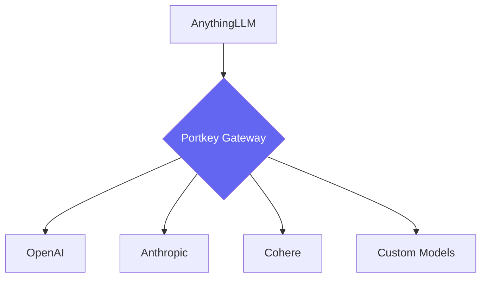

<CardGroup cols={3}>
  <Card title="Secure Gateway" icon="shield-lock" href="#secure-api-gateway">
    Unified interface for 250+ LLMs with centralized credentials
  </Card>
  <Card title="Cost Governance" icon="coins" href="#cost-governance">
    Real-time spend tracking & budget enforcement
  </Card>
  <Card title="Security First" icon="shield-check" href="#security-guardrails">
    PII detection, content filtering, compliance controls
  </Card>
</CardGroup>

## Why Portkey for AnythingLLM?

While AnythingLLM provides excellent chat capabilities, Portkey adds essential enterprise controls:

<Tabs>
  <Tab title="For DevOps Teams" icon="server">
    - **Zero Downtime** - Fallbacks & load balancing
    - **Standardized Metrics** - Unified monitoring across LLMs
    - **Infra Optimization** - Smart caching & request batching
  </Tab>
  
  <Tab title="For Security Teams" icon="shield">
    - **PII Masking** - Automatic sensitive data protection
    - **Audit Logs** - Complete request/response tracking
    - **Access Controls** - RBAC & SSO integration
  </Tab>
  
  <Tab title="For Finance Teams" icon="calculator">
    - **Cost Allocation** - Department/team spend tracking
    - **Budget Caps** - Hard limits on API usage
    - **Forecasting** - Usage trend analysis
  </Tab>
</Tabs>



## 🚀 Quick Start Integration

<Steps>
  <Step title="1. Get Portkey API Key" icon="key">
    Create your free account at [Portkey Dashboard](https://app.portkey.ai)
    <Frame>
      
    </Frame>
  </Step>

  <Step title="2. Configure AnythingLLM" icon="sliders">
    ```mdx
    1. Go to **Settings > AI Providers**
    2. Select **Generic OpenAI**
    3. Set Base URL: `https://api.portkey.ai/v1`
    4. Enter Portkey API Key
    ```
    <Warning>
      Ensure model names match provider exactly (e.g., `gpt-4-1106-preview`)
    </Warning>
  </Step>

  <Step title="3. Verify Connection" icon="check-circle">
    ```bash
    curl https://api.portkey.ai/v1/chat/completions \
      -H "x-portkey-api-key: $PORTKEY_KEY" \
      -d '{"model":"gpt-4", "messages": [...]}'
    ```
    <Tip>
      Monitor first requests in [Live Logs](https://app.portkey.ai/logs)
    </Tip>
  </Step>
</Steps>

## Enterprise Governance Setup

<AccordionGroup>
  <Accordion title="Budget Controls" icon="coins">
    ### Departmental Spending Limits
    ```json
    {
      "virtual_key": "sales-team-key",
      "limits": {
        "monthly_spend": 5000,
        "requests_per_minute": 30
      }
    }
    ```
    [View Budget Documentation](/docs/cost-controls)
  </Accordion>

  <Accordion title="Security Guardrails" icon="shield">
    ### Automatic PII Detection
    ```json
    {
      "guardrails": {
        "pii_detection": true,
        "content_filters": ["violence", "self-harm"]
      }
    }
    ```
    [Security Guide](/docs/security-guardrails)
  </Accordion>

  <Accordion title="Team Access Control" icon="users">
    ### Role-Based Access
    ```python
    portkey.teams.create(
      name="Support Agents",
      model_access: ["gpt-3.5-turbo"],
      max_budget: 1000,
      permissions: ["chat.create"]
    )
    ```
    [IAM Documentation](/docs/access-control)
  </Accordion>
</AccordionGroup>

## Key Features Deep Dive

<Tabs>
  <Tab title="📊 Observability">
    <CardGroup cols={2}>
      <Card title="Cost Tracking" icon="dollar">
        Real-time spend analytics across 12 dimensions
        <Frame>
          
        </Frame>
      </Card>
      <Card title="Performance Metrics" icon="gauge">
        - Latency percentiles
        - Error rate tracking
        - Token usage analytics
      </Card>
    </CardGroup>
  </Tab>

  <Tab title="🔒 Security">
    <CardGroup cols={2}>
      <Card title="Data Protection" icon="lock">
        - Automatic PII masking
        - Custom blocklists
        - Audit trails
      </Card>
      <Card title="Compliance" icon="clipboard-check">
        - SOC2 Type II certified
        - GDPR ready
        - HIPAA compliant deployments
      </Card>
    </CardGroup>
  </Tab>
</Tabs>

## FAQ & Troubleshooting

<AccordionGroup>
  <Accordion title="Budget Exceeded Errors">
    **Solution:**  
    1. Check current usage in Dashboard  
    2. Increase virtual key limits  
    3. Set up budget alerts
  </Accordion>

  <Accordion title="Model Not Found Errors">
    **Common Fixes:**  
    - Verify exact model name  
    - Check provider access  
    - Update config routing
  </Accordion>
</AccordionGroup>

## Next Steps

<CardGroup cols={2}>
  <Card title="Advanced Configurations" icon="settings" href="/docs/advanced-config">
    Explore load balancing, fallbacks, and caching
  </Card>
  <Card title="Enterprise Support" icon="headset" href="/contact-sales">
    24/7 Support and Custom Solutions
  </Card>
</CardGroup>

<Tip>
  Join our [Discord Community](https://portkey.sh/discord) for real-time support and updates!
</Tip>
