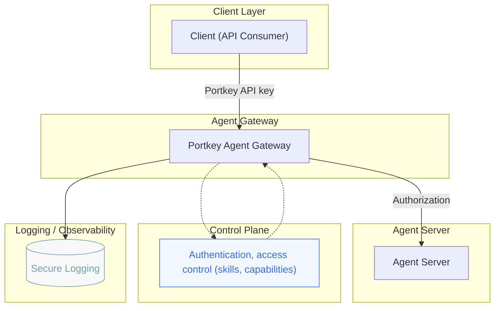

<Info>
  Supported agent frameworks: [A2A
  agents](https://a2a-protocol.org/latest/topics/what-is-a2a/#understanding-the-agent-stack-a2a-mcp-agent-frameworks-and-models)
</Info>

<CardGroup cols={2}>
  <Card
    title="Quickstart"
    icon="rocket"
    href="/product/agent-gateway/quickstart"
  >
    Skip to the quickstart
  </Card>
  <Card
    title="Advanced code snippets and examples"
    icon="code"
    href="/product/agent-gateway/advanced-code-snippets-and-examples"
  >
    Advanced code snippets and examples for the Agent Gateway
  </Card>
</CardGroup>

## Introduction

Feel free to consume the documentation in any order you prefer, the quickstart is a good place to start to get going.

The Agent Gateway consists of 2 components:

- [Agent Registry](/product/agent-gateway/registry): A centralised registry of all agents in your organization with access control and observability.
- [Agent Servers](/product/agent-gateway/servers): Agent servers that act as a client to the upstream agent server and as a server to the downstream agent clients.

The agent gateway acts as a centralised proxy for your agent servers. Sitting in between your agent clients and your agent servers.

Here is a broad architecture diagram:

