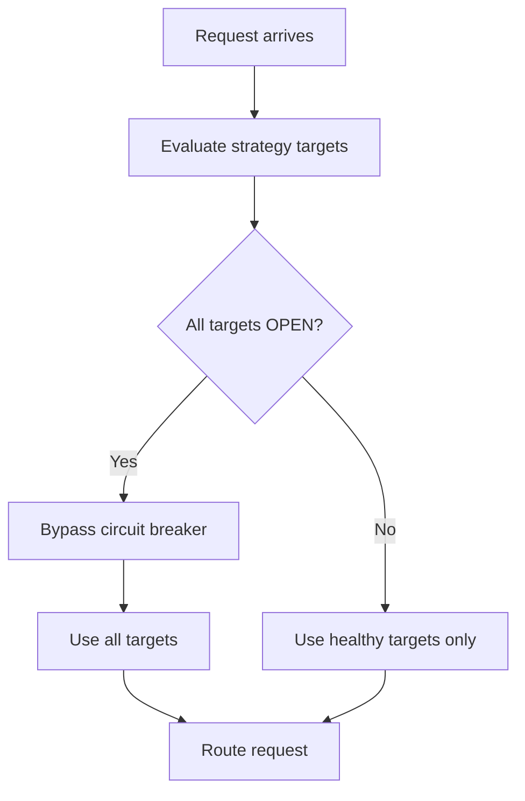

<Info>
Available on all Portkey [plans](https://portkey.ai/pricing).
</Info>

Circuit breakers prevent cascading failures by temporarily blocking requests to targets that are failing.

## Config Schema

| Field | Description |
|-------|-------------|
| `failure_threshold` | Number of failures to open circuit |
| `failure_threshold_percentage` | Percentage failure rate to trip circuit *(optional)* |
| `cooldown_interval` | Milliseconds to wait before retrying (min: 30s) |
| `failure_status_codes` | HTTP codes considered failures *(optional, default: >500)* |
| `minimum_requests` | Requests required before evaluating failure rate *(optional)* |

<Info>
- Strategies inherit `cb_config` from parent if not set
- Targets inherit from their parent strategy
</Info>

<Warning>
`conditional` mode strategies are **not** evaluated by circuit breaker.
</Warning>

## Example

```json
{
  "strategy": {
    "mode": "fallback",
    "cb_config": {
      "failure_threshold_percentage": 20,
      "minimum_requests": 10,
      "cooldown_interval": 60000,
      "failure_status_codes": [401, 429, 500]
    }
  },
  "targets": [
    { "override_params": { "model": "@openai-prod/gpt-4o" } },
    { "override_params": { "model": "@anthropic-prod/claude-3-5-sonnet-20241022" } }
  ]
}
```

<Info>
The `@provider-slug/model-name` format automatically routes to the correct provider. Set up providers in [Model Catalog](https://app.portkey.ai/model-catalog).
</Info>

## How It Works

Circuit breaker tracks per strategy path:
- Failure and success counts
- Time of first failure
- Failure rate (when `minimum_requests` threshold met)

**Circuit opens (OPEN)** when:
- Failure count exceeds `failure_threshold`, or
- Failure rate exceeds `failure_threshold_percentage`

**Circuit closes (CLOSED)** automatically after `cooldown_interval` passes.

## Runtime Behavior



- Unhealthy targets removed from routing
- If all targets are OPEN, circuit breaker is bypassed
