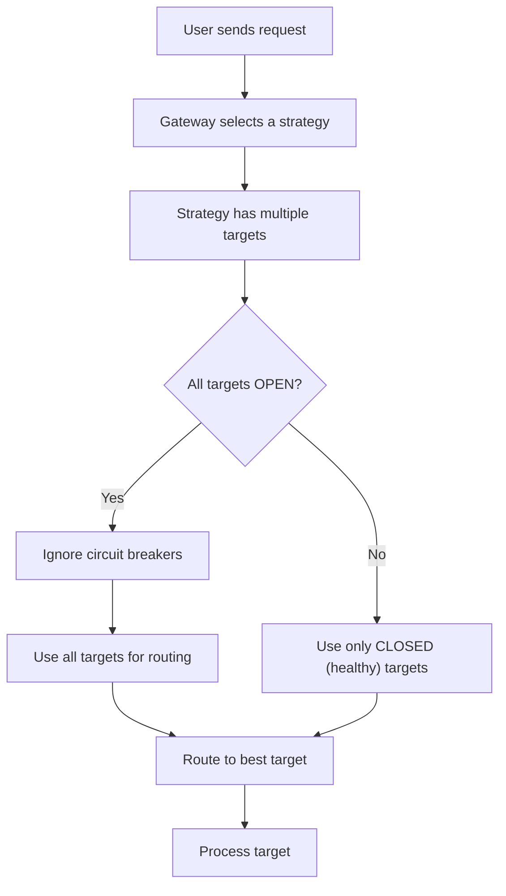

<Info>
This feature is available on all Portkey [plans](https://portkey.ai/pricing).
</Info>

## Circuit Breaker Config Schema

Each `strategy` in a config may define a `cb_config` with the following fields:

- **failure_threshold**: Number of failures after which the circuit opens.
- **failure_threshold_percentage** *(optional)*: Percentage failure rate to trip the circuit.
- **cooldown_interval**: Time (in milliseconds) to wait before allowing retries. A minimum of 30 seconds is enforced.
- **failure_status_codes** *(optional)*: Specific HTTP status codes considered as failures. If not provided, all status codes >500 are considered as failures.
- **minimum_requests** *(optional)*: Minimum number of requests required before failure rate is evaluated.

<Info>
- Strategies can inherit `cb_config` from a parent if not set at their level.
- Targets inherit `cb_config` from their parent strategy.
</Info>

<Warning>
Strategies using the `conditional` mode are **not considered** in circuit breaker logic. 
</Warning>

## Example Config

```json
{
  "strategy": {
    "mode": "fallback",
    "cb_config": {
      "failure_threshold_percentage": 20,
      "minimum_requests": 10,
      "cooldown_interval": 60000,
      "failure_status_codes": [
        401,
        429,
        500
      ]
    }
  },
  "targets": [
    {
      "virtual_key": "virtual-key-1"
    },
    {
      "virtual_key": "virtual-key-2"
    }
  ]
}
```

## Circuit State Evaluation

Circuit breaker logic is evaluated per strategy path. It tracks:

- Number of failures and successes.
- The time of the first failure.
- Whether the total requests meet the `minimum_requests` threshold and calculates failure rate as percentage

The circuit is **OPEN**(unhealthy) if:
- The failure count exceeds the `failure_threshold`, or
- The failure rate exceeds `failure_threshold_percentage`.

Once **OPEN**, requests to the affected targets are blocked until the `cooldown_interval` has passed.

When the cooldown period ends, the circuit is **CLOSED** automatically, and failure counters are reset.

## Runtime Behavior

- At each strategy level, the circuit breaker evaluates the status of all sibling targets.
- Unhealthy targets (circuit OPEN) are removed from the target list before strategy execution.
- If no healthy targets remain, circuit breaker is bypassed and all targets are used for routing.

