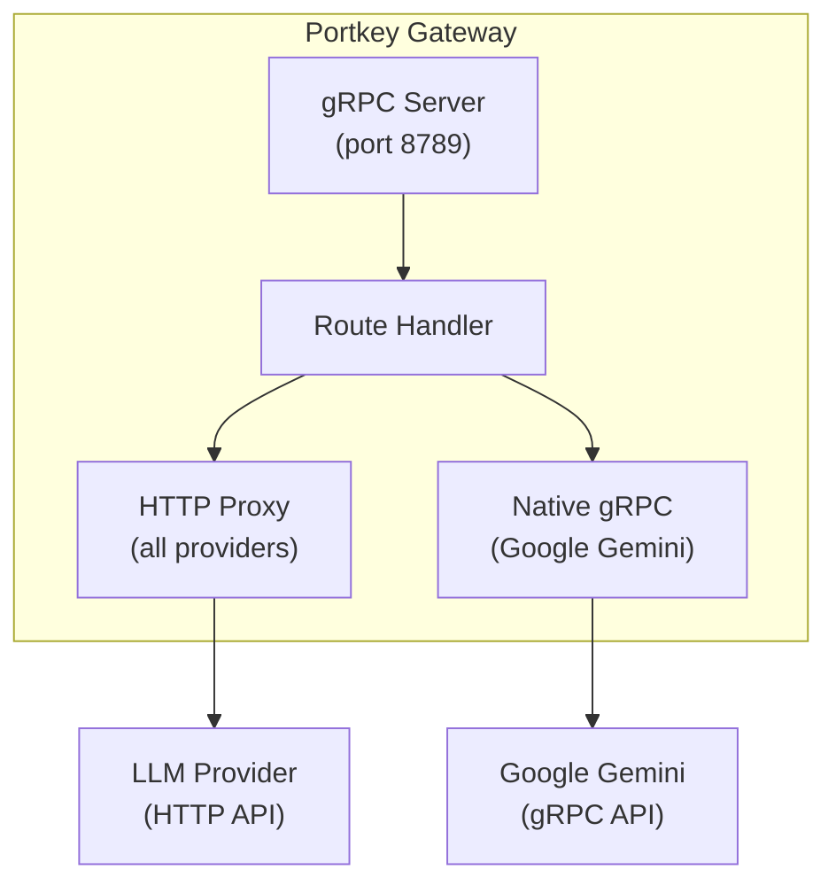

<Info>
  **Enterprise Feature** <br/> gRPC support is available on **Enterprise** self-hosted plans only. Contact the [Portkey team](/support/contact-us) to enable it for your gateway deployment.
</Info>

<Note>
  gRPC support is currently in **beta**. The API surface may change based on feedback.
</Note>

The Portkey Gateway supports **gRPC** as an alternative transport protocol alongside HTTP/REST. This enables lower latency, efficient binary serialization via Protocol Buffers, and native streaming support for applications that prefer gRPC communication.

## How It Works

The gateway operates in two modes depending on the provider:

| Mode | Description | Use Case |
|------|-------------|----------|
| **gRPC → HTTP Proxy** | Gateway accepts gRPC requests and converts them to HTTP internally | Works with all providers |
| **Native gRPC** | Gateway connects to the provider's native gRPC endpoint directly | Lower latency for supported providers (e.g., Google Gemini) |



For providers without a native gRPC endpoint, the gateway transparently proxies gRPC requests over HTTP — so **every provider** supported by Portkey works out of the box. When a provider *does* expose a native gRPC API (currently Google Gemini), the gateway connects directly for optimal performance.

## Starting the gRPC Server

### Command Line Flags

```bash
# Start only the gRPC server (default port 8789)
npm start -- --llm-grpc

# Start both HTTP and gRPC servers
npm start -- --llm-node --llm-grpc

# With custom ports
npm start -- --llm-node --llm-grpc --port 8787 --grpc-port 50051
```

### Environment Variables

| Variable | Default | Description |
|----------|---------|-------------|
| `GRPC_PORT` | `8789` | Port for the gRPC server |
| `PORT` | `8787` | Port for the HTTP server (used as base URL for internal routing) |

### Enabling TLS

The gRPC server supports TLS using the same certificates as the HTTP server:

```bash
TLS_KEY_PATH=/path/to/key.pem \
TLS_CERT_PATH=/path/to/cert.pem \
npm start -- --llm-grpc
```

## Authentication

Pass your Portkey API key as gRPC metadata:

| Metadata Key | Description |
|--------------|-------------|
| `x-portkey-api-key` | Your Portkey API key |

With the [Model Catalog](/product/model-catalog), the provider is specified in the model string itself (`@provider_slug/model_name`), so separate provider headers are typically not needed.

## Making Requests

All request bodies are sent as a JSON string in the `input` field of the `GatewayRequest` message. Each endpoint returns responses in a consistent format matching the API you called, regardless of the underlying provider:

- **ChatCompletions** and **Embeddings** — OpenAI-compatible format
- **Messages** — Anthropic Messages format
- **Responses** — OpenAI Responses API format

The gateway handles all provider-to-format translation automatically — you always get the format matching the endpoint you called, no matter which LLM is behind it.

### Model String Format

Portkey uses the [Model Catalog](/product/model-catalog) format for model strings:

```
@provider_slug/model_name
```

Examples: `@openai/gpt-4o`, `@gemini/gemini-2.0-flash`, `@anthropic/claude-3-opus-20240229`, `@azure-openai/gpt-4`

### Chat Completions

<Tabs>
  <Tab title="grpcurl">
```bash
# Non-streaming
grpcurl -plaintext \
  -H 'x-portkey-api-key: YOUR_PORTKEY_KEY' \
  -d '{
    "input": "{\"model\": \"@openai/gpt-4o\", \"messages\": [{\"role\": \"user\", \"content\": \"Hello!\"}]}"
  }' \
  localhost:8789 gateway.Gateway/ChatCompletions
```

```bash
# Streaming
grpcurl -plaintext \
  -H 'x-portkey-api-key: YOUR_PORTKEY_KEY' \
  -d '{
    "input": "{\"model\": \"@openai/gpt-4o\", \"messages\": [{\"role\": \"user\", \"content\": \"Count from 1 to 5\"}], \"stream\": true}"
  }' \
  localhost:8789 gateway.Gateway/ChatCompletionsStream
```
  </Tab>
  <Tab title="Python (grpcio)">
```python
import grpc
import json

# Generate Python stubs from proto:
# python -m grpc_tools.protoc -I. --python_out=. --grpc_python_out=. gateway.proto

import gateway_pb2
import gateway_pb2_grpc

channel = grpc.insecure_channel('localhost:8789')
stub = gateway_pb2_grpc.GatewayStub(channel)

metadata = [
    ('x-portkey-api-key', 'YOUR_PORTKEY_KEY'),
]

# Non-streaming
request = gateway_pb2.GatewayRequest(
    input=json.dumps({
        "model": "@openai/gpt-4o",
        "messages": [{"role": "user", "content": "Hello!"}]
    })
)

response = stub.ChatCompletions(request, metadata=metadata)
print(f"Status: {response.status_code}")
print(f"Response: {response.body.decode('utf-8')}")

# Streaming
stream_request = gateway_pb2.GatewayRequest(
    input=json.dumps({
        "model": "@openai/gpt-4o",
        "messages": [{"role": "user", "content": "Count to 5"}],
        "stream": True
    })
)

for chunk in stub.ChatCompletionsStream(stream_request, metadata=metadata):
    print(f"Chunk: {chunk.data.decode('utf-8')}")
```
  </Tab>
  <Tab title="Node.js (@grpc/grpc-js)">
```javascript
// Using CommonJS require() for compatibility.
// For ESM, use: import grpc from '@grpc/grpc-js';
const grpc = require('@grpc/grpc-js');
const protoLoader = require('@grpc/proto-loader');

const packageDefinition = protoLoader.loadSync('gateway.proto', {
  keepCase: true,
  longs: String,
  enums: String,
  defaults: true,
  oneofs: true,
});

const gatewayProto = grpc.loadPackageDefinition(packageDefinition).gateway;

const client = new gatewayProto.Gateway(
  'localhost:8789',
  grpc.credentials.createInsecure()
);

const metadata = new grpc.Metadata();
metadata.set('x-portkey-api-key', 'YOUR_PORTKEY_KEY');

// Non-streaming
client.ChatCompletions(
  {
    input: JSON.stringify({
      model: '@openai/gpt-4o',
      messages: [{ role: 'user', content: 'Hello!' }],
    }),
  },
  metadata,
  (error, response) => {
    if (error) {
      console.error('Error:', error);
      return;
    }
    console.log('Status:', response.status_code);
    console.log('Response:', response.body.toString('utf-8'));
  }
);

// Streaming
const call = client.ChatCompletionsStream(
  {
    input: JSON.stringify({
      model: '@openai/gpt-4o',
      messages: [{ role: 'user', content: 'Count to 5' }],
      stream: true,
    }),
  },
  metadata
);

call.on('data', (chunk) => {
  console.log('Chunk:', chunk.data.toString('utf-8'));
});

call.on('end', () => {
  console.log('Stream ended');
});

call.on('error', (error) => {
  console.error('Stream error:', error);
});
```
  </Tab>
</Tabs>

### Anthropic Messages

<Tabs>
  <Tab title="grpcurl">
```bash
grpcurl -plaintext \
  -H 'x-portkey-api-key: YOUR_PORTKEY_KEY' \
  -d '{
    "input": "{\"model\": \"@anthropic/claude-3-opus-20240229\", \"messages\": [{\"role\": \"user\", \"content\": \"What is the capital of France?\"}], \"max_tokens\": 100}"
  }' \
  localhost:8789 gateway.Gateway/Messages
```
  </Tab>
  <Tab title="grpcurl (Streaming)">
```bash
grpcurl -plaintext \
  -H 'x-portkey-api-key: YOUR_PORTKEY_KEY' \
  -d '{
    "input": "{\"model\": \"@anthropic/claude-3-opus-20240229\", \"messages\": [{\"role\": \"user\", \"content\": \"What is the capital of France?\"}], \"max_tokens\": 100, \"stream\": true}"
  }' \
  localhost:8789 gateway.Gateway/MessagesStream
```
  </Tab>
</Tabs>

### OpenAI Responses

<Tabs>
  <Tab title="grpcurl">
```bash
grpcurl -plaintext \
  -H 'x-portkey-api-key: YOUR_PORTKEY_KEY' \
  -d '{
    "input": "{\"model\": \"@openai/gpt-4o\", \"input\": \"Tell me a joke\"}"
  }' \
  localhost:8789 gateway.Gateway/Responses
```
  </Tab>
  <Tab title="grpcurl (Streaming)">
```bash
grpcurl -plaintext \
  -H 'x-portkey-api-key: YOUR_PORTKEY_KEY' \
  -d '{
    "input": "{\"model\": \"@openai/gpt-4o\", \"input\": \"Tell me a joke\", \"stream\": true}"
  }' \
  localhost:8789 gateway.Gateway/ResponsesStream
```
  </Tab>
</Tabs>

### Embeddings

```bash
grpcurl -plaintext \
  -H 'x-portkey-api-key: YOUR_PORTKEY_KEY' \
  -d '{
    "input": "{\"model\": \"@openai/text-embedding-3-small\", \"input\": \"The quick brown fox jumps over the lazy dog\"}"
  }' \
  localhost:8789 gateway.Gateway/Embeddings
```

### Health Check

```bash
grpcurl -plaintext localhost:8789 gateway.Gateway/Health
```

```json
{
  "status": "success",
  "message": "Server is healthy",
  "version": "1.x.x"
}
```

## Native gRPC Providers

When a provider exposes a native gRPC API, the gateway bypasses HTTP entirely and makes direct gRPC calls for the lowest possible latency.

| Provider | Transport | Streaming | Endpoint |
|----------|-----------|-----------|----------|
| Google Gemini | Native gRPC | Yes | `generativelanguage.googleapis.com:443` |
| OpenAI | HTTP proxy | Yes | — |
| Anthropic | HTTP proxy | Yes | — |
| Azure OpenAI | HTTP proxy | Yes | — |

### How Native gRPC Works

When a request targets a native gRPC provider, the gateway:

1. Detects the gRPC transport via the `x-portkey-gateway-transport: grpc` header
2. Transforms the request into the provider's native gRPC format
3. Makes a direct gRPC call to the provider's endpoint
4. Transforms the response back to the format matching the endpoint you called

This eliminates HTTP/JSON serialization overhead, uses efficient binary Protocol Buffer encoding, and maintains persistent gRPC connections with client caching.

<Tabs>
  <Tab title="Gemini (Non-Streaming)">
```bash
grpcurl -plaintext \
  -H 'x-portkey-api-key: YOUR_PORTKEY_KEY' \
  -d '{
    "input": "{\"model\": \"@gemini/gemini-2.0-flash\", \"messages\": [{\"role\": \"user\", \"content\": \"Hello!\"}]}"
  }' \
  localhost:8789 gateway.Gateway/ChatCompletions
```
  </Tab>
  <Tab title="Gemini (Streaming)">
```bash
grpcurl -plaintext \
  -H 'x-portkey-api-key: YOUR_PORTKEY_KEY' \
  -d '{
    "input": "{\"model\": \"@gemini/gemini-2.0-flash\", \"messages\": [{\"role\": \"user\", \"content\": \"Explain quantum computing\"}], \"stream\": true}"
  }' \
  localhost:8789 gateway.Gateway/ChatCompletionsStream
```
  </Tab>
</Tabs>

<Tip>
  The gateway handles all format transformations automatically — you send requests in the format matching the endpoint (Chat Completions, Messages, or Responses) and receive responses in that same format, regardless of the underlying provider.
</Tip>

## gRPC Service Definition

The gateway exposes a single `Gateway` service with the following methods:

```protobuf
service Gateway {
  // Health check
  rpc Health(Empty) returns (HealthResponse);

  // Embeddings (non-streaming)
  rpc Embeddings(GatewayRequest) returns (GatewayResponse);

  // Chat completions
  rpc ChatCompletions(GatewayRequest) returns (GatewayResponse);
  rpc ChatCompletionsStream(GatewayRequest) returns (stream StreamChunk);

  // Anthropic Messages
  rpc Messages(GatewayRequest) returns (GatewayResponse);
  rpc MessagesStream(GatewayRequest) returns (stream StreamChunk);

  // OpenAI Responses
  rpc Responses(GatewayRequest) returns (GatewayResponse);
  rpc ResponsesStream(GatewayRequest) returns (stream StreamChunk);
}
```

### Message Types

```protobuf
message GatewayRequest {
  string input = 1;  // JSON request body
}

message GatewayResponse {
  int32 status_code = 1;
  bytes body = 2;     // JSON response body
}

message StreamChunk {
  bytes data = 1;     // SSE-formatted chunk data
}

message HealthResponse {
  string status = 1;
  string message = 2;
  string version = 3;
}
```

### Service Discovery

The gRPC server supports reflection, enabling service discovery with tools like `grpcurl`:

```bash
# List all services
grpcurl -plaintext localhost:8789 list

# Describe the Gateway service
grpcurl -plaintext localhost:8789 describe gateway.Gateway

# Describe a specific method
grpcurl -plaintext localhost:8789 describe gateway.Gateway.ChatCompletions
```

## Response Format

The `GatewayResponse` contains an HTTP status code and a JSON body. The response format depends on which endpoint you called — the gateway ensures consistency regardless of the underlying provider.

### ChatCompletions

Returns the standard OpenAI Chat Completions format:

<Tabs>
  <Tab title="Non-Streaming">
```json
{
  "id": "portkey-xxx",
  "object": "chat.completion",
  "created": 1234567890,
  "model": "gemini-2.0-flash",
  "provider": "google",
  "choices": [
    {
      "index": 0,
      "message": {
        "role": "assistant",
        "content": "Hello! How can I help you today?"
      },
      "finish_reason": "stop"
    }
  ],
  "usage": {
    "prompt_tokens": 10,
    "completion_tokens": 15,
    "total_tokens": 25
  }
}
```
  </Tab>
  <Tab title="Streaming">
Each `StreamChunk` contains SSE-formatted data:

```
data: {"id":"portkey-xxx","object":"chat.completion.chunk","choices":[{"index":0,"delta":{"role":"assistant","content":"Hello"},"finish_reason":null}]}

data: {"id":"portkey-xxx","object":"chat.completion.chunk","choices":[{"index":0,"delta":{"content":"!"},"finish_reason":null}]}

data: {"id":"portkey-xxx","object":"chat.completion.chunk","choices":[{"index":0,"delta":{},"finish_reason":"stop"}],"usage":{"prompt_tokens":10,"completion_tokens":2,"total_tokens":12}}

data: [DONE]
```
  </Tab>
</Tabs>

### Messages (Anthropic)

Returns the Anthropic Messages format — even when the underlying provider is not Anthropic (e.g., calling `Messages` with `@openai/gpt-4o`):

```json
{
  "id": "msg_xxx",
  "type": "message",
  "role": "assistant",
  "content": [
    {
      "type": "text",
      "text": "The capital of France is Paris."
    }
  ],
  "model": "claude-3-opus-20240229",
  "stop_reason": "end_turn",
  "usage": {
    "input_tokens": 14,
    "output_tokens": 10
  }
}
```

### Responses (OpenAI Responses API)

Returns the OpenAI Responses API format:

```json
{
  "id": "resp_xxx",
  "object": "response",
  "created_at": 1234567890,
  "model": "gpt-4o",
  "output": [
    {
      "type": "message",
      "role": "assistant",
      "content": [
        {
          "type": "output_text",
          "text": "Why did the chicken cross the road? To get to the other side!"
        }
      ]
    }
  ],
  "usage": {
    "input_tokens": 8,
    "output_tokens": 18,
    "total_tokens": 26
  }
}
```

### Response Metadata

HTTP response headers are returned as gRPC trailing metadata:

```
x-portkey-trace-id: xxx-xxx-xxx
x-portkey-provider: google
x-portkey-cache-status: DISABLED
x-portkey-retry-attempt-count: 0
```

## Error Handling

Provider and request errors are returned inside the `GatewayResponse.status_code` field, not as gRPC status codes on the wire. The gRPC call itself will return `OK` unless there is a gateway infrastructure failure (e.g., server crash, proto parse error).

Use the table below to interpret the `status_code` value in the response:

| Status Code | Equivalent gRPC Status | Description |
|-------------|------------------------|-------------|
| 200 | `OK` | Success |
| 400 | `INVALID_ARGUMENT` | Bad request |
| 401 | `UNAUTHENTICATED` | Invalid API key |
| 403 | `PERMISSION_DENIED` | Access denied |
| 404 | `NOT_FOUND` | Resource not found |
| 429 | `RESOURCE_EXHAUSTED` | Rate limited |
| 500 | `INTERNAL` | Server error |
| 503 | `UNAVAILABLE` | Service unavailable |
| 504 | `DEADLINE_EXCEEDED` | Timeout |

<Note>
  Always check `GatewayResponse.status_code` to detect errors — do not rely on the gRPC call status alone.
</Note>

Error responses include details in the body:

```json
{
  "error": {
    "message": "Invalid API key",
    "type": "authentication_error",
    "code": "invalid_api_key"
  }
}
```

## When to Use gRPC vs HTTP

| Use gRPC when... | Use HTTP when... |
|-------------------|-------------------|
| You need the lowest possible latency | You have browser-based clients (gRPC-Web requires a proxy) |
| You have high-throughput streaming workloads | You need simple integrations with widely supported REST |
| You're in a service-to-service architecture with protobuf | You need easy debugging with standard HTTP tools |
| You want native gRPC connections to providers like Google Gemini | |

### Connection Management

The gateway maintains a cache of gRPC client connections:
- Connections are reused per API key for efficiency
- Stale connections are automatically cleaned up
- Default timeout: **60 seconds** (300 seconds for streaming)

## Limitations

<Warning>
  The following limitations apply during the beta period:
</Warning>

- WebSocket-based realtime endpoints (`/v1/realtime`) are **not** available via gRPC
- File upload/download operations use HTTP proxy mode only
- Batch operations use HTTP proxy mode only
- Only server-side streaming is supported (no bidirectional streaming)

## Troubleshooting

### Connection Refused

```
Error: 14 UNAVAILABLE: Connection refused
```

Ensure the gRPC server is running with the `--llm-grpc` flag:

```bash
npm start -- --llm-grpc
```

### Authentication Errors

```
Error: 16 UNAUTHENTICATED
```

Verify your Portkey API key is correctly passed as gRPC metadata:

```bash
grpcurl -H 'x-portkey-api-key: YOUR_KEY' ...
```

### INVALID_ARGUMENT Errors

```
Error: 3 INVALID_ARGUMENT
```

Check that your request JSON is valid and properly escaped in the `input` field. Ensure the model string follows the `@provider_slug/model_name` format.

### Timeout Issues

For long-running requests, increase the client-side timeout:

<Tabs>
  <Tab title="Python">
```python
response = stub.ChatCompletions(
    request,
    metadata=metadata,
    timeout=120.0  # 120 seconds
)
```
  </Tab>
  <Tab title="Node.js">
```javascript
client.ChatCompletions(
  request,
  metadata,
  { deadline: Date.now() + 120000 },
  callback
);
```
  </Tab>
</Tabs>
