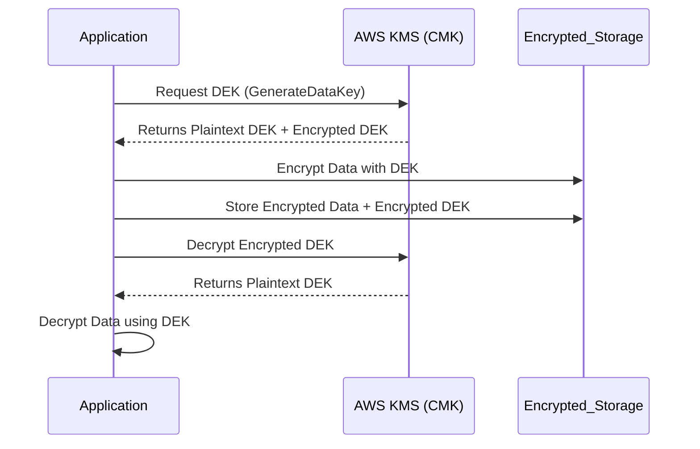

This document outlines how customers can bring their own encryption keys to Portkey AI to encrypt data at storage.

## Overview

Portkey AI supports integration with Key Management Services (KMS) to encrypt data at storage. This integration allows customers to manage their encryption keys and data protection policies through their existing KMS infrastructure.

## Supported KMS Providers

Portkey AI supports integration with the following KMS providers:

- AWS KMS

### Encryption Methodology

Envelope encryption is used to encrypt data at storage. The data is encrypted with a key that is stored in the KMS provider.



### Encrypted Fields
- Configs
    - Full template
- LLM Integrations
    - Auth Key
    - Auth Configuration
- Prompts
    - Full Template
- Prompt Partials
    - Full Template
- Guardrails
    - Checks 
    - Actions
- Integrations/Plugins
    - Auth Credentials/Keys
- SSO/OAuth
    - Client Secret
    - Auth Settings

### Integration Steps:

Integrating with a KMS provider requires the following steps:
1. Create a KMS key in your KMS provider.
2. Update the key policy to allow Portkey AI to access the key.
3. Share the ARN of the key with the Portkey AI team.

For AWS KMS, the Portkey Account ARN is:
```sh Portkey Account ARN
arn:aws:iam::299329113195:role/EnterpriseKMSPolicy
```

<Note>
The above ARN only works when control plane is hosted on [hosted app](https://app.portkey.ai/).<br />

To enable KMS for AWS in your Portkey Enterprise self hosted control plane deployment. Please reach out to your Portkey representative or contact us on support@portkey.ai.
</Note>

## AWS KMS Key Creation Guide

1. Go to **Key Management Service (KMS)** in the AWS console and navigate to **Customer Managed Keys**.
2. Click on **Create Key**.
3. Select:
   - **Key Type**: Symmetric  
   - **Key Usage**: Encrypt and Decrypt
4. Name the key according to your criteria.
5. Define key administrative permissions according to your criteria.
6. Define key usage permissions according to your criteria.
7. Once created, update the **Key Policy** with the following policy:

```json
{
  "Version": "2012-10-17",
  "Id": "key-consolepolicy-3",
  "Statement": [
    {
      "Sid": "Allow use of the key",
      "Effect": "Allow",
      "Principal": {
        "AWS": "arn:aws:iam::299329113195:role/EnterpriseKMSPolicy"
      },
      "Action": [
        "kms:Encrypt",
        "kms:Decrypt",
        "kms:ReEncrypt*",
        "kms:GenerateDataKey*",
        "kms:DescribeKey"
      ],
      "Resource": "*"
    }
  ]
}
```

8. Update the Key Arn in Portkey AI Admin Settings.
