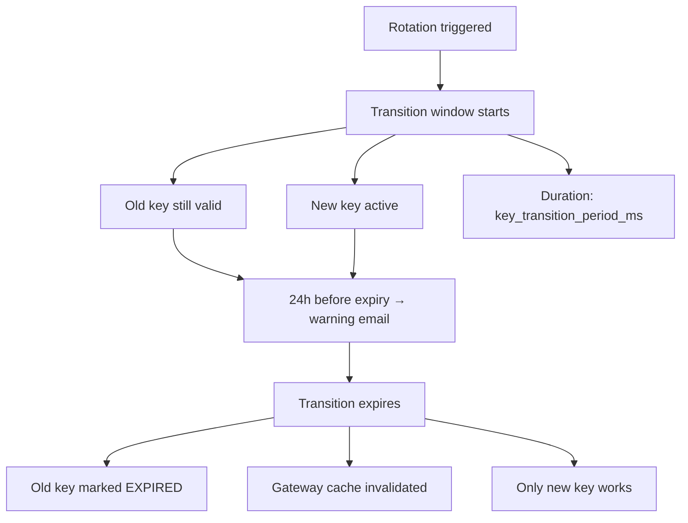

<Note>
**Availability:** This feature is live on Portkey Cloud. For self-hosted deployments — **Airgapped:** Backend `v1.13.0+` | **Hybrid:** Gateway Enterprise `v2.5.0+`.
</Note>

<Warning>
Most older versions are compatible, but there are known edge cases around cache invalidation during the transition window. We recommend upgrading to the versions above for full support.
</Warning>

## Overview

API Key Rotation allows customers to periodically replace their API key secrets without downtime. When a key is rotated, a new key is issued immediately while the old key continues to work for a configurable **transition period**, giving teams time to update their integrations. Rotation can be triggered manually or run automatically on a schedule.

## Key Concepts

| Concept | Description |
|---|---|
| **Rotation** | Replacing the current API key secret with a new one |
| **Transition Period** | Window during which both old and new keys are valid (minimum & default: 30 minutes) |
| **Rotation Policy** | Per-key schedule configuration that drives automatic rotation |
| **Key Version** | A record of the old key kept active during the transition period |

At any point, **at most 2 keys are active** for a given API key: the current key and one previous version still within its transition window.

## Rotation Modes

### Manual Rotation

Triggered via API call. The caller receives the new key in the response.

**Endpoint:** [`POST /v2/api-keys/:apiKeyId/rotate`](/api-reference/admin-api/control-plane/api-keys/rotate-api-key)

**Request body (optional):**

```json
{
  "key_transition_period_ms": 3600000
}
```

- `key_transition_period_ms` — overrides the policy/default transition period for this rotation. Minimum: `1800000` (30 min).

**Response:**

```json
{
  "id": "<api-key-id>",
  "key": "<new-key-secret>",
  "key_transition_expires_at": "2026-04-08T12:30:00.000Z"
}
```

**Constraints:**
- Cannot rotate if a previous version is still in transition. Wait for the transition to expire first.
- If a rotation policy with `rotation_period` exists, the transition period must be shorter than the rotation period.

**Required scope:** `*.rotate` (e.g., `organisation-service-api-keys.rotate`, `workspace-user-api-keys.rotate`)

### Automatic Rotation

Driven by a background worker that runs on a recurring schedule. It performs four phases each run:

| Phase | Action |
|---|---|
| **Expire old versions** | Marks version keys past their transition window as `EXPIRED` and invalidates their gateway cache |
| **Rotate due keys** | Rotates any key whose `next_rotation_at <= now()`, generates a new secret, and computes the next rotation date |
| **Transition expiry warnings** | Sends email alerts for old key versions expiring within the next 24 hours |
| **Upcoming rotation warnings** | Sends email alerts for keys scheduled to rotate within the next 24 hours |

## Rotation Policy Configuration

A rotation policy can be attached to any API key at [**creation**](/api-reference/admin-api/control-plane/api-keys/create-api-key) or via [**update**](/api-reference/admin-api/control-plane/api-keys/update-api-key).

| Field | Type | Required | Description |
|---|---|---|---|
| `rotation_period` | `"weekly"` \| `"monthly"` | One of `rotation_period` or `next_rotation_at` | Recurring schedule. Weekly rotates every Monday 00:00 UTC; monthly rotates on the 1st of each month 00:00 UTC |
| `next_rotation_at` | ISO 8601 datetime | One of `rotation_period` or `next_rotation_at` | Explicit one-time or override date for the next rotation (normalized to UTC midnight) |
| `key_transition_period_ms` | integer (ms) | No | How long the old key stays valid after rotation. Min: `1800000` (30 min). Default: `1800000` |

<Note>`key_transition_period_ms` must be strictly less than the rotation period duration.</Note>

**Setting a policy on create:**

```json
{
  "name": "Production Key",
  "scopes": ["completions.write"],
  "rotation_policy": {
    "rotation_period": "monthly",
    "key_transition_period_ms": 86400000
  }
}
```

**Updating a policy:**

```json
{
  "rotation_policy": {
    "rotation_period": "weekly"
  }
}
```

**Removing a policy:** Set `rotation_policy` to `null` in the update request.

## How Rotation Works

1. A new API key secret is generated.
2. The current (old) key is saved to the **api_key_versions** table with a `key_transition_expires_at` timestamp.
3. The API key record is atomically updated with the new secret and `last_rotated_at` is set (both operations run in a single database transaction).
4. Gateway cache is invalidated for the old key.
5. A gateway sync job is queued to propagate the change.
6. If a recurring `rotation_period` exists, `next_rotation_at` is recomputed for the next cycle.

During the transition window, both the old and new key resolve to the same API key record. The gateway falls back to the versions table when a key string isn't found in the primary table.

## Transition Window Lifecycle



## Email Notifications

Three types of emails are sent by the system:

| Email | Trigger | Subject |
|---|---|---|
| **Rotation Alert** | Immediately after auto-rotation | "Action Required: API Key Rotated" |
| **Transition Expiry Warning** | Old key version expires within 24 hours | "Reminder: Old API Key Expiring Soon" |
| **Upcoming Rotation Warning** | Key scheduled to auto-rotate within 24 hours | "Reminder: API Key Scheduled for Rotation" |

**Recipients:** Organisation admins and owners, the key's owning user (for workspace-user keys), and any custom addresses in `alert_emails`.

## Reading Rotation State

[`GET /v2/api-keys/:apiKeyId`](/api-reference/admin-api/control-plane/api-keys/retrieve-an-api-key) returns the rotation policy alongside the key details:

```json
{
  "id": "...",
  "name": "Production Key",
  "key": "...",
  "rotation_policy": {
    "rotation_period": "monthly",
    "next_rotation_at": "2026-05-01T00:00:00.000Z",
    "key_transition_period_ms": 1800000,
    "status": "ACTIVE"
  }
}
```

## Cascade Behavior

| Event | Effect on Rotation |
|---|---|
| **API key deleted** | Rotation policy archived, active versions expired (all in one transaction) |
| **API key expired** | Same — policy archived, versions expired |
| **Rotation policy removed** (set to `null`) | Policy archived; no more auto-rotations; existing transition windows continue until they expire naturally |

## Permissions & Authorization

| Action | Required Scope Pattern |
|---|---|
| Configure rotation policy | `*.update` (same as editing the API key) |
| Trigger manual rotation | `*.rotate` |
| View rotation policy | `*.read` (same as reading the API key) |

Admins (org admin/owner, workspace admin/manager) can rotate any key within their scope. Non-admins can only rotate their own keys.

## Constraints & Limits

- Maximum 2 active key secrets at any time (current + one version in transition)
- Cannot rotate again while a previous transition is active
- `key_transition_period_ms` minimum: 30 minutes (`1800000` ms)
- `key_transition_period_ms` must be less than the rotation period
- `rotation_period` options: `weekly`, `monthly`
- `next_rotation_at` is always normalized to UTC midnight

## Audit Logging

Every rotation (manual and automatic) produces an audit log entry containing:

| Field | Value |
|---|---|
| `api_key_id` | The rotated key's ID |
| `rotation_mode` | `"manual"` or `"auto"` |
| `old_key_masked` | Masked version of the old key for traceability |
| `transition_expires_at` | When the old key stops working |

## Related

<CardGroup cols={3}>
  <Card title="Rotate API Key" icon="rotate" href="/api-reference/admin-api/control-plane/api-keys/rotate-api-key" />
  <Card title="Create API Key" icon="plus" href="/api-reference/admin-api/control-plane/api-keys/create-api-key" />
  <Card title="Update API Key" icon="pen" href="/api-reference/admin-api/control-plane/api-keys/update-api-key" />
  <Card title="Retrieve API Key" icon="eye" href="/api-reference/admin-api/control-plane/api-keys/retrieve-an-api-key" />
  <Card title="API Keys (AuthN & AuthZ)" icon="key" href="/product/enterprise-offering/org-management/api-keys-authn-and-authz" />
  <Card title="User Roles & Permissions" icon="shield" href="/product/enterprise-offering/org-management/user-roles-and-permissions" />
</CardGroup>
