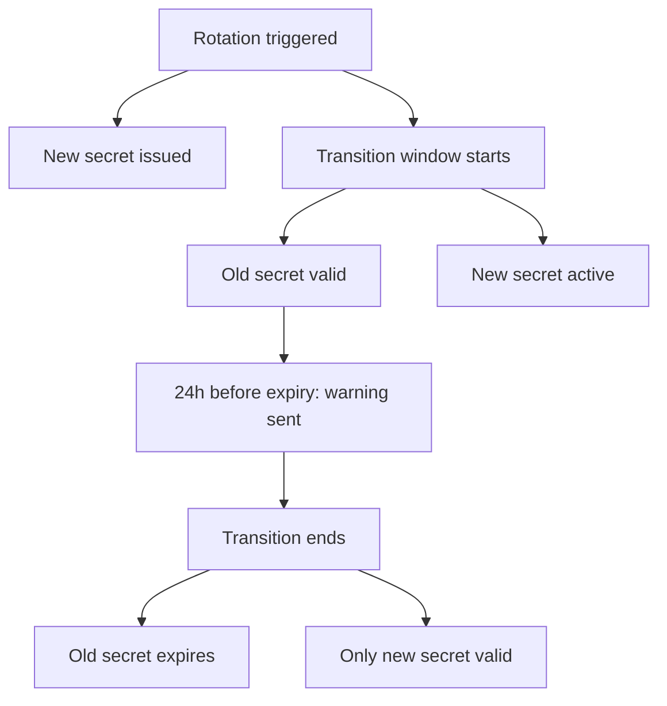

<Note>
**Availability:** API key rotation is available on **all plans** (Free, Growth, and Enterprise) on Portkey Cloud. 

For self-hosted deployments:
  - **Airgapped:** Backend `v1.14.0+`
  - **Hybrid:** Gateway Enterprise `v2.5.0+`
</Note>

## Overview

API Key Rotation enables you to replace API key secrets without causing service disruption.

When a key is rotated:

* A new secret is generated immediately.
* The previous secret remains valid for a configurable **transition period**, allowing time to update existing integrations.
* After the transition period ends, the old secret is automatically revoked.

You can initiate rotation:

* **Manually**, on demand
* **Automatically**, using a defined schedule

**Key Characteristics**

* The **API key ID remains unchanged** during rotation.
* Only the **secret value is updated**.
* Existing usage data, such as budget tracking, cost attribution, and analytics - continues to be associated with the same key.

## Key Concepts

| Concept               | Description                                                                                                         |
| --------------------- | ------------------------------------------------------------------------------------------------------------------- |
| **Rotation**          | Replaces the current API key secret with a newly generated secret                                                   |
| **Transition Period** | A configurable window during which both the previous and new secrets remain valid (minimum and default: 30 minutes) |
| **Rotation Policy**   | A per-key configuration that defines when automatic rotation occurs                                                 |
| **Key Version**       | A previous secret retained temporarily during the transition period                                                 |

## How Rotation Works

1. A new API key secret is generated.
2. The current secret is retained as a **previous version**, with a `key_transition_expires_at` timestamp.
3. The API key is updated with the new secret, and `last_rotated_at` is recorded.
4. The new secret becomes immediately valid for authentication.
5. If a `rotation_period` is configured, `next_rotation_at` is recalculated for the next cycle.

**During the transition window**

* Both the **previous** and **current** secrets are accepted.
* Requests authenticated with either secret resolve to the same API key.

## Transition Window Lifecycle



## Rotation Modes

### Manual Rotation

Triggered via API call. The caller receives the new key in the response.

**Endpoint:** [`POST /v2/api-keys/:apiKeyId/rotate`](/api-reference/admin-api/control-plane/api-keys/rotate-api-key)

**Request body (optional):**

```json
{
  "key_transition_period_ms": 3600000
}
```

- `key_transition_period_ms` — overrides the policy/default transition period for this rotation. Minimum: `1800000` (30 min).

**Response:**

```json
{
  "id": "<api-key-id>",
  "key": "<new-key-secret>",
  "key_transition_expires_at": "2026-04-08T12:30:00.000Z"
}
```

**Constraints:**
- Cannot rotate if a previous version is still in transition. Wait for the transition to expire first.
- If a rotation policy with `rotation_period` exists, the transition period must be shorter than the rotation period.

**Required scope:** `*.rotate` (e.g., `organisation-service-api-keys.rotate`, `workspace-user-api-keys.rotate`)

### Automatic Rotation

Automatic rotation is handled by a background worker that runs on a recurring schedule. On each run, the worker executes the following phases in order:

| Phase                          | Description                                                                                                                 |
| ------------------------------ | --------------------------------------------------------------------------------------------------------------------------- |
| **Expire old versions**        | Marks key versions whose transition window has ended as `EXPIRED`, making them unusable                                     |
| **Rotate due keys**            | Rotates keys that have reached their scheduled rotation time, issuing a new secret and updating the next rotation timestamp |
| **Transition expiry warnings** | Sends notifications for key versions that will expire within the next 24 hours                                              |
| **Upcoming rotation warnings** | Sends notifications for keys scheduled to rotate within the next 24 hours                                                   |

## Rotation Policy Configuration

A rotation policy can be attached to any API key at [**creation**](/api-reference/admin-api/control-plane/api-keys/create-api-key) or via [**update**](/api-reference/admin-api/control-plane/api-keys/update-api-key).

| Field | Type | Required | Description |
|---|---|---|---|
| `rotation_period` | `"weekly"` \| `"monthly"` | One of `rotation_period` or `next_rotation_at` | Recurring schedule. Weekly rotates every Monday 00:00 UTC; monthly rotates on the 1st of each month 00:00 UTC |
| `next_rotation_at` | ISO 8601 datetime | One of `rotation_period` or `next_rotation_at` | Explicit one-time or override date for the next rotation (normalized to UTC midnight) |
| `key_transition_period_ms` | integer (ms) | No | How long the old key stays valid after rotation. Min: `1800000` (30 min). Default: `1800000` |

<Note>
- `key_transition_period_ms` must be strictly less than the rotation period duration.
- If both `rotation_period` and `next_rotation_at` are provided, 
`next_rotation_at` takes precedence for the upcoming rotation. 
- Subsequent rotations follow the `rotation_period`.
</Note>

**Setting a policy on create:**

```json
{
  "name": "Production Key",
  "scopes": ["completions.write"],
  "rotation_policy": {
    "rotation_period": "monthly",
    "key_transition_period_ms": 86400000
  }
}
```

**Updating a policy:**

```json
{
  "rotation_policy": {
    "rotation_period": "weekly"
  }
}
```

**Removing a policy:** Set `rotation_policy` to `null` in the update request.

## Email Notifications

These notifications are triggered during automatic rotation runs.:

| Email | Trigger | Subject |
|---|---|---|
| **Rotation Alert** | Immediately after auto-rotation | "Action Required: API Key Rotated" |
| **Transition Expiry Warning** | Old key version expires within 24 hours | "Reminder: Old API Key Expiring Soon" |
| **Upcoming Rotation Warning** | Key scheduled to auto-rotate within 24 hours | "Reminder: API Key Scheduled for Rotation" |

**Recipients:** Organisation admins and owners, the key's owning user (for workspace-user keys), and any custom addresses in `alert_emails`.

## Reading Rotation State

[`GET /v2/api-keys/:apiKeyId`](/api-reference/admin-api/control-plane/api-keys/retrieve-an-api-key) returns the rotation policy alongside the key details:

```json
{
  "id": "...",
  "name": "Production Key",
  "key": "...",
  "rotation_policy": {
    "rotation_period": "monthly",
    "next_rotation_at": "2026-05-01T00:00:00.000Z",
    "key_transition_period_ms": 1800000,
    "status": "ACTIVE"
  }
}
```

## Permissions & Authorization

| Action | Required Scope Pattern |
|---|---|
| Configure rotation policy | `*.update` (same as editing the API key) |
| Trigger manual rotation | `*.rotate` |
| View rotation policy | `*.read` (same as reading the API key) |

Admins (org admin/owner, workspace admin/manager) can rotate any key within their scope. Non-admins can only rotate their own keys.

## Constraints & Limits

* A maximum of **two active secrets** can exist per API key at any time:

  * The current secret
  * One previous secret within its transition window

* Rotation is **blocked while a transition is active** (i.e., until the previous secret expires)

* `key_transition_period_ms`:

  * Minimum: **30 minutes** (`1800000` ms)
  * Must be **strictly less than** the configured rotation period

* Supported `rotation_period` values:

  * `weekly`
  * `monthly`

* `next_rotation_at` is always normalized to **UTC midnight** for consistency across schedules


## Audit Logging

Every rotation (manual and automatic) produces an audit log entry containing:

| Field | Value |
|---|---|
| `api_key_id` | The rotated key's ID |
| `rotation_mode` | `"manual"` or `"auto"` |
| `old_key_masked` | Masked version of the old key for traceability |
| `transition_expires_at` | When the old key stops working |

## Notes

* Automatic rotation phases are executed sequentially within a single run.
* A single run may process multiple keys across different phases.
* Notifications are advisory and do not affect key validity.

## Related

<CardGroup cols={3}>
  <Card title="Rotate API Key" icon="rotate" href="/api-reference/admin-api/control-plane/api-keys/rotate-api-key" />
  <Card title="Create API Key" icon="plus" href="/api-reference/admin-api/control-plane/api-keys/create-api-key" />
  <Card title="Update API Key" icon="pen" href="/api-reference/admin-api/control-plane/api-keys/update-api-key" />
  <Card title="Retrieve API Key" icon="eye" href="/api-reference/admin-api/control-plane/api-keys/retrieve-an-api-key" />
  <Card title="API Keys (AuthN & AuthZ)" icon="key" href="/product/enterprise-offering/org-management/api-keys-authn-and-authz" />
  <Card title="User Roles & Permissions" icon="shield" href="/product/enterprise-offering/org-management/user-roles-and-permissions" />
</CardGroup>
