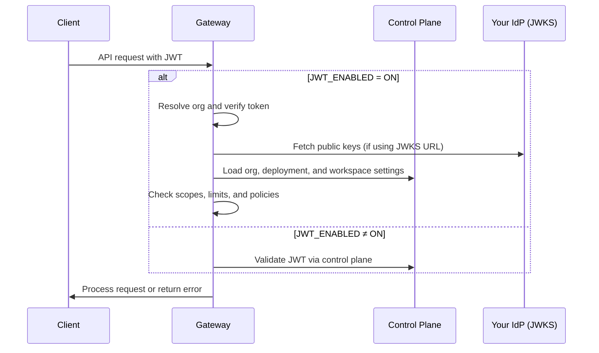

<Info>
  This feature is available only on the [Enterprise Plan](/product/enterprise-offering) of Portkey.
</Info>

Portkey supports JWT-based authentication in addition to API key authentication. Clients send a JWT in `x-portkey-api-key` or `Authorization: Bearer`; the token is validated against JWKS configured on the organisation.

**Portkey Cloud** validates JWTs on the control plane. **[Hybrid](/self-hosting/hybrid-deployments/architecture) and [air-gapped](/self-hosting/airgapped/model-pricing) deployments** can optionally enable **gateway-local JWT authentication** so the AI Gateway validates tokens locally instead of delegating every request to the control plane.

<Card href="/product/guardrails/list-of-guardrail-checks#basic-%E2%80%94-deterministic-guardrails" title="Validate JWT Token (Guardrail)">
    Optionally validate JWTs inside a config's hook pipeline using the JWT guardrail plugin. This is separate from gateway-local JWT auth, which replaces API key validation at the gateway.
</Card>

## Configuring JWT Authentication

JWT authentication can be configured under **Admin Settings** → **Organisation** → **Authentication**.

<Frame>
</img>
</Frame>

### JWKS Configuration

To validate JWTs, you must configure one of the following:

- **JWKS URL**: A URL from which the public keys will be dynamically fetched.
- **JWKS JSON**: A static JSON containing public keys.

## Hard Requirements (Read First)

### JWT Header (JOSE Header)
- `alg`: Must be `RS256`. Symmetric algorithms like `HS256` are not accepted.
- `typ`: Must be `JWT`.
- `kid`: Required. The value in the JWT header must match a `kid` in your JWKS.

### Key Requirements
- Key type: RSA
- Key size: 2048 bits or higher
- Your JWKS must expose only the public key parameters (e.g., `kty`, `n`, `e`, `use`, `alg`, `kid`). Do not include private key material.

## JWT Requirements

### Supported Algorithm

- JWTs must be signed using **RS256** (RSA Signature with SHA-256).

### Required Claims

Your JWT payload must contain the following claims:

| **Claim Key**                         | **Description**                                  |
|--------------------------------------|--------------------------------------------------|
| `portkey_oid` / `organisation_id`    | Unique identifier for the organization.          |
| `portkey_workspace` / `workspace_slug` | Identifier for the workspace.                  |
| `scope` / `scopes`                   | Permissions granted by the token.                |
| `exp`                                | Expiration time (as a UNIX timestamp, in seconds). |

- `exp` is mandatory. Tokens without `exp` or with expired `exp` are rejected. A small amount of clock skew is tolerated.
- `iat` and/or `nbf` are recommended but optional.

<Note>
On Portkey Cloud, `portkey_oid` and `portkey_workspace` are required. In [gateway-local JWT auth](#gateway-local-jwt-authentication), org and workspace can be resolved from deployment configuration when you use a standard IdP token - see [Integration modes](#integration-modes).
</Note>

### Optional Claims

| **Claim Key** | **Description**                                                                 |
|--------------|---------------------------------------------------------------------------------|
| `defaults`   | Object containing default settings applied to all requests made with this token. See [Embedding Default Configs](#embedding-default-configs-in-jwt) below. |
| `usage_limits` | Usage limits to enforce on requests made with this token.                     |
| `rate_limits`  | Rate limits to enforce on requests made with this token.                      |

### User Identification

Portkey identifies users in the following order of precedence for logging and metrics:

1. `email_id`
2. `sub`
3. `uid`

## End-to-End Working Example (Generate → Configure JWKS → Sign → Call)

The following example uses Node.js and the `jose` library to:
1) generate an RSA key pair,
2) create a JWKS containing the public key,
3) sign a JWT with the private key,
4) call Portkey with the JWT.

### 1) Prerequisites

```sh
# Node 18+ recommended
npm init -y
npm install jose
```

### 2) Generate RSA Keys, Create JWKS, and Sign a JWT (NodeJS)

Create `generate-and-sign-jwt.mjs`:

```js
import { generateKeyPair, exportJWK, SignJWT } from 'jose';
import { randomUUID } from 'node:crypto';
import fs from 'node:fs';

const { publicKey, privateKey } = await generateKeyPair('RS256');

// Create a public JWK for JWKS
const publicJwk = await exportJWK(publicKey);
publicJwk.kty = 'RSA';
publicJwk.use = 'sig';
publicJwk.alg = 'RS256';
publicJwk.kid = randomUUID();

const jwks = { keys: [publicJwk] };
fs.writeFileSync('jwks.json', JSON.stringify(jwks, null, 2));

const now = Math.floor(Date.now() / 1000);

// Sign a JWT with the private key
const jwt = await new SignJWT({
  portkey_oid: '<YOUR_ORG_ID>',
  portkey_workspace: '<YOUR_WORKSPACE_SLUG>',
  scope: ['completions.write', 'logs.view'],
  email_id: 'user@example.com',
  sub: '<YOUR_USER_ID>',
  // Optional: embed default config and metadata
  // defaults: { config_id: 'pc-your-config-id', metadata: { environment: 'production' } }
})
  .setProtectedHeader({ alg: 'RS256', kid: publicJwk.kid, typ: 'JWT' })
  .setIssuedAt(now)
  .setExpirationTime(now + 60 * 60) // 1 hour
  .sign(privateKey);

fs.writeFileSync('token.jwt', jwt);

console.log('JWKS written to jwks.json');
console.log('JWT written to token.jwt');
console.log('kid:', publicJwk.kid);
```

Run it:

```sh
node generate-and-sign-jwt.mjs
```

This produces:
- `jwks.json`: A JWKS containing your public key (with a `kid`).
- `token.jwt`: A signed JWT ready to use with Portkey.

### 3) Add Your Public Key to Portkey (JWKS)

In the Portkey Admin UI:
- Navigate to **Admin Settings** → **Organisation** → **Authentication**.
- Choose either:
  - JWKS URL: Host `jwks.json` at a reachable HTTPS URL and paste that URL.
  - JWKS JSON: Paste the entire contents of your generated `jwks.json`.
- Save changes.

Ensure the `kid` in your JWT header matches a key in the configured JWKS.

### 4) Call Portkey Using the Signed JWT

Send the JWT in the `x-portkey-api-key` header.

```sh
curl https://api.portkey.ai/v1/chat/completions \
  -H "Content-Type: application/json" \
  -H "x-portkey-api-key: $(cat token.jwt)" \
  -H "x-portkey-provider: @<YOUR_PROVIDER_SLUG>" \
  -d '{
    "model": "your-model-id",
    "messages": [
      { "role": "user", "content": "Hello!" }
    ]
  }'
```

If your JWT, JWKS, and claims are correct, the request will authenticate and succeed.

<Note>
If you prefer Python for signing, you can generate the RSA key pair using your preferred method, ensure the public key is present in your JWKS with a matching `kid`, and use a library like `PyJWT` to sign with `RS256` while setting the header `{ "alg": "RS256", "typ": "JWT", "kid": "<your-kid>" }`.
</Note>

## Authentication Process

1. The client sends the JWT in `x-portkey-api-key` or `Authorization: Bearer`:

   ```http
   x-portkey-api-key: <JWT_TOKEN>
   ```

   If `x-portkey-api-key` is absent, `Authorization` is used.

2. The gateway or control plane validates the JWT:
   - Verifies the signature using the organisation JWKS.
   - Checks token expiry.
   - Ensures required claims are present.

3. If valid, the request is authenticated and user details are extracted for authorization and logging.
4. If invalid, the request is rejected. Common responses include **401 Unauthorized** (invalid or expired token), **403 Forbidden** (scope or workspace not allowed), **412** (usage limit exceeded), and **429** (rate limit exceeded).

On hybrid and air-gapped gateways with `JWT_ENABLED=ON`, validation runs locally on the gateway. Otherwise, JWT-shaped tokens are validated by the control plane.

## Authorization & Scopes

Once the JWT is validated, the server checks for the required **scope**. Scopes can be provided in the JWT as either a single string or an array of strings using the `scope` or `scopes` claim.

<Expandable title="Available Permission Scopes">
  <Expandable title="Workspace Management">
    <ParamField query="workspaces.read" type="string">
      View workspace details
    </ParamField>
    <ParamField query="workspaces.update" type="string">
      Modify workspace settings
    </ParamField>
    <ParamField query="workspaces.list" type="string">
      List available workspaces
    </ParamField>
  </Expandable>

  <Expandable title="Logs & Analytics">
    <ParamField query="logs.export" type="string">
      Export logs to external systems
    </ParamField>
    <ParamField query="logs.list" type="string">
      List available logs
    </ParamField>
    <ParamField query="logs.view" type="string">
      View log details
    </ParamField>
    <ParamField query="logs.write" type="string">
      Create and modify logs
    </ParamField>
    <ParamField query="analytics.view" type="string">
      Access analytics data
    </ParamField>
  </Expandable>

  <Expandable title="Configurations">
    <ParamField query="configs.create" type="string">
      Create new configurations
    </ParamField>
    <ParamField query="configs.update" type="string">
      Update existing configurations
    </ParamField>
    <ParamField query="configs.delete" type="string">
      Delete configurations
    </ParamField>
    <ParamField query="configs.read" type="string">
      View configuration details
    </ParamField>
    <ParamField query="configs.list" type="string">
      List available configurations
    </ParamField>
  </Expandable>

  <Expandable title="Providers">
    <ParamField query="providers.create" type="string">
      Create new providers
    </ParamField>
    <ParamField query="provider.update" type="string">
      Update existing providers
    </ParamField>
    <ParamField query="virtual_keys.delete" type="string">
      Delete providers
    </ParamField>
    <ParamField query="providers.duplicate" type="string">
      Duplicate existing providers
    </ParamField>
    <ParamField query="providers.read" type="string">
      View provider details
    </ParamField>
    <ParamField query="providers.list" type="string">
      List available providers
    </ParamField>
  </Expandable>

  <Expandable title="Workspace Users">
    <ParamField query="workspace_users.create" type="string">
      Create new workspace users
    </ParamField>
    <ParamField query="workspace_users.read" type="string">
      View workspace user details
    </ParamField>
    <ParamField query="workspace_users.update" type="string">
      Update workspace user settings
    </ParamField>
    <ParamField query="workspace_users.delete" type="string">
      Remove users from workspace
    </ParamField>
    <ParamField query="workspace_users.list" type="string">
      List workspace users
    </ParamField>
  </Expandable>

  <Expandable title="Other">
    <ParamField query="prompts.render" type="string">
      Render prompt templates
    </ParamField>
    <ParamField query="completions.write" type="string">
      Create and manage completions
    </ParamField>
  </Expandable>
</Expandable>

Scopes can also be prefixed with `portkey.` (e.g., `portkey.completions.write`).

<Note>
    JWT tokens with appropriate scopes function identically to workspace API keys, providing access to workspace-specific operations. They cannot be used as organization API keys, which have broader administrative permissions across all workspaces.
</Note>

#### Example JWT Header

```json
{
  "alg": "RS256",
  "typ": "JWT",
  "kid": "<YOUR_KID>"
}
```

- This matches the signing example (`.setProtectedHeader({ alg: 'RS256', kid: publicJwk.kid, typ: 'JWT' })`).
- Ensure `kid` exactly matches one key in your configured JWKS.

## Embedding Default Configs in JWT

You can embed a default [config](/product/ai-gateway/configs) directly in the JWT payload using the `defaults` claim. This works the same way as [attaching default configs to API keys](/product/administration/enforce-default-config), but lets you control it per-token - useful when different users or services need different routing rules.

The `defaults` object supports the following fields:

| **Field**      | **Description**                                                                 |
|---------------|---------------------------------------------------------------------------------|
| `config_id`   | The ID of the config to apply as the default for all requests made with this token. |
| `metadata`    | A JSON object with custom metadata to attach to all requests.                   |

When a JWT with a `defaults.config_id` is used, Portkey validates that the config belongs to the same organization before applying it. If the config is not found or doesn't belong to the org, the default is ignored.

<Note>
  This follows the same precedence rules as API key default configs - if a user explicitly passes a config ID in their request headers, it will override the JWT default unless config override is disabled at the workspace level.
</Note>

### Example JWT Payload with Defaults

```json
{
  "portkey_oid": "3ed1b666-7e3d-416a-9260-da10e1610d1a",
  "portkey_workspace": "ws-shared-8622d1",
  "scope": ["completions.write", "logs.view"],
  "email_id": "user@example.com",
  "sub": "user-123",
  "exp": 1735689600,
  "defaults": {
    "config_id": "pc-your-config-id",
    "metadata": {
      "environment": "production",
      "team": "backend"
    }
  }
}
```

## Example JWT Payload

```json
{
  "portkey_oid": "3ed1b666-7e3d-416a-9260-da10e1610d1a",
  "portkey_workspace": "ws-shared-8622d1",
  "scope": ["completions.write", "logs.view"],
  "email_id": "user@example.com",
  "sub": "user-123",
  "exp": 1735689600
}
```

## Making API Calls with JWT Authentication

Once you have a valid JWT token, you can use it to authenticate your API calls to Portkey. Below are examples showing how to use JWT authentication with different SDKs.

<Tabs>
<Tab title="NodeJS">
Install the Portkey SDK with npm
```sh
npm install portkey-ai
```
<CodeGroup>
```ts Chat Completions
import Portkey from 'portkey-ai';

const client = new Portkey({
  apiKey: '<JWT_TOKEN>', // Use JWT token instead of API key
  provider: '@<YOUR_PROVIDER_SLUG>'

});

async function main() {
  const response = await client.chat.completions.create({
    messages: [{ role: "user", content: "Hello, how are you today?" }],
    model: "your-model-id",
  });

  console.log(response.choices[0].message.content);
}

main();
```
</CodeGroup>
</Tab>
<Tab title="Python">
Install the Portkey SDK with pip
```sh
pip install portkey-ai
```
<CodeGroup>
```py Chat Completions
from portkey_ai import Portkey

client = Portkey(
  api_key = "<JWT_TOKEN>", # Use JWT token instead of API key,
  provider = "@<YOUR_PROVIDER_SLUG>"
)

response = client.chat.completions.create(
  model="your-model-id",
  messages=[
    {"role": "system", "content": "You are a helpful assistant."},
    {"role": "user", "content": "Hello!"}
  ]
)

print(response.choices[0].message)
```
</CodeGroup>
</Tab>
<Tab title="cURL">
<CodeGroup>
```sh Chat Completions
curl https://api.portkey.ai/v1/chat/completions \
  -H "Content-Type: application/json" \
  -H "x-portkey-api-key: <JWT_TOKEN>" \
  -H "x-portkey-provider: @<YOUR_PROVIDER_SLUG>" \
  -d '{
    "model": "your-model-id",
    "messages": [
      { "role": "user", "content": "Hello!" }
    ]
  }'
```
</CodeGroup>
</Tab>
<Tab title="OpenAI Python SDK">
Install the OpenAI & Portkey SDKs with pip
```sh
pip install openai portkey-ai
```
<CodeGroup>
```py Chat Completions
from openai import OpenAI
from portkey_ai import createHeaders, PORTKEY_GATEWAY_URL

client = OpenAI(
    api_key="xx",
    base_url=PORTKEY_GATEWAY_URL,
    default_headers=createHeaders(
        api_key="<JWT_TOKEN>" # Use JWT token instead of API key
    )
)

completion = client.chat.completions.create(
  model="@<YOUR_PROVIDER_SLUG>/your-model-id",
  messages=[
    {"role": "system", "content": "You are a helpful assistant."},
    {"role": "user", "content": "Hello!"}
  ]
)

print(completion.choices[0].message)
```
</CodeGroup>
</Tab>
<Tab title="OpenAI NodeJS SDK">
Install the OpenAI & Portkey SDKs with npm
```sh
npm install openai portkey-ai
```
<CodeGroup>
```ts Chat Completions
import OpenAI from 'openai';
import { PORTKEY_GATEWAY_URL, createHeaders } from 'portkey-ai'

const openai = new OpenAI({
  apiKey: 'xx',
  baseURL: PORTKEY_GATEWAY_URL,
  defaultHeaders: createHeaders({
    apiKey: "<JWT_TOKEN>" // Use JWT token instead of API key
  })
});

async function main() {
  const completion = await openai.chat.completions.create({
    messages: [{ role: 'user', content: 'Say this is a test' }],
    model: '@<YOUR_PROVIDER_SLUG>/your-model-id'
  });

  console.log(completion.choices[0].message);
}

main();
```
</CodeGroup>
</Tab>
</Tabs>

## Troubleshooting “Invalid API Key” Errors

- **Wrong algorithm**: Only `RS256` is accepted; `HS256` or others will fail.
- **Missing or mismatched `kid`**: Your JWT header must include a `kid` that matches a key in the JWKS.
- **Incorrect header usage**: Send the raw JWT in `x-portkey-api-key`, or use `Authorization: Bearer <JWT>`. Do not prefix the token with `Bearer` in `x-portkey-api-key`.
- **Expired or missing `exp`**: The `exp` claim is required and must be in the future. Allow for small clock skew.
- **Private vs Public key mix-up**: Your JWKS must contain only the public key parameters. The private key is used only for signing; never paste it into the JWKS JSON.
- **Wrong org/workspace identifiers**: `portkey_oid` (or `organisation_id`) and `portkey_workspace` (or `workspace_slug`) must correspond to valid identifiers in your Portkey tenant.
- **Scopes missing for the API you call**: E.g., chat completions needs `completions.write`.
- **Unreachable JWKS URL**: If using a URL, it must be publicly reachable by Portkey. For static JSON, ensure the pasted JSON is valid and includes `keys: [...]`.

<Info>
  All Invalid JWT errors are logged in the Audit Logs.
  Sample error message:
  ```
  "jwtToken": "ey****bt",
  "error": "Error Verifying JWT token: Signing Key Not Found",
  ```
</Info>

## Gateway-Local JWT Authentication

<Info>
Gateway-local JWT authentication is available only on **[hybrid](/self-hosting/hybrid-deployments/architecture)** and **air-gapped** deployments.

It requires gateway **2.5.0** or higher (Backend **v1.13.0** or higher for air-gapped) with `JWT_ENABLED=ON`.
</Info>

When enabled, your AI Gateway validates JWTs locally instead of sending every request to the control plane for authentication. This reduces latency and keeps authentication working even when the control plane is temporarily unreachable.

If `JWT_ENABLED` is not `ON`, JWT-shaped tokens are validated by the control plane instead.

### How it works

1. The client sends a JWT in `x-portkey-api-key` or `Authorization: Bearer`.
2. The gateway determines the organisation and workspace for the request.
3. The gateway verifies the token signature against your configured JWKS.
4. The gateway applies the same authorization, usage limits, rate limits, and policies as it would for a regular API key.

### Integration modes

Choose the mode that matches how much control you have over your JWT issuer.

#### Mode A - You control the JWT issuer

You can add Portkey-specific claims to your tokens (`portkey_oid`, `portkey_workspace`, `usage_limits`, `rate_limits`, `defaults`, and others) and use the full JWT feature set described in this guide.

#### Mode B - Standard IdP token

Use this when tokens come from Okta, Auth0, Entra, Cognito, or another IdP whose token schema you cannot change. Portkey handles org, workspace, and budget configuration on the server side. If your IdP cannot include Portkey scopes in tokens, set `JWT_LOCAL_AUTH_DEFAULT_SCOPES` on the gateway instead.

| What you need | How to configure it |
| ------------- | ------------------- |
| Organisation | Set `ORGANISATIONS_TO_SYNC` to a **single org UUID** when the token does not include `portkey_oid` or `organisation_id`. |
| Workspace | Map users to workspaces with deployment settings, restrict the deployment to specific workspaces, or set an org-level default workspace. See [Workspace resolution](#workspace-resolution). |
| Scopes | Register gateway scopes (e.g. `completions.write`) in your IdP, or set `JWT_LOCAL_AUTH_DEFAULT_SCOPES` on the gateway when IdP scope changes are not possible. Both `completions.write` and `portkey.completions.write` are accepted. |
| Usage and rate limits | Configure limits on the workspace, or use workspace policies keyed off request metadata. |
| User attribution in logs | The gateway uses `email_id`, `sub`, or `uid` from the token for per-user logging and metrics. |
| JWKS | Point your org's JWKS URL to your IdP's discovery endpoint (e.g. `https://<tenant>/.well-known/jwks.json`) in **Admin Settings** → **Organisation** → **Authentication**. |

### Enable gateway-local JWT

#### Gateway environment variables

| Variable | Required | Description |
| -------- | -------- | ----------- |
| `JWT_ENABLED` | **Yes** | Set to `ON` to enable gateway-local JWT auth. Any other value uses control plane validation. |
| `ORGANISATIONS_TO_SYNC` | **Yes** | Comma-separated org UUIDs to sync from the control plane. Also restricts which orgs this gateway accepts. |
| `PORTKEY_CLIENT_AUTH` | **Yes** | Service auth token for the gateway to sync org, workspace, and deployment settings from the control plane. |
| `JWT_LOCAL_AUTH_DEFAULT_SCOPES` | No | Comma-separated gateway scopes to apply when the IdP token does not include `scope` or `scopes`. Use this when you cannot add Portkey scopes to tokens in your IdP. |

Example:

```sh
JWT_LOCAL_AUTH_DEFAULT_SCOPES=completions.write,mcp.invoke
```

These variables are also documented in the [hybrid deployment guides](/self-hosting/hybrid-deployments/architecture).

#### Organisation JWKS

Configure JWKS under **Admin Settings** → **Organisation** → **Authentication**:

- **JWKS URL** (recommended) - your IdP's public key endpoint, or
- **JWKS JSON** - a static public key set

Authentication fails if JWKS is not configured for the organisation.

#### Required JWT claims (gateway-local)

| Claim | Required | Notes |
| ----- | -------- | ----- |
| `scope` or `scopes` | Conditional | At least one valid scope, unless `JWT_LOCAL_AUTH_DEFAULT_SCOPES` is set on the gateway. |
| `portkey_oid` or `organisation_id` | Conditional | Required when `ORGANISATIONS_TO_SYNC` lists more than one org. With a single-org gateway (Mode B), the env var supplies the org. |
| `sub` | Conditional | Required when your deployment restricts which user IDs may authenticate. |

#### Recommended optional claims

| Claim | Purpose | Mode B (locked IdP) |
| ----- | ------- | ------------------- |
| `exp` | Token expiry | Usually already present on IdP tokens |
| `email_id`, `sub`, or `uid` | User identity for logging | `sub` is used automatically |
| `portkey_workspace` or `workspace_slug` | Target workspace | Resolve via deployment settings or org default workspace |
| `usage_limits`, `rate_limits` | Per-token limits | Configure on the workspace or via policies instead |
| `defaults` | Default config and metadata | Set default config on the workspace instead |

#### Example token payloads

**Mode A - full Portkey-aware token:**

```json
{
  "portkey_oid": "4f8d2c3b-1a9e-4b7c-8d2f-6a1b3c4d5e6f",
  "portkey_workspace": "engineering-workspace-slug",
  "sub": "user-42",
  "email_id": "alice@company.com",
  "scope": "completions.write mcp.invoke",
  "exp": 1735689600,
  "usage_limits": [
    {
      "id": "ul-1",
      "type": "cost",
      "credit_limit": 50,
      "status": "active"
    }
  ]
}
```

**Mode B - minimal IdP token:**

```json
{
  "iss": "https://idp.example.com",
  "aud": "portkey-gateway",
  "sub": "user-42",
  "exp": 1735689600
}
```

If the token omits `scope` / `scopes`, set `JWT_LOCAL_AUTH_DEFAULT_SCOPES` on the gateway (e.g. `completions.write,mcp.invoke`).

In Mode B, the gateway resolves the org from `ORGANISATIONS_TO_SYNC` and the workspace from your deployment configuration.

#### Gateway scopes

Scopes can be provided as a space-separated string (`scope`) or an array (`scopes`) in the token, or via `JWT_LOCAL_AUTH_DEFAULT_SCOPES` on the gateway. A `portkey.` prefix is optional.

| Scope | Used for |
| ----- | -------- |
| `completions.read` | Read completions |
| `completions.write` | Chat completions, embeddings, and most AI routes |
| `logs.read` | Read logs |
| `logs.write` | Write logs |
| `logs.export` | Export logs |
| `prompts.render` | Render prompts |
| `virtual_keys.list` | List virtual keys |
| `mcp.invoke` | MCP invocation |
| `agents.invoke` | Agent invocation |
| `guardrails.invoke` | Guardrail invocation |
| `feedbacks.read` | Read feedbacks |
| `feedbacks.write` | Write feedbacks |

Each API route requires a matching scope. For example, chat completions requires `completions.write`.

### Organisation resolution

The gateway determines which organisation a token belongs to using this priority order:

1. `portkey_oid` claim in the token
2. `organisation_id` claim in the token
3. `ORGANISATIONS_TO_SYNC` - only when exactly **one** org UUID is configured

If `ORGANISATIONS_TO_SYNC` is set, the resolved org must be in that list.

| Scenario | Result |
| -------- | ------ |
| Both `portkey_oid` and `organisation_id` are present | `portkey_oid` is used |
| No org in token, and exactly one org in `ORGANISATIONS_TO_SYNC` | That org is used |
| No org in token, and multiple orgs in `ORGANISATIONS_TO_SYNC` | Request rejected (**401**) |
| Token org is not in `ORGANISATIONS_TO_SYNC` | Request rejected (**403**) |
| Organisation not found | Request rejected (**401**) |
| JWKS not configured for the org | Request rejected (**403**) |

After the org is determined, the gateway verifies the token signature against that org's JWKS.

### Workspace resolution

Workspace is determined after the token is verified, using token claims first and then deployment settings.

**From the token:**

1. `portkey_workspace`
2. `workspace_slug`

**From deployment settings** (when the token has no workspace claim):

| Setting | Effect |
| ------- | ------ |
| User allowlist | Restrict authentication to specific user IDs (`sub` values) |
| User-to-workspace mapping | Map each user ID to a workspace slug |
| Workspace allowlist | When enabled, only listed workspaces are allowed; the first listed workspace is used as the default |
| Org default workspace | Used when no workspace is resolved from the token or deployment settings |

<Note>
Contact your Portkey account team to configure deployment-level JWT settings such as user allowlists, user-to-workspace mappings, and workspace allowlists.
</Note>

### Usage limits, rate limits, and policies

JWT-authenticated requests are subject to the same limit and policy checks as API key requests. Limits can come from three places:

| Source | Description |
| ------ | ----------- |
| **Token claims** | `usage_limits` and `rate_limits` embedded in the JWT (Mode A) |
| **Workspace settings** | Limits configured on the resolved workspace |
| **Workspace policies** | Conditional budget policies based on request context |

Each unique JWT is tracked separately for token-level limits. Workspace limits and policies apply on top of any token-level limits - all must pass before the request proceeds.

**Guidance by mode:**

- **Mode A:** Put per-user or per-session budgets in the JWT `usage_limits` claim. Use workspace limits and policies for shared team budgets.
- **Mode B:** Configure all budgets and rate limits on the workspace or as workspace policies. For per-user splits within a shared workspace, use policies keyed off user metadata. For hard per-user isolation, map each user to a dedicated workspace.

### Authentication flow



### Troubleshooting gateway-local JWT

| Symptom | Likely cause | What to check |
| ------- | ------------ | ------------- |
| Organisation not found | Token missing org claim on a multi-org gateway | Add `portkey_oid` to the token, or set a single org in `ORGANISATIONS_TO_SYNC` |
| Org not allowed | Org ID not in sync list | Add the org to `ORGANISATIONS_TO_SYNC` or fix the token claim |
| JWKS not configured | No public keys set for the org | Configure JWKS URL or JSON under **Admin Settings** → **Organisation** → **Authentication** |
| JWT verification failed | Bad signature, expired token, or wrong keys | Verify IdP signing config, `exp`, and JWKS |
| No valid scopes | Missing scopes in token and no gateway defaults | Add scopes to the token, or set `JWT_LOCAL_AUTH_DEFAULT_SCOPES` on the gateway |
| User not allowed | User ID restricted by deployment settings | Update deployment allowlist or token `sub` |
| Workspace forbidden | Workspace not allowed for this deployment | Use an allowed workspace or update deployment settings |

### Quick setup checklist

**Both modes:**

- Set `JWT_ENABLED=ON`, `PORTKEY_CLIENT_AUTH`, and `ORGANISATIONS_TO_SYNC` on the gateway
- Configure JWKS for your org in the Portkey admin UI
- Ensure the gateway cache is enabled (required for hybrid and air-gapped deployments)

**Mode A:**

- Issue JWTs with required scopes and optionally `portkey_oid`, `portkey_workspace`, `usage_limits`, `rate_limits`, and `defaults`

**Mode B:**

- Set `ORGANISATIONS_TO_SYNC` to a **single** org UUID
- Configure scopes in your IdP, or set `JWT_LOCAL_AUTH_DEFAULT_SCOPES` on the gateway if IdP scope changes are not possible
- Set up workspace resolution (user mapping, workspace allowlist, or org default workspace)
- Configure workspace-level usage limits, rate limits, and policies in Portkey

## Caching & Token Revocation

Validated JWTs are cached until they expire to reduce validation overhead. On gateway-local auth, org and workspace settings are also cached locally and refreshed during control plane sync.

If you rotate signing keys:

- Publish the new public key in JWKS with a new `kid`.
- Start issuing tokens signed by the new private key (with the new `kid`).
- Old tokens remain valid until their `exp` is reached.
