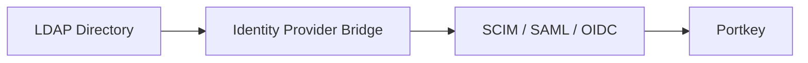

Portkey provides LDAP integration support for enterprises through industry-standard identity provider bridges. This approach enables organizations to maintain their existing LDAP infrastructure while benefiting from modern cloud-native authentication protocols.

## Overview

Rather than implementing native LDAP support, Portkey leverages proven bridge solutions from leading identity providers. This strategy offers:

* **Enhanced Security**: Modern token-based authentication with MFA support
* **Improved Scalability**: Cloud-native architecture without on-premises limitations  
* **Reduced Complexity**: Leverage specialized identity provider expertise
* **Future-Ready**: Seamless path to modern protocols

## How LDAP Bridging Works

LDAP bridge solutions translate between your existing LDAP directory and Portkey's modern authentication protocols (SAML, OIDC, SCIM).

### Architecture Overview



The bridge maintains synchronization between your LDAP directory and the identity provider, enabling:

* **User Authentication**: LDAP credentials validated through SAML/OIDC
* **User Provisioning**: Directory changes synchronized via SCIM
* **Group Management**: LDAP groups mapped to Portkey workspaces
* **Attribute Mapping**: Custom LDAP attributes preserved

## Supported Identity Providers

<CardGroup cols={1}>
  <Card title="Azure AD Connect" icon="cloud" href="#azure-ad-setup" cta="Setup Guide" arrow="true">
    <b>Microsoft’s solution for organizations using Active Directory.</b>
    <br /><br />
    - Synchronizes on-premises AD to Azure AD<br />
    - Supports password hash sync or pass-through authentication<br />
    - Enables SAML, OIDC, and SCIM for cloud applications<br />
    - Free tier available, Premium features $6-9/user/month
    <br /><br />
    <b>Best For:</b> Organizations already using Microsoft 365 or Azure services
  </Card>
<CardGroup cols={2}>
  <Card title="Okta LDAP Agent" icon="key" href="#okta-setup" cta="Setup Guide" arrow="true">
    <b>On-premises agent connects to your LDAP directory.</b>
    <br /><br />
    - No credential replication to cloud<br />
    - Real-time authentication against LDAP<br />
    <br /><br />
    <b>Best For:</b> Organizations with on-premises AD
  </Card>

  <Card title="Okta LDAP Interface" icon="unlock" href="#okta-setup" cta="Setup Guide" arrow="true">
    <b>Cloud-based LDAP endpoint.</b>
    <br /><br />
    - No on-premises infrastructure required<br />
    - Simplified management<br />
    <br /><br />
    <b>Best For:</b> Organizations with on-premises AD
  </Card>
  </CardGroup>
</CardGroup>


**Alternative Solutions**

- **OneLogin Virtual LDAP**: Cloud-based LDAP service
- **Auth0 AD/LDAP Connector**: Developer-friendly integration
- **Keycloak**: Open-source option with enterprise features
- **JumpCloud**: Directory-as-a-Service with LDAP support

## Migration Strategy

<Steps>

<Step title="Assessment">
<AccordionGroup>
  <Accordion title="Inventory Current LDAP Usage">
    - Document all applications using LDAP  
    - Map user attributes and groups  
    - Identify custom schema extensions  
  </Accordion>
  <Accordion title="Select Identity Provider">
    - Evaluate based on existing infrastructure  
    - Consider total cost of ownership  
    - Assess technical capabilities  
  </Accordion>
  <Accordion title="Plan Migration Approach">
    - Define pilot user groups  
    - Establish success criteria  
    - Create rollback procedures  
  </Accordion>
</AccordionGroup>
</Step>

<Step title="Bridge Implementation">
<AccordionGroup>
  <Accordion title="Deploy Identity Provider Bridge">
    - Install and configure bridge solution  
    - Establish secure connectivity  
    - Configure attribute mapping  
  </Accordion>
  <Accordion title="Enable Portkey Integration">
    - Configure SAML/OIDC in Portkey admin settings  
    - Set up SCIM provisioning  
    - Map groups to workspaces  
  </Accordion>
  <Accordion title="Validate Functionality">
    - Test authentication flows  
    - Verify user provisioning  
    - Confirm group memberships  
  </Accordion>
</AccordionGroup>
</Step>

<Step title="Gradual Migration">
<AccordionGroup>
  <Accordion title="Pilot Deployment">
    - Start with IT administrators  
    - Expand to early adopter groups  
    - Monitor performance and issues  
  </Accordion>
  <Accordion title="Production Rollout">
    - Migrate by department or location  
    - Maintain parallel authentication during transition  
    - Provide user training and support  
  </Accordion>
</AccordionGroup>
</Step>

<Step title="Legacy Sunset">
<Accordion title="Complete Migration">
- Migrate remaining users  
- Decommission legacy authentication  
- Update documentation  
</Accordion>
</Step>

</Steps>

## Implementation Guide

### Azure AD Setup

<Note>
  Requires Azure AD Connect installed on-premises with connectivity to your domain controllers.
</Note>

<Steps>
  <Step title="Install Azure AD Connect">
    ```powershell
      # Download from Microsoft
      # Run installer with admin privileges
    ```
  </Step>

  <Step title="Configure Synchronization">
    <AccordionGroup>
      <Accordion title="Authentication Method">
        - Password Hash Sync (recommended)
        - Pass-through Authentication
        - Federation (advanced)
      </Accordion>
      <Accordion title="OU Selection">
        - Select OUs to synchronize
      </Accordion>
      <Accordion title="Attribute Filtering">
        - Configure attribute filtering
      </Accordion>
    </AccordionGroup>
  </Step>

  <Step title="Enable Portkey SSO">
    - Navigate to Azure Portal > Enterprise Applications
    - Add new application > Non-gallery application

    <AccordionGroup>
      <Accordion title="SAML Configuration">
        - Entity ID: get from Portkey Control Plane.
        - Reply URL: get from Portkey Control Plane.
        - Sign-on URL: `https://app.portkey.ai`
      </Accordion>
    </AccordionGroup>
  </Step>

  <Step title="Configure SCIM Provisioning">
    <AccordionGroup>
      <Accordion title="Provisioning Setup">
        - In application settings, go to Provisioning
        - Set mode to Automatic
        - Configure with Portkey SCIM endpoint and token
      </Accordion>
      <Accordion title="Attribute Mapping">
        - Map attributes according to [SCIM setup guide](/product/enterprise-offering/org-management/scim/azure-ad)
      </Accordion>
    </AccordionGroup>
  </Step>


</Steps>

<CardGroup cols={3}>
  <Card title="SSO Documentation" icon="lock" href="./sso" arrow="true" />
  <Card title="SCIM Documentation" icon="shield" href="./scim" arrow="true" />
</CardGroup>

### Okta Setup

#### Using Okta LDAP Agent

<Steps>
  <Step title="Download and Install Agent">
    - Access Okta Admin Console
    - Navigate to Directory > Directory Integrations
    - Add LDAP Directory > Download Agent
    - Install on server with LDAP connectivity
  </Step>

  <Step title="Configure LDAP Connection">
  ```yaml
  LDAP Host: ldap.company.com
  LDAP Port: 389 (or 636 for LDAPS)
  Bind DN: cn=okta-service,ou=services,dc=company,dc=com
  Base DN: dc=company,dc=com
  ```
  </Step>

  <Step title="Set Up Portkey Integration">
    - Create SAML application following [SSO guide](./sso#okta)
    - Enable SCIM provisioning per [SCIM guide](./okta)
    - Configure attribute mappings
  </Step>
</Steps>

#### Using Okta LDAP Interface

<Steps>
  <Step title="Enable LDAP Interface">
    - Okta Admin > Directory > LDAP Interface
    - Generate LDAP credentials
    - Note the LDAP endpoint URL
  </Step>

  <Step title="Configure Applications">
    - Point LDAP applications to Okta endpoint
    - Use generated credentials for binding
    - Test authentication flow
  </Step>
</Steps>

### Attribute Mapping

Ensure critical LDAP attributes map correctly:

| LDAP Attribute | SCIM Attribute | Portkey Field |
|---------------|----------------|---------------|
| uid/sAMAccountName | userName | username |
| mail | emails[primary] | email |
| givenName | name.givenName | firstName |
| sn | name.familyName | lastName |
| memberOf | groups | workspaces |
| title | title | jobTitle |

<Info>
  Custom LDAP attributes can be mapped through extended schema support in most identity providers.
</Info>

## Troubleshooting

<AccordionGroup>
  <Accordion title="Authentication Failures">
    <b>Symptom:</b> Users cannot log in despite correct credentials


    <b>Causes:</b>
    - Certificate validation errors
    - Time synchronization issues
    - Incorrect attribute Mapping

    
    <b>Solution:</b>
    - Verify SSL certificates are trusted
    - Ensure NTP synchronization
    - Check authentication logs in identity provider
  </Accordion>

  <Accordion title="Provisioning Errors">
    <b>Symptom:</b> Users not appearing in Portkey or incorrect attributes
    
    <b>Causes:</b>
    - SCIM endpoint connectivity issues
    - Attribute mapping conflicts
    - Insufficient permissions


    <b>Solution:</b>
    - Test SCIM endpoint with bearer token
    - Review attribute mapping configuration
    - Verify service account permissions
  </Accordion>

  <Accordion title="Performance Issues">
    <b>Symptom:</b> Slow authentication or provisioning


    <b>Causes:</b>
    - Unindexed LDAP queries
    - Network latency
    - Large group memberships


    <b>Solution:</b>
    - Add indexes for commonly queried attributes
    - Deploy bridge closer to LDAP servers
    - Implement group filtering
  </Accordion>
</AccordionGroup>

### Best Practices

<CardGroup cols={2}>
  <Card title="High Availability" icon="server">
Deploy multiple bridge instances<br />
Configure load balancing<br />
Implement health monitoring
  </Card>
  <Card title="Security Hardening" icon="shield-check">
Use LDAPS (LDAP over SSL) always<br />
Implement service account restrictions<br />
Enable audit logging
  </Card>
  <Card title="Performance Optimization" icon="bolt">
Cache frequently accessed data<br />
Implement connection pooling<br />
Monitor query performance
  </Card>
</CardGroup>

## Frequently Asked Questions

<AccordionGroup>

  <Accordion title="Why doesn't Portkey support native LDAP?">
    Modern cloud architectures benefit from stateless, token-based protocols. LDAP's stateful binary protocol creates security and scalability challenges in cloud environments. Industry leaders like Slack, Salesforce, and others follow the same approach.
  </Accordion>

  <Accordion title="Will this increase our costs?">
    While identity provider licenses add cost, most organizations see overall savings through:
    <ul>
      <li>Reduced infrastructure maintenance</li>
      <li>Improved security posture</li>
      <li>Decreased administrative overhead</li>
      <li>Better user experience</li>
    </ul>
  </Accordion>

  <Accordion title="How long does migration take?">
    Typical enterprise migrations complete in 3-6 months:
    <ul>
      <li>Small organizations (&lt;1,000 users): 4-8 weeks</li>
      <li>Medium organizations (1,000-10,000): 2-4 months</li>
      <li>Large enterprises (10,000+): 4-6 months</li>
    </ul>
  </Accordion>

  <Accordion title="Can we maintain LDAP for other applications?">
    Yes, bridge solutions maintain your existing LDAP infrastructure. Other applications continue working unchanged while Portkey uses modern protocols.
  </Accordion>

</AccordionGroup>

## Support

For assistance with LDAP integration:

* Review our [SSO documentation](../sso) for authentication setup
* Configure [SCIM provisioning](../scim) for user management
* Contact [support@portkey.ai](mailto:support@portkey.ai) for integration help

---

<Note>
  Enterprise customers can request a guided migration workshop. Our solution architects will help design and implement your LDAP bridge strategy.
</Note>