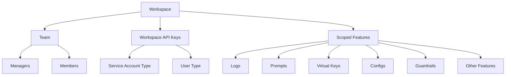

## Workspaces

Workspaces in Portkey are sub-organizations that enable better separation of data, teams, scope, and visibility within your larger organization.

They provide a more granular level of control and organization, allowing you to structure your projects and teams efficiently.

Key features of Workspaces:

* **Team Management:** You can add team members to workspaces with specific roles (manager or member), allowing for precise access control.
* **Dedicated API Keys:** Workspaces contain their own API keys, which can be of two types:
   * Service Account type: For automated processes and integrations
   * User type: For individual user access
   * Both these types of keys are scoped to the workspace by default and can only execute actions within that workspace.
* **Completion API Scoping:** Completion APIs are always scoped by workspace and can only be accessed using workspace API keys.
* **Admin Control:** While only org admins can create workspaces, managers can add API keys and team members with roles to existing workspaces.
* **Flexible Updates:** When making updates to entities via admin keys (at the org level), you can specify the `workspace_id` to target specific workspaces.

Workspaces provide a powerful way to organize your projects, teams, and resources within your larger organization, ensuring proper access control and data separation.

This structure allows for efficient management of resources and access within each workspace, providing a clear separation between different projects or teams within your organization.

### Deleting a Workspace

<Note>
- Before deleting a workspace, all resources within it must be removed.
- You can't delete the default Shared Team Workspace.
</Note>

To delete a workspace in Portkey, follow these steps:

1. Navigate to the sidebar in the Portkey app
2. Open the workspace menu dropdown
3. Select the workspace you wish to delete
4. Click on the delete option (trash icon) next to the workspace name

When attempting to delete a workspace, you'll receive a confirmation dialog. If the workspace still contains resources, you'll see a warning message prompting you to delete these resources first.

<Frame caption="Workspace deletion confirmation">
  
</Frame>

Resources that must be deleted before removing a workspace like - Prompts, Prompt partials, Virtual keys, Configs, Guardrails and more.

Once all resources have been removed, enter the workspace name in the confirmation field to proceed with deletion.

<Warning>
  Workspace deletion is permanent and cannot be undone
</Warning>

Alternatively you can also delete workspaces using the Admin API:

<Card title="Delete a Workspace API" href="/api-reference/admin-api/control-plane/workspaces/delete-a-workspace"/>

### Related Topics

<Card title="Organizations" href="/product/enterprise-offering/org-management/organizations"/>
<Card title="User Roles & Permissions" href="/product/enterprise-offering/org-management/user-roles-and-permissions"/>
<Card title="API Keys (AuthN and AuthZ)" href="/product/enterprise-offering/org-management/api-keys-authn-and-authz"/>
