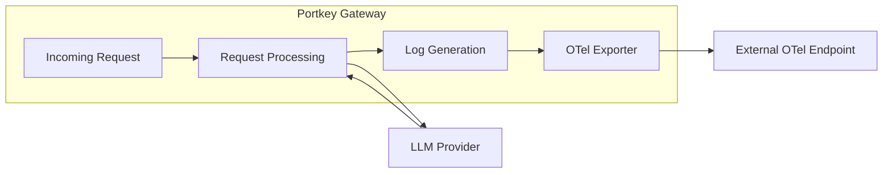

<Note>
  This is an experimental feature available for **Enterprise** and **Self-Hosted** deployments only.
</Note>

## Overview

Portkey Gateway can push complete LLM request/response logs to any OpenTelemetry-compatible endpoint, following the [experimental semantic conventions for Generative AI](https://opentelemetry.io/docs/specs/semconv/gen-ai/gen-ai-spans/). This enables integration with external observability platforms like LangSmith, Datadog, Honeycomb, or any OTLP-compatible collector.

Unlike the [Analytics Export](/product/enterprise-offering/otel/analytics), this feature exports **complete logs** including:

- Full prompt and completion content
- Tool definitions and function calls
- All request parameters (temperature, max_tokens, etc.)
- Complete response metadata

### Why Use This Feature?

- **Unified Observability**: Consolidate LLM telemetry with your existing monitoring infrastructure
- **External Analysis**: Send Portkey logs to specialized GenAI observability tools like LangSmith
- **Standards-Based**: Follows OpenTelemetry GenAI semantic conventions for consistent attribute naming
- **Zero Code Changes**: Enable via environment variables without modifying application code

## Scope

### Included

- Automatic log export to OTLP-compatible HTTP endpoints
- Full GenAI semantic convention attribute mapping
- Request parameters, response metadata, and token usage
- Tool definitions and prompt/completion content
- LangSmith-compatible attribute overrides

### Out of Scope

- gRPC OTLP transport (HTTP/JSON only)
- Metrics export (use [Analytics Export](/product/enterprise-offering/otel/analytics) for that)
- Custom attribute mapping configuration

## Architecture



**Data Flow:**

1. LLM request is processed through Portkey Gateway
2. After receiving the LLM response, a log object is generated
3. The log is transformed into OTLP span format with GenAI semantic attributes
4. The span is pushed to the configured external OTLP endpoint

## Configuration

### Environment Variables

| Variable | Required | Description |
|----------|----------|-------------|
| `EXPERIMENTAL_GEN_AI_OTEL_TRACES_ENABLED` | Yes | Set to `true` to enable log pushing |
| `EXPERIMENTAL_GEN_AI_OTEL_EXPORTER_OTLP_ENDPOINT` | Yes | The OTLP endpoint URL (without `/v1/traces` suffix) |
| `EXPERIMENTAL_GEN_AI_OTEL_EXPORTER_OTLP_HEADERS` | No | Comma-separated headers in `key=value` format |

### Example Configuration

<Tabs>
  <Tab title="LangSmith">
```yaml
EXPERIMENTAL_GEN_AI_OTEL_TRACES_ENABLED: "true"
EXPERIMENTAL_GEN_AI_OTEL_EXPORTER_OTLP_ENDPOINT: https://api.smith.langchain.com/otel
EXPERIMENTAL_GEN_AI_OTEL_EXPORTER_OTLP_HEADERS: x-api-key=<your-langsmith-api-key>
```
  </Tab>
  <Tab title="Datadog">
```yaml
EXPERIMENTAL_GEN_AI_OTEL_TRACES_ENABLED: "true"
EXPERIMENTAL_GEN_AI_OTEL_EXPORTER_OTLP_ENDPOINT: https://http-intake.logs.datadoghq.com/api/v2/otlp
EXPERIMENTAL_GEN_AI_OTEL_EXPORTER_OTLP_HEADERS: DD-API-KEY=<your-datadog-api-key>
```
  </Tab>
  <Tab title="Custom Collector">
```yaml
EXPERIMENTAL_GEN_AI_OTEL_TRACES_ENABLED: "true"
EXPERIMENTAL_GEN_AI_OTEL_EXPORTER_OTLP_ENDPOINT: http://otel-collector:4318
EXPERIMENTAL_GEN_AI_OTEL_EXPORTER_OTLP_HEADERS: Authorization=Bearer <token>
```
  </Tab>
</Tabs>

<Note>
  The endpoint should be the base OTLP URL. Portkey automatically appends `/v1/traces` when sending data.
</Note>

## Span Attributes

Logs are exported as OpenTelemetry spans with attributes following the [GenAI semantic conventions](https://github.com/open-telemetry/semantic-conventions/blob/main/model/gen-ai/spans.yaml).

### Resource Attributes

| Attribute | Value | Description |
|-----------|-------|-------------|
| `service.name` | `portkey` | Service identifier |
| `otel.semconv.version` | `1.37.0` | Semantic convention version |

### Request Attributes

| Attribute | Source | Description |
|-----------|--------|-------------|
| `gen_ai.request.model` | Request body | Model identifier |
| `gen_ai.request.max_tokens` | Request body | Maximum tokens to generate |
| `gen_ai.request.temperature` | Request body | Sampling temperature |
| `gen_ai.request.top_p` | Request body | Top-p sampling parameter |
| `gen_ai.request.stop_sequences` | Request body | Stop sequences |
| `gen_ai.request.frequency_penalty` | Request body | Frequency penalty |
| `gen_ai.request.presence_penalty` | Request body | Presence penalty |
| `gen_ai.request.seed` | Request body | Random seed |

### Response Attributes

| Attribute | Source | Description |
|-----------|--------|-------------|
| `gen_ai.response.id` | Response body | Response identifier |
| `gen_ai.response.model` | Response body | Model used for generation |
| `gen_ai.response.finish_reasons` | Response body | Array of finish reasons |
| `gen_ai.response.input_tokens` | Metrics | Input token count |
| `gen_ai.response.output_tokens` | Metrics | Output token count |

### Provider & Server Attributes

| Attribute | Source | Description |
|-----------|--------|-------------|
| `gen_ai.provider.name` | Metrics | LLM provider name |
| `server.address` | Request | Provider endpoint URL |
| `server.port` | Constant | Server port (443 for HTTPS) |
| `error.type` | Response | HTTP status code (for errors ≥300) |

### Message Attributes

Prompt messages are exported using an indexed format for LangSmith compatibility:

| Attribute | Description |
|-----------|-------------|
| `gen_ai.prompt.{index}.role` | Message role (system, user, assistant) |
| `gen_ai.prompt.{index}.content` | Message content |
| `gen_ai.input.messages` | Raw input (for embedding/completion endpoints) |
| `gen_ai.output.messages` | Response messages or embeddings |

### Tool Attributes

| Attribute | Description |
|-----------|-------------|
| `gen_ai.tool.definitions` | Array of tool definitions from request |
| `tools` | LangSmith-specific tool definitions copy |

## Span Structure

Each log is exported as a span with the following structure:

```json
{
  "resourceSpans": [{
    "resource": {
      "attributes": [
        { "key": "service.name", "value": { "stringValue": "portkey" } },
        { "key": "otel.semconv.version", "value": { "stringValue": "1.37.0" } }
      ]
    },
    "scopeSpans": [{
      "scope": { "name": "custom.genai.instrumentation" },
      "spans": [{
        "traceId": "<32-char-hex>",
        "spanId": "<16-char-hex>",
        "parentSpanId": "<optional-16-char-hex>",
        "name": "<span-name>",
        "startTimeUnixNano": "<nanoseconds>",
        "endTimeUnixNano": "<nanoseconds>",
        "status": { "code": 1, "message": "200" },
        "attributes": [/* GenAI attributes */]
      }]
    }]
  }]
}
```

## Trace Context

The feature preserves trace context from incoming requests:

- **Trace ID**: Uses Portkey's trace ID if valid (32 hex chars), otherwise generates a new one
- **Span ID**: Uses Portkey's span ID if valid (16 hex chars), otherwise generates a new one  
- **Parent Span ID**: Preserved from parent request if available

This allows correlation with upstream traces in distributed tracing scenarios.

## Error Handling

- **Export Failures**: Logged internally; does not affect request processing
- **Invalid Endpoints**: Connection errors are caught and logged
- **Malformed Responses**: Error responses from the OTLP endpoint are logged with status text

<Warning>
  Export failures do not block or retry the LLM request. Logs may be lost if the external endpoint is unavailable.
</Warning>

## Performance Considerations

- **Async Processing**: Log export runs in parallel with other post-request handlers
- **No Request Latency Impact**: Export happens after the response is returned
- **HTTP/JSON Protocol**: Uses standard HTTP POST with JSON payload

## Security Considerations

<Warning>
  When enabled, request/response content including prompts and completions are sent to the external endpoint. Ensure your endpoint is trusted and properly secured.
</Warning>

- **Authentication**: Use the headers configuration to pass API keys or bearer tokens
- **Data Sensitivity**: Prompt and completion content is included in exports
- **Network Security**: Use HTTPS endpoints for production deployments

## Integration with LangSmith

LangSmith uses a slightly different attribute format than the standard GenAI semantic conventions. Portkey includes compatibility attributes:

- Prompt messages use indexed format: `gen_ai.prompt.{index}.role` and `gen_ai.prompt.{index}.content`
- Tool definitions are duplicated in the `tools` attribute for LangSmith parsing

For LangSmith setup, refer to [LangSmith OpenTelemetry documentation](https://docs.smith.langchain.com/observability/how_to_guides/trace_with_opentelemetry).

## Verification

To verify the feature is working:

1. Enable the feature with your endpoint configuration
2. Make an LLM request through Portkey Gateway
3. Check your external observability platform for incoming spans
4. Verify spans contain expected GenAI attributes

## Known Limitations

<Warning>
  The [OpenTelemetry GenAI semantic conventions](https://opentelemetry.io/docs/specs/semconv/gen-ai/gen-ai-spans/) are experimental and subject to change. Attribute names may evolve as the specification stabilizes.
</Warning>

- **HTTP Only**: gRPC OTLP protocol is not supported
- **No Batching**: Each log is pushed individually (no span batching)
- **No Retry Logic**: Failed exports are not retried
- **Experimental Conventions**: GenAI semantic conventions may change

