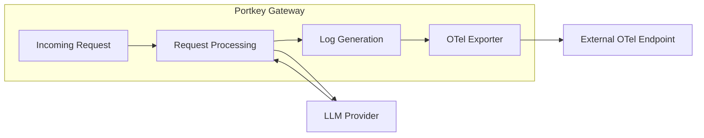

<Note>
  This is an experimental feature available for **Enterprise** and **Self-Hosted** deployments only.
</Note>

## Overview

Portkey Gateway can push complete LLM request/response logs to any OpenTelemetry-compatible endpoint, following the [experimental semantic conventions for Generative AI](https://opentelemetry.io/docs/specs/semconv/gen-ai/gen-ai-spans/). This enables integration with external observability platforms like LangSmith, Datadog, Honeycomb, or any OTLP-compatible collector.

Unlike the [Analytics Export](/product/enterprise-offering/otel/analytics), this feature exports **complete logs** including:

- Full prompt and completion content
- Tool definitions and function calls
- All request parameters (temperature, max_tokens, etc.)
- Complete response metadata

### Why Use This Feature?

- **Unified Observability**: Consolidate LLM telemetry with your existing monitoring infrastructure
- **External Analysis**: Send Portkey logs to specialized GenAI observability tools like LangSmith
- **Standards-Based**: Follows OpenTelemetry GenAI semantic conventions for consistent attribute naming
- **Zero Code Changes**: Enable via environment variables without modifying application code

## Scope

### Included

- Automatic log export to OTLP-compatible HTTP endpoints
- Full GenAI semantic convention attribute mapping
- Request parameters, response metadata, and token usage
- Tool definitions and prompt/completion content
- LangSmith-compatible attribute overrides

### Out of Scope

- gRPC OTLP transport (HTTP/JSON only)
- Metrics export (use [Analytics Export](/product/enterprise-offering/otel/analytics) for that)
- Custom attribute mapping configuration

## Architecture


```mermaid
graph LR
    subgraph Portkey Gateway
        REQ[Incoming Request]
        PROC[Request Processing]
        LOG[Log Generation]
        PUSH[OTel Exporter]
    end
    
    LLM[LLM Provider]
    OTel[External OTel Endpoint]
    
    REQ --> PROC
    PROC --> LLM
    LLM --> PROC
    PROC --> LOG
    LOG --> PUSH
    PUSH --> OTel
```

**Data Flow:**

1. LLM request is processed through Portkey Gateway
2. After receiving the LLM response, a log object is generated
3. The log is transformed into OTLP span format with GenAI semantic attributes
4. The span is pushed to the configured external OTLP endpoint

## Configuration

### Environment Variables

| Variable | Required | Description |
|----------|----------|-------------|
| `EXPERIMENTAL_GEN_AI_OTEL_TRACES_ENABLED` | Yes | Set to `true` to enable log pushing |
| `EXPERIMENTAL_GEN_AI_OTEL_EXPORTER_OTLP_ENDPOINT` | Yes | The OTLP endpoint URL (without `/v1/traces` suffix) |
| `EXPERIMENTAL_GEN_AI_OTEL_EXPORTER_OTLP_HEADERS` | No | Comma-separated headers in `key=value` format |
| `EXPERIMENTAL_GEN_AI_OTEL_RESOURCE_ATTRIBUTES` | No | Comma-separated `key=value` pairs added as OTLP resource attributes |

### Example Configuration

<Tabs>
  <Tab title="LangSmith">
```yaml
EXPERIMENTAL_GEN_AI_OTEL_TRACES_ENABLED: "true"
EXPERIMENTAL_GEN_AI_OTEL_EXPORTER_OTLP_ENDPOINT: https://api.smith.langchain.com/otel
EXPERIMENTAL_GEN_AI_OTEL_EXPORTER_OTLP_HEADERS: x-api-key=<your-langsmith-api-key>
```
  </Tab>
  <Tab title="Datadog">
```yaml
EXPERIMENTAL_GEN_AI_OTEL_TRACES_ENABLED: "true"
EXPERIMENTAL_GEN_AI_OTEL_EXPORTER_OTLP_ENDPOINT: https://http-intake.logs.datadoghq.com/api/v2/otlp
EXPERIMENTAL_GEN_AI_OTEL_EXPORTER_OTLP_HEADERS: DD-API-KEY=<your-datadog-api-key>
```
  </Tab>
  <Tab title="Custom Collector">
```yaml
EXPERIMENTAL_GEN_AI_OTEL_TRACES_ENABLED: "true"
EXPERIMENTAL_GEN_AI_OTEL_EXPORTER_OTLP_ENDPOINT: http://otel-collector:4318
EXPERIMENTAL_GEN_AI_OTEL_EXPORTER_OTLP_HEADERS: Authorization=Bearer <token>
```
  </Tab>
</Tabs>

<Note>
  The endpoint should be the base OTLP URL. Portkey automatically appends `/v1/traces` when sending data.
</Note>

## Span Attributes

Logs are exported as OpenTelemetry spans with attributes following the [GenAI semantic conventions](https://github.com/open-telemetry/semantic-conventions/blob/main/model/gen-ai/spans.yaml).

### Resource Attributes

| Attribute | Value | Description |
|-----------|-------|-------------|
| `service.name` | `portkey` | Service identifier |
| `otel.semconv.version` | `1.40.0` | Semantic convention version |
| Custom attributes | Configurable | Additional attributes from `EXPERIMENTAL_GEN_AI_OTEL_RESOURCE_ATTRIBUTES` |

### Common Attributes

These attributes are set on all spans (inference and embeddings):

| Attribute | Source | Description |
|-----------|--------|-------------|
| `gen_ai.operation.name` | Derived | Operation type: `chat`, `embeddings`, or derived from request URL |
| `gen_ai.provider.name` | Metrics | Semconv-normalized provider name (e.g., `openai`, `anthropic`, `aws.bedrock`, `azure.ai.openai`) |
| `gen_ai.system` | Metrics | Backward-compatible alias for `gen_ai.provider.name` |
| `gen_ai.request.model` | Request body | Model identifier |
| `gen_ai.response.model` | Response body | Model used for generation |
| `server.address` | Request URL | Provider endpoint hostname |
| `server.port` | Request URL | Server port (derived from URL, 443 for HTTPS) |
| `error.type` | Response | HTTP status code (for errors ≥300) |

### Inference Attributes

These attributes are set on inference (chat completion) spans:

| Attribute | Source | Description |
|-----------|--------|-------------|
| `gen_ai.request.max_tokens` | Request body | Maximum tokens to generate (from `max_tokens` or `max_completion_tokens`) |
| `gen_ai.request.temperature` | Request body | Sampling temperature |
| `gen_ai.request.top_p` | Request body | Top-p sampling parameter |
| `gen_ai.request.top_k` | Request body | Top-k sampling parameter |
| `gen_ai.request.stop_sequences` | Request body | Stop sequences |
| `gen_ai.request.frequency_penalty` | Request body | Frequency penalty |
| `gen_ai.request.presence_penalty` | Request body | Presence penalty |
| `gen_ai.request.seed` | Request body | Random seed |
| `gen_ai.request.choice.count` | Request body | Number of choices requested (only set when > 1) |
| `gen_ai.response.id` | Response body | Response identifier |
| `gen_ai.response.finish_reasons` | Response body | Normalized finish reasons (e.g., `tool_use`/`tool_calls`/`function_call` → `tool_call`) |
| `gen_ai.usage.input_tokens` | Response usage | Input token count |
| `gen_ai.usage.output_tokens` | Response usage | Output token count |
| `gen_ai.usage.cache_creation.input_tokens` | Response usage | Tokens written to prompt cache |
| `gen_ai.usage.cache_read.input_tokens` | Response usage | Tokens read from prompt cache |
| `gen_ai.conversation.id` | Request/Response | Conversation or thread identifier |
| `gen_ai.output.type` | Request body | Output format type: `json`, `image`, `speech`, or `text` |

### Embeddings Attributes

These attributes are set on embeddings spans:

| Attribute | Source | Description |
|-----------|--------|-------------|
| `gen_ai.request.encoding_formats` | Request body | Requested encoding formats |
| `gen_ai.embeddings.dimension.count` | Request body | Embedding dimensions |
| `gen_ai.usage.input_tokens` | Response usage | Input token count |

### Message Attributes

Messages are exported using structured semconv 1.40.0 format with role-based grouping and multimodal part normalization:

| Attribute | Description |
|-----------|-------------|
| `gen_ai.input.messages` | Array of input messages (excluding system), each with `role` and `parts` (text, tool_call, tool_call_response, image, audio, file, reasoning) |
| `gen_ai.system_instructions` | System message content extracted as instruction parts |
| `gen_ai.output.messages` | Array of output messages, each with `role`, `parts`, and `finish_reason` |
| `gen_ai.tool.definitions` | Array of tool definitions from request |

<Note>
Tool call semantics are normalized across providers: `tool_use` (Anthropic), `tool_calls` (OpenAI), and `function_call` are all mapped to the standard `tool_call` type.
</Note>

## Span Structure

Each log is exported as a span with the following structure:

```json
{
  "resourceSpans": [{
    "resource": {
      "attributes": [
        { "key": "service.name", "value": { "stringValue": "portkey" } },
        { "key": "otel.semconv.version", "value": { "stringValue": "1.40.0" } }
      ]
    },
    "scopeSpans": [{
      "scope": { "name": "custom.genai.instrumentation" },
      "spans": [{
        "traceId": "<32-char-hex>",
        "spanId": "<16-char-hex>",
        "parentSpanId": "<optional-16-char-hex>",
        "name": "chat gpt-4o",
        "kind": 3,
        "startTimeUnixNano": "<nanoseconds>",
        "endTimeUnixNano": "<nanoseconds>",
        "status": { "code": 1, "message": "200" },
        "attributes": [/* GenAI attributes */]
      }]
    }]
  }]
}
```

- **Span name** follows the format `{operation_name} {model}` (e.g., `chat gpt-4o`, `embeddings text-embedding-3-small`)
- **Span kind** is `CLIENT` (3), reflecting that the gateway acts as a client to the LLM provider

## Trace Context

The feature preserves trace context from incoming requests:

- **Trace ID**: Uses Portkey's trace ID if valid (32 hex chars), otherwise generates a new one
- **Span ID**: Uses Portkey's span ID if valid (16 hex chars), otherwise generates a new one  
- **Parent Span ID**: Preserved from parent request if available

This allows correlation with upstream traces in distributed tracing scenarios.

## Error Handling

- **Export Failures**: Logged internally; does not affect request processing
- **Invalid Endpoints**: Connection errors are caught and logged
- **Malformed Responses**: Error responses from the OTLP endpoint are logged with status text

<Warning>
  Export failures do not block or retry the LLM request. Logs may be lost if the external endpoint is unavailable.
</Warning>

## Performance Considerations

- **Async Processing**: Log export runs in parallel with other post-request handlers
- **No Request Latency Impact**: Export happens after the response is returned
- **HTTP/JSON Protocol**: Uses standard HTTP POST with JSON payload

## Security Considerations

<Warning>
  When enabled, request/response content including prompts and completions are sent to the external endpoint. Ensure your endpoint is trusted and properly secured.
</Warning>

- **Authentication**: Use the headers configuration to pass API keys or bearer tokens
- **Data Sensitivity**: Prompt and completion content is included in exports
- **Network Security**: Use HTTPS endpoints for production deployments

## Integration with LangSmith

Portkey exports spans using the semconv 1.40.0 structured message format (`gen_ai.input.messages`, `gen_ai.output.messages`, `gen_ai.system_instructions`), which is compatible with LangSmith and other modern GenAI observability tools.

For LangSmith setup, refer to [LangSmith OpenTelemetry documentation](https://docs.smith.langchain.com/observability/how_to_guides/trace_with_opentelemetry).

## Verification

To verify the feature is working:

1. Enable the feature with your endpoint configuration
2. Make an LLM request through Portkey Gateway
3. Check your external observability platform for incoming spans
4. Verify spans contain expected GenAI attributes

## Known Limitations

<Warning>
  The [OpenTelemetry GenAI semantic conventions](https://opentelemetry.io/docs/specs/semconv/gen-ai/gen-ai-spans/) are experimental and subject to change. Attribute names may evolve as the specification stabilizes.
</Warning>

- **HTTP Only**: gRPC OTLP protocol is not supported
- **No Batching**: Each log is pushed individually (no span batching)
- **No Retry Logic**: Failed exports are not retried
- **Experimental Conventions**: GenAI semantic conventions may change

