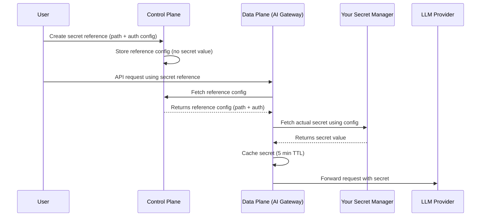

Secret References let your organization point Portkey to secrets living in your own external secret manager. Instead of pasting provider keys or credentials directly into Portkey, you create a **reference** that tells Portkey where to fetch the secret at runtime.

This keeps sensitive material in infrastructure you already control and audit.

<Info>
Available on **Enterprise** plans only. Requires:
- Gateway version **2.2.4** or higher
- Backend version **1.12.0** or higher (for air-gapped deployments).
</Info>

## Supported Secret Managers

| Manager | `manager_type` value |
|---------|---------------------|
| AWS Secrets Manager | `aws_sm` |
| Azure Key Vault | `azure_kv` |
| HashiCorp Vault | `hashicorp_vault` |

## How It Works

Secret references use a split architecture between Portkey's **control plane** and **data plane**:

1. You create a **secret reference** in Portkey via the API. The control plane stores only the reference configuration (manager type, secret path, auth config) — never the actual secret value.
2. At runtime, the **data plane** (AI Gateway) reads the reference configuration and fetches the secret directly from your external manager.
3. The control plane never fetches or sees the final secret. The data plane caches the fetched secret value for **5 minutes** to avoid hitting your secret manager on every request. After the TTL expires, the next request triggers a fresh fetch.



## Creating a Secret Reference

Send a `POST` request to `/v1/secret-references` with the following body:

```json
{
  "name": "prod-openai-key",
  "manager_type": "aws_sm",
  "auth_config": {
    "aws_auth_type": "accessKey",
    "aws_access_key_id": "AKIA...",
    "aws_secret_access_key": "wJalr...",
    "aws_region": "us-east-1"
  },
  "secret_path": "prod/openai/api-key",
  "secret_key": "OPENAI_API_KEY"
}
```

| Field | Type | Required | Description |
|-------|------|----------|-------------|
| `name` | string | Yes | Display name (1–255 chars). |
| `slug` | string | No | Unique identifier. Auto-generated from name if omitted. Pattern: `^[a-zA-Z0-9_-]+$`. |
| `description` | string \| null | No | Max 1024 chars. |
| `manager_type` | string | Yes | `aws_sm`, `azure_kv`, or `hashicorp_vault`. |
| `auth_config` | object | Yes | Auth credentials for connecting to the manager. See [Auth Config](#auth-config) below. |
| `secret_path` | string | Yes | Path to the secret in the external manager. |
| `secret_key` | string \| null | No | Specific key within the secret (when the secret holds multiple key-value pairs). |
| `allow_all_workspaces` | boolean | No | Default `true`. Grant access to all workspaces. |
| `allowed_workspaces` | string[] | No | Restrict access to specific workspace UUIDs or slugs. Mutually exclusive with `allow_all_workspaces: true`. |
| `tags` | object \| null | No | Key-value metadata tags. |

## Updating a Secret Reference

Send a `PUT` request to `/v1/secret-references/:id` with only the fields you want to change. At least one field must be provided.

`auth_config` updates are **merged** with the existing config - you don't need to resend the full object.

Setting `allow_all_workspaces: true` purges any workspace-specific mappings. Providing `allowed_workspaces` automatically sets `allow_all_workspaces` to `false`.

## Deleting a Secret Reference

Send a `DELETE` request to `/v1/secret-references/:id`.

It will fail if the secret reference is currently in use by any integrations or virtual keys - remove those associations first.

## Workspace Scoping

By default, a secret reference is accessible from **all workspaces** in your organisation. To restrict access:

- Pass `allowed_workspaces` with an array of workspace UUIDs or slugs when creating or updating the reference.
- This automatically disables `allow_all_workspaces`.

To revert to org-wide access, set `allow_all_workspaces: true` - this purges all workspace-specific mappings.

## Auth Config

The `auth_config` schema depends on the `manager_type` you choose.

<Tabs>
  <Tab title="AWS Secrets Manager">
    ### Access Key

    | Field | Type | Required |
    |-------|------|----------|
    | `aws_auth_type` | `"accessKey"` | Yes |
    | `aws_access_key_id` | string | Yes |
    | `aws_secret_access_key` | string | Yes |
    | `aws_region` | string | Yes |

    ### Assumed Role

    Use this when Portkey should assume an IAM role in your account.

    | Field | Type | Required |
    |-------|------|----------|
    | `aws_auth_type` | `"assumedRole"` | Yes |
    | `aws_role_arn` | string | Yes |
    | `aws_external_id` | string \| null | No |
    | `aws_region` | string | Yes |

    ### Service Role

    Uses Portkey's own service role. Requires your secret's resource policy to grant Portkey access.

    | Field | Type | Required |
    |-------|------|----------|
    | `aws_auth_type` | `"serviceRole"` | Yes |
    | `aws_region` | string | No |
  </Tab>
  <Tab title="Azure Key Vault">
    ### Entra (Service Principal)

    | Field | Type | Required |
    |-------|------|----------|
    | `azure_auth_mode` | `"entra"` | Yes |
    | `azure_entra_tenant_id` | string | Yes |
    | `azure_entra_client_id` | string | Yes |
    | `azure_entra_client_secret` | string | Yes |
    | `azure_vault_url` | url | Yes |

    ### Managed Identity

    | Field | Type | Required |
    |-------|------|----------|
    | `azure_auth_mode` | `"managed"` | Yes |
    | `azure_managed_client_id` | string | No |
    | `azure_vault_url` | url | Yes |

    ### Default Credentials

    | Field | Type | Required |
    |-------|------|----------|
    | `azure_auth_mode` | `"default"` | Yes |
    | `azure_vault_url` | url | Yes |
  </Tab>
  <Tab title="HashiCorp Vault">
    ### Token

    | Field | Type | Required |
    |-------|------|----------|
    | `vault_auth_type` | `"token"` | Yes |
    | `vault_addr` | url | Yes |
    | `vault_token` | string | Yes |
    | `vault_namespace` | string | No |

    ### AppRole

    | Field | Type | Required |
    |-------|------|----------|
    | `vault_auth_type` | `"approle"` | Yes |
    | `vault_addr` | url | Yes |
    | `vault_role_id` | string | Yes |
    | `vault_secret_id` | string | Yes |
    | `vault_namespace` | string | No |

    ### Kubernetes

    | Field | Type | Required |
    |-------|------|----------|
    | `vault_auth_type` | `"kubernetes"` | Yes |
    | `vault_addr` | url | Yes |
    | `vault_role` | string | Yes |
    | `vault_namespace` | string | No |
  </Tab>
</Tabs>

## Sensitive Field Masking

When you retrieve a secret reference via the API, sensitive `auth_config` fields are automatically masked. The original field is replaced with a `masked_` prefixed version containing a truncated value.

| Original Field | Masked Field |
|----------------|-------------|
| `aws_secret_access_key` | `masked_aws_secret_access_key` |
| `aws_access_key_id` | `masked_aws_access_key_id` |
| `aws_role_arn` | `masked_aws_role_arn` |
| `aws_external_id` | `masked_aws_external_id` |
| `azure_entra_client_secret` | `masked_azure_entra_client_secret` |
| `vault_token` | `masked_vault_token` |
| `vault_secret_id` | `masked_vault_secret_id` |

## Access Requirements

- **Authentication**: `x-portkey-api-key` header.
- **RBAC Role**: `OWNER` or `ADMIN`.

---

## API Reference

<Card title="Create Secret Reference" href="/api-reference/admin-api/control-plane/secret-references/create-secret-reference"/>
<Card title="List Secret References" href="/api-reference/admin-api/control-plane/secret-references/list-secret-references"/>
<Card title="Retrieve Secret Reference" href="/api-reference/admin-api/control-plane/secret-references/retrieve-secret-reference"/>
<Card title="Update Secret Reference" href="/api-reference/admin-api/control-plane/secret-references/update-secret-reference"/>
<Card title="Delete Secret Reference" href="/api-reference/admin-api/control-plane/secret-references/delete-secret-reference"/>
