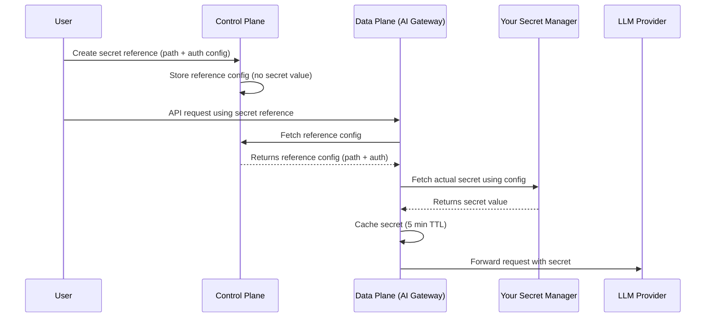

Secret References let you point Portkey to credentials stored in your external vault. Instead of entering keys directly in Portkey, you create a **reference**, that tells Portkey where to fetch the value at runtime.

This keeps sensitive material in infrastructure you already control and audit.
<Info>
Available on **Enterprise** plans only. Requires:
- Gateway version **2.2.4** or higher
- Backend version **1.12.0** or higher (for air-gapped deployments).
</Info>

## Supported Secret Managers

| Manager | `manager_type` value |
|---------|---------------------|
| AWS Secrets Manager | `aws_sm` |
| Azure Key Vault | `azure_kv` |
| HashiCorp Vault | `hashicorp_vault` |

## How It Works

Secret references use a split architecture between Portkey's **control plane** and **data plane**:

1. You create a **secret reference** in Portkey via the API. The control plane stores only the reference configuration (manager type, secret path, auth config) — never the actual secret value.
2. At runtime, the **data plane** (AI Gateway) reads the reference configuration and fetches the secret directly from your external manager.
3. The control plane never fetches or sees the final secret. The data plane caches the fetched secret value for **5 minutes** to avoid hitting your secret manager on every request. After the TTL expires, the next request triggers a fresh fetch.



## Creating a Secret Reference

### From the Control Panel

1. From your admin panel, go to [**Secret References**](https://app.portkey.ai/secret-references) and click **Create**.

2. Configure the reference identity:

<Frame>
  
</Frame>
   - **Name**: A name for this reference
   - **Slug**: Unique identifier, auto-generated from name if not added. Pattern: `^[a-zA-Z0-9_-]+$`
   - **Description**: Optional context about this reference's purpose

3. Choose your external vault from the supported options:
   - AWS Secrets Manager
   - Azure Key Vault
   - HashiCorp Vault

4. Select the authentication type for your chosen manager and add the required details.

5. Secret Location:
   - **Secret Path**: Add the Secret name from the external manager
   - **Secret Key** (optional): Add the specific key within the secret

<Frame>
  
</Frame>

### Via Admin APIs

Send a `POST` request to `/v1/secret-references` with the following body:

```json
{
  "name": "prod-openai-key",
  "manager_type": "aws_sm",
  "auth_config": {
    "aws_auth_type": "accessKey",
    "aws_access_key_id": "AKIA...",
    "aws_secret_access_key": "wJalr...",
    "aws_region": "us-east-1"
  },
  "secret_path": "prod/openai/api-key",
  "secret_key": "OPENAI_API_KEY"
}
```

| Field | Type | Required | Description |
|-------|------|----------|-------------|
| `name` | string | Yes | Display name (1–255 chars). |
| `slug` | string | No | Unique identifier. Auto-generated from name if omitted. Pattern: `^[a-zA-Z0-9_-]+$`. |
| `description` | string \| null | No | Max 1024 chars. |
| `manager_type` | string | Yes | `aws_sm`, `azure_kv`, or `hashicorp_vault`. |
| `auth_config` | object | Yes | Auth credentials for connecting to the manager. See [Auth Config](#auth-config) below. |
| `secret_path` | string | Yes | Path to the secret in the external manager. |
| `secret_key` | string \| null | No | Specific key within the secret (when the secret holds multiple key-value pairs). |
| `allow_all_workspaces` | boolean | No | Default `true`. Grant access to all workspaces. |
| `allowed_workspaces` | string[] | No | Restrict access to specific workspace UUIDs or slugs. Mutually exclusive with `allow_all_workspaces: true`. |
| `tags` | object \| null | No | Key-value metadata tags. |

## Updating a Secret Reference

Send a `PUT` request to `/v1/secret-references/:id` with only the fields you want to change. At least one field must be provided.

`auth_config` updates are **merged** with the existing config - you don't need to resend the full object.

Setting `allow_all_workspaces: true` purges any workspace-specific mappings. Providing `allowed_workspaces` automatically sets `allow_all_workspaces` to `false`.

## Deleting a Secret Reference

Send a `DELETE` request to `/v1/secret-references/:id`.

It will fail if the secret reference is currently in use by any integrations - remove those associations first.

## Workspace Scoping

By default, a secret reference is accessible from **all workspaces** in your organisation. To restrict access:

- Pass `allowed_workspaces` with an array of workspace UUIDs or slugs when creating or updating the reference.
- This automatically disables `allow_all_workspaces`.

To revert to org-wide access, set `allow_all_workspaces: true` - this purges all workspace-specific mappings.

## Auth Config

The `auth_config` schema depends on the `manager_type` you choose.

<Tabs>
  <Tab title="AWS Secrets Manager">
    ### Access Key

    | Field | Type | Required |
    |-------|------|----------|
    | `aws_auth_type` | `"accessKey"` | Yes |
    | `aws_access_key_id` | string | Yes |
    | `aws_secret_access_key` | string | Yes |
    | `aws_region` | string | Yes |

    ### Assumed Role

    Use this when Portkey should assume an IAM role in your account.

    | Field | Type | Required |
    |-------|------|----------|
    | `aws_auth_type` | `"assumedRole"` | Yes |
    | `aws_role_arn` | string | Yes |
    | `aws_external_id` | string \| null | No |
    | `aws_region` | string | Yes |

    ### Service Role

    Uses Portkey's own service role. Requires your secret's resource policy to grant Portkey access.

    | Field | Type | Required |
    |-------|------|----------|
    | `aws_auth_type` | `"serviceRole"` | Yes |
    | `aws_region` | string | No |
  </Tab>
  <Tab title="Azure Key Vault">
    ### Entra (Service Principal)

    | Field | Type | Required |
    |-------|------|----------|
    | `azure_auth_mode` | `"entra"` | Yes |
    | `azure_entra_tenant_id` | string | Yes |
    | `azure_entra_client_id` | string | Yes |
    | `azure_entra_client_secret` | string | Yes |
    | `azure_vault_url` | url | Yes |

    ### Managed Identity

    | Field | Type | Required |
    |-------|------|----------|
    | `azure_auth_mode` | `"managed"` | Yes |
    | `azure_managed_client_id` | string | No |
    | `azure_vault_url` | url | Yes |

    ### Default Credentials

    | Field | Type | Required |
    |-------|------|----------|
    | `azure_auth_mode` | `"default"` | Yes |
    | `azure_vault_url` | url | Yes |
  </Tab>
  <Tab title="HashiCorp Vault">
    ### Token

    | Field | Type | Required |
    |-------|------|----------|
    | `vault_auth_type` | `"token"` | Yes |
    | `vault_addr` | url | Yes |
    | `vault_token` | string | Yes |
    | `vault_namespace` | string | No |

    ### AppRole

    | Field | Type | Required |
    |-------|------|----------|
    | `vault_auth_type` | `"approle"` | Yes |
    | `vault_addr` | url | Yes |
    | `vault_role_id` | string | Yes |
    | `vault_secret_id` | string | Yes |
    | `vault_namespace` | string | No |

    ### Kubernetes

    | Field | Type | Required |
    |-------|------|----------|
    | `vault_auth_type` | `"kubernetes"` | Yes |
    | `vault_addr` | url | Yes |
    | `vault_role` | string | Yes |
    | `vault_namespace` | string | No |
  </Tab>
</Tabs>

## Secret Mappings

Secret mappings allow integrations to dynamically resolve secrets from secret references at runtime, instead of storing credentials directly. The `secret_mappings` field is an optional JSON array accepted on create and update in **Integrations**.

### Schema

Each entry in the `secret_mappings` array:

| Field | Type | Required | Description |
|-------|------|----------|-------------|
| `target_field` | string | Yes | The field on the entity that should be populated from the secret reference. Must be unique within the array. |
| `secret_reference_id` | string | Yes | UUID or slug of the secret reference to resolve. Must belong to the same organisation and be accessible by the workspace. |
| `secret_key` | string \| null | No | Override the `secret_key` defined on the secret reference. Use to pick a specific key from a multi-value secret. |
| `value_format` | string \| null | No | Format of the secret value. Either `json` or `string`. Use `json` when the secret value is a JSON object that should be parsed. |

### From the Control Panel

If you're storing provider API keys in your vault, map your secrets in LLM Integrations:

1. While creating a new LLM integration (or editing an existing one), you'll see a toggle. Switch to **Secret Ref** to use the key via your vault.
<Frame>
  
</Frame>

2. Select the secret reference. Optionally, provide a **Secret Key** if the reference contains multiple values.

<Frame>
  
</Frame>


### Via Admin APIs

### Valid `target_field` Values

<Tabs>
  <Tab title="LLM Integrations">
**Integrations** (`POST /v1/integrations`, `PUT /v1/integrations/:integrationId`)

| target_field | Description |
|-------------|-------------|
| `key` | The provider API key. When mapped, the `key` body field can be omitted. |
| `configurations.<field>` | Any provider-specific configuration field (e.g. `configurations.aws_secret_access_key`, `configurations.azure_entra_client_secret`). |
  </Tab>
  <Tab title="MCP Integrations">
**MCP Integrations** (`POST /v1/mcp-integrations`, `PUT /v1/mcp-integrations/:mcpIntegrationId`)

<Info>
MCP integration secret mappings require:
- Enterprise Gateway version **2.7.0** or higher
- Frontend version **1.8.1** or higher
- Backend version **1.15.0** or higher
</Info>

| target_field | Description |
|-------------|-------------|
| `configurations.<field>` | Any MCP server configuration field (e.g. `configurations.oauth_metadata`, `configurations.headers`, `configurations.passthrough_headers`, `configurations.forward_headers`, `configurations.external_auth_config`, `configurations.jwt_validation`). |

MCP integrations support the same secret mapping functionality as LLM integrations. This is particularly useful for:
- **OAuth credentials**: Store OAuth client secrets, tokens, and metadata in your vault
- **API keys**: Reference API keys for MCP servers that use header-based authentication
- **Complex configurations**: Use `value_format: "json"` for nested configuration objects like OAuth metadata

**Example: MCP Integration with OAuth metadata from vault**

```json
{
  "name": "GitHub MCP",
  "slug": "github-mcp",
  "server_url": "https://api.githubcopilot.com/mcp",
  "auth_type": "oauth",
  "secret_mappings": [
    {
      "target_field": "configurations.oauth_metadata",
      "secret_reference_id": "my-github-oauth",
      "value_format": "json"
    }
  ]
}
```
  </Tab>
</Tabs>


### Example

```json
{
  "secret_mappings": [
    {
      "target_field": "key",
      "secret_reference_id": "my-aws-api-key"
    },
    {
      "target_field": "configurations.aws_secret_access_key",
      "secret_reference_id": "aws-credentials-ref",
      "secret_key": "secret_access_key"
    },
    {
      "target_field": "configurations.oauth_metadata",
      "secret_reference_id": "my-github-oauth",
      "value_format": "json"
    }
  ]
}
```

#### Using `value_format: json`

When your secret value is a JSON object (not a plain string), use `value_format: "json"` to have Portkey parse the value as JSON before injecting it into the configuration.

```json
{
  "secret_mappings": [
    {
      "secret_key": "oauth_metadata",
      "target_field": "configurations.oauth_metadata",
      "value_format": "json",
      "secret_reference_id": "my-github-oauth"
    }
  ]
}
```

This is useful for complex configuration objects like OAuth metadata that contain multiple nested fields.

### Example: Storing OAuth Metadata for GitHub MCP

This walkthrough shows how to store GitHub OAuth credentials in AWS Secrets Manager and reference them in Portkey for an MCP integration.

#### 1. Store the secret in AWS Secrets Manager

In your AWS Secrets Manager console (or via CLI), create a secret with:

- **Secret name** (path): `portkey/mcp/github-oauth`
- **Secret key**: `oauth_metadata`
- **Secret value**: Store the OAuth metadata as a **native JSON object** — no need to stringify it.

```json
{
  "client_id": "Ov**********6lf4J",
  "client_secret": "99*************0",
  "redirect_uri": "https://mcp.portkey.ai/oauth/upstream-callback",
  "scope": "repo read:org read:user read:project"
}
```

<Tip>
AWS Secrets Manager natively supports JSON values. Store your OAuth metadata as a JSON object directly — you do **not** need to `JSON.stringify()` it first. Portkey (with `value_format: "json"`) will parse the value correctly either way, but storing as native JSON makes it easier to read and edit in the AWS console.
</Tip>

#### 2. Create a secret reference in Portkey

In the Portkey dashboard, go to [**Secret References**](https://app.portkey.ai/secret-references) and click **Create**:

1. **Name**: `my-github-oauth`
2. **Secret Manager**: Select **AWS Secrets Manager** (or Azure Key Vault / HashiCorp Vault, depending on where you stored the secret)
3. **Authentication**: Provide the credentials for your chosen manager
4. **Secret Location**:
   - **Secret Path**: `portkey/mcp/github-oauth`
   - **Secret Key**: `oauth_metadata`

Or via the API:

```json
{
  "name": "my-github-oauth",
  "manager_type": "aws_sm",
  "auth_config": {
    "aws_auth_type": "serviceRole",
    "aws_region": "us-east-1"
  },
  "secret_path": "portkey/mcp/github-oauth",
  "secret_key": "oauth_metadata"
}
```

This example uses the `serviceRole` auth type, where Portkey authenticates using its own service role — your secret's resource policy must grant Portkey access. When you retrieve a secret reference via the API, any sensitive `auth_config` fields are automatically [masked](#sensitive-field-masking).

#### 3. Use the secret reference in your MCP integration

When creating or updating the GitHub MCP integration, map `oauth_metadata` to your secret reference:

```json
{
  "name": "GitHub MCP",
  "server_url": "https://api.githubcopilot.com/mcp",
  "auth_type": "oauth",
  "secret_mappings": [
    {
      "target_field": "configurations.oauth_metadata",
      "secret_reference_id": "my-github-oauth",
      "secret_key": "oauth_metadata",
      "value_format": "json"
    }
  ]
}
```

At runtime, Portkey's data plane fetches the OAuth metadata from AWS Secrets Manager and injects it into the MCP integration configuration — no credentials are stored in Portkey's control plane.

### Example: Storing External Auth Config for MCP

This example shows how to store OAuth/OIDC provider configuration (e.g., Okta) for external authentication in your MCP integrations.

#### 1. Store the external auth config in your vault

In AWS Secrets Manager (or your preferred vault), create a secret with:

- **Secret name**: `portkey/mcp/okta-auth`
- **Secret key**: `external_auth_config`
- **Secret value**: Store the OAuth configuration as a JSON object:

```json
{
  "issuer": "https://your-org.okta.com",
  "authorization_endpoint": "https://your-org.okta.com/oauth2/v1/authorize",
  "token_endpoint": "https://your-org.okta.com/oauth2/v1/token",
  "revocation_endpoint": "https://your-org.okta.com/oauth2/v1/revoke",
  "registration_endpoint": "https://your-org.okta.com/oauth2/v1/clients",
  "client_id": "0oaxxxxxxxxxxxxxxxxx",
  "client_secret": "your-client-secret-here",
  "scope": "openid email profile offline_access",
  "response_types_supported": ["code"],
  "code_challenge_methods_supported": ["S256"],
  "grant_types_supported": ["authorization_code", "refresh_token"],
  "token_endpoint_auth_methods_supported": ["client_secret_basic", "client_secret_post"],
  "scopes_supported": ["openid", "email", "profile", "offline_access"]
}
```

#### 2. Create a secret reference in Portkey

```json
{
  "name": "okta-external-auth",
  "manager_type": "aws_sm",
  "auth_config": {
    "aws_auth_type": "serviceRole",
    "aws_region": "us-east-1"
  },
  "secret_path": "portkey/mcp/okta-auth",
  "secret_key": "external_auth_config"
}
```

#### 3. Use the secret reference in your MCP integration

```json
{
  "name": "Internal MCP Server",
  "server_url": "https://mcp.internal.yourcompany.com",
  "auth_type": "oauth",
  "secret_mappings": [
    {
      "target_field": "configurations.external_auth_config",
      "secret_reference_id": "okta-external-auth",
      "secret_key": "external_auth_config",
      "value_format": "json"
    }
  ]
}
```

### Example: Storing JWT Validation Config for MCP

For MCP servers that use JWT validation with an external IdP, you can store the validation configuration in your vault.

#### 1. Store the JWT validation config in your vault

- **Secret name**: `portkey/mcp/jwt-validation`
- **Secret key**: `jwt_validation`
- **Secret value**:

```json
{
  "jwksUri": "https://your-org.okta.com/oauth2/v1/keys",
  "algorithms": ["RS256"],
  "requiredClaims": ["sub", "email"],
  "claimValues": {
    "iss": {
      "values": "https://your-org.okta.com",
      "matchType": "exact"
    }
  }
}
```

#### 2. Create a secret reference in Portkey

```json
{
  "name": "okta-jwt-validation",
  "manager_type": "aws_sm",
  "auth_config": {
    "aws_auth_type": "assumedRole",
    "aws_role_arn": "arn:aws:iam::123456789012:role/PortkeySecretAccess",
    "aws_region": "us-east-1"
  },
  "secret_path": "portkey/mcp/jwt-validation",
  "secret_key": "jwt_validation"
}
```

#### 3. Use the secret reference in your MCP integration

```json
{
  "name": "Internal MCP Server",
  "server_url": "https://mcp.internal.yourcompany.com",
  "auth_type": "external",
  "secret_mappings": [
    {
      "target_field": "configurations.jwt_validation",
      "secret_reference_id": "okta-jwt-validation",
      "secret_key": "jwt_validation",
      "value_format": "json"
    }
  ]
}
```

### Example: Combining External Auth and JWT Validation

For complete external OAuth setups, you may need both `external_auth_config` (for OAuth flow) and `jwt_validation` (for token verification):

```json
{
  "name": "Secure Internal MCP",
  "server_url": "https://mcp.internal.yourcompany.com",
  "auth_type": "external",
  "secret_mappings": [
    {
      "target_field": "configurations.external_auth_config",
      "secret_reference_id": "okta-external-auth",
      "value_format": "json"
    },
    {
      "target_field": "configurations.jwt_validation",
      "secret_reference_id": "okta-jwt-validation",
      "value_format": "json"
    }
  ]
}
```

This setup:
- Uses `external_auth_config` to configure the OAuth endpoints and credentials for user authentication
- Uses `jwt_validation` to validate incoming tokens against your IdP's JWKS

### Validation Rules

- `secret_mappings` must be an array (if provided).
- Each `target_field` must be one of the allowed fields/prefixes for the entity type.
- No duplicate `target_field` values within the array.
- Each `secret_reference_id` must reference an existing, active secret reference in the same organisation.
- If the entity is workspace-scoped, the secret reference must be accessible to that workspace (either `allow_all_workspaces: true` or explicitly mapped).
- On create, `target_field` values with the `configurations.` prefix are auto-normalized — you can pass just the field name without the prefix and it will be prepended.

### Behavior

- At gateway runtime, mapped fields are resolved from the external secret manager using the referenced secret reference's `auth_config`, `secret_path`, and the mapping's `secret_key` (or the secret reference's default `secret_key`).
- When a `target_field` of `key` is mapped, the `key` field on the entity becomes optional during creation.
- Secret mappings are returned in GET responses for integrations.

---

## Sensitive Field Masking

When you retrieve a secret reference via the API, sensitive `auth_config` fields are automatically masked. The original field is replaced with a `masked_` prefixed version containing a truncated value.

| Original Field | Masked Field |
|----------------|-------------|
| `aws_secret_access_key` | `masked_aws_secret_access_key` |
| `aws_access_key_id` | `masked_aws_access_key_id` |
| `aws_role_arn` | `masked_aws_role_arn` |
| `aws_external_id` | `masked_aws_external_id` |
| `azure_entra_client_secret` | `masked_azure_entra_client_secret` |
| `vault_token` | `masked_vault_token` |
| `vault_secret_id` | `masked_vault_secret_id` |

## Access Requirements

- **Authentication**: `x-portkey-api-key` header.
- **RBAC Role**: `OWNER` or `ADMIN`.

---

## API Reference

<Card title="Create Secret Reference" href="/api-reference/admin-api/control-plane/secret-references/create-secret-reference"/>
<Card title="List Secret References" href="/api-reference/admin-api/control-plane/secret-references/list-secret-references"/>
<Card title="Retrieve Secret Reference" href="/api-reference/admin-api/control-plane/secret-references/retrieve-secret-reference"/>
<Card title="Update Secret Reference" href="/api-reference/admin-api/control-plane/secret-references/update-secret-reference"/>
<Card title="Delete Secret Reference" href="/api-reference/admin-api/control-plane/secret-references/delete-secret-reference"/>
