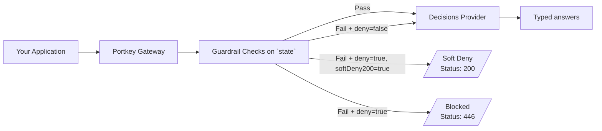

Portkey's guardrails also cover `/v1/decisions`, the typed-judgment endpoint. [TypeSafe's Jev](/integrations/llms/typesafe) is the first supported provider, with more planned. This lets you screen the content a decision is made about before it reaches the model, the same way you would for a chat or embedding request.

## Why Use Guardrails for Decisions?

A decisions request has three parts: `model`, `questions`, and `state`. Only `state` is caller-supplied content — `model` and `questions` (including any `criteria`) are your own application's instructions. Guardrails scan `state` alone, so they check what a user or upstream system fed into the judgment, never your prompt design.

This matters because `state` often carries the same kind of untrusted content you'd otherwise send to a chat model — support tickets, form submissions, extracted document text — before it's judged, scored, or classified. Guardrails let you catch PII, prompt injection, or policy violations in that content before the judgment call is made.

## How It Works

Guardrails for decisions run only at the **before-request** stage, on `state` only:



1. Your application sends `state`, `model`, and `questions` to `/v1/decisions`.
2. Portkey's before-request guardrails scan `state` — never `model`, `questions`, or nested `criteria`.
3. If all checks pass, the request (with `state` possibly redacted by a mutator) is forwarded to the provider.
4. If a check fails, the configured [guardrail action](/product/guardrails) applies: log only, soft-deny with a `200`, or hard-deny with a `446`.

<Note>
  There are no after-request (output) guardrails on `/v1/decisions`. A successful answer is a typed judgment — a choice, a score, or a probability — with no free text to scan, so only `input_guardrails` apply. This mirrors [Guardrails for Embeddings](/product/guardrails/embedding-guardrails).
</Note>

## Redacting `state`

Mutator guardrails (for example, PII redaction) can rewrite `state` before it's forwarded:

- If `state` was a plain string, the redacted text replaces it directly.
- If `state` was a JSON object or array, the redacted text is parsed back into JSON before being written back.
- If a mutator's output is no longer valid JSON for an object/array `state`, Portkey keeps the original `state` unchanged rather than forwarding corrupted content.

## Response When a Guardrail Fails

A hard deny (`deny: true`, no soft-deny) returns `446` with the standard guardrail error shape:

```json
{
  "error": {
    "message": "The guardrail checks defined in the config failed. You can find more information in the `hook_results` object.",
    "type": "hooks_failed",
    "param": null,
    "code": null
  },
  "hook_results": {
    "before_request_hooks": [ /* per-check verdicts */ ],
    "after_request_hooks": []
  }
}
```

A soft deny (`deny: true`, `softDeny200: true`) returns `200` with an empty `answers` map instead of an OpenAI-style error envelope, keeping the response shape consistent with a normal decisions response:

```json
{
  "answers": {},
  "message": "The guardrail checks defined in the config failed. You can find more information in the `hook_results` object.",
  "hook_results": {
    "before_request_hooks": [ /* per-check verdicts */ ],
    "after_request_hooks": []
  }
}
```

## Setting Up Guardrails for Decisions

### 1. Create a Guardrail

* Navigate to the `Guardrails` page and click `Create`.
* Select a check that supports `beforeRequestHook` (for example, PII Detection, Regex Match, Moderate Content).
* Configure the check parameters and set the action for failed checks (log, soft-deny, or hard-deny).
* Save the guardrail to get its ID.

<Note>
  Only guardrails that support `beforeRequestHook` run on `/v1/decisions`. Guardrails scoped to `afterRequestHook` only are skipped for this endpoint.
</Note>

### 2. Add the Guardrail to Your Config

```json
{
  "input_guardrails": ["gr-xxx", "gr-yyy"]
}
```

### 3. Use the Config with a Decisions Request

```bash cURL
curl https://api.portkey.ai/v1/decisions \
  -H "Content-Type: application/json" \
  -H "x-portkey-api-key: $PORTKEY_API_KEY" \
  -H "x-portkey-provider: typesafe" \
  -H "x-portkey-config: pc-xxx" \
  -d '{
    "model": "jev-latest",
    "state": "Help! My payouts have been failing for 3 days.",
    "questions": {
      "department": {
        "type": "choice",
        "instructions": "Which team should handle this?",
        "criteria": { "billing": "Payments", "technical": "Bugs" }
      }
    }
  }'
```

## Learn More

<CardGroup cols={2}>
  <Card title="Guardrails Overview" href="/product/guardrails">
    Create guardrails, configure actions, attach to requests
  </Card>
  <Card title="Supported Endpoints & Capabilities" href="/product/guardrails/capabilities">
    Where guardrails run across the gateway
  </Card>
  <Card title="TypeSafe (Jev)" href="/integrations/llms/typesafe">
    Provider setup and quick start for /v1/decisions
  </Card>
  <Card title="List of Guardrail Checks" href="/product/guardrails/list-of-guardrail-checks">
    All built-in and partner checks
  </Card>
</CardGroup>


import PrismaAirsCta from "/snippets/prisma-airs-cta.mdx";

<PrismaAirsCta />
