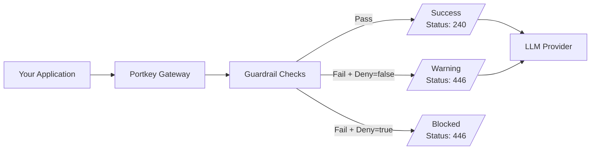

Portkey's guardrails aren't limited to chat completions and text generation - they can also be applied to embedding requests. This means you can protect your embedding workflows with the same robust security measures you use for your other LLM interactions.
## Why Use Guardrails for Embeddings?

Vector embeddings form the backbone of modern AI applications, transforming text into numerical representations that power semantic search, recommendation systems, and RAG pipelines. However, unprotected embedding workflows create significant business risks that technical leaders cannot ignore.

Without proper guardrails, sensitive customer data can leak into vector databases, toxic content can contaminate downstream systems, and resources are wasted embedding low-quality inputs. Protecting these workflows is essential because:

1. **Data leakage prevention**: Stop PII, PHI, or sensitive information from being sent to embedding models
2. **Data quality control**: Ensure only clean, formatted data gets embedded
3. **Cost optimization**: Avoid unnecessary API calls for data that doesn't meet your criteria
4. **Compliance**: Maintain regulatory compliance by filtering problematic content

By implementing guardrails at the embedding stage, you create a critical safety layer that protects your entire AI pipeline. For technical teams already building with embeddings, Portkey's guardrails integrate seamlessly with existing workflows while providing the security measures that enterprise applications demand.


## How It Works

Guardrails for embeddings are applied at the "before request" stage, examining your text before it's sent to the embedding model:




1. Your application sends text to Portkey for embedding
2. Portkey's guardrails analyze the text before sending to the LLM provider
3. If the text passes all checks, it's sent to the embedding model
4. If it fails, the configured [guardrail action](/product/guardrails) is taken (deny, feedback, etc.)

## Supported Guardrails for Embeddings

You can use any of Portkey's "before request" guardrails with embedding requests:

<CardGroup cols={3}>
  <Card title="PII Detection" href="/product/guardrails/pii-redaction">
    Protect user privacy by preventing PII from being embedded
  </Card>
  <Card title="Regex Match" href="/product/guardrails/list-of-guardrail-checks#basic--deterministic-guardrails">
    Filter content based on custom pattern matching
  </Card>
  <Card title="Contains Check" href="/product/guardrails/list-of-guardrail-checks#basic--deterministic-guardrails">
    Block embedding requests with specific words/phrases
  </Card>
  <Card title="Word/Character Count" href="/product/guardrails/list-of-guardrail-checks#basic--deterministic-guardrails">
    Ensure embeddings meet appropriate length requirements
  </Card>
  <Card title="Contains Code" href="/product/guardrails/list-of-guardrail-checks#basic--deterministic-guardrails">
    Detect and block code snippets from being embedded
  </Card>
  <Card title="Custom Webhook" href="/product/guardrails/bring-your-own-guardrails">
    Implement your own custom guardrail logic
  </Card>
  <Card title="Partner Guardrails" href="/product/guardrails/list-of-guardrail-checks#partner-guardrails">
    Utilize guardrails from Pangea, Pillar, and other partners
  </Card>
  <Card title="PHI Detection" href="/product/guardrails/list-of-guardrail-checks#pro--llm-guardrails">
    Prevent healthcare data from entering embedding systems
  </Card>
  <Card title="Moderate Content" href="/product/guardrails/list-of-guardrail-checks#pro--llm-guardrails">
    Filter out harmful content before embedding
  </Card>
</CardGroup>

[Learn More...](/product/guardrails)
## Setting Up Embedding Guardrails

### 1. Create a Guardrail

Follow the standard process to create a guardrail in Portkey:

* Navigate to the `Guardrails` page and click `Create`
* Select the appropriate check from available guardrails (e.g., PII Detection, Regex Match)
* Configure the check parameters & set desired actions for failed checks
* Save the guardrail to get its ID

<Note>
  Make sure to select guardrails that support the `beforeRequestHook` since embeddings only use pre-request validation.
</Note>

### 2. Add the Guardrail to Your Config

Add your guardrail ID to the `before_request_hooks` in your Portkey [config](/product/ai-gateway/configs):

```json
{
  "input_gurarils": ["gr-xxx", "gr-yyy", ...]
}
```

### 3. Use the Config with Embedding Requests

<Tabs>
  <Tab title="Python">
```python
# Initialize Portkey with your config
portkey = Portkey(
    api_key="PORTKEY_API_KEY",
    config="pc-xxx"  # Config with embedding guardrails
)

# Make your embedding request
response = portkey.embeddings.create(
    input="Your text string goes here",
    model="text-embedding-3-small"
)

```
  </Tab>
  <Tab title="Node.js">
```javascript
// Initialize Portkey with your config
const portkey = new Portkey({
    apiKey: "PORTKEY_API_KEY",
    config: "pc-xxx"  // Config with embedding guardrails
});

// Make your embedding request
const response = await portkey.embeddings.create({
    input: "Your text string goes here",
    model: "text-embedding-3-small"
});


```
  </Tab>
  <Tab title="OpenAI Python">
```python
from openai import OpenAI
from portkey.api_client.openai import createHeaders

client = OpenAI(
    api_key="OPENAI_API_KEY",
    base_url="PORTKEY_GATEWAY_URL",
    default_headers=createHeaders(
        provider="openai",
        api_key="PORTKEY_API_KEY",
        config="pc-xxx"  # Config with embedding guardrails
    )
)

# Make your embedding request
response = client.embeddings.create(
    input="Your text string goes here",
    model="text-embedding-3-small"
)


```
  </Tab>
  <Tab title="cURL">
```bash
curl https://api.portkey.ai/v1/embeddings \
  -H "Content-Type: application/json" \
  -H "Authorization: Bearer $OPENAI_API_KEY" \
  -H "x-portkey-api-key: $PORTKEY_API_KEY" \
  -H "x-portkey-config: pc-xxx" \
  -d '{
    "model": "text-embedding-3-small",
    "input": "Your text string goes here"
  }'
```
  </Tab>
</Tabs>

## Common Use Cases

- **Protecting Against PII in Embeddings**: When building search systems or RAG applications, you need to ensure no personally identifiable information is inadvertently embedded:

- **Filtering Code from Document Embeddings**: If you're building a knowledge base that shouldn't include code snippets:

- **Size-Based Filtering**: Ensure only appropriately sized documents get embedded:

- **Custom Regex Filtering**: Create domain-specific filters using regex patterns:


## Monitoring and Logs

All guardrail actions on embedding requests are logged in the Portkey dashboard, just like other guardrail activities. You can:

- See which embedding requests were blocked
- View detected issues (PII, regex matches, etc.)
- Track guardrail performance over time
- Export logs for compliance reporting


<Frame>
  
</Frame>

## Get Support

If you're implementing guardrails for embeddings and need assistance, reach out to the Portkey team on the [community forum](https://discord.gg/portkey-llms-in-prod-1143393887742861333).

## Learn More

- [Portkey Guardrails Overview](/product/guardrails)
- [List of Guardrail Checks](/product/guardrails/list-of-guardrail-checks)
- [Creating Raw Guardrails in JSON](/product/guardrails/creating-raw-guardrails-in-json)
