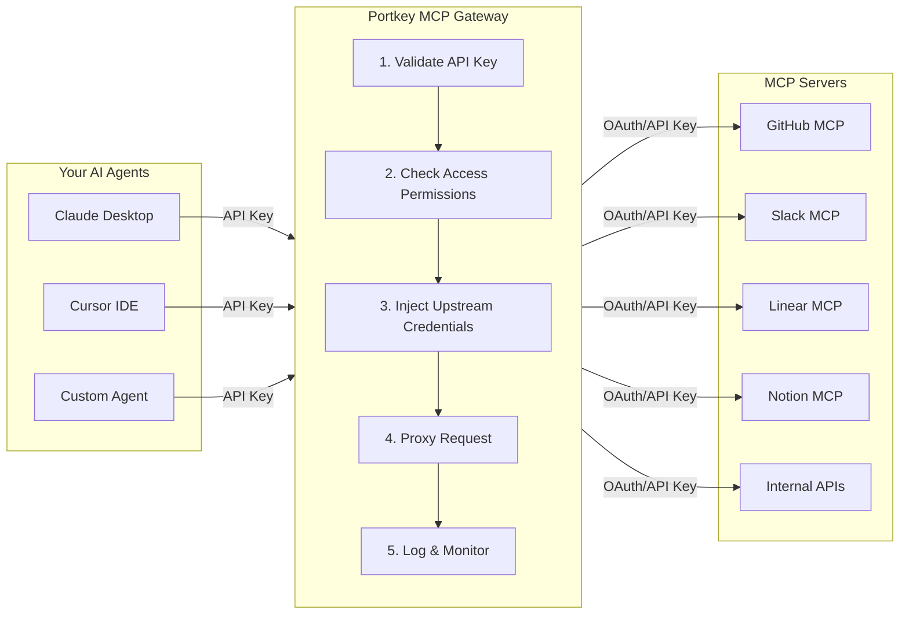

MCP servers are everywhere—GitHub, Slack, Linear, Salesforce, internal APIs. Each has different authentication. Each team needs different permissions. And when something breaks, there's no single place to check what happened.

**Portkey's MCP Gateway solves this.** It's a unified control plane that sits between your AI agents and MCP servers—centralized authentication, fine-grained access control, policy enforcement, and full observability for every tool call.

<CardGroup cols={2}>
  <Card title="Quickstart" icon="rocket" href="/product/mcp-gateway/quickstart">
    Add your first MCP server and connect an agent in 5 minutes.
  </Card>
  <Card title="Integrations" icon="plug" href="/product/mcp-gateway/integrations">
    Connect Claude Desktop, Cursor, VS Code, or your own MCP client.
  </Card>
</CardGroup>

---

## How It Works



Your agents connect to Portkey with a simple API key. Portkey then:

1. **Validates** the API key and identifies the user/team
2. **Checks permissions** against your access control policies
3. **Injects credentials** for the upstream MCP server (OAuth tokens, API keys)
4. **Proxies** the tool call to the MCP server
5. **Logs** the full interaction for debugging and compliance

**Agents never touch upstream credentials.** They only need their Portkey API key.

---

## Capabilities

<CardGroup cols={2}>
  <Card title="Centralized Authentication" icon="key" href="/product/mcp-gateway/authentication">
    Configure auth once per MCP server—OAuth, API keys, custom headers. Portkey handles token refresh and credential isolation. Your agents never manage secrets.
  </Card>
  <Card title="Access Control" icon="users" href="/product/mcp-gateway/access-control">
    Control which teams and users access which servers. Marketing sees Notion. Engineering sees GitHub. Fine-tune permissions at user level.
  </Card>
  <Card title="Tool Provisioning" icon="wrench" href="/product/mcp-gateway/tool-provisioning">
    Go deeper than server-level access. Enable or disable specific tools at org level or per user.
  </Card>
  <Card title="Observability" icon="chart-mixed" href="/product/mcp-gateway/observability">
    Every tool call logged with full context—who called what, when, with what parameters. Debug production issues in minutes.
  </Card>
  <Card title="Security & Guardrails" icon="shield-check" href="/product/mcp-gateway/guardrails">
    Rate limits, content filtering, approval workflows. Stop an agent from sending 1000 Slack messages. Enforce policies consistently.
  </Card>
</CardGroup>

---

## MCP Registry

<Card title="MCP Registry" icon="layer-group" href="/product/mcp-gateway/mcp-registry">
  Your organization's catalog of MCP servers. Add a server, configure authentication, and control which teams can access it.
</Card>

**Platform teams** add MCP servers to the registry, configure authentication, provision access to teams, and monitor usage across the organization.

**Developers** see their available servers, grab connection URLs, and start building. No credential management. No access requests. Just tools that work.

---

## Connect Your Agent

Portkey exposes a standard MCP endpoint. Point any MCP client at it.

```json
{
  "mcpServers": {
    "portkey": {
      "url": "https://mcp.portkey.ai/{server-slug}/mcp",
      "headers": {
        "Authorization": "Bearer YOUR_API_KEY"
      }
    }
  }
}
```

Your API key determines which servers and tools you can access. One endpoint, all your MCP servers.

<Card title="See All Integrations" icon="arrow-right" href="/product/mcp-gateway/integrations">
  Setup guides for Claude Desktop, Cursor, VS Code, and custom agents.
</Card>